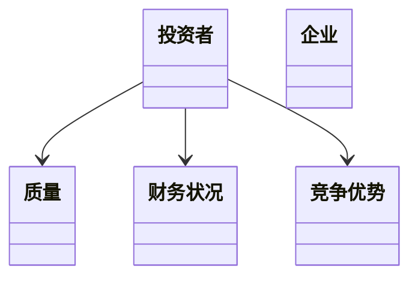
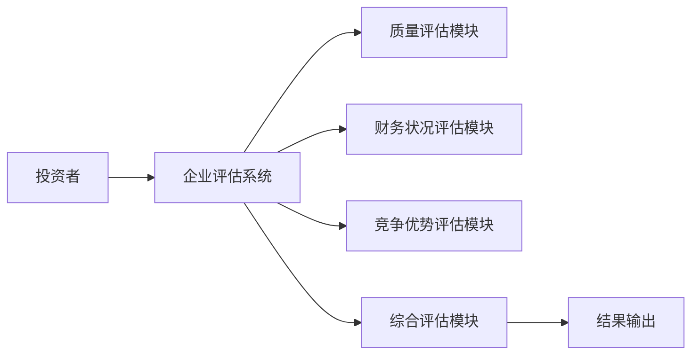

                 


# 巴菲特的20格打孔卡投资法则

## 关键词：巴菲特，投资法则，价值投资，20格打孔卡，投资策略，投资分析，风险管理

## 摘要：本文深入解析了巴菲特的20格打孔卡投资法则，探讨了其背后的逻辑、数学模型和系统架构，结合实际案例进行详细分析，为读者提供系统性的投资分析方法和实践指导。

---

# 第1章: 巴菲特投资哲学概述

## 1.1 巴菲特的投资理念

### 1.1.1 价值投资的定义与核心思想

价值投资是一种以低于内在价值的价格购买优质股票的投资策略。巴菲特的价值投资理念强调：

1. **长期投资**：关注企业的长期价值，而非短期市场波动。
2. **安全边际**：以低于内在价值的价格买入，确保投资的安全性。
3. **竞争优势**：投资具有持续竞争优势的企业。

### 1.1.2 巴菲特的投资策略与成功案例

巴菲特的投资策略集中于寻找具有强大竞争优势、良好财务状况和优秀管理团队的企业。他成功投资的案例包括可口可乐、苹果和亚马逊等。

### 1.1.3 巴菲特投资哲学的现代意义

在当前市场环境下，巴菲特的价值投资理念依然适用，强调基本面分析和长期持有优质资产。

---

## 1.2 20格打孔卡的背景与意义

### 1.2.1 20格打孔卡的起源与演变

20格打孔卡是巴菲特筛选投资目标的工具，基于20个格栅（标准）进行评估。每个格栅对应一个评估维度，如质量、财务状况、竞争优势等。

### 1.2.2 20格打孔卡在投资决策中的作用

通过20格打孔卡，投资者可以系统化地评估企业的质量、财务状况和竞争优势，从而做出更明智的投资决策。

### 1.2.3 20格打孔卡与其他投资工具的对比

20格打孔卡的优势在于其系统性和严谨性，能够帮助投资者避免情绪化决策和短期波动的影响。

---

# 第2章: 20格打孔卡的核心概念与联系

## 2.1 核心概念原理

### 2.1.1 质量、财务状况、竞争优势的定义与解释

- **质量**：企业的盈利能力、成长性和可持续性。
- **财务状况**：企业的财务健康状况，包括负债、现金流等。
- **竞争优势**：企业的核心竞争力，如品牌、技术、成本优势等。

### 2.1.2 格栅的属性特征对比表格

| 格栅属性 | 定义 | 重要性 |
|----------|------|--------|
| 质量     | 盈利能力 | 高     |
| 财务状况 | 财务健康 | 中高   |
| 竞争优势 | 核心竞争力 | 高     |

### 2.1.3 ER实体关系图架构的Mermaid流程图

```mermaid
graph LR
    A[投资者] -> B[企业]
    B -> C[质量]
    B -> D[财务状况]
    B -> E[竞争优势]
```

## 2.2 格栅的数学模型与公式

### 2.2.1 市盈率（P/E）的计算公式

$$ P/E = \frac{\text{股价}}{\text{每股收益}} $$

市盈率反映了市场对公司未来盈利能力的预期。

### 2.2.2 净资产收益率（ROE）的计算公式

$$ ROE = \frac{\text{净利润}}{\text{净资产}} $$

ROE衡量了企业利用股东资产创造利润的能力。

---

# 第3章: 20格打孔卡的算法原理

## 3.1 算法流程图

```mermaid
graph TD
    A[开始] -> B[输入企业数据]
    B -> C[评估质量]
    C -> D[评估财务状况]
    D -> E[评估竞争优势]
    E -> F[综合评估]
    F -> G[输出结果]
    G -> H[结束]
```

## 3.2 算法实现

### 3.2.1 Python代码实现

```python
def evaluate_company(company_data):
    # 股价、每股收益、净利润、净资产等数据处理
    pe_ratio = company_data['股价'] / company_data['每股收益']
    roe = company_data['净利润'] / company_data['净资产']
    # 其他评估指标计算
    return {'P/E': pe_ratio, 'ROE': roe, '综合评估': ...}
```

---

# 第4章: 投资决策系统分析与架构设计

## 4.1 系统功能设计

### 4.1.1 领域模型Mermaid类图



## 4.2 系统架构设计

### 4.2.1 Mermaid架构图



---

# 第5章: 项目实战

## 5.1 环境安装与配置

### 5.1.1 必需软件安装指南

- Python 3.8+
- Jupyter Notebook
- Pandas、NumPy等库

## 5.2 核心代码实现

### 5.2.1 数据获取与处理代码

```python
import pandas as pd

# 假设data.csv包含企业数据
data = pd.read_csv('data.csv')
```

### 5.2.2 20格打孔卡评估系统实现

```python
def evaluate_company(company_data):
    pe_ratio = company_data['股价'] / company_data['每股收益']
    roe = company_data['净利润'] / company_data['净资产']
    return {'P/E': pe_ratio, 'ROE': roe}
```

## 5.3 案例分析

### 5.3.1 苹果公司的评估案例

- 股价：$150
- 每股收益：$5
- 净利润：$500亿
- 净资产：$1000亿

计算：
- P/E = 150 / 5 = 30
- ROE = 500 / 1000 = 0.5

### 5.3.2 亚马逊公司的评估案例

- 股价：$3000
- 每股收益：$30
- 净利润：$100亿
- 净资产：$500亿

计算：
- P/E = 3000 / 30 = 100
- ROE = 100 / 500 = 0.2

---

# 第6章: 总结与最佳实践

## 6.1 本章小结

### 6.1.1 核心要点回顾

- 巴菲特的20格打孔卡是一种系统化的投资评估工具。
- 通过质量、财务状况和竞争优势三个维度进行评估。

## 6.2 最佳实践Tips

### 6.2.1 投资中的注意事项

- 长期投资，避免短期波动。
- 保持安全边际，避免过度杠杆。

### 6.2.2 拓展阅读推荐

- 巴菲特的《投资哲学》
- 《证券分析》

## 6.3 投资心态与风险管理

### 6.3.1 长期投资的重要性

长期持有优质资产，避免频繁交易。

### 6.3.2 风险管理策略

- 分散投资，降低风险。
- 定期评估，及时调整。

---

通过本文的分析和案例，读者可以掌握巴菲特的20格打孔卡投资法则，并将其应用于实际投资中，提升投资决策的科学性和严谨性。

