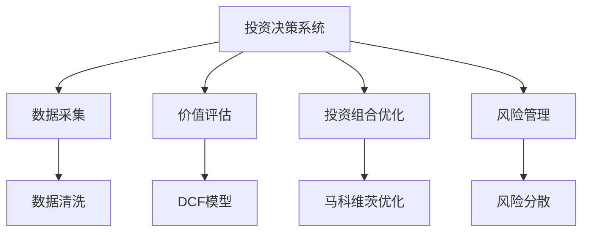

                 


# 巴菲特的20格打孔卡：集中投资的智慧

> 关键词：巴菲特，价值投资，20格打孔卡，投资策略，风险管理，数学模型

> 摘要：本文深入探讨了巴菲特的投资哲学和20格打孔卡的集中投资策略。通过分析价值投资的核心理念、数学模型的应用以及风险管理的重要性，结合实际案例和系统设计，展示了如何利用打孔卡进行高效的投资决策。文章详细介绍了投资决策系统的架构、算法实现和项目实战，为读者提供了全面的指导和实用的工具。

---

## 第一部分：投资哲学与价值投资概述

### 第1章：投资哲学的演变

#### 1.1 传统投资理念的局限性
在传统投资理念中，投资者往往追求短期收益，忽视了企业的内在价值和长期增长潜力。这种做法导致许多投资者在市场波动中频繁买卖，最终难以实现稳定的收益。

#### 1.2 巴菲特投资哲学的核心思想
巴菲特的投资哲学以价值投资为核心，强调长期持有优质资产。他提出，投资的本质是寻找那些具有持续竞争优势和良好管理团队的企业，并以合理的价格买入并长期持有。

#### 1.3 价值投资的定义与特点
价值投资是一种以低于内在价值的价格买入优质资产的投资策略。其特点包括：
- 专注于企业的基本面分析
- 寻找具有持续竞争优势的企业
- 长期持有，避免频繁交易

#### 1.4 打孔卡的起源与意义
打孔卡是一种简单有效的工具，用于筛选和评估投资标的。通过将20个关键问题转化为打孔点，投资者可以快速识别出具有投资价值的企业。

---

### 第2章：20格打孔卡的核心概念与原理

#### 2.1 核心概念分析
打孔卡的核心在于通过20个关键问题，对企业进行全方位的评估。这些问题涵盖了企业的财务状况、竞争优势、管理团队等多个方面。

#### 2.2 打孔卡的逻辑架构
打孔卡的逻辑架构包括以下几个步骤：
1. **问题设计**：将投资决策的关键问题转化为20个打孔点。
2. **权重分配**：根据问题的重要性赋予不同的权重。
3. **打孔评估**：通过打孔的方式对每个问题进行评估，最终筛选出优质企业。

---

## 第二部分：数学模型与算法原理

### 第3章：价值评估模型与数学公式

#### 3.1 现金流折现模型（DCF）
现金流折现模型是评估企业内在价值的重要工具。其公式为：
$$DCF = \sum_{t=1}^{n} \frac{CF_t}{(1+r)^t} + \frac{TV}{(1+r)^n}$$
其中，$CF_t$表示第t年的现金流，$r$表示折现率，$TV$表示终值。

#### 3.2 市盈率与市净率的比较
市盈率（P/E）和市净率（P/B）是常用的估值指标，其公式分别为：
$$P/E = \frac{Price}{Earnings}$$
$$P/B = \frac{Price}{Book\ Value}$$

---

### 第4章：投资组合优化的数学模型

#### 4.1 马科维茨投资组合理论
马科维茨的投资组合理论为投资组合优化提供了理论基础。其核心公式包括：
$$E(r_p) = \sum w_i E(r_i)$$
$$Var(r_p) = \sum w_i^2 Var(r_i) + 2\sum w_i w_j Cov(r_i, r_j)$$
其中，$w_i$表示第i个资产的投资权重，$E(r_i)$表示第i个资产的期望收益率，$Var(r_i)$表示第i个资产的收益率方差，$Cov(r_i, r_j)$表示第i个和第j个资产的协方差。

---

## 第三部分：系统分析与架构设计

### 第5章：投资决策系统的架构

#### 5.1 系统功能模块划分
投资决策系统主要包含以下几个功能模块：
1. 数据采集与处理
2. 价值评估模型
3. 投资组合优化
4. 风险管理

#### 5.2 系统架构设计
以下是投资决策系统的架构图：



---

## 第四部分：项目实战与代码实现

### 第6章：项目实战

#### 6.1 环境安装与配置
为了实现投资决策系统，我们需要安装以下工具和库：
- Python
- Pandas
- NumPy
- Matplotlib

#### 6.2 核心代码实现

##### 6.2.1 价值评估模型的代码实现
```python
import pandas as pd
import numpy as np

def calculate_dcf(cash_flows, discount_rate, terminal_value):
    present_value = 0
    for t in range(len(cash_flows)):
        present_value += cash_flows[t] / (1 + discount_rate) ** t
    present_value += terminal_value / (1 + discount_rate) ** len(cash_flows)
    return present_value

# 示例数据
cash_flows = [100, 150, 200, 250]
discount_rate = 0.1
terminal_value = 500

dcf_value = calculate_dcf(cash_flows, discount_rate, terminal_value)
print(f"DCF Value: {dcf_value}")
```

##### 6.2.2 投资组合优化的代码实现
```python
import numpy as np

def calculate_portfolio_optimization(returns, weights):
    expected_return = np.sum(returns * weights)
    covariance_matrix = np.cov(returns)
    variance = np.dot(weights.T, np.dot(covariance_matrix, weights))
    return expected_return, variance

# 示例数据
returns = np.array([[0.1, 0.2], [0.15, 0.25]])
weights = np.array([0.5, 0.5])

expected_return, variance = calculate_portfolio_optimization(returns, weights)
print(f"Expected Return: {expected_return}")
print(f"Variance: {variance}")
```

---

## 第五部分：小结与注意事项

### 第7章：小结与注意事项

#### 7.1 最佳实践
- **长期投资**：避免频繁交易，专注于长期价值。
- **分散投资**：通过分散投资降低风险。
- **持续学习**：不断更新知识，适应市场变化。

#### 7.2 注意事项
- 投资决策需要结合市场环境和企业实际情况。
- 20格打孔卡只是一个工具，不能完全依赖。

#### 7.3 拓展阅读
- 巴菲特的《 Intelligent Investor》
- 马科维茨的《Portfolio Selection》

---

通过以上内容，我们全面介绍了巴菲特的20格打孔卡及其在集中投资中的应用。希望本文能够为投资者提供有价值的指导和启示。

