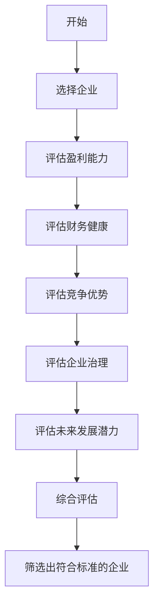
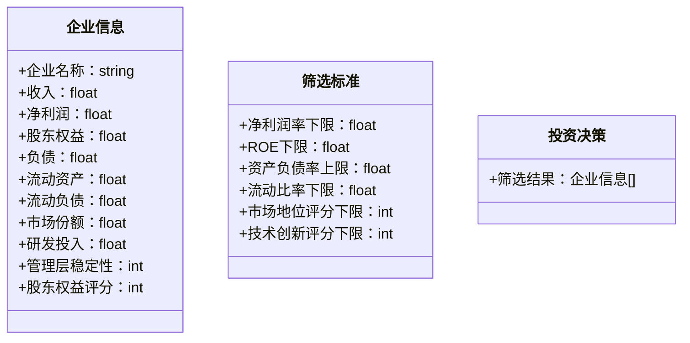
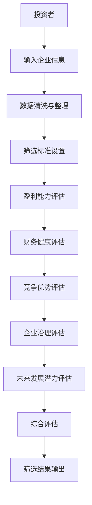
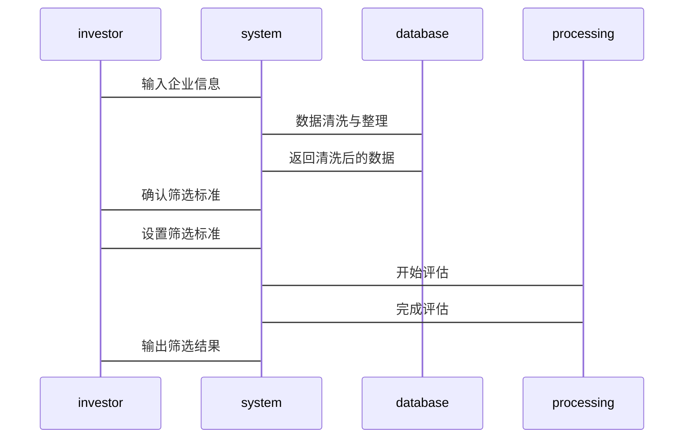

                 


# 巴菲特的20格打孔卡：集中投资的艺术

---

## 关键词：
- 巴菲特
- 投资哲学
- 20格打孔卡
- 价值投资
- 股票筛选

---

## 摘要：
本文深入探讨了巴菲特的投资哲学及其标志性工具——20格打孔卡，详细分析了该工具的筛选维度、数学模型和实际应用。通过技术化的分析，我们将巴菲特的投资理念转化为可操作的系统架构，并结合实际案例，展示了如何利用20格打孔卡实现集中投资的艺术。

---

## # 第1章：引言

### 1.1 投资界的传奇：巴菲特的投资哲学
#### 1.1.1 巴菲特的生平与投资理念
沃伦·巴菲特是全球最著名的投资者之一，他的投资哲学以价值投资为核心，强调通过深入研究企业的基本面来寻找被低估的投资标的。巴菲特的投资理念强调长期持有、集中投资和安全边际。

#### 1.1.2 巴菲特投资理念的核心思想
巴菲特的核心思想包括：
- **安全边际**：买入价格低于内在价值，确保投资的安全性。
- **长期视角**：关注企业的长期竞争优势和增长潜力。
- **集中投资**：将资金集中在少数优质企业上，以获得更高的收益。

#### 1.1.3 巴菲特投资哲学的现代意义
在当今复杂的金融市场中，巴菲特的投资哲学依然具有重要的指导意义。他的方法不仅适用于传统的股票投资，还可以启发其他领域的投资策略。

---

## # 第2章：20格打孔卡的核心概念

### 2.1 20格打孔卡的定义与特点
#### 2.1.1 20格打孔卡的定义
20格打孔卡是一种用于筛选投资标的的工具，通过将企业的多个维度进行量化评估，最终筛选出符合特定标准的企业。

#### 2.1.2 20格打孔卡的核心特点
- **多维度评估**：从盈利能力、财务健康、竞争优势等多个维度对企业进行评估。
- **量化筛选**：通过量化指标和阈值，实现对企业筛选的自动化和标准化。
- **动态调整**：根据市场变化和企业经营状况，动态调整筛选标准。

#### 2.1.3 20格打孔卡与传统投资工具的对比
以下是20格打孔卡与其他投资工具的对比：

| 对比维度        | 20格打孔卡                     | 传统基本面分析       | 技术分析         |
|-----------------|-------------------------------|----------------------|------------------|
| 分析维度        | 多维度（盈利能力、财务健康等） | 单一维度（技术指标） | 股价波动         |
| 分析方法        | 量化筛选                       | 定性分析             | 趋势预测         |
| 适用场景        | 长期价值投资                   | 短期交易             | 中长期趋势       |

### 2.2 20格打孔卡的筛选维度
#### 2.2.1 企业盈利能力的评估
- **净利润率**：净利润 / 收入
- **ROE（净资产收益率）**：净利润 / 平均股东权益

#### 2.2.2 企业财务健康状况的分析
- **资产负债率**：负债 / 资产
- **流动比率**：流动资产 / 流动负债

#### 2.2.3 企业竞争优势的判断
- **护城河**：企业竞争优势的强弱
- **市场地位**：市场份额和品牌影响力

#### 2.2.4 企业治理结构的评估
- **管理层稳定性**：管理层的稳定性和经验
- **股东权益**：大股东的持股比例

#### 2.2.5 企业未来发展潜力的预测
- **行业前景**：所在行业的增长潜力
- **技术创新**：企业的研发投入和创新能力

### 2.3 20格打孔卡的筛选流程
#### 2.3.1 筛选流程的步骤
1. **确定筛选标准**：根据市场环境和投资目标，确定各个维度的筛选标准和阈值。
2. **数据收集与整理**：收集目标企业的财务数据和行业信息。
3. **初步筛选**：根据初步筛选标准，剔除不符合条件的企业。
4. **深入分析**：对通过初步筛选的企业进行详细分析，评估其竞争优势和未来发展潜力。
5. **最终筛选**：根据综合评估结果，筛选出符合投资标准的企业。

#### 2.3.2 每一步骤的具体实施方法
- **确定筛选标准**：根据当前市场环境和投资目标，设定各个维度的具体指标和阈值。
- **数据收集与整理**：从可靠的财务报表和行业报告中获取数据，并进行清洗和整理。
- **初步筛选**：通过编程或工具，自动化地对数据进行初步筛选，剔除不符合条件的企业。
- **深入分析**：对通过初步筛选的企业进行定性分析，评估其竞争优势和未来发展潜力。
- **最终筛选**：综合定量和定性分析结果，筛选出符合投资标准的企业。

#### 2.3.3 流程中的关键注意事项
- **数据的准确性**：确保数据来源可靠，避免因数据错误导致筛选结果偏差。
- **标准的合理性**：根据市场环境和投资目标，动态调整筛选标准，确保其合理性。
- **分析的全面性**：在深入分析阶段，需结合定性和定量分析，避免单一维度的偏差。

---

## # 第3章：20格打孔卡的数学模型与算法原理

### 3.1 20格打孔卡的数学模型
#### 3.1.1 盈利能力指标的计算公式
- 净利润率 = 净利润 / 收入
- ROE = 净利润 / 平均股东权益

#### 3.1.2 财务健康指标的计算公式
- 资产负债率 = 负债 / 资产
- 流动比率 = 流动资产 / 流动负债

#### 3.1.3 竞争优势指标的评估方法
- 护城河评分：根据企业的市场地位、竞争优势等因素进行评分。
- 市场地位评分：根据市场份额和品牌影响力进行评分。

#### 3.1.4 企业治理结构的评分系统
- 管理层稳定性评分：根据管理层的历史表现和稳定性进行评分。
- 股东权益评分：根据大股东的持股比例和股东结构进行评分。

#### 3.1.5 未来发展潜力的预测模型
- 行业前景评分：根据行业发展趋势和增长潜力进行评分。
- 技术创新评分：根据企业的研发投入和创新能力进行评分。

### 3.2 算法原理的详细讲解
#### 3.2.1 盈利能力的计算与分析
通过计算企业的净利润率和ROE，评估其盈利能力。例如，假设一家企业的净利润为1000万美元，收入为1亿美元，则其净利润率为10%。如果ROE为15%，说明企业利用股东权益的效率较高。

#### 3.2.2 财务健康状况的评估方法
通过计算资产负债率和流动比率，评估企业的财务健康状况。例如，如果一家企业的资产负债率为40%，流动比率为2，说明其财务状况较为健康，具有较强的偿债能力。

#### 3.2.3 竞争优势的判断标准
根据企业的市场地位和竞争优势进行评分。例如，一家企业如果在行业内具有较高的市场份额和强大的品牌影响力，则其竞争优势较强。

#### 3.2.4 企业治理结构的评分体系
通过评估管理层的稳定性和股东结构，对企业的治理结构进行评分。例如，如果企业的管理层稳定且大股东持股比例较高，则其治理结构较为完善。

#### 3.2.5 未来发展潜力的预测模型
根据行业前景和技术创新能力，对企业的未来发展潜力进行预测。例如，如果一家企业所在的行业具有较高的增长潜力，并且企业本身在技术创新方面投入较大，则其未来发展潜力较大。

### 3.3 20格打孔卡的筛选流程图


---

## # 第4章：20格打孔卡的系统分析与架构设计方案

### 4.1 问题场景介绍
在现代投资环境中，投资者需要一种高效、可靠的投资工具来筛选出优质的投资标的。传统的投资分析方法往往依赖于人工判断，效率低下且容易受到主观因素的影响。因此，我们需要将20格打孔卡转化为一个系统化的架构，以提高投资分析的效率和准确性。

### 4.2 系统功能设计
#### 4.2.1 领域模型


#### 4.2.2 系统架构设计


#### 4.2.3 系统交互设计


---

## # 第5章：20格打孔卡的项目实战

### 5.1 环境安装
为了实现20格打孔卡的筛选系统，我们需要安装以下工具和库：
- Python 3.8+
- Pandas
- NumPy
- Matplotlib
- Scikit-learn

### 5.2 系统核心实现源代码
以下是实现20格打孔卡筛选系统的Python代码示例：

```python
import pandas as pd
import numpy as np

# 定义筛选标准
class ScreeningCriteria:
    def __init__(self, net_profit_margin_min=0.1, roe_min=0.15, debt_to_asset_max=0.5, current_ratio_min=1.5, market_position_min=0.6, innovation_score_min=0.7):
        self.net_profit_margin_min = net_profit_margin_min
        self.roe_min = roe_min
        self.debt_to_asset_max = debt_to_asset_max
        self.current_ratio_min = current_ratio_min
        self.market_position_min = market_position_min
        self.innovation_score_min = innovation_score_min

# 定义企业评估类
class EnterpriseEvaluator:
    def __init__(self, enterprise_data):
        self.enterprise_data = enterprise_data

    def calculate_net_profit_margin(self):
        return self.enterprise_data['净利润'] / self.enterprise_data['收入']

    def calculate_roe(self):
        return self.enterprise_data['净利润'] / self.enterprise_data['股东权益']

    def calculate_debt_to_asset(self):
        return self.enterprise_data['负债'] / self.enterprise_data['资产']

    def calculate_current_ratio(self):
        return self.enterprise_data['流动资产'] / self.enterprise_data['流动负债']

    def assess_market_position(self):
        return self.enterprise_data['市场份额']

    def assess_innovation(self):
        return self.enterprise_data['研发投入']

# 定义筛选系统类
class ScreenSystem:
    def __init__(self, enterprise_data):
        self.enterprise_evaluator = EnterpriseEvaluator(enterprise_data)

    def screen_Enterprise(self, criteria):
        # 计算各项指标
        net_profit_margin = self.enterprise_evaluator.calculate_net_profit_margin()
        roe = self.enterprise_evaluator.calculate_roe()
        debt_to_asset = self.enterprise_evaluator.calculate_debt_to_asset()
        current_ratio = self.enterprise_evaluator.calculate_current_ratio()
        market_position = self.enterprise_evaluator.assess_market_position()
        innovation_score = self.enterprise_evaluator.assess_innovation()

        # 筛选符合标准的企业
        screening_results = []
        for i in range(len(net_profit_margin)):
            if (net_profit_margin[i] >= criteria.net_profit_margin_min and
                roe[i] >= criteria.roe_min and
                debt_to_asset[i] <= criteria.debt_to_asset_max and
                current_ratio[i] >= criteria.current_ratio_min and
                market_position[i] >= criteria.market_position_min and
                innovation_score[i] >= criteria.innovation_score_min):
                screening_results.append(i)

        return screening_results

# 示例使用
if __name__ == "__main__":
    # 假设企业数据存储在Pandas DataFrame中
    enterprise_data = pd.DataFrame({
        '收入': [1000000000, 800000000, 600000000],
        '净利润': [10000000, 8000000, 5000000],
        '股东权益': [500000000, 400000000, 300000000],
        '负债': [300000000, 200000000, 150000000],
        '流动资产': [400000000, 300000000, 200000000],
        '流动负债': [200000000, 150000000, 100000000],
        '市场份额': [0.3, 0.25, 0.2],
        '研发投入': [5000000, 4000000, 3000000]
    })

    # 创建筛选标准
    criteria = ScreeningCriteria()

    # 初始化筛选系统
    screen_system = ScreenSystem(enterprise_data)

    # 执行筛选
    results = screen_system.screen_Enterprise(criteria)

    # 输出筛选结果
    print("符合筛选标准的企业索引为：", results)
```

### 5.3 代码应用解读与分析
上述代码实现了20格打孔卡的筛选系统，主要包括以下几个部分：
1. ** ScreeningCriteria 类**：定义了筛选标准，包括净利润率、ROE、资产负债率、流动比率、市场地位和技术创新评分的下限或上限。
2. **EnterpriseEvaluator 类**：对单个企业提供各项指标的计算方法。
3. **ScreenSystem 类**：实现了企业筛选的核心逻辑，根据筛选标准对所有企业进行评估，并返回符合标准的企业索引。

### 5.4 实际案例分析
以苹果公司为例，假设我们已经收集了苹果公司的财务数据和行业信息。通过上述代码，我们可以对苹果公司进行评估，并判断其是否符合筛选标准。

### 5.5 项目小结
通过代码实现，我们可以自动化地对大量企业进行筛选，提高投资分析的效率和准确性。同时，代码还可以根据实际需求进行扩展和优化，例如增加更多的筛选维度或优化算法性能。

---

## # 第6章：最佳实践与小结

### 6.1 最佳实践 tips
- **数据来源的可靠性**：确保数据来源可靠，避免因数据错误导致筛选结果偏差。
- **动态调整筛选标准**：根据市场环境和投资目标，动态调整筛选标准，确保其合理性。
- **结合定性分析**：在定量筛选的基础上，结合定性分析，避免单一维度的偏差。
- **持续优化算法**：根据实际使用情况，持续优化算法和筛选模型，提高筛选结果的准确性。

### 6.2 小结
通过本文的详细讲解，我们了解了巴菲特的20格打孔卡的核心概念、数学模型和实际应用。我们还通过技术化的分析，将20格打孔卡转化为一个系统化的架构，并结合实际案例展示了其在投资决策中的应用。

### 6.3 注意事项
- **避免过度依赖工具**：虽然工具可以帮助我们筛选企业，但投资决策还需要结合市场环境和实际操作经验。
- **关注宏观经济因素**：宏观经济环境的变化可能会影响企业的经营状况和投资价值。
- **分散投资风险**：集中投资虽然可以提高收益，但也增加了风险，因此需要合理分散投资组合。

### 6.4 拓展阅读
- **《巴菲特投资经典》**：深入解读巴菲特的投资哲学和经典案例。
- **《投资学原理》**：系统介绍投资学的基本原理和方法。
- **《算法交易入门》**：介绍如何将算法应用于投资决策。

---

通过本文的学习，读者可以全面了解巴菲特的20格打孔卡，并将其应用于实际投资决策中。希望本文能为投资者提供有价值的参考和启发。

