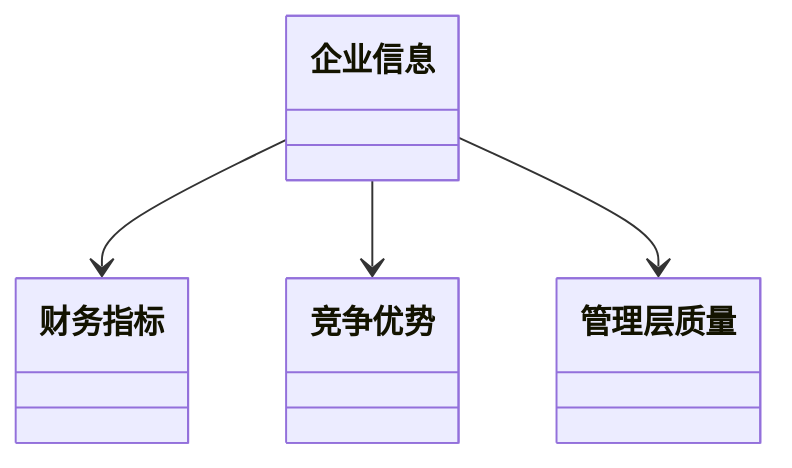

                 

# 巴菲特的20格打孔卡：集中投资策略

## 关键词：巴菲特，投资策略，价值投资，知识管理，系统化投资

## 摘要：本文深入分析了巴菲特的20格打孔卡投资策略，探讨其背后的哲学、结构和系统化方法。通过详细讲解每个关键概念和实际应用案例，结合系统架构设计和项目实战，揭示了如何将知识管理和投资决策有机融合，为读者提供一种高效的投资策略参考。

---

# 第一部分：巴菲特的投资哲学与20格打孔卡概述

## 第1章：巴菲特的投资哲学

### 1.1 价值投资的定义与核心思想

价值投资是一种以内在价值为导向的投资方法，强调购买被市场低估的优质资产。巴菲特将其发扬光大，强调长期持有和安全边际的重要性。

- **核心思想**：寻找具有持续竞争优势的企业，关注企业的基本面和财务健康状况，而非市场的短期波动。
- **长期主义**：投资不是短期交易，而是寻找能够长期稳定增长的企业，耐心持有，等待价值的实现。

### 1.2 巴菲特的投资风格与成功案例

巴菲特的投资风格以稳健著称，注重企业的护城河和管理层质量。他成功投资的案例包括可口可乐、伯克希尔 Hathaway 等，这些企业的共同点是具有强大的竞争优势和持续的盈利能力。

### 1.3 巴菲特对投资的长期主义思考

巴菲特认为，投资的最终目标是实现财富的长期增长，而不是短期收益。他强调企业质量的重要性，认为市场的短期波动不应影响长期投资决策。

---

## 第2章：20格打孔卡的背景与演变

### 2.1 20格打孔卡的起源

20格打孔卡最初是巴菲特用于记录投资理念和企业分析的工具，每个格子代表一个关键的评估维度。这种工具帮助他系统化地整理信息，提高投资决策的效率。

- **物理形态**：20个格子，每个格子记录一个关键点，如企业财务指标、竞争优势、管理层质量等。
- **知识管理**：打孔卡通过物理布局和信息筛选，帮助投资者快速找到关键信息，避免信息过载。

### 2.2 20格打孔卡的核心价值

20格打孔卡不仅是一种信息整理工具，更是一种投资策略的体现。它帮助投资者将复杂的信息简化，专注于最关键的因素，提高决策的质量。

- **知识筛选与精炼**：通过打孔卡的筛选标准，投资者能够快速识别出有价值的信息，避免被无关信息干扰。
- **信息组织与快速检索**：打孔卡的结构设计使得投资者能够快速检索所需信息，提高决策效率。

---

# 第二部分：20格打孔卡的结构与应用

## 第3章：20格打孔卡的结构设计

### 3.1 打孔卡的物理与知识结构

20格打孔卡的设计注重信息密度和可扩展性，每个格子的信息容量经过精心设计，确保在有限的空间内包含最关键的信息。

- **信息密度**：每个格子包含多个关键指标，如财务数据、竞争优势分析等，帮助投资者快速评估企业。
- **可扩展性**：打孔卡的设计允许投资者根据需要添加新的维度，灵活调整分析框架。

### 3.2 核心概念与联系

20格打孔卡的核心在于将投资决策的关键因素系统化，通过表格和图表展示这些因素之间的联系，帮助投资者更好地理解和应用。

- **核心概念对比表**：将企业财务指标、竞争优势、管理层质量等关键因素进行对比分析，找出最佳投资目标。
- **ER实体关系图**：展示企业各要素之间的关系，帮助投资者全面评估企业的潜力和风险。

---

## 第4章：20格打孔卡在投资中的应用

### 4.1 投资决策的核心要素

20格打孔卡的应用集中在对企业基本面的深入分析，包括财务指标、竞争优势和管理层质量等方面。

- **财务指标评估**：通过ROE（净资产收益率）、毛利率等指标，评估企业的盈利能力和发展潜力。
- **竞争优势分析**：识别企业的核心竞争力，如品牌优势、成本优势等，确保投资对象具有长期竞争优势。

### 4.2 投资策略的系统化

20格打孔卡将投资策略系统化，通过结构化的信息整理和分析，帮助投资者制定科学的投资计划。

- **投资流程**：从筛选企业到深入分析，再到最终决策，每个步骤都经过系统的规划和执行。
- **风险管理**：通过集中投资策略，降低投资组合的风险，提高整体收益的稳定性。

---

# 第三部分：系统分析与架构设计方案

## 第5章：投资决策系统的构建

### 5.1 问题场景介绍

投资决策系统旨在帮助投资者系统化地筛选和评估投资标的，解决传统投资方法中信息过载和决策低效的问题。

- **问题背景**：市场信息复杂，投资者难以快速找到关键信息，决策效率低下。
- **系统目标**：构建一个高效的决策支持系统，帮助投资者快速筛选和评估投资标的。

### 5.2 项目介绍

#### 5.2.1 项目目标与范围

- **目标**：构建一个基于20格打孔卡的投资决策系统，实现对企业信息的系统化分析。
- **范围**：涵盖企业基本面分析、财务指标评估、竞争优势分析等功能。

#### 5.2.2 核心功能模块

- **信息筛选模块**：根据打孔卡的筛选标准，快速筛选出符合条件的企业。
- **数据分析模块**：对筛选出的企业进行深入分析，生成评估报告。
- **决策支持模块**：根据分析结果，提供投资建议和决策支持。

### 5.3 系统功能设计

#### 5.3.1 领域模型Mermaid类图

---

## 第6章：20格打孔卡的系统化应用

### 6.1 投资策略的系统化

通过20格打孔卡的系统化应用，投资者能够更高效地筛选和评估企业，制定科学的投资计划。

- **风险管理**：通过集中投资策略，降低投资组合的风险，提高整体收益的稳定性。
- **持续优化**：定期评估和调整投资组合，确保投资策略的有效性。

### 6.2 实际案例分析

#### 6.2.1 案例介绍

以可口可乐为例，分析其财务指标、竞争优势和管理层质量。

- **财务指标**：可口可乐的ROE长期保持高位，显示出强大的盈利能力。
- **竞争优势**：强大的品牌影响力和全球分销网络是其竞争优势的核心。

#### 6.2.2 分析过程

1. **筛选阶段**：通过20格打孔卡的标准筛选出可口可乐作为潜在投资标的。
2. **评估阶段**：深入分析其财务指标和竞争优势，确认其投资价值。
3. **决策阶段**：基于分析结果，决定进行投资并长期持有。

---

## 总结

巴菲特的20格打孔卡是一种高效的投资工具，通过系统化的方法帮助投资者筛选和评估企业，制定科学的投资策略。本文通过详细讲解其结构、应用和系统化设计，揭示了其在现代投资中的重要价值。对于希望提升投资效率的投资者，20格打孔卡提供了一种值得借鉴的方法。

