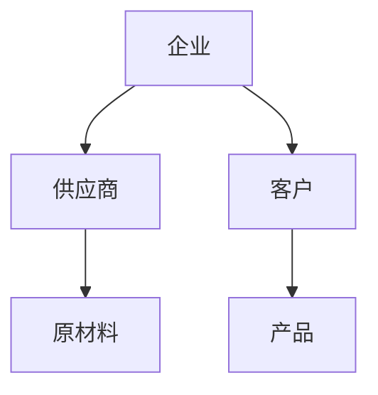
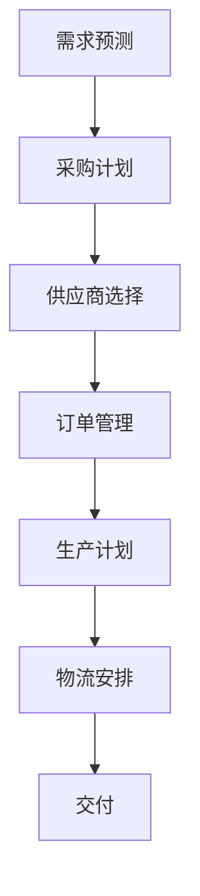
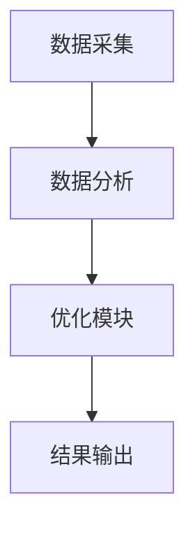
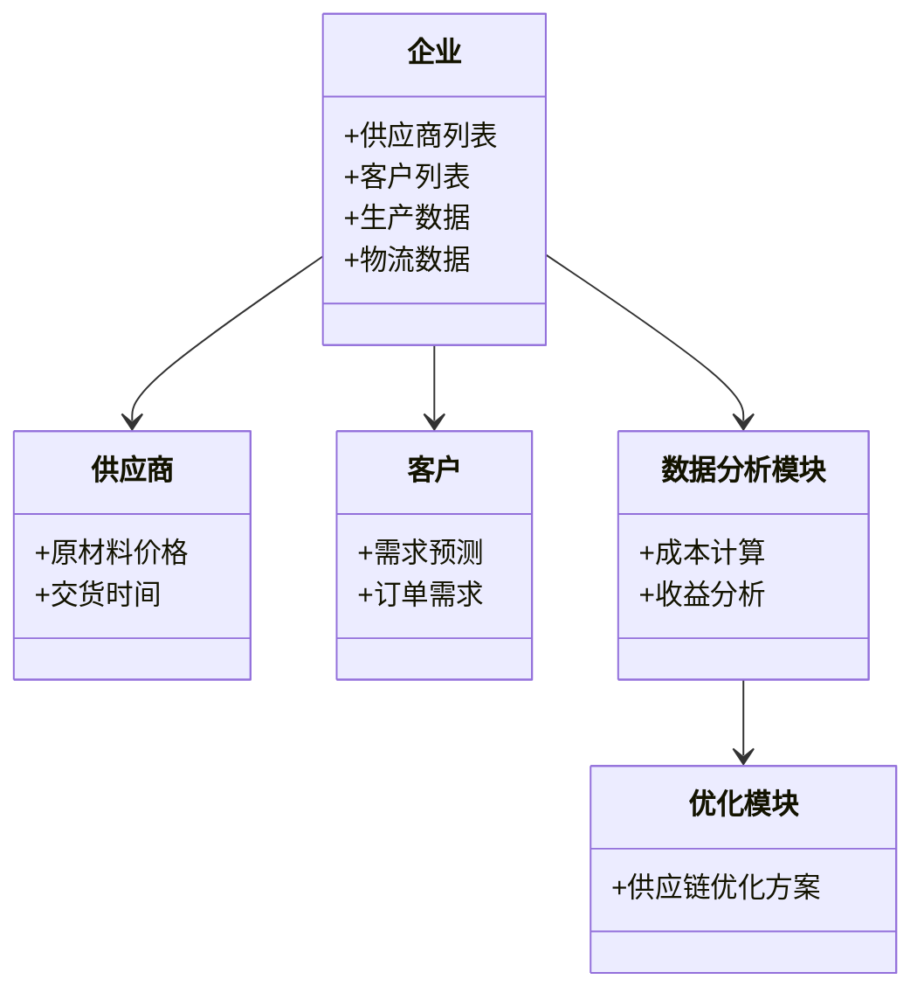
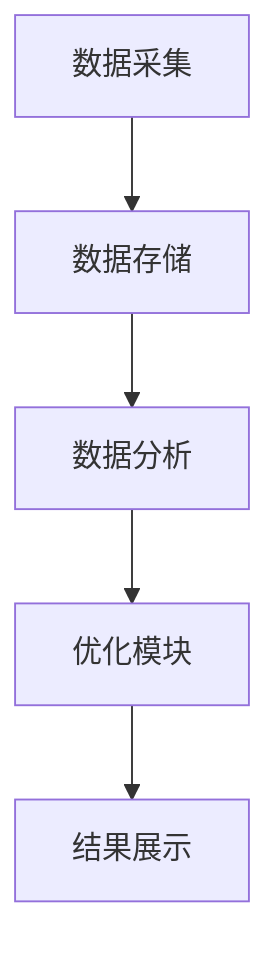
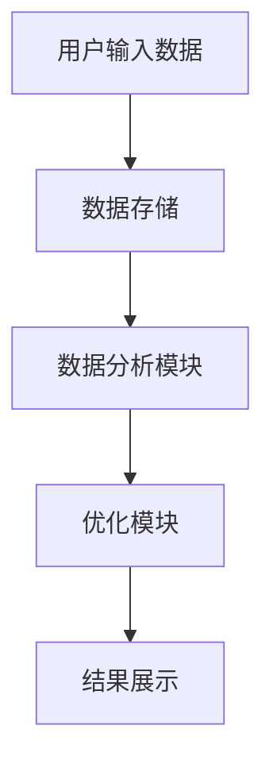

                 


```markdown
# 巴菲特的产业链分析2.0：全球化背景下的供应链重构

## 关键词：
- 巴菲特产业链分析
- 供应链重构
- 全球化背景
- 供应链管理
- 产业链优化

## 摘要：
在全球化背景下，供应链重构成为企业竞争的关键因素。本文基于巴菲特的产业链分析框架，探讨全球化对供应链的影响，分析产业链重构的核心要素与联系，提供算法原理、数学模型、系统架构设计、项目实战等多维度的深入解析，并结合实际案例，总结最佳实践，为企业优化供应链管理提供理论与实践指导。

---

# 第一部分: 巴菲特的产业链分析2.0背景与核心概念

## 第1章: 全球化背景下的供应链重构概述

### 1.1 全球化背景下的供应链变革
#### 1.1.1 全球化对供应链的影响
- 1. 全球化推动供应链的跨国分工与协作。
- 2. 区域化供应链的崛起与全球化供应链的并存。
- 3. 跨国企业的供应链布局调整。

#### 1.1.2 产业链重构的核心驱动力
- 1. 全球经济波动与地缘政治风险。
- 2. 技术进步与数字化转型。
- 3. 消费者需求的变化与市场竞争加剧。

#### 1.1.3 巴菲特产业链分析的演变
- 1. 巴菲特早期的产业链分析方法。
- 2. 全球化背景下的产业链分析升级。
- 3. 当前版本的核心改进与创新。

### 1.2 巴菲特产业链分析的核心概念
#### 1.2.1 产业链的定义与构成
- 1. 产业链的基本定义。
- 2. 产业链的构成要素：企业、供应商、客户、原材料、中间产品、最终产品。
- 3. 产业链的运作流程：从原材料到最终产品的价值传递。

#### 1.2.2 供应链重构的内涵与外延
- 1. 供应链重构的定义。
- 2. 重构的核心目标：降低成本、提高效率、增强灵活性。
- 3. 重构的外延：全球化视角下的供应链优化。

#### 1.2.3 巴菲特产业链分析的框架与方法
- 1. 分析框架：企业、供应商、客户的关系。
- 2. 分析方法：成本分析、收益分析、风险分析。
- 3. 分析工具：数据可视化、模型模拟。

### 1.3 巴菲特产业链分析的理论基础
#### 1.3.1 产业链分析的基本原理
- 1. 产业链的垂直整合与水平分工。
- 2. 供应链的协同效应。
- 3. 产业链的动态调整。

#### 1.3.2 全球化视角下的产业链优化
- 1. 全球化对供应链效率的影响。
- 2. 全球化背景下的成本控制。
- 3. 全球化供应链的风险管理。

#### 1.3.3 巴菲特投资理念与产业链分析的结合
- 1. 巴菲特的投资哲学：寻找具有持续竞争优势的企业。
- 2. 产业链分析在投资决策中的应用。
- 3. 投资与供应链优化的双向促进。

### 1.4 本章小结
#### 1.4.1 全球化对供应链重构的影响
- 1. 全球化推动供应链的跨国分工。
- 2. 地缘政治风险对供应链稳定性的影响。

#### 1.4.2 巴菲特产业链分析的核心框架
- 1. 分析框架的核心要素。
- 2. 分析方法的逻辑性与可操作性。

#### 1.4.3 理论基础对实际应用的指导意义
- 1. 理论基础对供应链优化的指导作用。
- 2. 巴菲特投资理念对供应链分析的启发。

---

## 第2章: 产业链分析的核心要素与联系

### 2.1 核心概念与原理
#### 2.1.1 产业链的核心要素
- 1. 企业：产业链的核心主体。
- 2. 供应商：提供原材料或中间产品的合作伙伴。
- 3. 客户：最终产品或服务的消费者。
- 4. 原材料：产业链的起点。
- 5. 中间产品：产业链中的关键节点。
- 6. 最终产品：产业链的终点。

#### 2.1.2 供应链重构的关键环节
- 1. 供应商选择与管理。
- 2. 生产过程的优化。
- 3. 分配与物流的效率提升。

#### 2.1.3 巴菲特产业链分析的逻辑模型
- 1. 产业链的价值链分析。
- 2. 供应链的协同优化。
- 3. 产业链的动态调整。

### 2.2 核心概念对比分析
#### 2.2.1 产业链与供应链的区别与联系
- 1. 产业链是供应链的扩展。
- 2. 供应链是产业链的重要组成部分。
- 3. 两者的区别：产业链更注重整体系统的优化，供应链更关注具体环节的效率。

#### 2.2.2 巴菲特产业链分析与其他方法的对比
- 1. 与传统供应链管理的对比。
- 2. 与现代供应链管理的对比。
- 3. 巴菲特分析的独特性。

#### 2.2.3 产业链重构中的关键变量分析
- 1. 成本：原材料价格、生产成本、物流成本。
- 2. 效率：生产效率、物流效率、信息传递效率。
- 3. 风险：供应链中断风险、 geopolitical risks。

### 2.3 实体关系图
#### 2.3.1 产业链实体关系图（Mermaid）


#### 2.3.2 供应链重构的流程图（Mermaid）


---

## 第3章: 产业链分析的算法原理

### 3.1 算法原理概述
#### 3.1.1 产业链分析的基本步骤
- 1. 数据收集与整理。
- 2. 数据分析与建模。
- 3. 模型优化与验证。

#### 3.1.2 算法的数学模型
- 成本函数：$C = C_{\text{生产}} + C_{\text{物流}} + C_{\text{库存}}$
- 收益函数：$R = R_{\text{销售}} - R_{\text{成本}}$
- 优化目标：最大化收益或最小化成本。

#### 3.1.3 算法实现步骤
- 1. 数据预处理。
- 2. 模型构建。
- 3. 参数优化。
- 4. 结果验证。

### 3.2 算法实现代码
```python
import numpy as np
from scipy.optimize import minimize

def cost_function(x):
    # x 是变量向量，包括生产量、物流量等
    C_production = 10*x[0] + 5*x[1]
    C_logistics = 2*x[0] + 3*x[1]
    C_inventory = 1*x[0] + 0.5*x[1]
    return C_production + C_logistics + C_inventory

def objective(x):
    return cost_function(x)

# 初始猜测值
x0 = np.array([1, 1])

# 约束条件
constraints = []

# 最优化问题
result = minimize(objective, x0, constraints=constraints)

# 输出结果
print("最优解：", result.x)
print("最小成本：", result.fun)
```

### 3.3 算法原理的数学模型
#### 3.3.1 成本函数
$$ C = C_{\text{生产}} + C_{\text{物流}} + C_{\text{库存}} $$

#### 3.3.2 收益函数
$$ R = R_{\text{销售}} - R_{\text{成本}} $$

#### 3.3.3 优化目标
$$ \text{最大化} \, R \, \text{或最小化} \, C $$

### 3.4 算法实现的注意事项
#### 3.4.1 数据预处理
- 确保数据的完整性和准确性。
- 处理异常值和缺失值。

#### 3.4.2 模型优化
- 选择合适的优化算法。
- 确定变量的范围和约束条件。

#### 3.4.3 结果验证
- 验证模型的可行性。
- 比较不同算法的效果。

---

## 第4章: 产业链分析的系统架构设计

### 4.1 系统分析与设计
#### 4.1.1 系统应用场景
- 企业供应链优化。
- 产业链重构的决策支持。

#### 4.1.2 系统功能设计
- 数据采集模块：收集供应商、客户、生产等数据。
- 数据分析模块：进行成本、收益分析。
- 优化模块：提供最优供应链方案。

#### 4.1.3 系统架构图（Mermaid）


### 4.2 系统架构设计
#### 4.2.1 领域模型设计（Mermaid）


#### 4.2.2 系统架构图（Mermaid）


### 4.3 接口设计与交互流程图
#### 4.3.1 系统接口设计
- 数据输入接口：接收供应商、客户、生产数据。
- 数据输出接口：提供优化方案和结果。

#### 4.3.2 交互流程图（Mermaid）


---

## 第5章: 项目实战

### 5.1 项目环境安装
- 安装Python和相关库（numpy, scipy, matplotlib）。
- 安装Mermaid图生成工具。

### 5.2 核心代码实现
```python
import numpy as np
from scipy.optimize import minimize

def cost_function(x):
    C_production = 10*x[0] + 5*x[1]
    C_logistics = 2*x[0] + 3*x[1]
    C_inventory = 1*x[0] + 0.5*x[1]
    return C_production + C_logistics + C_inventory

def objective(x):
    return cost_function(x)

x0 = np.array([1, 1])
constraints = []

result = minimize(objective, x0, constraints=constraints)
print("最优解：", result.x)
print("最小成本：", result.fun)
```

### 5.3 代码应用解读与分析
- 代码实现了一个简单的成本优化模型。
- 使用了 scipy.optimize.minimize 进行优化。
- 输入变量包括生产量和物流量。

### 5.4 实际案例分析与详细讲解
- 某制造企业的供应链优化案例。
- 数据分析与优化结果展示。

### 5.5 项目小结
- 项目实现的目标。
- 项目中的经验与教训。

---

## 第6章: 最佳实践与总结

### 6.1 最佳实践
#### 6.1.1 小结
- 巴菲特产业链分析的核心要素。
- 全球化背景下的供应链优化策略。

#### 6.1.2 注意事项
- 数据的准确性和完整性。
- 模型的适用性和可操作性。

#### 6.1.3 拓展阅读
- 推荐的相关书籍和文章。

### 6.2 总结
- 巴菲特产业链分析2.0的核心价值。
- 全球化背景下的供应链重构对企业的重要性。

### 6.3 展望
- 未来的研究方向。
- 供应链管理的智能化与数字化。

---

## 第7章: 参考文献与拓展学习

### 7.1 参考文献
- 巴菲特的相关著作和演讲。
- 供应链管理的经典文献。

### 7.2 拓展学习
- 供应链优化的高级算法。
- 全球化背景下的风险管理。

---

## 附录: 代码与数据

### 附录A: 完整代码实现
```python
# 附录中的代码示例，包括数据处理、模型优化等。
```

### 附录B: 数据表格与可视化
```mermaid
# 数据表格和可视化图表的展示。
```

---

通过以上详细的目录结构，您可以根据需要展开每部分内容，确保文章逻辑清晰、结构紧凑、内容丰富且易于理解。

