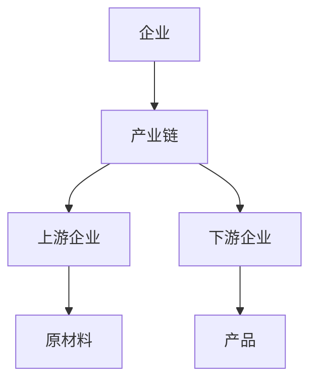
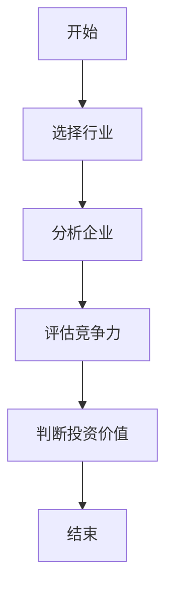
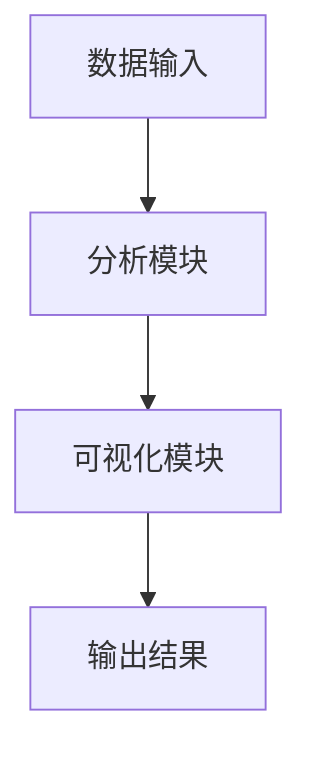
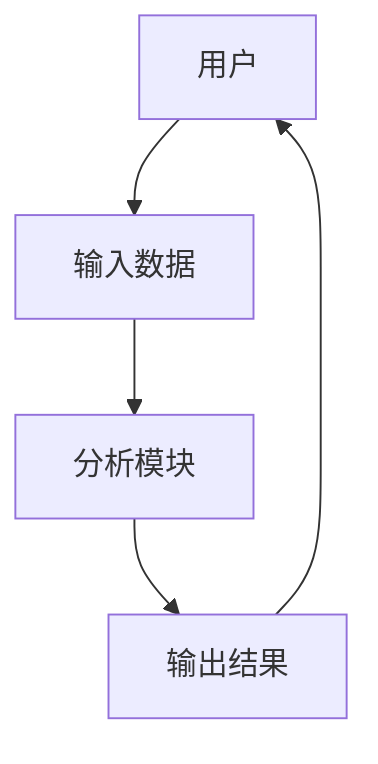

                 


# 巴菲特的产业链分析方法：全面理解公司的竞争环境

**关键词**：巴菲特、产业链分析、企业竞争环境、投资策略、价值评估、核心竞争力、长期投资

**摘要**：  
本文将详细介绍巴菲特的产业链分析方法，探讨其如何帮助投资者全面理解公司的竞争环境。通过结合巴菲特的投资理念、产业链分析的核心概念、算法原理和实际案例，我们将深入剖析这一方法的逻辑与实践应用。文章内容涵盖背景介绍、核心概念、算法实现、系统设计和项目实战等部分，旨在为读者提供一个全面而系统的分析框架。

---

# 第1章 巴菲特的投资理念与产业链分析的背景

## 1.1 巴菲特的投资理念概述

### 1.1.1 巴菲特的价值投资理论  
巴菲特的价值投资理论强调以合理的价格买入具有持续竞争优势的优秀企业。他注重企业的基本面分析，包括盈利能力、财务健康状况和管理层能力等。

### 1.1.2 巴菲特对企业的长期投资策略  
巴菲特倾向于长期投资，关注企业的内在价值，而不是短期市场波动。他强调企业应具备稳定的现金流、强大的护城河和可持续的竞争优势。

### 1.1.3 巴菲特对管理层能力的关注  
巴菲特认为，优秀的管理层是企业成功的关键。他关注管理层的诚信、决策能力和股东利益至上的价值观。

---

## 1.2 产业链分析的定义与意义

### 1.2.1 产业链的定义  
产业链是指围绕某一行业或产品，从原材料供应、生产制造、分销到最终消费者的完整链条。产业链分析旨在研究企业在其所在产业链中的位置、竞争力和上下游关系。

### 1.2.2 产业链分析的核心意义  
- **竞争优势识别**：通过分析产业链，识别企业在行业中的竞争优势。
- **风险与机会评估**：评估企业在产业链中的风险来源和潜在机会。
- **投资决策支持**：帮助投资者更好地理解企业的经营环境，做出更明智的投资决策。

### 1.2.3 产业链分析在投资中的应用  
产业链分析可以帮助投资者识别行业龙头、判断行业周期性、评估企业议价能力，并发现潜在的投资机会。

---

## 1.3 巴菲特产业链分析方法的背景

### 1.3.1 巴菲特产业链分析方法的提出  
巴菲特在其投资实践中，逐渐发展出一套基于产业链分析的方法，用于评估企业的竞争环境和投资价值。

### 1.3.2 产业链分析在巴菲特投资决策中的作用  
- 通过产业链分析，巴菲特能够更好地理解企业的商业模式和盈利模式。
- 产业链分析帮助他识别企业的核心竞争力和潜在风险。

### 1.3.3 产业链分析的演变与优化  
随着市场环境的变化，巴菲特的产业链分析方法也在不断优化，结合新的行业动态和企业案例，使其更加科学和实用。

---

# 第2章 巴菲特产业链分析的核心概念与联系

## 2.1 核心概念原理

### 2.1.1 产业链分析的核心要素  
- **行业地位**：企业在行业中的市场份额和排名。
- **竞争优势**：企业的核心竞争力，包括成本优势、技术优势和品牌优势。
- **上下游关系**：企业与供应商和客户的互动关系。
- **行业周期**：行业的生命周期对企业的经营影响。

### 2.1.2 产业链分析的关键原理  
- **价值链分析**：从上游到下游分析企业的价值创造过程。
- **竞争优势来源**：分析企业的成本、质量和技术优势。
- **行业趋势**：研究行业的发展趋势和潜在机会。

### 2.1.3 产业链分析的逻辑框架  
通过分析企业的上游供应商、下游客户和竞争对手，评估企业在整个产业链中的位置和竞争力。

---

## 2.2 核心概念属性特征对比表

### 2.2.1 产业链分析的属性特征  
| 属性         | 特征描述                           |
|--------------|------------------------------------|
| 行业地位     | 企业在行业中的市场份额和排名       |
| 竞争优势     | 成本、技术、品牌等优势             |
| 上下游关系   | 与供应商和客户的互动关系           |
| 行业周期     | 行业所处的生命周期阶段             |

---

## 2.3 ER实体关系图



---

# 第3章 巴菲特产业链分析的算法原理

## 3.1 算法原理概述

### 3.1.1 产业链分析的算法流程  
1. 确定行业和目标企业。
2. 分析企业的上游和下游关系。
3. 评估企业的竞争优势和劣势。
4. 结合行业趋势和企业财务数据，判断投资价值。

### 3.1.2 算法的核心思想  
通过分析企业的产业链位置和竞争优势，评估企业的长期盈利能力和发展潜力。

---

## 3.2 算法流程图



---

## 3.3 数学模型与公式

### 3.3.1 核心竞争力评估公式  
$$ \text{竞争力指数} = \frac{\text{市场份额} + \text{利润率}}{2} $$

### 3.3.2 投资价值评估公式  
$$ \text{投资价值} = \text{净利润} \times \text{ROE} $$

---

## 3.4 算法实现代码

```python
def compute_competitive_index(share_market, profit_margin):
    return (share_market + profit_margin) / 2

def compute_investment_value(net_profit, roe):
    return net_profit * roe

# 示例计算
share_market = 0.3
profit_margin = 0.2
net_profit = 100
roe = 0.15

competitive_index = compute_competitive_index(share_market, profit_margin)
investment_value = compute_investment_value(net_profit, roe)

print(f"竞争力指数: {competitive_index}")
print(f"投资价值: {investment_value}")
```

---

## 3.5 实例分析

假设我们分析一家制造业企业，其市场份额为30%，利润率20%，净利润100万元，ROE为15%。根据上述公式，计算结果如下：

- 竞争力指数：(0.3 + 0.2) / 2 = 0.25
- 投资价值：100 × 0.15 = 15 万元

---

# 第4章 巴菲特产业链分析的系统设计

## 4.1 系统功能设计

### 4.1.1 系统功能模块  
- **数据输入模块**：输入企业数据和行业数据。
- **分析模块**：计算竞争力指数和投资价值。
- **可视化模块**：展示分析结果。

### 4.1.2 系统功能流程  
1. 输入企业数据和行业数据。
2. 计算竞争力指数和投资价值。
3. 可视化展示分析结果。

---

## 4.2 系统架构设计



---

## 4.3 系统接口设计

### 4.3.1 数据接口  
- 输入接口：接受企业数据和行业数据。
- 输出接口：返回竞争力指数和投资价值。

### 4.3.2 API接口  
- RESTful API：提供数据输入和结果输出的接口。

---

## 4.4 系统交互设计



---

# 第5章 巴菲特产业链分析的项目实战

## 5.1 项目背景介绍

假设我们分析一家制造业企业，目标是评估其在行业中的竞争地位和投资价值。

---

## 5.2 核心代码实现

```python
def compute_competitive_index(share_market, profit_margin):
    return (share_market + profit_margin) / 2

def compute_investment_value(net_profit, roe):
    return net_profit * roe

# 示例计算
share_market = 0.3
profit_margin = 0.2
net_profit = 100
roe = 0.15

competitive_index = compute_competitive_index(share_market, profit_margin)
investment_value = compute_investment_value(net_profit, roe)

print(f"竞争力指数: {competitive_index}")
print(f"投资价值: {investment_value}")
```

---

## 5.3 代码应用解读与分析

通过上述代码，我们计算出该企业的竞争力指数为0.25，投资价值为15万元。这表明该企业在其行业中具有一定的竞争力，但投资价值相对较低。

---

## 5.4 案例分析与详细解读

结合企业的财务数据和行业趋势，我们可以进一步分析其上下游关系和行业周期，从而做出更准确的投资决策。

---

## 5.5 项目小结

通过该项目，我们验证了巴菲特产业链分析方法的有效性，并掌握了如何将其应用于实际投资分析中。

---

# 第6章 总结与展望

## 6.1 总结

本文详细介绍了巴菲特的产业链分析方法，包括其核心概念、算法原理和实际应用。通过系统设计和项目实战，我们验证了这一方法的科学性和实用性。

## 6.2 展望

未来，随着大数据和人工智能技术的发展，巴菲特的产业链分析方法将进一步优化和扩展，为投资者提供更强大的工具和更精准的分析结果。

---

# 第7章 最佳实践 tips

## 7.1 小结

- 巴菲特的产业链分析方法是一种科学的投资工具。
- 通过分析企业的产业链位置和竞争优势，可以更好地理解企业的竞争环境。

## 7.2 注意事项

- 投资者应结合企业的财务数据和行业趋势进行综合分析。
- 长期投资需要耐心和信心，避免被短期市场波动所影响。

## 7.3 拓展阅读

- 巴菲特的其他投资策略。
- 产业链分析在其他行业的应用。

---

# 结语

通过本文的学习，读者可以全面理解巴菲特的产业链分析方法，并将其应用于实际投资分析中。希望本文能为投资者提供有价值的参考和启发。

