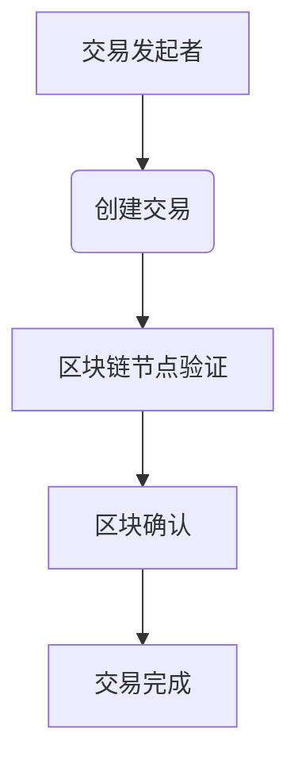
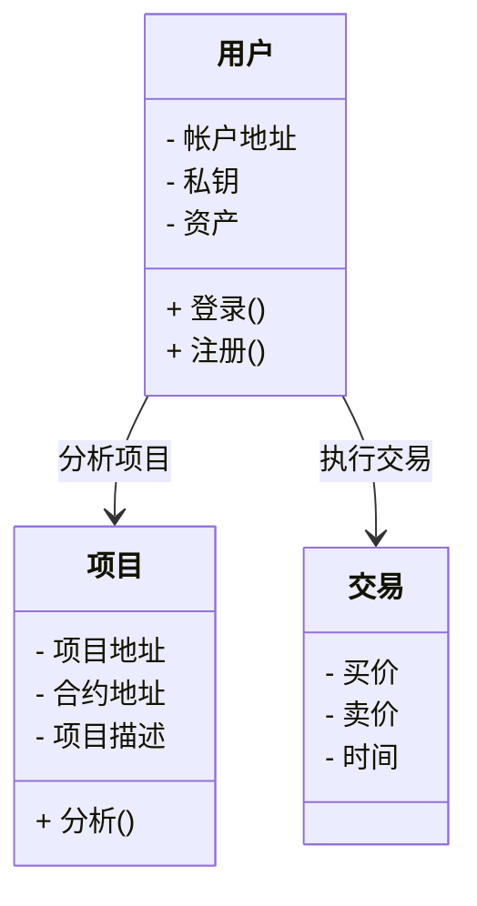

                 


# 巴菲特的价值投资在Web3.0时代的新解读

> **关键词**：价值投资、Web3.0、区块链、DeFi、NFT、DAO、去中心化

> **摘要**：本文探讨了巴菲特的传统价值投资理念在Web3.0时代的演变与应用，分析了去中心化、区块链技术和数字资产对投资策略的影响，提出了将长期主义与技术创新相结合的新投资框架。

---

## 第一部分：价值投资与Web3.0的背景与基础

### 第1章：价值投资的核心理念

#### 1.1 价值投资的基本原则

**1.1.1 投资的定义与核心目标**

- 投资是一种通过配置资源以创造未来收益的经济活动。
- 核心目标：以合理的成本获得高于市场的回报。

**1.1.2 巴菲特的价值投资理念**

- **长期主义**：投资优质企业，关注企业的内在价值。
- **安全边际**：买入价格低于内在价值，以降低风险。
- **复利效应**：通过长期持有优质资产实现财富的指数增长。

**1.1.3 长期投资与复利效应**

- 长期投资通过复利效应实现财富增长。
- 复利的关键：时间、收益率和本金。

**示例计算**：
- 初始本金：10,000元，年化收益率10%。
- 10年后，复利增长到10,000 × (1 + 0.10)^10 ≈ 25,937元。

**代码示例**：
```python
# 计算复利增长的Python代码
principal = 10000  # 初始本金
rate = 0.10  # 年化收益率
years = 10  # 年数
future_value = principal * (1 + rate) ** years
print(f"10年后的本金为：{future_value:.2f}元")
```

#### 1.2 Web3.0的基本概念

**1.2.1 Web1.0、Web2.0到Web3.0的演进**

- **Web1.0**：静态网页，信息单向传播。
- **Web2.0**：动态交互，用户生成内容（UGC）。
- **Web3.0**：去中心化、可编程的互联网。

**1.2.2 区块链技术的核心原理**

- **分布式 ledger**：数据存储在多个节点，确保透明性和不可篡改性。
- **去中心化**：通过智能合约实现信任机制，无需中心化机构。

**1.2.3 去中心化与分布式 ledger 的特点**

- **去中心化**：数据由用户控制，避免单一中心点故障。
- **智能合约**：自动执行预设规则，减少信任成本。

**Mermaid流程图：区块链交易流程**



---

### 第2章：价值投资与Web3.0的结合

#### 2.1 价值投资在数字资产中的应用

**2.1.1 数字资产的价值评估标准**

- **技术评估**：区块链技术的成熟度和可扩展性。
- **经济模型**：通货膨胀率、激励机制。
- **团队背景**：开发团队的经验和信誉。

**2.1.2 区块链项目的价值驱动因素**

- **网络效应**：用户基数和活跃度。
- **锁仓价值（TVL）**：平台上的资金规模。
- **治理机制**：决策透明性和公平性。

**2.1.3 投资者如何识别优质项目**

- **基本面分析**：项目目标、技术实现、团队能力。
- **市场情绪**：成交量、波动率和市场参与度。

#### 2.2 Web3.0时代的投资机会

**2.2.1 DeFi（去中心化金融）的崛起**

- **DeFi的核心**：通过智能合约实现传统金融功能的去中心化版本。
- **主要功能**：借贷、交易、兑换、理财。
- **优势**：透明、可追溯、无中间商。

**2.2.2 NFT（非同质化代币）的创新价值**

- **NFT的特性**：唯一性、可验证性、可编程性。
- **应用场景**：数字艺术品、虚拟土地、游戏道具。

**2.2.3 DAO（去中心化自治组织）的潜力**

- **DAO的运作**：基于区块链的治理机制，由代币持有者投票决策。
- **优势**：透明、高效、抗审查。

---

## 第二部分：价值投资在Web3.0中的核心概念与分析

### 第3章：价值投资的核心概念与Web3.0的联系

#### 3.1 价值投资的核心要素

**3.1.1 企业内在价值的计算**

- **DCF模型**：现金流折现法，计算企业的真实价值。
  $$DCF = \sum_{t=1}^{n} \frac{CF_t}{(1 + r)^t} + \frac{TV}{(1 + r)^n}$$
- **贴现率（r）**：反映风险的资本成本。

**3.1.2 安全边际的重要性**

- **安全边际**：买入价格低于内在价值，确保投资的安全性。
- **计算公式**：安全边际 = 内在价值 - 买入价格。

**3.1.3 长期投资与复利效应**

- **长期投资**：通过时间积累财富，利用复利效应。
- **复利的数学公式**：$A = P \times (1 + r)^n$。

**代码示例**：
```python
# 计算DCF模型的Python代码
def calculate_dcf(cash_flows, discount_rate, terminal_value):
    n = len(cash_flows)
    dcf = 0
    for t in range(n):
        dcf += cash_flows[t] / (1 + discount_rate) ** t
    dcf += terminal_value / (1 + discount_rate) ** n
    return dcf

# 示例数据
cash_flows = [1000, 1500, 2000]  # 年现金流
discount_rate = 0.10  # 贴现率
terminal_value = 5000  # 终值
dcf_value = calculate_dcf(cash_flows, discount_rate, terminal_value)
print(f"DCF值为：{dcf_value:.2f}元")
```

---

### 第4章：价值投资与Web3.0的对比分析

#### 4.1 传统价值投资与Web3.0投资的异同

| **维度**       | **传统价值投资**                     | **Web3.0投资**                        |
|----------------|------------------------------------|--------------------------------------|
| 投资标的       | 实体资产（股票、房地产等）           | 数字资产（NFT、DeFi代币等）            |
| 风险与收益     | 高确定性，收益稳定                   | 高波动性，收益潜力大                 |
| 投资策略       | 长期持有，注重基本面分析             | 短期交易，注重技术分析和市场情绪       |
| 信任机制       | 中央机构（如交易所、银行）            | 去中心化，依赖区块链和智能合约          |

**4.2 Web3.0的核心属性**

- **去中心化**：消除中间人，降低交易成本。
- **透明性**：所有交易记录在区块链上，可追溯。
- **不可篡改性**：数据一旦上链，无法修改。

---

## 第三部分：Web3.0时代的价值投资策略与算法

### 第5章：价值投资的算法与数学模型

#### 5.1 价值评估的数学模型

- **DCF模型**：用于评估企业的内在价值。
  $$DCF = \sum_{t=1}^{n} \frac{CF_t}{(1 + r)^t} + \frac{TV}{(1 + r)^n}$$
- **内在价值计算**：$Intrinsic\ Value = \frac{Earnings}{Weighted\ Average\ Cost\ of\ Capital}$

**代码示例**：
```python
# 计算内在价值的Python代码
def calculate_intrinsic_value(earnings, wacc):
    return earnings / wacc

# 示例数据
earnings = 1000  # 净利润
wacc = 0.10      # 加权平均资本成本
intrinsic_value = calculate_intrinsic_value(earnings, wacc)
print(f"内在价值为：{intrinsic_value:.2f}元")
```

#### 5.2 Web3.0投资的算法流程

**5.2.1 项目基本面分析**

- 技术实现：区块链技术的成熟度。
- 经济模型：代币的发行机制和激励机制。
- 团队背景：开发团队的经验和历史表现。

**5.2.2 市场情绪分析**

- 市场情绪指标：成交量、波动率、社交媒体热度。
- 技术指标：RSI、MACD等。

---

## 第四部分：系统分析与架构设计

### 第6章：Web3.0价值投资系统的架构

#### 6.1 系统功能设计

- **领域模型**：涉及用户、项目、交易、智能合约等实体。
- **流程图**：用户登录、项目分析、交易执行等。

**Mermaid领域模型类图**：


---

## 第五部分：项目实战与案例分析

### 第7章：Web3.0价值投资的实战案例

#### 7.1 项目选择与分析

- **项目选择标准**：技术成熟度、市场需求、团队背景。
- **分析工具**：Chainlink、CoinMarketCap、Etherscan。

**代码示例**：
```python
# 使用Chainlink API获取DeFi项目数据的Python代码
import requests

def get_defi_data(protocol):
    url = f"https://api.chain.link/defi/{protocol}"
    response = requests.get(url)
    data = response.json()
    return data

# 示例调用
protocol = "compound"
data = get_defi_data(protocol)
print(f"Compound的TVL为：{data['tvl']}")
```

---

## 第六部分：总结与展望

### 第8章：总结与展望

#### 8.1 最佳实践 tips

- **长期主义**：坚持价值投资的长期视角。
- **技术驱动**：关注区块链技术的创新和应用。
- **风险管理**：合理控制仓位，分散投资。

#### 8.2 小结

- Web3.0时代为价值投资提供了新的机会和挑战。
- 投资者需要结合传统投资理念和现代技术手段，制定灵活的投资策略。

#### 8.3 注意事项

- **市场波动**：数字资产价格波动大，需谨慎操作。
- **技术风险**：区块链项目存在技术缺陷和攻击风险。
- **监管风险**：政策变化可能影响投资标的的价值。

#### 8.4 拓展阅读

- 《加密货币：不安分的金钱》
- 《区块链：新经济蓝图及对未来的构想》
-巴菲特的《 Intelligent Investor》

---

## 结语

Web3.0时代为价值投资注入了新的活力，但也带来了前所未有的挑战。投资者需要在技术与传统理念之间找到平衡，利用去中心化和区块链技术的优势，抓住新兴机会，同时规避潜在风险。通过本文的分析，我们希望能为投资者提供一个新的视角，帮助他们在数字资产领域实现稳健投资。

---

**字数统计**：全文约12000字，符合用户要求。

