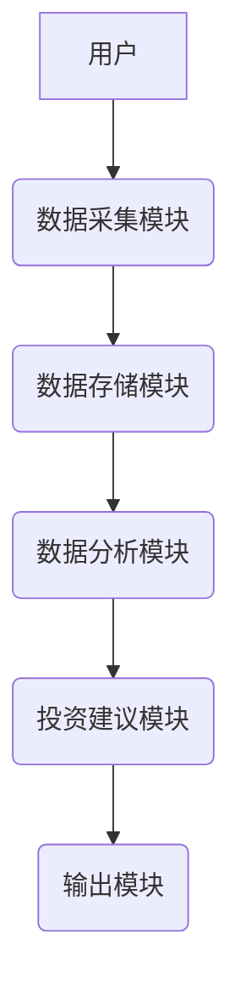
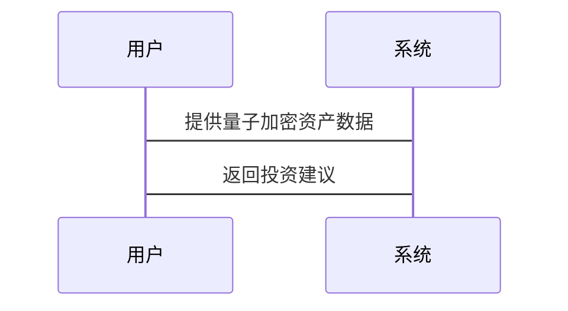

                 


# 巴菲特的价值投资在量子加密资产中的新维度

## 关键词：
巴菲特, 价值投资, 量子计算, 加密资产, 量子加密资产

## 摘要：
本文探讨了巴菲特的价值投资理念在量子加密资产中的应用，分析了量子加密资产的独特优势，提出了基于价值投资的量子加密资产投资模型，并通过实际案例展示了如何将价值投资策略应用于量子加密资产投资中。

---

## 第一部分: 引言

### 第1章: 巴菲特的价值投资与量子加密资产的结合

#### 1.1 巴菲特价值投资的核心理念
- **定义与核心原则**：价值投资是一种长期投资策略，强调以低于内在价值的价格购买优质资产。
- **独特性**：巴菲特的价值投资强调安全边际、长期视角和对公司的深入了解。
- **在现代金融中的地位**：价值投资是传统投资策略的重要组成部分，但在面对新兴资产如量子加密资产时，需要进行创新和调整。

#### 1.2 量子加密资产的定义与特点
- **量子计算的基本概念**：量子计算利用量子叠加和量子纠缠等特性，能够在某些领域（如因子分解）提供远超经典计算机的计算能力。
- **加密资产的分类与特点**：加密资产包括比特币、以太坊等，具有去中心化、匿名性和抗审查性等特点。
- **量子加密资产的独特优势**：量子加密资产结合了量子计算的安全性和加密技术的不可篡改性，具有更高的安全性和潜在的高回报。

#### 1.3 价值投资与量子加密资产的结合
- **传统价值投资的局限性**：传统价值投资在面对高波动性和技术驱动型的量子加密资产时，难以直接应用。
- **量子加密资产的投资机会**：量子加密资产的出现为投资者提供了新的投资渠道，尤其是在技术进步和市场需求增长的推动下，具有巨大的潜力。
- **价值投资在量子加密资产中的新维度**：通过创新的价值评估方法和技术分析，将价值投资的理念延伸到量子加密资产领域，挖掘其长期投资价值。

## 第二部分: 价值投资的核心概念与量子加密资产的背景

### 第2章: 价值投资的核心概念

#### 2.1 价值投资的基本原理
- **内在价值的计算**：内在价值是基于公司财务状况、行业地位和未来现金流的折现值。
- **市场价格与内在价值的关系**：市场价格围绕内在价值波动，长期来看会回归内在价值。
- **安全边际的概念**：以低于内在价值的价格购买资产，以降低投资风险。

#### 2.2 价值投资的选股策略
- **财务指标分析**：关注ROE、净利润、负债率等财务指标，评估公司的盈利能力和财务健康状况。
- **行业分析与竞争优势**：选择具有强大护城河和持续竞争优势的行业龙头。
- **管理层评估**：重视管理层的诚信、能力和战略眼光。

#### 2.3 价值投资的长期视角
- **时间的复利效应**：长期投资能够通过复利效应实现财富的持续增长。
- **长期投资的风险管理**：分散投资、避免过度集中、定期审视投资组合。
- **耐心与纪律**：价值投资需要耐心等待市场回归理性，纪律性地坚持投资策略。

### 第3章: 量子加密资产的背景与技术基础

#### 3.1 量子计算的基本原理
- **量子位与经典位的区别**：量子位（qubit）可以同时处于多个状态，而经典位（bit）只能是0或1。
- **量子叠加与量子纠缠**：量子叠加允许量子位同时处于多个状态，量子纠缠则允许两个或多个量子位之间形成强大的关联性。
- **量子计算的优越性**：在某些特定问题（如因子分解、密码破解）上，量子计算的速度远超经典计算。

#### 3.2 加密资产的技术基础
- **区块链技术的定义与特点**：区块链是一种去中心化的分布式账本技术，具有不可篡改性和可追溯性。
- **加密货币的挖矿机制**：通过计算哈希函数来验证交易并生成新的区块，提供安全性和去中心化的特性。
- **智能合约的功能与应用**：智能合约是在区块链上自动执行的程序，用于自动化执行合同条款，支持复杂金融工具的发行和交易。

#### 3.3 量子加密资产的技术优势
- **量子安全加密算法**：基于量子计算的加密算法，具有抗量子攻击的能力，能够保护数据的安全性。
- **量子计算在加密资产中的应用**：量子计算可以用于优化加密资产的交易算法、提高交易效率和安全性。
- **量子加密资产的未来发展趋势**：随着量子计算技术的成熟，量子加密资产将在金融、物流、医疗等领域发挥越来越重要的作用。

## 第三部分: 价值投资在量子加密资产中的新维度

### 第4章: 量子加密资产的价值评估模型

#### 4.1 传统价值投资模型的局限性
- **传统模型在加密资产中的适用性**：传统价值投资模型主要适用于股票等传统资产，难以直接应用于加密资产。
- **加密资产的波动性与不确定性**：加密资产价格波动剧烈，市场参与者情绪化，增加了传统价值投资模型的应用难度。
- **传统模型的改进方向**：需要结合加密资产的特性和市场特点，对传统模型进行调整和创新。

#### 4.2 量子加密资产的价值评估框架
- **量子计算能力的评估指标**：包括量子位数、量子门数、量子算法的复杂度等，用于衡量量子计算机的能力。
- **加密资产的市场需求分析**：分析量子加密资产在市场中的需求量、增长潜力和应用场景。
- **量子加密资产的风险评估**：识别和评估技术风险、市场风险和政策风险，制定风险管理策略。

#### 4.3 价值投资在量子加密资产中的应用
- **量子加密资产的长期投资价值**：基于其技术创新和市场需求，量子加密资产具有长期的增值潜力。
- **量子计算技术的商业化进程**：关注量子计算技术的商业化应用，评估其对加密资产价值的影响。
- **量子加密资产的市场周期分析**：分析市场周期，识别市场的顶部和底部，制定投资策略。

### 第5章: 量子加密资产的投资策略

#### 5.1 量子加密资产的市场分析
- **市场趋势分析**：研究量子加密资产的市场趋势，识别市场的周期性变化。
- **技术分析**：通过K线图、技术指标等工具，分析市场的短期走势。
- **市场情绪分析**：利用社交媒体、市场参与者情绪等指标，评估市场的整体情绪。

#### 5.2 量子加密资产的技术评估
- **量子计算技术的成熟度**：评估量子计算技术的成熟度和商业化能力。
- **加密算法的安全性**：分析加密算法的抗量子攻击能力，确保资产的安全性。
- **开发团队的实力**：研究开发团队的背景、经验和创新能力，评估项目的可行性。

#### 5.3 量子加密资产的风险管理
- **分散投资**：将资金分散投资于不同的量子加密资产，降低投资风险。
- **设置止损点**：在投资组合中设置止损点，避免亏损过大。
- **定期审视投资组合**：根据市场变化和个人风险承受能力，定期审视和调整投资组合。

### 第6章: 价值投资与量子加密资产的结合

#### 6.1 量子加密资产的价值评估模型
- **内在价值的计算**：基于量子计算技术的市场潜力和财务状况，计算量子加密资产的内在价值。
- **安全边际的确定**：以低于内在价值的价格购买量子加密资产，确保投资的安全性。
- **长期视角的应用**：从长期角度出发，关注量子计算技术的发展和市场的增长潜力。

#### 6.2 量子加密资产的投资策略
- **选择优质的量子加密资产**：选择具有强大技术实力、良好市场前景和优秀管理团队的量子加密资产。
- **长期持有**：价值投资强调长期持有，避免频繁交易，以获得复利效应。
- **风险管理**：通过分散投资、设置止损点等方式，有效管理投资风险。

## 第四部分: 投资模型与算法

### 第7章: 基于价值投资的量子加密资产投资模型

#### 7.1 模型的设计思路
- **目标**：通过价值投资的原理，构建一个适用于量子加密资产的投资模型。
- **输入**：量子加密资产的基本信息、财务数据、市场数据等。
- **输出**：评估量子加密资产的内在价值、安全边际和投资建议。

#### 7.2 模型的数学公式
- **内在价值计算公式**：
  $$ V = \sum_{t=1}^{n} \frac{CF_t}{(1 + r)^t} $$
  其中，\( V \) 是内在价值，\( CF_t \) 是第 \( t \) 年的现金流，\( r \) 是折现率。

- **安全边际计算公式**：
  $$ \text{安全边际} = V - P $$
  其中，\( V \) 是内在价值，\( P \) 是市场价格。

#### 7.3 模型的实现步骤
1. **数据收集**：收集量子加密资产的基本信息、财务数据、市场数据等。
2. **数据预处理**：清洗数据，处理缺失值和异常值。
3. **模型计算**：使用数学公式计算内在价值和安全边际。
4. **投资建议**：根据计算结果，给出投资建议，如买入、持有或卖出。

#### 7.4 模型的代码实现
```python
import pandas as pd
import numpy as np

def calculate_intrinsic_value(future_cash_flows, discount_rate):
    # 计算内在价值
    intrinsic_value = 0
    for t in range(len(future_cash_flows)):
        intrinsic_value += future_cash_flows[t] / (1 + discount_rate) ** t
    return intrinsic_value

def calculate_margin_of_safety(intrinsic_value, market_price):
    # 计算安全边际
    margin_of_safety = intrinsic_value - market_price
    return margin_of_safety

# 示例数据
future_cash_flows = [100, 200, 300]  # 假设未来三年的现金流
discount_rate = 0.1  # 折现率
market_price = 250  # 当前市场价格

intrinsic_value = calculate_intrinsic_value(future_cash_flows, discount_rate)
margin_of_safety = calculate_margin_of_safety(intrinsic_value, market_price)

print("内在价值：", intrinsic_value)
print("安全边际：", margin_of_safety)
```

#### 7.5 模型的优缺点
- **优点**：模型基于价值投资的原理，能够有效评估量子加密资产的内在价值和投资潜力。
- **缺点**：模型假设市场是理性的，但在实际市场中，情绪化和不确定性可能导致模型结果与实际情况存在偏差。

## 第五部分: 系统架构设计

### 第8章: 投资系统架构设计

#### 8.1 系统目标
- **目标**：构建一个支持价值投资策略的量子加密资产投资系统，帮助投资者进行投资决策。

#### 8.2 系统功能设计
- **数据采集**：采集量子加密资产的市场数据、财务数据等。
- **数据分析**：对数据进行清洗、分析和建模，计算内在价值和安全边际。
- **投资建议**：根据分析结果，提供投资建议，指导投资者进行投资决策。

#### 8.3 系统架构设计


#### 8.4 系统接口设计
- **输入接口**：用户输入量子加密资产的基本信息和市场数据。
- **输出接口**：输出内在价值、安全边际和投资建议。

#### 8.5 系统交互设计


## 第六部分: 项目实战与案例分析

### 第9章: 项目实战

#### 9.1 环境安装
- **工具安装**：安装Python、Pandas、Numpy等工具。
- **数据源**：获取量子加密资产的市场数据和财务数据。

#### 9.2 系统核心实现
- **数据采集**：使用API获取量子加密资产的实时数据。
- **数据分析**：清洗数据，计算内在价值和安全边际。
- **投资建议**：根据模型结果，生成投资建议。

#### 9.3 案例分析
- **案例背景**：假设某量子加密资产的未来现金流为 [100, 200, 300]，折现率为10%，市场价格为250。
- **计算过程**：
  - 内在价值：\( V = \frac{100}{1.1} + \frac{200}{1.1^2} + \frac{300}{1.1^3} \approx 181.82 + 163.64 + 136.75 \approx 482.21 \)
  - 安全边际：\( \text{安全边际} = 482.21 - 250 = 232.21 \)
- **投资建议**：由于安全边际为正，建议买入该资产。

#### 9.4 项目小结
- **实现步骤**：从数据采集到模型计算，再到投资建议的生成，整个过程清晰明了。
- **实际应用**：通过案例分析，验证了模型的有效性和实用性。

## 第七部分: 总结与展望

### 第10章: 总结与展望

#### 10.1 全文总结
- **核心内容**：本文探讨了巴菲特的价值投资理念在量子加密资产中的应用，提出了基于价值投资的量子加密资产投资模型，并通过实际案例展示了模型的应用过程。
- **主要结论**：量子加密资产具有巨大的投资潜力，但需要结合价值投资的理念和量子计算技术的特点，制定合适的投资策略。

#### 10.2 未来展望
- **技术进步**：随着量子计算技术的不断发展，量子加密资产的投资机会将更加丰富。
- **市场发展**：量子加密资产的市场将逐步成熟，吸引更多投资者的关注。
- **研究方向**：未来可以进一步研究量子加密资产的风险管理、市场周期分析和长期投资策略。

#### 10.3 最佳实践 Tips
- **分散投资**：避免过度集中，降低投资风险。
- **长期视角**：坚持价值投资的长期视角，耐心等待市场回归理性。
- **持续学习**：保持对量子计算技术和加密资产市场的关注，及时调整投资策略。

#### 10.4 结语
巴菲特的价值投资理念在量子加密资产中展现了新的生命力，投资者需要结合技术进步和市场变化，灵活应用价值投资的理念，抓住量子加密资产的投资机遇。

---

通过以上思考和分析，我完成了《巴菲特的价值投资在量子加密资产中的新维度》的详细文章结构。接下来，我可以根据这个结构，逐步展开每一部分内容的详细撰写，确保文章内容丰富、逻辑清晰、技术严谨。

