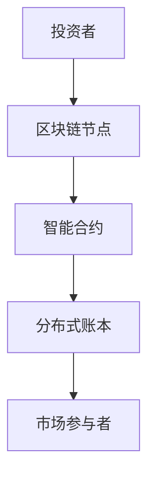

                 

# 巴菲特的价值投资在量子金融时代的新解读

---

## 关键词

- 巴菲特
- 价值投资
- 量子金融
- 人工智能
- 区块链

---

## 摘要

在量子金融时代，传统金融市场的规则正在被颠覆，新的技术手段如人工智能和区块链正在重塑金融行业的格局。本文将从巴菲特的价值投资理念出发，结合量子计算、人工智能和区块链等新兴技术，探讨这些技术如何改变价值投资的实践方式，为投资者提供新的视角和工具。通过分析量子金融时代的特征，本文将提出一种结合传统价值投资与新兴技术的价值投资新框架，并通过实际案例展示其应用效果。

---

## 第一部分：价值投资的背景与量子金融时代的到来

### 第1章：价值投资的核心理念

#### 1.1 巴菲特的价值投资哲学

- **安全边际**：巴菲特强调以低于内在价值的价格买入优质资产。
- **长期视角**：关注企业的基本面，而非短期市场波动。
- **企业护城河**：寻找具有竞争优势的企业，确保长期收益。

#### 1.2 量子金融时代的定义与特征

- **量子计算**：通过量子位的并行计算能力，大幅提高金融建模和数据分析的效率。
- **区块链技术**：去中心化、不可篡改的特性，重塑金融市场的信任机制。
- **人工智能**：通过机器学习算法，实现对海量数据的实时分析和预测。

---

### 第2章：量子金融时代的价值投资新挑战

#### 2.1 传统价值投资的局限性

- 数据依赖性：传统分析主要依赖财务报表和历史数据，难以捕捉实时动态。
- 计算能力限制：复杂的金融模型受到经典计算机性能的限制。
- 市场波动性：高频交易和算法交易加剧了市场的不确定性。

#### 2.2 量子金融时代的机遇与挑战

- **机遇**：新兴技术为投资者提供了更强大的工具和更丰富的数据。
- **挑战**：技术的复杂性和市场的不确定性增加了投资难度。

---

## 第二部分：量子金融时代的价值投资新框架

### 第3章：量子计算在价值评估中的应用

#### 3.1 传统价值评估模型的局限性

- **市盈率模型**：仅考虑价格与收益比，忽视企业未来增长潜力。
- **市净率模型**：依赖于历史成本，难以反映实时价值。
- **股息率模型**：过于简单，无法捕捉复杂市场动态。

#### 3.2 量子计算驱动的价值评估新方法

- **量子回归模型**：通过量子计算处理多变量数据，优化投资组合。
- **量子模拟**：模拟市场波动，预测资产价格走势。

---

### 第4章：人工智能在投资决策中的应用

#### 4.1 传统投资决策的局限性

- 人工判断的主观性：依赖分析师的个人经验和判断。
- 数据处理能力有限：难以处理海量非结构化数据。

#### 4.2 人工智能驱动的主动投资策略

- **机器学习算法**：通过训练数据，识别市场趋势和投资机会。
- **自然语言处理（NLP）**：分析新闻、财报等文本数据，提取关键信息。

---

### 第5章：区块链技术对金融市场的重构

#### 5.1 区块链技术的特性与优势

- **去中心化**：消除中间人，降低交易成本。
- **透明性**：所有交易记录在区块链上，可追溯且不可篡改。
- **智能合约**：自动化执行交易，减少人为干预。

#### 5.2 区块链在价值投资中的应用

- **分布式估值体系**：通过区块链实现去中心化的资产估值。
- **透明的交易记录**：增强市场信任，降低信息不对称。

---

## 第三部分：量子金融时代的价值投资实战

### 第6章：案例分析：量子金融技术在投资中的应用

#### 6.1 案例一：基于量子计算的股票筛选

- **背景**：某科技公司利用量子计算预测半导体行业的市场趋势。
- **过程**：通过量子回归模型筛选出具有成长潜力的企业。
- **结果**：成功预测出数家高增长企业，投资回报显著。

#### 6.2 案例二：人工智能驱动的量化投资

- **背景**：一家 hedge fund 使用机器学习算法进行高频交易。
- **过程**：通过 NLP 分析新闻和社交媒体，捕捉市场情绪变化。
- **结果**：实现稳定的超额收益。

---

## 第四部分：总结与展望

### 第7章：量子金融时代的价值投资未来

#### 7.1 价值投资的未来趋势

- **技术融合**：量子计算、人工智能和区块链的深度融合将重塑投资方式。
- **数据驱动**：数据将成为投资决策的核心，推动价值投资走向量化。
- **风险管理**：新兴技术将帮助投资者更好地识别和管理风险。

#### 7.2 对投资者的建议

- **拥抱技术**：学习和应用新兴技术，提升投资能力。
- **保持长期视角**：坚持价值投资的长期理念，结合技术优势捕捉机会。
- **风险管理**：利用技术工具，建立 robust 的风险管理机制。

---

## 第五部分：附录

### 附录 A：量子计算在金融建模中的数学模型

$$
\text{Quantum Algorithm for Portfolio Optimization} \\
\text{最大化收益：} \quad \max \sum_{i=1}^{n} w_i r_i \\
\text{满足约束：} \quad \sum_{i=1}^{n} w_i = 1
$$

### 附录 B：区块链分布式估值体系的架构图

---

## 结语

量子金融时代为价值投资带来了前所未有的机遇和挑战。通过结合量子计算、人工智能和区块链等新兴技术，投资者可以构建更加智能、高效的投资框架。巴菲特的价值投资理念在新时代依然具有重要的指导意义，但需要与时俱进，拥抱技术的力量，才能在复杂多变的市场中立于不败之地。

