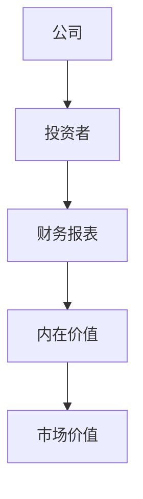

                 

# 巴菲特的价值投资实践案例分析

## 关键词：价值投资，巴菲特，投资策略，案例分析，内在价值，竞争优势，安全边际

## 摘要：本文通过分析巴菲特的价值投资实践案例，详细探讨了价值投资的核心理念、分析方法和实际应用。通过对巴菲特的经典投资案例的深入剖析，揭示了其成功的投资策略和决策过程。文章结合技术语言和专业分析，为读者提供了全面的理解和实践指导。

---

# 第1章 巴菲特及其价值投资概述

## 1.1 巴菲特的生平与投资理念

### 1.1.1 巴菲特的早年经历与投资起步
- 巴菲特的早年生活：生于1934年，美国内布拉斯州 Omaha市。
- 初中时期开始对股票投资产生兴趣，阅读格雷厄姆的《智慧的投资者》。
- 哈佛大学辍学，进入哥伦比亚商学院，师从格雷厄姆，学习价值投资理论。

### 1.1.2 巴菲特的价值投资核心理念
- 投资的本质是寻找内在价值，而非关注市场波动。
- 长期投资，选择具有持续竞争优势的公司。
- 安全边际的重要性：以低于内在价值的价格买入优质资产。

### 1.1.3 巴菲特投资哲学的演变与影响
- 早期受格雷厄姆影响，注重安全边际和市场估值。
- 后期更注重竞争优势和管理层质量，形成独特投资风格。
- 巴菲特的投资哲学对全球投资者的影响深远。

## 1.2 价值投资的核心概念
### 1.2.1 价值投资的定义与特点
- 价值投资是一种以低于公平价值的价格买入优质资产的投资策略。
- 长期投资，注重企业的内在价值，而非短期市场波动。
- 强调安全边际和风险控制。

### 1.2.2 价值投资与其他投资策略的对比
| 投资策略 | 核心关注点 | 投资期限 | 风险承受 |
|----------|------------|----------|----------|
| 价值投资 | 内在价值、安全边际 | 长期 | 低风险 |
| 技术分析 | 价格走势、技术指标 | 短期 | 高风险 |
| 成长投资 | 高成长性企业 | 中长期 | 中风险 |

### 1.2.3 价值投资的适用场景与局限性
- 适用场景：市场低迷、优质资产价格被低估时。
- 局限性：短期市场波动可能影响投资回报，需要较长的持有时间。

## 1.3 巴菲特投资的成功案例概述
### 1.3.1 巴菲特的经典投资案例
- 可口可乐：长期持有，看重品牌价值和稳定的现金流。
- IBM：看好其技术优势和管理层能力。
- 巴西国家石油公司：押注其资源优势和长期增长潜力。

### 1.3.2 巴菲特投资决策的共同特征
- 选择具有持续竞争优势的企业。
- 买入价格低于内在价值。
- 长期持有，耐心等待价值实现。

### 1.3.3 巴菲特投资哲学的实际应用
- 通过分析财务报表评估企业价值。
- 关注管理层素质和企业文化。
- 选择具有稳定现金流和高ROE的企业。

---

# 第2章 价值投资的核心概念与联系

## 2.1 价值投资的核心概念
### 2.1.1 安全边际的概念与计算
- 安全边际 = 内在价值 - 市场价格。
- 买入价格应低于内在价值，确保安全边际的存在。

### 2.1.2 内在价值的定义与计算公式
- 内在价值是企业未来现金流的现值。
- 计算公式：$$ 内在价值 = \sum_{t=1}^{n} \frac{CF_t}{(1+r)^t} $$
  - CF_t：第t年的现金流。
  - r：折现率。

### 2.1.3 竞争优势的分析框架
- 经济护城河：成本优势、品牌优势、技术优势等。
- 管理层质量：管理层能力、决策风格、股东利益保护。

## 2.2 核心概念的属性对比
### 2.2.1 内在价值与市场价值的对比
- 内在价值是企业的真实价值，市场价值是价格。
- 当市场价格低于内在价值时，投资机会出现。

### 2.2.2 安全边际与风险的对比
- 安全边际越大，投资风险越低。
- 安全边际提供了一种缓冲，避免市场波动带来的损失。

### 2.2.3 竞争优势与行业地位的对比
- 竞争优势决定了企业的长期盈利能力。
- 行业地位影响企业的市场占有率和竞争优势。

## 2.3 实体关系图

---

# 第3章 巴菲特的价值投资策略分析

## 3.1 价值投资的策略框架
### 3.1.1 确定投资目标与时间 horizon
- 投资目标：寻找具有持续竞争优势的企业。
- 时间 horizon：长期投资，耐心等待价值实现。

### 3.1.2 选择具有持续竞争优势的企业
- 竞争优势：经济护城河、成本优势、品牌优势。
- 管理层质量：管理层能力、决策风格、股东利益保护。

### 3.1.3 评估企业的内在价值
- 使用DCF模型计算企业内在价值。
- 比较市场价格与内在价值，确保安全边际的存在。

## 3.2 投资策略的系统分析与架构设计
### 3.2.1 系统功能设计
- 输入：企业财务数据、行业信息、管理层信息。
- 处理：计算内在价值、评估竞争优势、确定安全边际。
- 输出：投资决策（买入、持有、卖出）。

### 3.2.2 系统架构设计

### 3.2.3 系统接口设计
- 数据接口：获取企业财务数据、行业信息。
- 分析接口：计算内在价值、评估竞争优势。
- 决策接口：生成投资决策。

## 3.3 价值投资的算法原理
### 3.3.1 内在价值计算算法

### 3.3.2 折现率计算公式
- 折现率 = 无风险利率 + 风险溢价。
- 计算公式：$$ r = r_f + \text{风险溢价} $$

---

# 第4章 巴菲特的经典投资案例分析

## 4.1 可口可乐的投资案例
### 4.1.1 投资背景与决策过程
- 投资背景：可口可乐的全球品牌影响力和稳定的现金流。
- 决策过程：评估内在价值、判断安全边际、选择长期持有。

### 4.1.2 投资结果与经验总结
- 投资结果：长期持有可口可乐，获得稳定的股息收益和股价增长。
- 经验总结：品牌优势和现金流稳定性是重要的投资因素。

## 4.2 IBM的投资案例
### 4.2.1 投资背景与决策过程
- 投资背景：IBM的技术优势和管理层能力。
- 决策过程：评估内在价值、判断安全边际、选择长期持有。

### 4.2.2 投资结果与经验总结
- 投资结果：IBM股价表现稳定，股息增长。
- 经验总结：技术优势和管理层质量是重要的投资因素。

## 4.3 巴西国家石油公司
### 4.3.1 投资背景与决策过程
- 投资背景：巴西国家石油公司的资源优势和长期增长潜力。
- 决策过程：评估内在价值、判断安全边际、选择长期持有。

### 4.3.2 投资结果与经验总结
- 投资结果：巴西国家石油公司股价表现稳定，股息增长。
- 经验总结：资源优势和长期增长潜力是重要的投资因素。

---

# 第5章 价值投资的长期策略与风险管理

## 5.1 价值投资的长期策略
### 5.1.1 长期投资的核心要素
- 长期持有优质资产，耐心等待价值实现。
- 选择具有持续竞争优势的企业，确保长期增长潜力。

### 5.1.2 投资组合的构建与优化
- 分散投资：降低风险，避免过度集中。
- 定期审视：根据市场变化和企业情况调整投资组合。

## 5.2 风险管理与安全边际
### 5.2.1 安全边际的持续评估
- 定期评估安全边际，确保投资组合的安全性。
- 调整买入价格，确保安全边际的存在。

### 5.2.2 风险管理策略
- 风险分散：通过投资不同行业和企业降低风险。
- 风险控制：设定止损点，避免重大损失。

---

# 第6章 价值投资的现代挑战与应对策略

## 6.1 价值投资的现代挑战
### 6.1.1 科技公司的评估与投资
- 科技公司的特点是高成长性和高风险。
- 评估科技公司时需要关注技术创新、市场竞争力和管理层能力。

### 6.1.2 新兴市场的投资机会
- 新兴市场具有高增长潜力，但也面临更多的不确定性和风险。
- 投资新兴市场时需要关注宏观经济环境和政策风险。

## 6.2 价值投资的应对策略
### 6.2.1 科技公司的投资策略
- 选择具有持续技术创新和市场竞争力的科技公司。
- 评估管理层能力和企业治理结构。

### 6.2.2 新兴市场的投资策略
- 关注具有竞争优势和长期增长潜力的企业。
- 选择具有稳定现金流和高ROE的企业。

---

# 第7章 总结与展望

## 7.1 总结
- 巴菲特的价值投资理念强调长期投资、选择具有持续竞争优势的企业、注重安全边际。
- 通过分析巴菲特的经典投资案例，揭示了其成功的投资策略和决策过程。

## 7.2 展望
- 价值投资的未来发展方向：结合科技和数据分析，优化投资策略。
- 新兴市场和科技公司的投资机会将成为价值投资者关注的重点。

---

# 第8章 最佳实践与小结

## 8.1 最佳实践 Tips
- 选择具有持续竞争优势的企业，长期持有。
- 评估安全边际，确保投资的安全性。
- 关注管理层能力和企业治理结构。

## 8.2 小结
- 价值投资是一种长期稳健的投资策略，需要投资者具备耐心和纪律性。
- 巴菲特的投资理念和实践为我们提供了宝贵的经验和启示。

---

# 参考文献
- 巴菲特股东大会演讲
- 格雷厄姆《智慧的投资者》
- 现代投资组合理论相关文献

