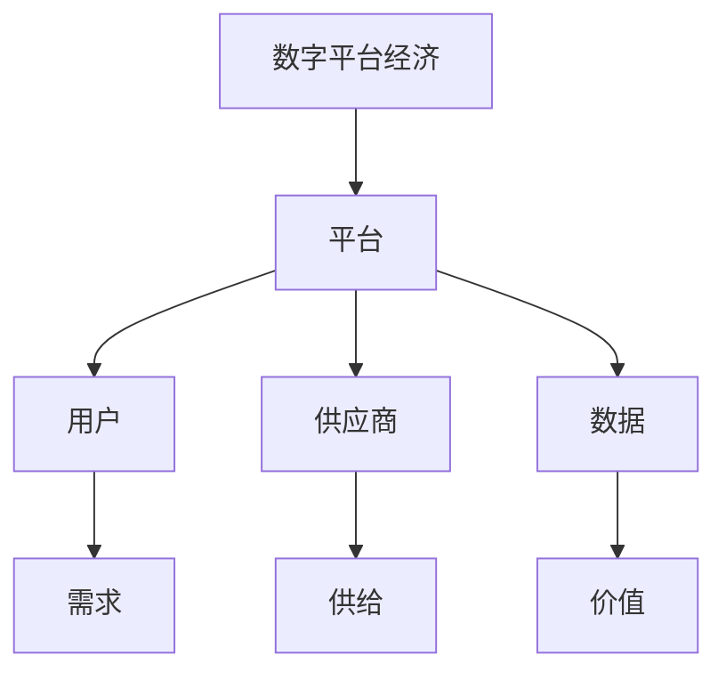

                 


```markdown
# 巴菲特的价值链分析：数字平台经济下的价值重构

> 关键词：数字平台经济、巴菲特、价值链分析、价值重构、数字经济、投资分析

> 摘要：随着数字经济的快速发展，数字平台经济逐渐成为主导经济模式。本文从巴菲特的价值链分析角度，探讨数字平台经济下的价值重构，分析数字技术对企业价值的影响，以及如何在数字时代重构企业价值，为投资者和企业管理者提供新的视角和方法。

---

## 第一部分：数字平台经济的背景与现状

### 第1章：数字平台经济的背景与现状

#### 1.1 数字平台经济的定义与特征
- **1.1.1 数字平台经济的定义**  
  数字平台经济是指基于数字技术构建的平台型经济模式，通过互联网技术和大数据分析，连接供需双方，提供撮合交易或服务的商业模式。其核心在于利用数字技术降低交易成本，提高效率。

- **1.1.2 数字平台经济的核心特征**  
  1. **平台化**：通过平台连接多方参与者，实现资源共享和价值创造。  
  2. **数字化**：依赖于数字技术实现数据采集、分析和应用。  
  3. **网络效应**：用户数量的增加会带来平台价值的指数级增长。  
  4. **数据驱动**：数据是平台的核心资产，驱动决策和业务创新。

- **1.1.3 数字平台经济的演变历程**  
  数字平台经济起源于20世纪末的互联网技术发展，经历了从早期的电商平台到现在的多领域平台（如共享经济、社交平台等）的演变。当前，数字平台经济已渗透到社会经济的各个领域。

#### 1.2 巴菲特价值链分析的背景
- **1.2.1 巴菲特投资理念的核心思想**  
  巴菲特的价值投资理念强调长期投资、安全边际和企业基本面分析。他认为，企业的价值取决于其未来现金流的现值，而现金流的核心来源于企业的核心竞争力和市场地位。

- **1.2.2 巴菲特价值链分析的定义**  
  巴菲特价值链分析是一种基于企业价值链的分析方法，通过识别企业在价值链中的关键环节和竞争优势，评估企业的整体价值。这种方法强调从原材料采购、生产、销售到最终用户服务的全价值链分析。

- **1.2.3 巴菲特价值链分析的适用性**  
  巴菲特的价值链分析不仅适用于传统制造业，也可以扩展到数字平台经济。通过分析数字平台企业的价值链，可以更好地理解其商业模式和价值创造过程。

---

## 第二部分：数字平台经济与巴菲特价值链分析的结合

### 第2章：数字平台经济与巴菲特价值链分析的结合

#### 2.1 数字平台经济与巴菲特价值链分析的结合背景
- **2.1.1 数字经济时代的价值链重构**  
  数字技术的应用正在重构传统价值链，数字平台经济通过数据驱动的方式，将价值链从线性模式转变为网络化、生态化的模式。这种重构使得企业需要重新审视其价值创造方式。

- **2.1.2 巴菲特投资理念在数字时代的挑战与机遇**  
  数字平台经济的崛起为巴菲特的价值投资理念带来了新的挑战和机遇。传统的财务指标和竞争优势分析需要结合新的数字技术特征进行调整。

#### 2.2 数字平台经济下价值重构的核心要素
- **2.2.1 数字技术对价值链的影响**  
  数字技术通过数据采集、分析和应用，优化了企业的采购、生产、销售和售后等环节，降低了成本，提高了效率。

- **2.2.2 平台经济中的多方利益相关者**  
  数字平台经济通过连接用户、供应商、合作伙伴等多方参与者，构建了一个多方共赢的生态系统。这种生态系统使得价值创造从单点竞争转变为生态协同。

- **2.2.3 数字平台经济下的新型价值传递机制**  
  数字平台经济通过数据驱动的方式，实现了价值的实时传递和动态调整。这种机制使得企业能够更快速地响应市场需求，优化资源配置。

---

## 第三部分：数字平台经济中的核心概念与联系

### 第3章：数字平台经济中的核心概念与联系

#### 3.1 核心概念原理
- **3.1.1 数字平台经济的核心要素**  
  数字平台经济的核心要素包括：  
  1. 数据：平台的核心资产，驱动业务决策。  
  2. 平台：连接供需双方的桥梁，提供撮合服务。  
  3. 用户：平台的主要参与者，包括消费者和供应商。  
  4. 网络效应：平台价值的放大效应，用户数量增加带来平台价值指数级增长。

- **3.1.2 巴菲特价值链分析的核心要素**  
  巴菲特价值链分析的核心要素包括：  
  1. 原材料采购：企业获取资源的能力。  
  2. 生产过程：企业的生产能力与成本控制。  
  3. 销售渠道：企业的市场覆盖能力。  
  4. 用户价值：企业的客户满意度与忠诚度。

#### 3.2 核心概念属性特征对比
- **3.2.1 数字平台经济与传统经济的对比分析**  
  | 特性          | 数字平台经济             | 传统经济               |
  |---------------|--------------------------|------------------------|
  | 价值创造       | 数据驱动，生态协同       | 线性价值链，单点竞争   |
  | 资产核心       | 数据                     | 物资、设备             |
  | 竞争优势       | 网络效应、数据优势       | 价格、质量             |
  | 价值传递       | 实时动态调整             | 线性传递，周期较长      |

- **3.2.2 巴菲特价值链分析与传统投资分析的对比分析**  
  | 方法          | 巴菲特价值链分析         | 传统投资分析           |
  |---------------|--------------------------|-------------------------|
  | 分析对象       | 企业全价值链             | 企业财务指标           |
  | 分析重点       | 价值创造与传递           | 财务表现与估值         |
  | 分析工具       | 价值链图、生态系统分析     | 财务报表、DCF模型       |

#### 3.3 实体关系图（ER图）


---

## 第四部分：数字平台经济下的算法原理

### 第4章：数字平台经济下的算法原理

#### 4.1 协同过滤算法
- **4.1.1 协同过滤算法的定义**  
  协同过滤算法是一种基于用户行为数据的推荐算法，通过分析用户的历史行为，找到相似用户的偏好，从而推荐相关内容或产品。

- **4.1.2 协同过滤算法的实现步骤**  
  1. 数据采集：收集用户的行为数据（如点击、购买、评价等）。  
  2. 相似度计算：计算用户之间的相似度，常用余弦相似度或皮尔逊相关系数。  
  3. 推荐生成：基于相似用户的偏好，生成推荐列表。

- **4.1.3 协同过滤算法的代码实现**  
  ```python
  import numpy as np
  from sklearn.metrics.pairwise import cosine_similarity

  # 示例数据：用户-商品评分矩阵
  user_data = {
      'user1': [4, 3, 0, 2],
      'user2': [3, 4, 0, 1],
      'user3': [2, 3, 0, 4],
      'user4': [0, 1, 4, 3]
  }

  # 转换为矩阵形式
  users = list(user_data.keys())
  products = [1, 2, 3, 4]
  ratings = np.array([user_data[u] for u in users], dtype=float)

  # 计算相似度矩阵
  similarity = cosine_similarity(ratings)

  # 找出与目标用户最相似的用户
  target_user_index = 0  # 目标用户为user1
  similar_users = np.argsort(similarity[target_user_index])[::-1]
  similar_users = similar_users[1:]  # 去除自身

  # 推荐商品
  recommendations = []
  for u in similar_users:
      for p in range(len(products)):
          if ratings[u][p] == 0:
              recommendations.append((users[u], products[p]))
              break

  print("推荐商品为：", recommendations)
  ```

- **4.1.4 协同过滤算法的数学模型**  
  相似度计算公式：$$\text{相似度}(u, v) = \frac{\sum_{i} (r_{u,i} - \bar{r}_u)(r_{v,i} - \bar{r}_v)}{\sqrt{\sum_{i} (r_{u,i} - \bar{r}_u)^2} \cdot \sqrt{\sum_{i} (r_{v,i} - \bar{r}_v)^2}}$$  
  预测模型公式：$$\hat{r}_{u,i} = \bar{r}_u + \sum_{v} w_{u,v} (r_v - \bar{r}_v)$$

---

## 第五部分：数字平台经济下的系统分析与架构设计

### 第5章：数字平台经济下的系统分析与架构设计

#### 5.1 系统功能设计
- **5.1.1 系统功能模块**  
  1. 用户模块：用户注册、登录、个人信息管理。  
  2. 供应商模块：供应商入驻、商品上架、订单管理。  
  3. 平台模块：数据采集、协同过滤推荐、交易撮合。  
  4. 数据模块：数据存储、数据分析、数据可视化。

- **5.1.2 系统功能流程**  
  ```mermaid
  graph TD
      A[用户] --> B[平台]
      B --> C[数据采集]
      C --> D[协同过滤推荐]
      D --> E[交易撮合]
      E --> F[订单完成]
  ```

#### 5.2 系统架构设计
- **5.2.1 系统架构图**  
  ```mermaid
  classDiagram
      class 用户
      class 供应商
      class 平台
      class 数据库
      用户 --> 平台
      供应商 --> 平台
      平台 --> 数据库
  ```

- **5.2.2 系统交互序列图**  
  ```mermaid
  sequenceDiagram
      用户->>平台: 请求推荐商品
      平台->>数据库: 查询用户历史行为
      平台->>协同过滤算法: 计算相似用户
      平台->>数据库: 获取相似用户的商品偏好
      平台->>用户: 返回推荐列表
  ```

---

## 第六部分：数字平台经济下的项目实战

### 第6章：数字平台经济下的项目实战

#### 6.1 项目背景与目标
- **6.1.1 项目背景**  
  某电商平台希望通过协同过滤算法优化推荐系统，提高用户购买转化率。

- **6.1.2 项目目标**  
  实现基于协同过滤算法的推荐系统，提升用户体验和平台销售额。

#### 6.2 环境安装与配置
- **6.2.1 环境要求**  
  - Python 3.6+
  - numpy, scikit-learn, pandas

- **6.2.2 安装依赖**  
  ```bash
  pip install numpy scikit-learn pandas
  ```

#### 6.3 系统核心实现源代码
- **6.3.1 协同过滤算法实现**  
  ```python
  from sklearn.metrics.pairwise import cosine_similarity
  import numpy as np

  # 示例数据：用户-商品评分矩阵
  user_data = {
      'user1': [4, 3, 0, 2],
      'user2': [3, 4, 0, 1],
      'user3': [2, 3, 0, 4],
      'user4': [0, 1, 4, 3]
  }

  # 转换为矩阵形式
  users = list(user_data.keys())
  products = [1, 2, 3, 4]
  ratings = np.array([user_data[u] for u in users], dtype=float)

  # 计算相似度矩阵
  similarity = cosine_similarity(ratings)

  # 找出与目标用户最相似的用户
  target_user_index = 0  # 目标用户为user1
  similar_users = np.argsort(similarity[target_user_index])[::-1]
  similar_users = similar_users[1:]  # 去除自身

  # 推荐商品
  recommendations = []
  for u in similar_users:
      for p in range(len(products)):
          if ratings[u][p] == 0:
              recommendations.append((users[u], products[p]))
              break

  print("推荐商品为：", recommendations)
  ```

- **6.3.2 代码解读与分析**  
  1. 数据准备：将用户-商品评分数据转换为矩阵形式。  
  2. 相似度计算：使用余弦相似度计算用户之间的相似度。  
  3. 推荐生成：根据相似用户的偏好，生成推荐列表。

#### 6.4 案例分析与详细解读
- **6.4.1 案例分析**  
  假设目标用户是user1，其历史行为为购买商品1和商品2，对商品3和商品4无兴趣。通过协同过滤算法，我们找到与user1相似的用户，发现user2和user3也对商品1和商品2感兴趣，但对商品4感兴趣。因此，推荐商品4给user1。

- **6.4.2 详细解读**  
  通过协同过滤算法，平台能够实时分析用户行为，动态调整推荐策略，从而提高用户满意度和购买转化率。

---

## 第七部分：数字平台经济下的最佳实践

### 第7章：数字平台经济下的最佳实践

#### 7.1 最佳实践
- **7.1.1 数据驱动决策**  
  平台企业应充分利用数据驱动决策，通过数据分析优化业务流程和用户体验。

- **7.1.2 生态系统构建**  
  平台企业应致力于构建多方共赢的生态系统，通过网络效应提升平台价值。

- **7.1.3 技术创新与应用**  
  平台企业应持续关注技术创新，通过人工智能、大数据等技术提升平台的核心竞争力。

#### 7.2 小结
数字平台经济的快速发展为巴菲特的价值投资理念带来了新的挑战和机遇。通过分析数字平台经济下的价值重构，我们可以更好地理解数字时代的企业价值创造过程。

#### 7.3 注意事项
- 投资者在进行数字平台经济投资时，应关注平台的网络效应、数据资产和生态系统建设。  
- 企业管理者在进行数字化转型时，应注重数据驱动决策和技术创新。

#### 7.4 拓展阅读
- 《巴菲特选股之道》  
- 《平台资本主义》  
- 《数字经济与价值重构》

---

# 结语

数字平台经济的崛起正在重塑企业的价值创造方式。通过结合巴菲特的价值链分析，我们可以更好地理解数字时代的企业价值重构过程。投资者和企业管理者需要与时俱进，充分利用数字技术的优势，抓住数字平台经济带来的机遇，应对数字经济时代的挑战。
```

