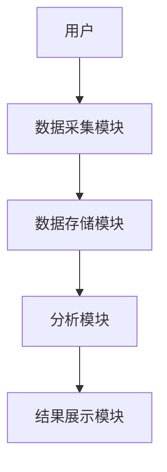

                 


# 巴菲特的价值链分析：理解公司在产业中的位置

## 关键词：巴菲特，价值链分析，企业竞争优势，投资分析，产业定位

## 摘要：  
巴菲特的价值链分析是一种深刻理解公司在产业中位置的重要方法。通过分析公司的价值链，可以识别其竞争优势、财务表现和护城河，从而做出更明智的投资决策。本文将从背景介绍、核心概念、算法原理、数学模型、系统分析、项目实战以及最佳实践等方面，全面解析巴菲特的价值链分析方法，帮助读者掌握如何通过价值链分析来理解公司在产业中的位置。

---

## 第1章：企业竞争优势与价值链分析的背景

### 1.1 企业竞争优势的重要性

#### 1.1.1 企业竞争优势的定义  
企业竞争优势是指公司在市场上相对于竞争对手的独特优势，包括成本优势、技术优势、品牌优势、资源优势等。这些优势使得公司在市场竞争中能够获得更高的利润率和市场份额。

#### 1.1.2 企业竞争优势的核心要素  
- **成本优势**：公司是否在生产或运营过程中具有更低的成本。  
- **技术优势**：公司是否掌握核心技术或专利。  
- **品牌优势**：公司是否拥有强大的品牌影响力。  
- **资源优势**：公司是否拥有独特的资源，如原材料、人才等。  

#### 1.1.3 企业竞争优势与股东价值的关系  
企业的竞争优势直接影响其盈利能力、市场份额和成长潜力，从而影响股东价值。竞争优势越强，公司越能为股东创造更多价值。

---

### 1.2 巴菲特的分析方法

#### 1.2.1 巴菲特投资理念的核心  
巴菲特的投资理念基于“价值投资”，即寻找那些具有持续竞争优势、良好治理结构和合理估值的公司。

#### 1.2.2 巴菲特对企业竞争优势的关注  
巴菲特认为，企业的竞争优势是其长期盈利能力的关键。他特别关注那些具有“护城河”的公司，即公司在竞争中具有难以被超越的优势。

#### 1.2.3 巴菲特分析框架的现代发展  
现代价值链分析结合了巴菲特的核心理念，引入了更系统的方法，包括对产业链的结构分析、关键价值活动识别和财务指标评估。

---

## 第2章：巴菲特的价值链分析框架

### 2.1 核心概念与分析工具

#### 2.1.1 企业价值链的构成  
企业价值链包括从原材料采购、生产、销售到售后服务等一系列活动。这些活动共同构成了公司的价值创造过程。

#### 2.1.2 价值链分析的维度  
- **成本驱动因素**：分析哪些环节是成本的主要来源。  
- **价值驱动因素**：分析哪些环节是价值的主要来源。  
- **效率与质量**：分析各个环节的效率和质量对整体竞争力的影响。

#### 2.1.3 巴菲特的分析工具  
- **护城河分析**：评估公司的竞争优势是否难以被复制或超越。  
- **财务指标分析**：通过财务数据评估公司的盈利能力、成长性和抗风险能力。  

---

### 2.2 价值链分析的步骤

#### 2.2.1 确定企业的核心业务流程  
通过绘制企业的业务流程图，识别核心业务活动。  

#### 2.2.2 识别关键价值活动  
分析每个业务活动对整体价值创造的贡献，找出关键价值活动。

#### 2.2.3 分析价值活动的成本与效益  
评估每个关键价值活动的成本和收益，找出成本过高或收益低的环节进行优化。

---

## 第3章：竞争优势的识别与评估

### 3.1 识别竞争优势的方法

#### 3.1.1 基于资源的视角  
分析公司的资源（如技术、品牌、人力资源）是否具有独特性和不可替代性。

#### 3.1.2 基于过程的视角  
分析公司的运营流程是否高效、标准化，是否能够持续优化。

#### 3.1.3 基于市场的视角  
分析公司在市场中的地位，包括市场份额、客户忠诚度和竞争对手分析。

---

### 3.2 竞争优势的评估标准

#### 3.2.1 竞争优势的强度  
评估公司在特定领域的竞争优势是否显著。

#### 3.2.2 竞争优势的可持续性  
评估公司的竞争优势是否能够长期保持。

#### 3.2.3 竞争优势的可扩展性  
评估公司的竞争优势是否能够支持业务扩展和全球化。

---

## 第4章：数学模型与算法原理

### 4.1 企业竞争优势的数学模型

#### 4.1.1 企业竞争优势指数模型  
$$ \text{竞争优势指数} = \frac{\text{公司优势} \times \text{市场地位} \times \text{财务表现}}{\text{行业平均值}} $$  

#### 4.1.2 企业竞争优势评估的步骤  
1. 收集行业数据和公司数据。  
2. 计算各项指标的权重。  
3. 评估公司各项指标的表现。  
4. 计算竞争优势指数。  

---

## 第5章：系统分析与架构设计

### 5.1 问题场景介绍  
假设我们希望开发一个系统，用于自动分析公司的价值链和竞争优势。

### 5.2 系统功能设计  
- 数据采集模块：收集公司和行业的财务数据、业务数据。  
- 分析模块：基于价值链分析模型，评估公司的竞争优势。  
- 结果展示模块：以图表形式展示分析结果。  

### 5.3 系统架构设计  


### 5.4 系统接口设计  
- 数据接口：与财务数据源对接。  
- 用户接口：提供输入参数和结果展示。  

---

## 第6章：项目实战

### 6.1 环境安装  
安装Python、Pandas、Matplotlib等工具。

### 6.2 核心实现代码  
```python
import pandas as pd
import matplotlib.pyplot as plt

# 示例数据
data = {
    '公司': ['A', 'B', 'C'],
    'ROE': [0.2, 0.15, 0.3],
    'ROA': [0.1, 0.08, 0.15]
}
df = pd.DataFrame(data)

# 可视化
plt.figure(figsize=(10, 6))
plt.plot(df['公司'], df['ROE'], label='ROE')
plt.plot(df['公司'], df['ROA'], label='ROA')
plt.title('公司财务表现')
plt.xlabel('公司')
plt.ylabel('比率')
plt.legend()
plt.show()
```

### 6.3 实际案例分析  
以苹果公司为例，分析其价值链和竞争优势。

---

## 第7章：总结与展望

### 7.1 总结  
通过价值链分析，我们可以更清晰地理解公司在产业中的位置，识别其竞争优势，并做出更明智的投资决策。

### 7.2 展望  
未来，随着人工智能和大数据技术的发展，价值链分析将更加智能化和精准化。

### 7.3 最佳实践 Tips  
- 定期更新分析模型，以反映市场变化。  
- 结合行业趋势和政策变化，优化分析框架。  
- 注重数据的准确性和完整性，确保分析结果的可靠性。  

---

## 小结  
本文详细介绍了巴菲特的价值链分析方法，并通过实际案例和系统设计展示了其应用。希望读者能够通过本文掌握如何通过价值链分析来理解公司在产业中的位置，并在实际工作中灵活运用这些方法。

