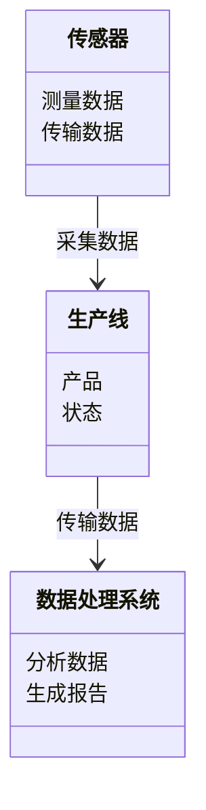
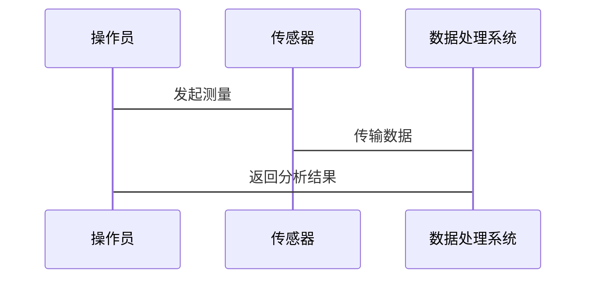

                 


# 巴菲特的价值链分析：量子传感技术在产业升级中的作用

## 关键词：量子传感技术、产业升级、巴菲特、价值链分析、技术应用

## 摘要：  
本文探讨了量子传感技术在企业产业升级中的应用，并结合巴菲特的价值链分析方法，深入分析了量子传感技术如何优化企业价值链，提升企业竞争力。通过理论与实践相结合的方式，本文详细解读了量子传感技术的核心原理、系统架构以及实际应用场景，为企业的技术升级提供了新的思路和解决方案。

---

## # 第1章: 巴菲特的价值链分析

### ## 1.1 价值投资的核心理念

#### ### 1.1.1 价值投资的定义与特点
价值投资是一种以基本面分析为基础的投资策略，旨在通过识别被低估的资产，长期持有以实现收益。其特点包括长期性、安全性、边际成本递减等。

#### ### 1.1.2 巴菲特的价值链分析方法
巴菲特的分析方法侧重于企业核心竞争力、管理层素质和财务健康状况。通过分析企业的价值链，识别关键业务流程中的优势和劣势。

#### ### 1.1.3 价值投资在现代企业中的应用
价值投资不仅适用于金融投资，还可应用于企业战略决策，帮助企业在产业升级中优化资源配置。

### ## 1.2 量子传感技术的基本概念

#### ### 1.2.1 量子传感技术的定义
量子传感技术基于量子力学原理，利用量子态的变化进行测量。它具有高灵敏度和高精度的特点。

#### ### 1.2.2 量子传感技术的核心原理
量子传感技术利用量子叠加和纠缠效应，通过测量量子态的变化来感知外部环境的变化。

#### ### 1.2.3 量子传感技术与传统传感器的对比
| 特性             | 传统传感器         | 量子传感器         |
|------------------|--------------------|--------------------|
| 灵敏度           | 较低               | 极高               |
| 精度             | 中等               | 高                 |
| 响应时间         | 较长               | 较短               |
| 适用场景         | 通用               | 高精度需求         |

### ## 1.3 量子传感技术在产业升级中的作用

#### ### 1.3.1 产业升级的定义与目标
产业升级是指通过技术创新和管理优化，提升企业生产效率和产品质量，实现可持续发展。

#### ### 1.3.2 量子传感技术如何优化企业价值链
量子传感技术能够提升数据采集的精度和速度，优化生产流程，降低资源浪费。

#### ### 1.3.3 量子传感技术对行业竞争力的影响
通过提升生产效率和产品质量，量子传感技术能够增强企业的市场竞争力。

### ## 1.4 本章小结

---

## # 第2章: 量子传感技术的核心原理与数学模型

### ## 2.1 量子传感技术的核心原理

#### ### 2.1.1 量子叠加原理
量子叠加原理表明，量子系统可以同时处于多个状态的叠加态，测量会破坏叠加态并使系统坍缩到一个特定状态。

#### ### 2.1.2 量子纠缠原理
量子纠缠是指两个或多个量子系统之间的关联，无论距离多远，测量其中一个会影响另一个的状态。

#### ### 2.1.3 量子测量原理
量子测量是指通过测量量子系统的状态，获取信息的过程。测量会影响系统的状态。

### ## 2.2 量子传感技术的数学模型

#### ### 2.2.1 量子态的表示与叠加
量子态可以用向量表示，例如：

$$
|\psi\rangle = \alpha|0\rangle + \beta|1\rangle
$$

其中，$\alpha$ 和 $\beta$ 是概率幅，满足 $|\alpha|^2 + |\beta|^2 = 1$。

#### ### 2.2.2 量子测量的数学表达
量子测量可以用投影算符表示：

$$
M_i = \text{测量结果为i的概率} = |\langle i|\psi\rangle|^2
$$

#### ### 2.2.3 量子传感器的信号处理模型
量子传感器通过测量量子态的变化来感知外部信号，数学模型如下：

$$
|\psi_{\text{out}}\rangle = U|\psi_{\text{in}}\rangle
$$

其中，$U$ 是单位ary变换，表示量子态的变化。

### ## 2.3 量子传感技术的算法实现

#### ### 2.3.1 量子算法的基本原理
量子算法利用量子并行性和干涉效应，能够在某些问题上比经典算法更高效。例如，量子傅里叶变换。

#### ### 2.3.2 量子传感器的数据处理流程
1. 量子态初始化
2. 量子叠加
3. 测量与反馈

#### ### 2.3.3 量子传感技术的优化算法
通过优化量子态的初始化和测量过程，提升传感器的灵敏度和精度。

### ## 2.4 本章小结

---

## # 第3章: 量子传感技术在企业价值链中的应用

### ## 3.1 企业价值链分析的框架

#### ### 3.1.1 企业价值链的基本构成
企业价值链包括采购、生产、销售、售后服务等环节。

#### ### 3.1.2 量子传感技术在价值链中的应用
量子传感技术可以应用于数据采集、质量控制、供应链优化等环节。

### ## 3.2 量子传感技术在企业价值链中的具体应用

#### ### 3.2.1 制造业中的应用
通过量子传感技术优化生产流程，提升产品质量。

#### ### 3.2.2 服务业中的应用
在物流和供应链管理中，量子传感技术可以实时监控货物状态。

#### ### 3.2.3 金融领域的应用
在金融风险评估中，量子传感技术可以提高数据处理效率。

### ## 3.3 量子传感技术对企业竞争力的影响

#### ### 3.3.1 提高生产效率
通过优化生产流程，降低资源浪费。

#### ### 3.3.2 提升产品质量
通过高精度测量，确保产品质量符合标准。

#### ### 3.3.3 增强市场响应能力
通过实时数据采集，快速调整生产策略。

### ## 3.4 本章小结

---

## # 第4章: 量子传感技术的系统分析与架构设计

### ## 4.1 问题场景介绍

#### ### 4.1.1 项目背景
以制造业为例，说明量子传感技术的应用场景。

#### ### 4.1.2 项目目标
通过量子传感技术优化生产流程，提升效率。

### ## 4.2 系统功能设计

#### ### 4.2.1 领域模型


#### ### 4.2.2 系统架构设计


#### ### 4.2.3 系统接口设计
- 传感器接口：数据采集和传输
- 数据处理系统接口：数据接收和分析
- 用户界面接口：数据可视化和操作

#### ### 4.2.4 系统交互流程


### ## 4.3 本章小结

---

## # 第5章: 量子传感技术的项目实战

### ## 5.1 环境安装

#### ### 5.1.1 安装量子传感器硬件
安装传感器并连接到数据采集系统。

#### ### 5.1.2 安装数据处理系统
安装量子传感技术的数据处理软件。

### ## 5.2 系统核心实现源代码

#### ### 5.2.1 量子传感器数据采集代码
```python
import quantum_sensor

sensor = quantum_sensor.QuantumSensor()
data = sensor.measure()
print(data)
```

#### ### 5.2.2 数据处理代码
```python
from data_processor import DataProcessor

processor = DataProcessor()
result = processor.analyze(data)
print(result)
```

### ## 5.3 代码应用解读与分析

#### ### 5.3.1 核心代码实现
传感器测量数据并传输到数据处理系统，系统分析数据并生成报告。

#### ### 5.3.2 实际案例分析
以制造业为例，说明量子传感技术如何优化生产流程。

### ## 5.4 项目小结

---

## # 第6章: 最佳实践、小结、注意事项和拓展阅读

### ## 6.1 最佳实践

#### ### 6.1.1 技术选型
根据具体需求选择合适的量子传感技术。

#### ### 6.1.2 系统优化
定期优化系统架构，提升性能。

### ## 6.2 小结

### ## 6.3 注意事项

#### ### 6.3.1 技术风险
量子传感技术尚处于发展阶段，可能存在技术瓶颈。

#### ### 6.3.2 成本控制
量子传感技术的成本较高，需合理控制。

### ## 6.4 拓展阅读

#### ### 6.4.1 推荐书籍
- 《量子计算入门》
- 《价值投资实战指南》

#### ### 6.4.2 在线资源
- 量子计算研究网站
- 量子传感技术论坛

---

## # 第7章: 结语

量子传感技术作为一项新兴技术，将在企业产业升级中发挥重要作用。通过结合巴菲特的价值链分析方法，企业可以更好地利用量子传感技术优化价值链，提升竞争力。

--- 

以上是《巴菲特的价值链分析：量子传感技术在产业升级中的作用》的技术博客文章的完整目录和部分章节内容，希望对您有所帮助！

