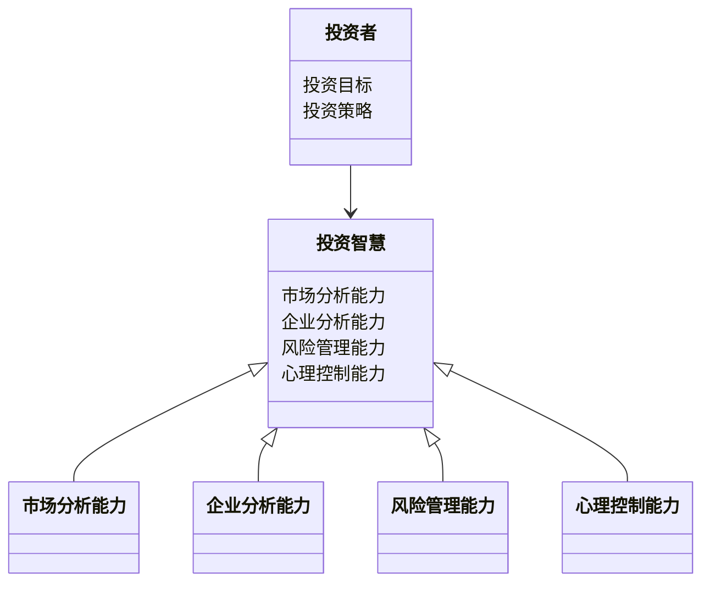
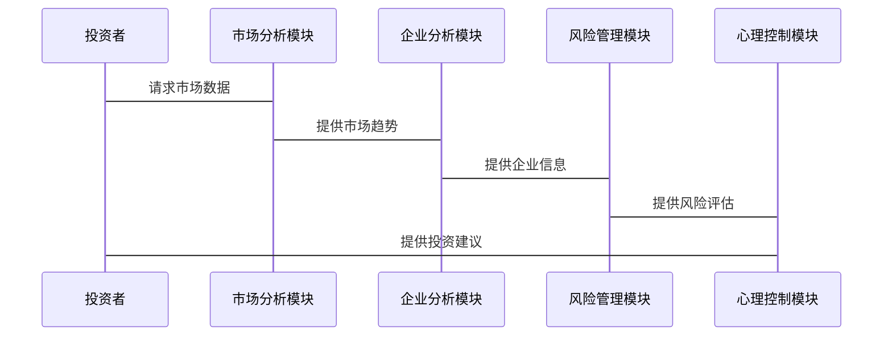

                 


# 巴菲特的传承计划：如何传递投资智慧

> 关键词：巴菲特，投资智慧，传承，价值投资，风险管理，投资策略，长期投资

> 摘要：本文深入探讨了巴菲特的投资智慧如何通过系统化的方法传递给后代和投资者。文章从背景介绍、核心概念、算法原理、系统架构、项目实战和最佳实践等多个方面进行了详细分析，为读者提供了全面的理解和实践指南。

---

## 第一部分: 投资智慧的背景与核心概念

### 第1章: 投资智慧的背景介绍

#### 1.1 投资智慧的背景与重要性

##### 1.1.1 投资智慧的定义与内涵

投资智慧是投资者在长期实践中积累的知识、经验和策略的总和，它不仅仅包括具体的财务技巧，还包括对市场、人性和经济趋势的深刻理解。巴菲特的投资智慧尤其突出，他通过长期实践总结出一套独特的方法论，为全球投资者提供了宝贵的经验。

##### 1.1.2 投资智慧在现代社会中的地位

在当今复杂的经济环境中，投资智慧不仅是个人财富增长的关键，也是企业战略决策的重要组成部分。巴菲特的投资智慧因其科学性和实践性，成为全球投资者学习和模仿的典范。

##### 1.1.3 巴菲特投资智慧的核心价值

巴菲特的投资智慧的核心价值在于其对长期价值的追求、对安全边际的重视以及对人性弱点的深刻理解。这些原则不仅帮助他取得了巨大的成功，也为投资者提供了可持续的投资策略。

#### 1.2 巴菲特的传奇与投资哲学

##### 1.2.1 巴菲特的投资理念与成功案例

巴菲特的投资理念以价值投资为核心，强调寻找具有持续竞争优势的企业，并长期持有。他的成功案例包括对可口可乐和美国运通的投资，这些案例展示了他如何通过深入研究和长期持有实现财富增长。

##### 1.2.2 巴菲特的价值投资原则

巴菲特的价值投资原则包括以下几点：
1. **寻找具有持续竞争优势的企业**：投资那些在行业中具有强大竞争力的企业。
2. **注重企业的财务健康状况**：关注企业的盈利能力、现金流和资产负债表。
3. **长期持有优质资产**：避免短期波动，坚持长期投资。
4. **安全边际**：以低于内在价值的价格买入优质资产。

##### 1.2.3 巴菲特投资智慧的传承意义

巴菲特的投资智慧不仅对个人投资者具有指导意义，也为企业和机构投资者提供了重要的参考。通过传承这些智慧，可以帮助更多人避免投资误区，实现长期财富增长。

---

### 第2章: 投资智慧的核心要素

#### 2.1 投资智慧的核心概念

##### 2.1.1 投资智慧的构成要素

投资智慧的构成要素包括：
1. **市场分析能力**：对宏观经济和行业趋势的准确判断。
2. **企业分析能力**：对企业财务状况、竞争优势和管理团队的深入评估。
3. **风险管理能力**：识别和控制投资风险的能力。
4. **心理控制能力**：在市场波动中保持理性决策的能力。

##### 2.1.2 投资智慧的逻辑框架

投资智慧的逻辑框架可以分为三个层次：
1. **认知层**：对投资本质和市场的理解。
2. **策略层**：制定具体的投资策略和计划。
3. **执行层**：将策略转化为实际操作，并不断优化。

##### 2.1.3 投资智慧的系统性分析

投资智慧的系统性分析需要从多个维度进行，包括：
1. **投资目标**：明确投资的目的和预期收益。
2. **投资策略**：选择适合自己的投资策略，如价值投资、成长投资等。
3. **风险管理**：制定有效的风险管理计划，避免重大损失。

#### 2.2 投资智慧的核心要素对比分析

##### 2.2.1 核心要素的属性特征对比表格

| 核心要素       | 属性特征               |
|----------------|------------------------|
| 市场分析能力   | 宏观经济、行业趋势、市场情绪 |
| 企业分析能力   | 财务状况、竞争优势、管理团队 |
| 风险管理能力   | 风险识别、风险评估、风险控制 |
| 心理控制能力   | 理性决策、情绪管理、耐心等待 |

##### 2.2.2 核心要素的ER实体关系图

```mermaid
erDiagram
    actor 投资者 {
        <属性> 投资目标
        <属性> 投资策略
    }
    actor 市场分析能力 {
        <属性> 宏观经济
        <属性> 行业趋势
    }
    actor 企业分析能力 {
        <属性> 财务状况
        <属性> 竞争优势
    }
    actor 风险管理能力 {
        <属性> 风险识别
        <属性> 风险控制
    }
    投资者 --> 市场分析能力
    投资者 --> 企业分析能力
    投资者 --> 风险管理能力
```

---

### 第3章: 投资智慧的传承与应用

#### 3.1 投资智慧的传承方式

##### 3.1.1 投资智慧的口头传承

通过口头传授，如导师制、讲座等方式，将投资智慧传递给他人。这种方式的优点是灵活性高，但缺点是缺乏系统性，容易遗漏关键点。

##### 3.1.2 投资智慧的书面传承

通过书籍、报告和文章等形式，将投资智慧记录下来，供后代和投资者学习。这种方式的优点是系统性强，可以长期保存，但需要较高的写作能力和深度思考。

##### 3.1.3 投资智慧的系统化传承

通过建立系统化的培训体系，如投资学院、在线课程等，将投资智慧传递给更广泛的人群。这种方式的优点是覆盖面广，效果显著，但需要投入大量资源。

#### 3.2 投资智慧的应用场景

##### 3.2.1 投资智慧在个人投资中的应用

个人投资者可以通过学习巴菲特的投资智慧，制定适合自己的投资策略，避免盲目跟风，实现财富增长。

##### 3.2.2 投资智慧在家族财富管理中的应用

家族可以通过传承巴菲特的投资智慧，建立长期的财富管理计划，确保家族资产的安全和增值。

##### 3.2.3 投资智慧在企业投资策略中的应用

企业可以通过借鉴巴菲特的投资智慧，优化投资决策，提升企业的竞争力和盈利能力。

---

## 第二部分: 投资智慧的系统分析与架构设计

### 第4章: 投资智慧的系统架构

#### 4.1 投资智慧的系统功能设计

##### 4.1.1 投资智慧的领域模型（Mermaid类图）



##### 4.1.2 投资智慧的系统架构设计（Mermaid架构图）

```mermaid
architecturalDiagram
    component 投资智慧系统 {
        component 市场分析模块
        component 企业分析模块
        component 风险管理模块
        component 心理控制模块
    }
    市场分析模块 --> 企业分析模块
    企业分析模块 --> 风险管理模块
    风险管理模块 --> 心理控制模块
```

##### 4.1.3 投资智慧的系统接口设计

投资智慧系统需要与外部数据源、投资者和风险管理模块进行交互。以下是系统的接口设计：



---

### 第5章: 投资智慧的风险管理模型

#### 5.1 投资智慧的风险管理原则

##### 5.1.1 风险管理的核心理念

风险管理的核心理念是通过识别、评估和控制风险，降低投资损失的可能性，同时抓住潜在的投资机会。

##### 5.1.2 风险管理的数学模型

风险值的计算公式如下：

$$ \text{风险值} = \frac{\text{潜在损失}}{\text{资产价值}} $$

##### 5.1.3 风险管理的实施步骤

1. **风险识别**：识别可能的投资风险，如市场风险、流动性风险等。
2. **风险评估**：评估每个风险的影响程度和发生概率。
3. **风险控制**：制定有效的风险管理策略，如分散投资、设定止损点等。

#### 5.2 投资智慧的风险管理模型

##### 5.2.1 风险管理的数学模型

风险管理的数学模型可以表示为：

$$ \text{总风险} = \sum_{i=1}^{n} \text{风险值}_i $$

其中，$n$ 是风险因素的数量。

##### 5.2.2 风险管理的实施流程

1. **风险识别**：通过市场分析和企业分析，识别可能的投资风险。
2. **风险评估**：对每个风险进行量化评估，确定其对投资组合的影响。
3. **风险控制**：根据评估结果，制定相应的风险管理策略，如调整投资组合、增加分散投资等。

---

## 第三部分: 投资智慧的项目实战与案例分析

### 第6章: 投资智慧的项目实战

#### 6.1 投资智慧的环境搭建

##### 6.1.1 投资环境的构建

为了实践巴菲特的投资智慧，需要构建一个良好的投资环境，包括：
1. **数据支持**：获取可靠的市场数据和企业信息。
2. **工具支持**：使用专业的投资分析工具，如Excel、投资分析软件等。
3. **知识储备**：学习巴菲特的投资理念和相关书籍。

#### 6.2 投资智慧的系统核心实现

##### 6.2.1 投资智慧的实现步骤

1. **市场分析**：研究宏观经济和行业趋势，寻找具有增长潜力的行业。
2. **企业分析**：分析企业的财务状况、竞争优势和管理团队。
3. **风险评估**：评估投资风险，制定风险管理策略。
4. **投资决策**：根据分析结果，制定投资策略并执行。

##### 6.2.2 投资智慧的实现代码

以下是一个简单的投资决策系统的伪代码示例：

```python
def investment_decision():
    market_data = get_market_data()
    company_analysis = analyze_company(market_data)
    risk_assessment = assess_risk(company_analysis)
    investment_strategy = determine_strategy(risk_assessment)
    return investment_strategy

investment_decision()
```

---

### 第7章: 投资智慧的案例分析

#### 7.1 投资智慧的典型案例

##### 7.1.1 巴菲特的经典投资案例

1. **可口可乐投资**：巴菲特通过长期持有可口可乐的股票，获得了稳定的股息收入和资本增值。
2. **美国运通投资**：巴菲特在收购美国运通的股份时，注重其强大的竞争优势和财务健康状况。

##### 7.1.2 投资智慧在实际中的应用

通过分析巴菲特的投资案例，我们可以总结出以下几点：
1. **长期持有优质资产**：选择具有持续竞争优势的企业，长期持有。
2. **注重安全边际**：以合理的价格买入优质资产，避免过度支付。
3. **避免短期波动**：在市场波动中保持理性，避免盲目跟风。

---

### 第8章: 投资智慧的最佳实践

#### 8.1 投资智慧的最佳实践

##### 8.1.1 投资心态的调整

投资者需要保持冷静和耐心，在市场波动中避免情绪化决策。

##### 8.1.2 风险管理的优化

通过分散投资和设定止损点，降低投资风险。

##### 8.1.3 持续学习与优化

不断学习新的投资知识和策略，优化自己的投资组合。

##### 8.1.4 投资记录与反思

定期记录投资决策和结果，进行反思和总结，避免重复犯错。

---

## 第四部分: 总结与展望

### 第9章: 投资智慧的总结与展望

#### 9.1 投资智慧的总结

巴菲特的投资智慧为我们提供了一套科学的投资方法，包括价值投资、长期持有和风险管理等方面。这些智慧不仅帮助我们实现财富增长，也为我们在复杂多变的市场中提供了重要的指导。

#### 9.2 投资智慧的未来展望

随着金融市场的不断发展，投资智慧也需要不断创新和优化。未来，我们可以通过技术手段，如大数据和人工智能，进一步提升投资分析的准确性和效率，为投资者提供更优质的服务。

---

## 结语

巴菲特的投资智慧不仅是个人财富增长的关键，也是企业投资策略的重要组成部分。通过系统化的方法和最佳实践，我们可以更好地传承和应用这些智慧，实现长期的投资目标。希望本文能为读者提供有价值的参考和启发，帮助他们在投资道路上走得更远、更稳。

---

