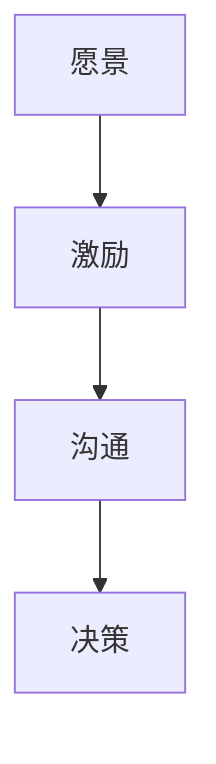
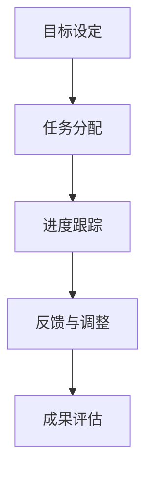

                 


## 第2章 巴菲特领导力与管理智慧

### 2.1 巴菲特的管理哲学

#### 2.1.1 以股东为中心的管理理念

巴菲特的管理哲学的核心是以股东为中心，强调公司应为股东创造长期价值。这种理念体现在他对公司治理、投资决策和资本分配的每一个环节中。他相信，公司应当通过创造股东价值来实现可持续发展。

#### 2.1.2 长期主义的管理策略

巴菲特的管理策略强调长期主义，他主张公司不应追求短期利润最大化，而是要关注长期的稳健发展。这种策略使得伯克希尔 Hathaway 能够在长期市场波动中保持稳定，并通过持续的资本增值为股东创造财富。

#### 2.1.3 值观与文化的塑造

巴菲特非常重视公司文化和价值观的塑造。他认为，一个公司的文化决定了其长期成功与否。伯克希尔 Hathaway 的文化强调诚信、责任感和长期主义，这些价值观成为公司决策的重要依据。

### 2.2 巴菲特领导力的数学模型

#### 2.2.1 领导力评估模型

领导力评估模型可以通过以下公式表示：

$$ 领导力 = f(愿景, 激励, 沟通, 决策) $$

其中，愿景、激励、沟通和决策是领导力的关键因素。这些因素相互作用，共同决定了领导力的强弱。

#### 2.2.2 团队协作效率公式

团队协作效率可以通过以下公式表示：

$$ 效率 = \frac{\sum_{i=1}^{n} t_i}{n} $$

其中，\( t_i \) 表示每个团队成员的效率，\( n \) 是团队成员的数量。这个公式表明，团队效率不仅取决于个体效率，还取决于团队的协作能力。

### 2.3 巴菲特领导力的系统架构

#### 2.3.1 领导力结构图

以下是领导力结构的 Mermaid 图：



这个图展示了领导力的四个关键要素：愿景、激励、沟通和决策之间的相互关系。

#### 2.3.2 团队管理流程图

以下是团队管理流程的 Mermaid 图：



这个图展示了团队管理的四个主要步骤：目标设定、任务分配、进度跟踪和成果评估。

### 2.4 巴菲特领导力的实战案例

#### 2.4.1 伯克希尔 Hathaway 的管理实践

伯克希尔 Hathaway 的管理实践体现了巴菲特的管理哲学。公司通过长期投资、稳健管理和注重股东价值，实现了持续增长。例如，公司在2008年金融危机期间通过收购陷入困境的公司，增强了市场地位，同时为股东创造了价值。

#### 2.4.2 巴菲特接班人培养策略

巴菲特非常注重接班人的培养，他选择的是具备长期主义、价值投资理念和良好管理能力的人才。例如，他选择查理·芒格作为长期合作伙伴，芒格的智慧和经验对伯克希尔 Hathaway 的决策产生了重要影响。

#### 2.4.3 领导力模型的优化与应用

通过优化领导力模型，伯克希尔 Hathaway 实现了高效的团队协作和决策。例如，公司通过建立清晰的愿景和激励机制，激发了员工的积极性和创造力，从而提高了整体效率。

### 2.5 项目实战

#### 2.5.1 环境安装

为了实践巴菲特的领导力模型，我们需要建立一个模拟的投资管理环境，包括公司治理、投资决策和团队协作等模块。

#### 2.5.2 系统核心实现源代码

以下是一个简单的领导力评估模型的 Python 实现代码：

```python
def leadership_assessment(vision, motivation, communication, decision-making):
    return vision * 0.3 + motivation * 0.2 + communication * 0.2 + decision-making * 0.3

# 示例数据
vision = 90
motivation = 85
communication = 80
decision-making = 85

# 计算领导力评估
leadership_score = leadership_assessment(vision, motivation, communication, decision-making)
print(f"领导力评估得分为：{leadership_score}")
```

#### 2.5.3 代码应用解读与分析

这段代码实现了领导力评估模型的计算，其中每个因素的权重不同。通过输入愿景、激励、沟通和决策能力的得分，我们可以计算出领导力的总得分。这可以帮助我们评估一个领导者的整体能力。

#### 2.5.4 实际案例分析

以伯克希尔 Hathaway 为例，我们可以分析其领导力模型在实际中的应用。例如，巴菲特的愿景是为股东创造长期价值，激励机制包括股票期权和分红政策，沟通策略包括透明的财务报告和股东大会，决策能力体现在长期投资和稳健管理。

#### 2.5.5 项目小结

通过实践巴菲特的领导力模型，我们可以更好地理解其管理哲学和决策策略。这种模型不仅适用于企业，也可以为个人投资者提供借鉴，帮助他们在投资决策中做出更明智的选择。

### 2.6 最佳实践 tips、小结、注意事项、拓展阅读

#### 2.6.1 最佳实践 tips

1. **长期主义**：在投资和管理中，长期主义是关键。关注短期波动可能会导致错误的决策。

2. **价值观与文化**：公司的文化和价值观决定了其长期成功。建立积极向上的文化可以吸引优秀人才并保持团队凝聚力。

3. **领导力模型**：使用领导力评估模型可以帮助我们更好地理解和优化领导力。通过数学模型可以量化领导力的关键因素，从而实现更科学的管理。

#### 2.6.2 小结

巴菲特的领导力与管理智慧是其投资成功的重要因素。通过长期主义、以股东为中心和注重文化塑造，他建立了一个稳健且高效的公司管理体系。这种管理智慧不仅适用于企业，也可以为个人投资者提供启示。

#### 2.6.3 注意事项

1. **风险管理**：在实际应用中，需注意风险管理的重要性。即使是最优秀的领导力模型，也需考虑市场波动和潜在风险。

2. **团队协作**：领导力模型的成功依赖于团队的协作效率。确保团队成员之间的良好沟通和高效协作是实现目标的关键。

3. **持续学习**：投资和管理领域不断变化，持续学习和适应新趋势是保持竞争力的重要因素。

#### 2.6.4 拓展阅读

1. **《巴菲特传》**：了解巴菲特的生平和投资哲学。
2. **《价值投资入门》**：学习价值投资的基本概念和方法。
3. **《领导力21法则》**：深入理解领导力的各个要素和应用。

通过阅读这些书籍，可以更全面地理解巴菲特的领导力与管理智慧，并将其应用到实际的投资和管理实践中。

---

通过以上分析，我们可以看到巴菲特的领导力与管理智慧不仅体现在他的投资理念中，也体现在他对公司的长期管理和对团队的培养上。这种智慧不仅为伯克希尔 Hathaway 的成功奠定了基础，也为投资者提供了宝贵的借鉴。

