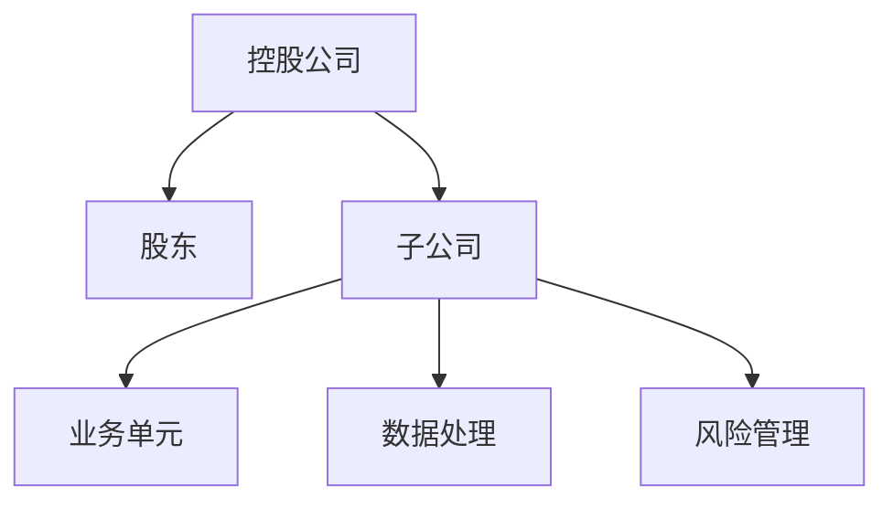

                 


# 巴菲特的伯克希尔哈撒韦模式：控股公司的优势

> 关键词：巴菲特，伯克希尔哈撒韦，控股公司，价值投资，资本配置

> 摘要：本文深入分析了巴菲特的伯克希尔哈撒韦公司作为一家控股公司的优势，探讨了其投资理念、组织结构和资本配置策略。通过详细讲解控股公司的核心概念、价值评估模型、系统架构设计和实际案例，本文为读者提供了从理论到实践的全面解读，帮助理解如何通过控股公司模式实现长期价值增长。

---

## 第一部分：巴菲特与伯克希尔哈撒韦的基本情况

### 第1章：巴菲特的投资理念

#### 1.1 价值投资的定义
- **价值投资**：寻找市场价格低于其内在价值的股票进行投资，强调长期持有优质资产。
- **核心原则**：
  - **安全边际**：购买价格低于内在价值，确保投资的安全性。
  - **长期思维**：关注企业的长期价值，而非短期市场波动。

#### 1.2 巴菲特的价值投资原则
- **集中投资**：将资金集中在少数优质企业上，而非分散投资。
- **企业质量**：选择具有强大竞争优势、稳定的管理层和良好财务状况的企业。
- **长期持有**：避免频繁交易，降低交易成本，专注于优质企业的长期增长。

### 第2章：伯克希尔哈撒韦公司简介

#### 2.1 伯克希尔哈撒韦的历史沿革
- 1956年成立，最初为一家小型保险控股公司。
- 1965年，巴菲特成为控股股东，逐步将其打造成全球最大的控股公司之一。

#### 2.2 伯克希尔哈撒韦的业务范围
- **保险业务**：通过保险浮存金支持其他投资。
- **投资业务**：主要投资于优质企业股权和债券。
- **多元化经营**：涵盖能源、铁路、银行等多个领域。

#### 2.3 伯克希尔哈撒韦的组织结构
- **控股公司架构**：通过全资子公司或部分控股子公司进行多元化投资。
- **分散管理**：每个子公司独立运营，由各自领域的优秀管理者负责。

### 第3章：控股公司的定义与特点

#### 3.1 控股公司的定义
- **控股公司**：通过持有其他公司一定比例的股份，实现对多个子公司的控制。
- **特点**：
  - **多元化业务**：涵盖多个行业和领域。
  - **财务杠杆**：通过控股实现资本的高效配置。
  - **风险分散**：降低单一业务的风险。

#### 3.2 伯克希尔哈撒韦的控股公司优势
- **财务稳定性**：通过多元化投资降低风险，增强抗跌能力。
- **资本配置效率**：将资金投向最有潜力的领域，最大化收益。
- **协同效应**：子公司之间的协同合作，提升整体竞争力。

---

## 第二部分：控股公司的核心概念与联系

### 第4章：巴菲特的投资理念与控股公司的联系

#### 4.1 价值投资与控股公司的结合
- **价值投资**：寻找被市场低估的控股公司，长期持有实现价值增长。
- **控股公司的优势**：通过控股优质企业，实现资产的多元化配置。

#### 4.2 巴菲特的控股公司战略
- **核心思想**：通过控股优质企业，构建一个稳定且高回报的投资组合。
- **实施步骤**：
  1. 选择具有强大竞争优势的企业。
  2. 长期持有，避免频繁交易。
  3. 通过控股实现资本的高效配置。

### 第5章：伯克希尔哈撒韦的组织结构与控股公司的联系

#### 5.1 伯克希尔哈撒韦的子公司分类
- **核心业务**：保险、能源、铁路等。
- **非核心业务**：银行、零售等。

#### 5.2 子公司治理模式
- **分散管理**：每个子公司独立运营，由专业团队管理。
- **控股公司监督**：母公司通过董事会和审计部门进行监督。

#### 5.3 子公司协同效应
- **资源共享**：子公司之间共享资源，降低成本。
- **协同合作**：通过协同合作提升整体竞争力。

### 第6章：伯克希尔哈撒韦的控股公司优势

#### 6.1 财务稳定性与抗风险能力
- **多元化投资**：降低单一业务的风险。
- **强大的财务实力**：通过控股实现资本的高效配置，增强抗风险能力。

#### 6.2 多元化的业务布局
- **覆盖多个行业**：降低单一行业波动的风险。
- **抓住市场机会**：通过多元化布局抓住不同行业的增长机会。

#### 6.3 高效的资本配置能力
- **优化资源配置**：将资金投向最有潜力的领域。
- **提升整体收益**：通过高效配置实现资本的增值。

---

## 第三部分：巴菲特的价值评估模型

### 第7章：价值评估模型的数学原理

#### 7.1 基本原理
- **内在价值**：企业未来现金流的现值。
- **公式**：
  \[
  V = \sum_{t=1}^{n} \frac{CF_t}{(1+r)^t}
  \]
  其中，\( V \) 为内在价值，\( CF_t \) 为第 \( t \) 年的现金流，\( r \) 为折现率。

#### 7.2 模型实现
```python
def calculate_intrinsic_value(cash_flows, discount_rate):
    present_value = 0
    for t in range(len(cash_flows)):
        CF_t = cash_flows[t]
        present_value += CF_t / (1 + discount_rate) ** t
    return present_value

cash_flows = [100, 200, 300]
discount_rate = 0.10
intrinsic_value = calculate_intrinsic_value(cash_flows, discount_rate)
print(f"内在价值为：{intrinsic_value}")
```

#### 7.3 案例分析
- **假设**：某企业未来三年现金流分别为100、200、300万元，折现率为10%。
- **计算**：
  \[
  V = \frac{100}{1.1} + \frac{200}{1.1^2} + \frac{300}{1.1^3} \approx 433.76 \text{万元}
  \]
- **结论**：如果市场价格低于433.76万元，投资该企业具有安全边际。

---

## 第四部分：系统架构设计

### 第8章：伯克希尔哈撒韦的系统架构

#### 8.1 业务架构
- **核心业务**：保险、投资、能源等。
- **支持业务**：数据处理、风险管理等。

#### 8.2 领域模型
```mermaid
classDiagram
    class 股东
    class 子公司
    class 股权
    class 业务单元
    股东 -- 股权 --> 子公司
    子公司 --> 业务单元
```

#### 8.3 系统架构图


---

## 第五部分：项目实战

### 第9章：基于伯克希尔模式的控股公司构建

#### 9.1 环境安装
- **工具**：Python、Jupyter Notebook、Mermaid。
- **安装步骤**：
  ```bash
  pip install mermaid
  ```

#### 9.2 核心代码实现
```python
class HoldingCompany:
    def __init__(self, name):
        self.name = name
        self.subsidiaries = []

    def add_sub(self, sub):
        self.subsidiaries.append(sub)

class Subsidiary:
    def __init__(self, name, industry):
        self.name = name
        self.industry = industry

# 实例化控股公司
 berkshire = HoldingCompany("伯克希尔哈撒韦")
berkshire.add_sub(Subsidiary("保险业务", "保险"))
berkshire.add_sub(Subsidiary("能源业务", "能源"))

# 输出
for sub in berkshire.subsidiaries:
    print(f"{sub.name} 属于 {sub.industry} 行业。")
```

#### 9.3 案例分析
- **场景**：构建一个小型控股公司，投资于保险和科技行业。
- **实现**：通过上述代码实现控股公司架构，管理多个子公司。
- **总结**：通过控股公司模式，实现多元化投资，降低风险，提升整体收益。

---

## 第六部分：最佳实践与小结

### 第10章：最佳实践

#### 10.1 投资建议
- **长期思维**：选择优质企业长期持有。
- **分散投资**：通过控股公司实现多元化配置。
- **关注管理层**：优秀管理层是企业成功的关键。

#### 10.2 小结
- **核心思想**：通过控股公司模式，实现资产的多元化配置，降低风险，提升整体收益。
- **实践价值**：本文提供了从理论到实践的全面解读，帮助读者理解如何通过控股公司模式实现长期价值增长。

### 第11章：注意事项与拓展阅读

#### 11.1 注意事项
- **风险控制**：即使在控股公司模式下，仍需注意分散风险。
- **市场变化**：密切关注市场变化，及时调整投资策略。

#### 11.2 拓展阅读
- **书籍推荐**：《巴菲特的智慧》、《投资最重要的ことは何か？》。
- **网站推荐**：伯克希尔哈撒韦官方网站、巴菲特股东大会实录。

---

## 结语

通过本文的详细分析，我们可以看到，伯克希尔哈撒韦的成功离不开其控股公司模式的优势。从价值投资理念到系统架构设计，再到实际项目实战，本文为读者提供了全面的解读。希望本文能够帮助读者更好地理解控股公司的运作模式，并在实际投资中加以应用。

