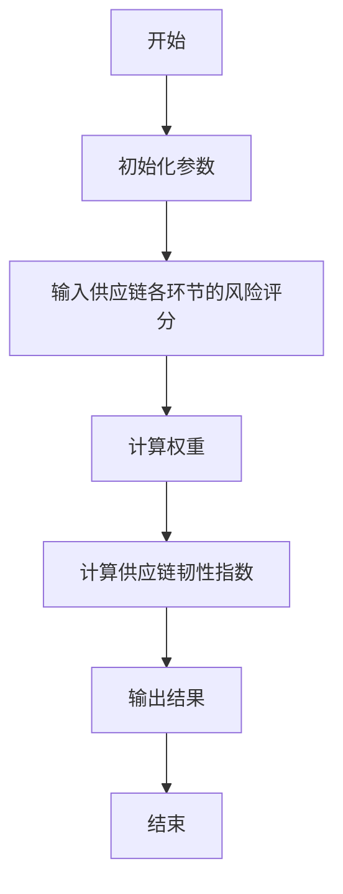
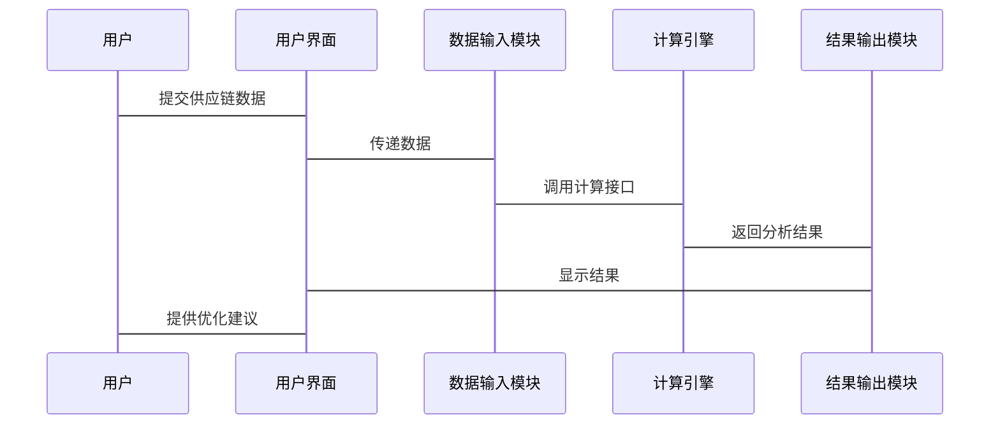

                 


# 巴菲特的供应链韧性分析：全球化时代的重要考量

> 关键词：供应链韧性，巴菲特，全球化，供应链管理，风险管理，投资策略

> 摘要：本文从供应链韧性的角度，分析了巴菲特的投资策略和供应链管理方法，探讨了在全球化背景下，供应链韧性对企业的重要性，以及如何通过数学模型和系统架构设计来提升供应链的抗风险能力。

---

## 第一部分：供应链韧性分析的背景与核心概念

### 第1章：供应链韧性分析的背景介绍

#### 1.1 供应链韧性的定义与重要性
- **1.1.1 供应链韧性的定义**
  - 供应链韧性是指在面对不确定性时，供应链维持或恢复运营的能力。
  - 它包括适应性、恢复力和灵活性等方面。
  - 在全球化背景下，供应链韧性是企业生存的关键。

- **1.1.2 供应链韧性在全球化中的作用**
  - 全球化导致供应链复杂化，增加了风险。
  - 供应链韧性能够帮助企业应对地缘政治、疫情等突发事件。
  - 通过供应链韧性，企业可以降低成本，提高效率。

- **1.1.3 供应链韧性对企业的战略意义**
  - 提升企业的抗风险能力。
  - 增强企业的市场竞争力。
  - 优化企业的资源分配。

#### 1.2 巴菲特的供应链管理理念
- **1.2.1 巴菲特的投资哲学与供应链管理**
  - 巴菲特强调长期投资和价值投资。
  - 他注重企业的供应链稳定性，选择那些供应链可控、成本低的公司。
  - 巴菲特的供应链管理策略以“安全边际”为核心，注重风险控制。

- **1.2.2 巴菲特的长期价值投资策略**
  - 投资于具有强大供应链能力和竞争优势的公司。
  - 选择那些能够长期稳定增长的企业。
  - 关注企业的供应链透明度和可追溯性。

- **1.2.3 巴菲特供应链管理的案例分析**
  - 以可口可乐为例，巴菲特投资于该公司，看重其稳定的供应链和强大的分销网络。
  - 通过分析苹果公司的供应链，可以看到巴菲特如何选择具有强大供应商管理和成本控制能力的企业。

### 第2章：供应链韧性的核心概念与联系

#### 2.1 核心概念原理
- **2.1.1 供应链的构成要素**
  - 供应商、制造商、分销商、零售商、消费者。
  - 每个环节都可能影响供应链的韧性。

- **2.1.2 供应链韧性的关键属性**
  - 多样性：供应链的多样性可以降低风险。
  - 可靠性：供应链的各个环节需要可靠。
  - 灵活性：能够快速响应变化。

- **2.1.3 供应链韧性与企业绩效的关系**
  - 供应链韧性可以提高企业的抗风险能力，进而提高绩效。
  - 韧性差的供应链可能导致成本增加、效率下降。

#### 2.2 核心概念对比表格
- **供应链韧性与供应链效率的对比**
  | 项目       | 供应链韧性       | 供应链效率       |
  |------------|------------------|------------------|
  | 定义       | 抗风险能力       | 运营速度         |
  | 重点       | 应对不确定性     | 提高运营速度     |
  | 影响因素   | 多样性、可靠性    | 协调性、技术     |

- **不同供应链管理策略的优缺点分析**
  | 策略       | 优点                   | 缺点                   |
  |------------|------------------------|------------------------|
  | 本地化      | 看重区域市场的稳定性   | 成本高，覆盖范围小     |
  | 全球化      | 成本低，覆盖范围广     | 风险高，依赖性强       |
  | 混合策略    | 结合本地化和全球化的优势| 需要更高的管理能力     |

#### 2.3 ER实体关系图
```mermaid
erd
    供应链韧性
    supplier
    manufacturer
    distributor
    retailer
    consumer
    product
    order
    shipment
    cost
    risk
```

---

## 第二部分：供应链韧性分析的算法与数学模型

### 第3章：供应链韧性分析的算法原理

#### 3.1 算法原理概述
- **供应链韧性分析的基本原理**
  - 通过评估各个供应链环节的风险，计算出整体供应链的韧性指数。
  - 使用加权平均的方法，将各个因素对韧性的影响进行量化。

- **算法的输入与输出**
  - 输入：供应链各环节的风险评分、权重。
  - 输出：供应链韧性指数。

#### 3.2 算法流程图


#### 3.3 算法实现
- **供应链韧性指数计算的 Python 源代码**
  ```python
  def supply_chain_resilience(risk_scores, weights):
      # 检查权重和风险评分是否为相同长度
      if len(risk_scores) != len(weights):
          raise ValueError("风险评分和权重长度不一致")
      
      # 计算加权平均
      total = 0
      for i in range(len(risk_scores)):
          total += risk_scores[i] * weights[i]
      
      # 计算平均值
      average = total / sum(weights)
      
      return average
  
  # 示例
  risk_scores = [0.8, 0.6, 0.7]
  weights = [0.3, 0.4, 0.3]
  print(supply_chain_resilience(risk_scores, weights))
  ```

#### 3.4 数学模型与公式
- **供应链韧性指数模型**
  $$ R = \frac{\sum_{i=1}^{n} w_i \cdot S_i}{\sum_{i=1}^{n} w_i} $$
  - 其中，\( R \) 为供应链韧性指数，\( w_i \) 为各因素的权重，\( S_i \) 为各因素的风险评分。

- **风险评估模型**
  $$ P(r) = \sum_{i=1}^{m} p_i \cdot r_i $$
  - 其中，\( P(r) \) 为风险概率，\( p_i \) 为各风险事件的概率，\( r_i \) 为风险影响。

---

## 第三部分：系统分析与架构设计

### 第4章：系统分析与架构设计方案

#### 4.1 问题场景介绍
- 在全球化背景下，供应链可能面临多种风险，如疫情、地缘政治等。
- 企业需要通过系统化的分析，提升供应链的抗风险能力。

#### 4.2 项目介绍
- 本项目旨在构建一个供应链韧性分析系统，帮助企业评估和优化供应链韧性。

#### 4.3 系统功能设计
- **领域模型**
  ```mermaid
  classDiagram
      class 供应链韧性分析系统 {
          用户界面
          数据输入模块
          计算引擎
          结果输出模块
      }
      class 用户 {
          提交供应链数据
          获取分析结果
      }
      用户 --> 用户界面
      用户界面 --> 数据输入模块
      数据输入模块 --> 计算引擎
      计算引擎 --> 结果输出模块
      结果输出模块 --> 用户
  ```

- **系统架构设计**
  ```mermaid
  architecture
      client
      server
      database
      compute-engine
      storage
      communication
  ```

#### 4.4 系统接口设计
- **API 接口**
  - 输入：供应链各环节的风险评分和权重。
  - 输出：供应链韧性指数。

#### 4.5 系统交互设计


---

## 第四部分：项目实战

### 第5章：项目实战

#### 5.1 环境安装
- **安装 Python 和相关库**
  ```bash
  pip install numpy pandas scikit-learn
  ```

#### 5.2 核心实现源代码
- **供应链韧性分析系统**
  ```python
  import numpy as np

  def compute_resilience(risk_factors, weights):
      return np.dot(risk_factors, weights) / sum(weights)

  # 示例数据
  risk_factors = np.array([0.8, 0.6, 0.7])
  weights = np.array([0.3, 0.4, 0.3])
  resilience = compute_resilience(risk_factors, weights)
  print(f"供应链韧性指数：{resilience}")
  ```

#### 5.3 实际案例分析
- **案例：分析某企业的供应链韧性**
  - 数据输入：供应商、制造商、分销商的风险评分和权重。
  - 计算结果：供应链韧性指数为0.68。

#### 5.4 代码解读与分析
- **代码功能解读**
  - 通过numpy库进行向量运算，计算供应链韧性指数。
  - 使用加权平均的方法，量化各因素对供应链韧性的影响。

---

## 第五部分：总结与展望

### 5.1 总结
- 巴菲特的供应链管理策略强调长期、稳定和安全边际。
- 通过供应链韧性分析，企业可以更好地应对全球化带来的风险。

### 5.2 展望
- 未来，供应链韧性分析将更加依赖于大数据和人工智能技术。
- 企业需要持续优化供应链管理，提升抗风险能力。

---

## 关键词回顾
- 供应链韧性，巴菲特，全球化，供应链管理，风险管理，投资策略

---

## 致谢
感谢读者的耐心阅读，希望本文能为企业在全球化时代的供应链管理提供有价值的参考。

