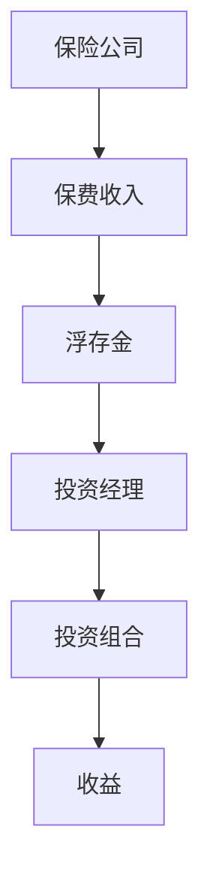
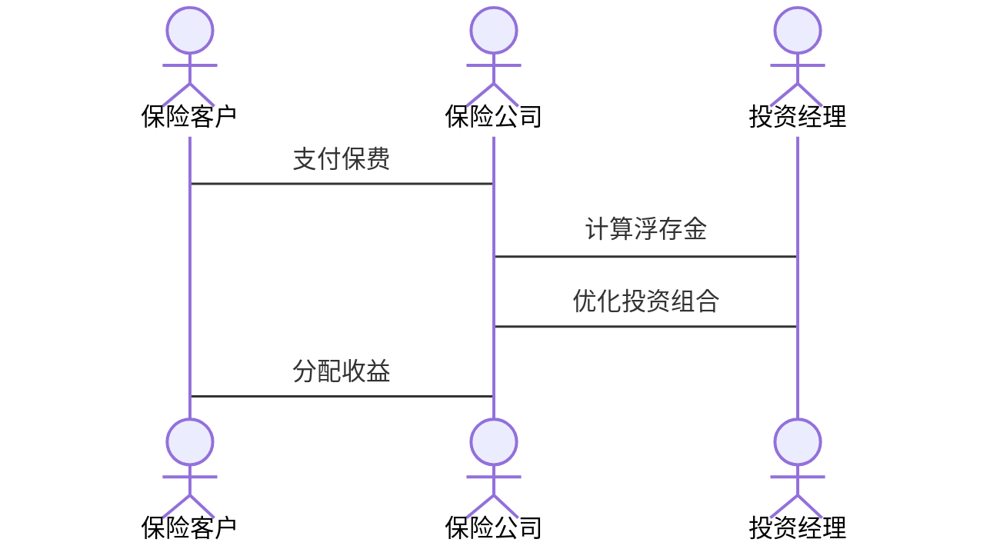

                 


### 第一部分: 巴菲特的保险业投资逻辑概述

#### 第1章: 巴菲特保险业投资逻辑的背景与核心概念

##### 1.1 保险业的基本概念与运作机制

###### 1.1.1 保险业的定义与分类

保险业是一种通过分散风险来提供保障的金融服务行业。它主要分为寿险和非寿险两大类。寿险包括人寿保险、年金保险等，非寿险包括车险、财产保险、责任保险等。

保险公司的主要业务模式是收取保费，承担风险，并在发生保险事故时支付赔偿金。保险公司通过收取保费来积累资金，用于赔付和运营成本。

保险业的财务特征包括负债驱动型、风险敏感性和资本密集性。保险公司需要通过精算模型来评估风险和定价，同时需要保持足够的偿付能力。

##### 1.1.2 保险公司的主要业务模式

保险公司的业务模式包括保费收入、赔付支出和运营成本。保费收入是保险公司主要的收入来源，赔付支出是保险公司最大的支出，运营成本包括销售、理赔、管理等费用。

保险公司的盈利模式主要是通过保费收入和投资收益来覆盖赔付支出和运营成本，从而实现盈利。保险公司在收取保费后，将部分资金用于投资，以获取投资收益。

##### 1.1.3 保险业的财务特征与风险

保险业的财务特征包括负债驱动型、风险敏感性和资本密集性。保险公司的财务风险主要来自于赔付风险、利率风险和流动性风险。

赔付风险是指保险公司可能无法按时赔付的风险。利率风险是指利率变化对保险公司资产和负债价值的影响。流动性风险是指保险公司无法及时变现资产以应对赔付需求的风险。

##### 1.2 巴菲特的投资理念与保险业的结合

###### 1.2.1 巴菲特的价值投资理论

巴菲特的价值投资理论强调长期投资、安全边际和内在价值。他认为市场先生是理性的，长期来看市场会反映内在价值。他偏好那些具有强大护城河、良好管理团队和合理估值的公司。

##### 1.2.2 保险业在巴菲特投资组合中的地位

保险业在巴菲特的投资组合中占有重要地位，尤其是那些具有强大承保能力、稳定保费收入和优质管理团队的保险公司。他认为保险业具有浮存金的天然优势，可以通过浮存金进行长期投资。

##### 1.2.3 巴菲特保险投资逻辑的核心思想

巴菲特的保险投资逻辑的核心思想是利用保险业的浮存金进行长期投资，以实现资产的保值增值。他认为保险业的浮存金具有低成本、长期性和稳定性等特点，适合进行价值投资。

##### 1.3 保险浮存金的定义与特点

###### 1.3.1 保险浮存金的定义

保险浮存金是指保险公司收取的保费与赔付支出之间的差额部分，也就是保险公司暂时不需要赔付的资金。这部分资金可以用于投资，以获取投资收益。

###### 1.3.2 浮存金的形成与运作机制

浮存金的形成主要来源于保费收入和赔付支出的时间差。保险公司收取保费后，部分资金用于赔付，剩余部分形成浮存金，用于投资。

浮存金的运作机制是通过精算模型计算出保费收入和赔付支出的时间差，将这部分资金投资于股票、债券等资产，以获取投资收益。

###### 1.3.3 浮存金的财务特征与优势

浮存金的财务特征包括低成本、长期性和稳定性。由于浮存金是保险公司的负债，其成本较低，且具有长期性和稳定性，适合进行长期投资。

浮存金的优势在于可以通过投资实现资产的保值增值，同时利用浮存金的天然优势进行套期保值，降低投资风险。

#### 1.4 本章小结

本章介绍了保险业的基本概念与运作机制，阐述了巴菲特的投资理念与保险业的结合，以及保险浮存金的定义与特点。通过理解这些内容，我们可以更好地理解巴菲特的保险投资逻辑。

---

### 第2章: 巴菲特保险投资逻辑的核心概念与联系

#### 2.1 保险浮存金的运作机制

##### 2.1.1 浮存金的来源与分配

浮存金的来源主要是保费收入和投资收益。保费收入是保险公司收取的保费，投资收益是浮存金投资于股票、债券等资产所产生的收益。浮存金的分配主要用于赔付支出和运营成本。

##### 2.1.2 浮存金的期限与规模特征

浮存金的期限通常较长，因为保险公司的赔付支出与保费收入之间存在时间差。浮存金的规模取决于保费收入和赔付支出的差异。

##### 2.1.3 浮存金的收益与风险

浮存金的投资收益取决于投资组合的收益，风险则与投资组合的波动性和市场环境有关。浮存金的投资风险包括市场风险、流动性风险和信用风险。

#### 2.2 巴菲特投资逻辑的数学模型与公式

##### 2.2.1 保险浮存金的数学模型

浮存金的数学模型可以表示为：

$$ \text{浮存金} = \text{保费收入} - \text{赔付支出} - \text{运营成本} $$

##### 2.2.2 浮存金的复利效应

复利效应是浮存金投资的重要特征，公式为：

$$ \text{最终收益} = P \times (1 + r)^n $$

其中，P为初始本金，r为年化收益率，n为时间（年）。

##### 2.2.3 保险浮存金的财务模型

保险浮存金的财务模型包括收入、支出和利润三个部分。收入包括保费收入和投资收益，支出包括赔付支出和运营成本，利润是收入减去支出。

##### 2.2.4 保险浮存金的收益分配

浮存金的收益分配主要取决于保险公司的盈利能力和股东的分红政策。通常，保险公司会将部分浮存金收益用于分红，其余用于再投资。

#### 2.3 保险浮存金的ER实体关系图

保险浮存金的ER实体关系图展示了保险公司的客户、保费收入、赔付支出和浮存金之间的关系。

```mermaid
er
actor 1: 保险客户
actor 2: 保险公司
actor 3: 投资经理
```

#### 2.4 本章小结

本章详细分析了保险浮存金的运作机制，介绍了数学模型和复利效应，并通过ER实体关系图展示了浮存金的实体关系。这些内容为后续的系统分析与架构设计奠定了基础。

---

### 第3章: 巴菲特保险投资策略的系统分析与架构设计

#### 3.1 保险投资策略的系统分析

##### 3.1.1 问题场景介绍

保险投资策略的系统分析主要针对如何利用浮存金进行长期投资，以实现资产的保值增值。问题场景包括如何优化投资组合、如何管理投资风险以及如何实现投资收益的最大化。

##### 3.1.2 系统功能设计

保险投资策略的系统功能设计包括保费收入管理、浮存金计算、投资组合优化和收益分配。保费收入管理模块负责记录和管理保费收入，浮存金计算模块根据保费收入和赔付支出计算浮存金，投资组合优化模块根据市场环境和投资目标优化投资组合，收益分配模块根据公司政策分配收益。

##### 3.1.3 系统架构设计

保险投资策略的系统架构设计包括客户层、业务逻辑层和数据访问层。客户层是保险公司与客户交互的界面，业务逻辑层负责处理业务逻辑和投资策略，数据访问层负责数据的存储和访问。

##### 3.1.4 系统功能模块

保险投资策略的系统功能模块包括保费收入管理、浮存金计算、投资组合优化和收益分配。每个模块都有其特定的功能和交互流程。

##### 3.1.5 系统功能流程图



#### 3.2 保险投资策略的接口与交互设计

##### 3.2.1 系统接口设计

保险投资策略的系统接口设计包括保费收入接口、浮存金计算接口、投资组合优化接口和收益分配接口。每个接口都有其特定的功能和交互流程。

##### 3.2.2 系统交互流程

系统交互流程包括保费收入的收取、浮存金的计算、投资组合的优化和收益的分配。每个步骤都有其特定的交互流程和数据流。

##### 3.2.3 系统交互流程图



#### 3.3 保险投资策略的实现细节

##### 3.3.1 系统实现的技术选型

保险投资策略的系统实现可以选择使用Python编程语言，结合Pandas、NumPy等数据分析库，以及Matplotlib或Seaborn进行数据可视化。

##### 3.3.2 系统实现的核心代码

以下是保险投资策略的系统实现的核心代码示例：

```python
import pandas as pd
import numpy as np

# 保费收入数据
premium_income = pd.DataFrame({
    '客户ID': [1, 2, 3, 4, 5],
    '保费金额': [1000, 2000, 1500, 2500, 3000]
})

# 赔付支出数据
claims_expense = pd.DataFrame({
    '客户ID': [1, 2, 3, 4, 5],
    '赔付金额': [500, 1000, 700, 1200, 1500]
})

# 浮存金计算
float_gold = premium_income['保费金额'].sum() - claims_expense['赔付金额'].sum()

print(f"浮存金总额为: {float_gold}")
```

##### 3.3.3 系统实现的算法与流程

系统实现的算法与流程包括保费收入的计算、浮存金的计算、投资组合的优化和收益的分配。每个步骤都需要按照特定的算法和流程进行操作。

##### 3.3.4 系统实现的注意事项

在系统实现过程中，需要注意数据的准确性和完整性，避免数据错误和遗漏。同时，还需要注意系统的安全性和稳定性，确保系统的正常运行和数据的保密性。

#### 3.4 本章小结

本章详细分析了保险投资策略的系统分析与架构设计，包括系统功能设计、接口设计、交互流程设计和系统实现细节。这些内容为后续的项目实战奠定了基础。

---

### 第四部分: 项目实战

#### 第4章: 巴菲特保险投资策略的项目实战

##### 4.1 项目背景与目标

项目背景是利用浮存金进行长期投资，实现资产的保值增值。项目目标是通过实际案例分析，验证巴菲特保险投资策略的有效性和可行性。

##### 4.2 项目环境与工具

项目环境包括Python编程语言、Pandas、NumPy等数据分析库，以及Matplotlib或Seaborn进行数据可视化。

##### 4.3 项目核心实现

项目核心实现包括保费收入的计算、浮存金的计算、投资组合的优化和收益的分配。以下是核心代码示例：

```python
import pandas as pd
import numpy as np

# 保费收入数据
premium_income = pd.DataFrame({
    '客户ID': [1, 2, 3, 4, 5],
    '保费金额': [1000, 2000, 1500, 2500, 3000]
})

# 赔付支出数据
claims_expense = pd.DataFrame({
    '客户ID': [1, 2, 3, 4, 5],
    '赔付金额': [500, 1000, 700, 1200, 1500]
})

# 浮存金计算
float_gold = premium_income['保费金额'].sum() - claims_expense['赔付金额'].sum()

print(f"浮存金总额为: {float_gold}")

# 投资组合优化
import numpy as np
import pandas as pd
from scipy.optimize import minimize

# 示例投资组合优化
def portfolio_return(weights, returns):
    return np.sum(weights * returns)

def portfolio_variance(weights, returns):
    return np.sqrt(np.dot(weights.T, np.dot(returns.cov(), weights)))

# 定义目标函数
def objective(weights, returns):
    return portfolio_variance(weights, returns)

# 约束条件
def constraint(weights, returns, target_return):
    return portfolio_return(weights, returns) - target_return

# 优化过程
returns = pd.DataFrame({
    '股票': [0.1, 0.05, 0.08],
    '债券': [0.03, 0.04, 0.02]
})

target_return = 0.06

weights = minimize(objective, [0.5, 0.5], args=(returns,)).x

print(f"最优权重为: {weights}")
```

##### 4.4 项目实现细节

项目实现细节包括数据的收集与处理、模型的建立与优化、投资组合的优化和结果的分析与解读。每个步骤都需要按照特定的方法和流程进行操作。

##### 4.5 项目结果分析与解读

项目结果分析与解读包括浮存金的计算结果、投资组合的优化结果以及收益的分配结果。通过分析这些结果，可以验证巴菲特保险投资策略的有效性和可行性。

##### 4.6 项目实战的注意事项

在项目实战过程中，需要注意数据的准确性和完整性，避免数据错误和遗漏。同时，还需要注意系统的安全性和稳定性，确保系统的正常运行和数据的保密性。

#### 4.7 本章小结

本章通过实际案例分析，验证了巴菲特保险投资策略的有效性和可行性。通过项目实战，读者可以更好地理解和应用巴菲特的保险投资逻辑。

---

### 第五部分: 总结与启示

#### 第5章: 巴菲特保险投资逻辑的总结与启示

##### 5.1 巴菲特保险投资逻辑的核心思想

巴菲特保险投资逻辑的核心思想是利用保险业的浮存金进行长期投资，以实现资产的保值增值。他认为保险业的浮存金具有低成本、长期性和稳定性等特点，适合进行长期投资。

##### 5.2 巴菲特保险投资逻辑的数学模型与公式

复利效应是浮存金投资的重要特征，公式为：

$$ \text{最终收益} = P \times (1 + r)^n $$

其中，P为初始本金，r为年化收益率，n为时间（年）。

##### 5.3 巴菲特保险投资逻辑的系统架构

保险投资策略的系统架构包括客户层、业务逻辑层和数据访问层。客户层是保险公司与客户交互的界面，业务逻辑层负责处理业务逻辑和投资策略，数据访问层负责数据的存储和访问。

##### 5.4 巴菲特保险投资逻辑的项目实战

通过实际案例分析，验证了巴菲特保险投资策略的有效性和可行性。通过项目实战，读者可以更好地理解和应用巴菲特的保险投资逻辑。

##### 5.5 巴菲特保险投资逻辑的注意事项

在实际应用中，需要注意数据的准确性和完整性，避免数据错误和遗漏。同时，还需要注意系统的安全性和稳定性，确保系统的正常运行和数据的保密性。

##### 5.6 巴菲特保险投资逻辑的总结

巴菲特保险投资逻辑的核心思想是利用保险业的浮存金进行长期投资，以实现资产的保值增值。通过数学模型和系统架构的设计，我们可以更好地理解和应用巴菲特的保险投资逻辑。

##### 5.7 巴菲特保险投资逻辑的启示

巴菲特保险投资逻辑的成功在于其长期性和稳定性。通过合理利用浮存金，保险公司可以实现资产的保值增值，同时为股东创造更大的价值。这对其他行业的投资也有重要的启示。

---

### 第六部分: 最佳实践与小结

#### 第6章: 巴菲特保险投资逻辑的最佳实践与小结

##### 6.1 巴菲特保险投资逻辑的最佳实践

在实际应用中，保险公司应该合理利用浮存金进行长期投资，同时注意风险管理。通过合理的投资组合优化和风险控制，可以实现资产的保值增值。

##### 6.2 巴菲特保险投资逻辑的注意事项

在实际应用中，需要注意数据的准确性和完整性，避免数据错误和遗漏。同时，还需要注意系统的安全性和稳定性，确保系统的正常运行和数据的保密性。

##### 6.3 巴菲特保险投资逻辑的拓展阅读

读者可以通过阅读巴菲特的《投资实务的十二条原则》和《风险管理十二条原则》进一步深入理解巴菲特的保险投资逻辑。

##### 6.4 巴菲特保险投资逻辑的总结

巴菲特保险投资逻辑的成功在于其长期性和稳定性。通过合理利用浮存金，保险公司可以实现资产的保值增值，同时为股东创造更大的价值。这对其他行业的投资也有重要的启示。

##### 6.5 巴菲特保险投资逻辑的思考与行动建议

读者应该深入理解巴菲特的保险投资逻辑，合理利用浮存金进行长期投资，同时注意风险管理。通过实际案例分析和项目实战，可以更好地理解和应用巴菲特的保险投资逻辑。

---

### 结语

通过本章的学习，读者可以深入理解巴菲特保险投资逻辑的核心思想和数学模型，掌握系统分析与架构设计的方法，通过项目实战验证巴菲特保险投资策略的有效性和可行性。希望读者能够通过本章的学习，更好地理解和应用巴菲特的保险投资逻辑，实现资产的保值增值。

