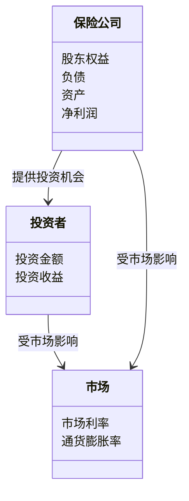
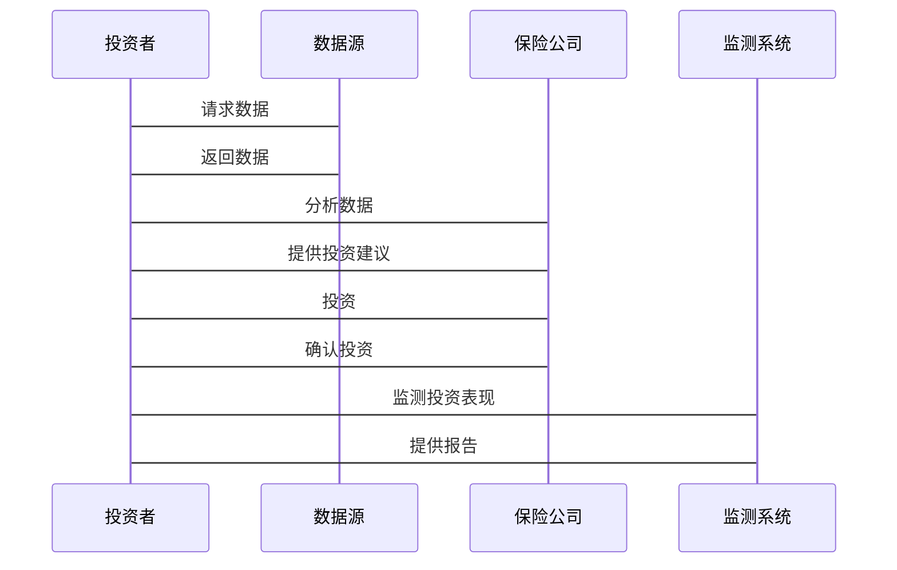

                 


# 巴菲特的保险业投资：在气候变化背景下的新考量

---

## 关键词：
- 巴菲特
- 保险投资
- 气候变化
- 保险定价
- 风险管理

---

## 摘要：
本文从巴菲特的保险业投资策略出发，分析气候变化对保险业的影响，探讨在气候变化背景下，巴菲特如何调整其投资策略以应对新的风险和机遇。文章结合保险业的基本概念、数学模型、系统架构和实际案例，详细阐述气候变化对保险投资的影响，并提出应对气候变化的策略建议。

---

# 第一部分：巴菲特保险业投资背景与基础

## 第1章：保险业的基本概念与巴菲特的投资理念

### 1.1 保险业的基本概念
#### 1.1.1 保险的基本定义与分类
保险是一种风险管理工具，通过将风险转移给保险公司，以换取一定的保费。保险可以分为寿险和非寿险两大类，其中非寿险包括财产保险、责任保险和信用保险等。

#### 1.1.2 保险业的运作模式与核心要素
保险公司的核心要素包括保费收入、赔付支出、投资收益和风险管理能力。保险公司通过收取保费来覆盖未来的赔付支出，并通过投资实现收益。

#### 1.1.3 保险业的市场结构与竞争格局
保险业是一个高度竞争的行业，市场结构由保险公司、保险经纪商和保险代理人组成。巴菲特的伯克希尔哈撒韦公司是美国保险市场的巨头之一。

### 1.2 巴菲特的投资理念
#### 1.2.1 巴菲特的投资哲学概述
巴菲特的投资哲学强调长期价值投资，注重公司的基本面分析和管理层素质。他认为保险业是一个具有稳定收益和防御性的行业，非常适合长期投资。

#### 1.2.2 巴菲特对保险业的特殊关注
巴菲特通过伯克希尔哈撒韦公司控股多家保险公司，包括 GEICO 和 Berkshire Hathaway Reinsurance Group。他倾向于投资那些具有强大承保能力、低赔付率和高资本效率的保险公司。

#### 1.2.3 巴菲特保险投资的成功案例
伯克希尔哈撒韦通过投资 GEICO 和其他保险公司，实现了稳定的保费收入和投资收益。巴菲特的成功在于他对保险公司的严格筛选和长期持有策略。

### 1.3 气候变化对保险业的影响
#### 1.3.1 气候变化对保险行业的潜在风险
气候变化导致极端天气事件增多，如洪水、飓风和干旱，这些事件增加了保险公司的赔付压力。

#### 1.3.2 气候变化对保险定价的影响
气候变化可能导致保险定价的不确定性增加。保险公司需要重新评估风险敞口，并调整保费以反映新的风险水平。

#### 1.3.3 气候变化对保险公司的资本需求
极端天气事件的增加可能导致保险公司的赔付激增，从而增加对资本的需求。保险公司需要持有更多的资本以应对潜在的损失。

---

## 第2章：保险业的核心概念与联系

### 2.1 保险的基本原理
#### 2.1.1 保险的风险转移机制
通过支付保费，投保人将风险转移给保险公司，从而避免因风险发生而遭受重大损失。

#### 2.1.2 保险合同的核心要素
保险合同包括保险金额、保险期限、保险责任和除外条款等内容。合同的公平性和透明性是保险业务的核心。

#### 2.1.3 保险公司的盈利模式
保险公司通过收取保费和投资收益实现盈利。保费收入是保险公司的重要资金来源，而投资收益则通过资金的保值增值实现。

### 2.2 巴菲特保险投资的核心概念
#### 2.2.1 巴菲特的保险投资策略
巴菲特通过控股保险公司，利用保险浮存金（float）进行长期投资。浮存金是指保险公司收取的保费与赔付支出之间的差额，这部分资金可以用于投资。

#### 2.2.2 巴菲特对保险公司的估值方法
巴菲特采用的是基于基本面的估值方法，注重公司的盈利能力、资本效率和管理层素质。他倾向于投资那些具有强大承保能力和低赔付率的保险公司。

#### 2.2.3 巴菲特保险投资的风险管理
巴菲特注重分散投资风险，通过控股多家保险公司分散单一业务的风险。同时，他强调对保险公司的严格监管和内部审计，确保资本安全。

### 2.3 气候变化对保险业的核心影响
#### 2.3.1 气候风险的定义与分类
气候风险包括物理风险（如极端天气事件）、转型风险（如政策变化）和法律风险（如责任追究）。这些风险可能对保险公司的赔付能力和资本充足性产生重大影响。

#### 2.3.2 气候变化对保险公司的财务影响
极端天气事件的增加可能导致保险公司赔付激增，从而影响其资本充足性和财务稳定性。同时，气候变化可能改变保险产品的定价模型，增加定价的复杂性。

#### 2.3.3 气候变化对保险业监管的挑战
气候变化对保险业的监管提出了新的要求。监管机构需要制定更加严格的风险评估和资本管理标准，以应对气候变化带来的潜在风险。

---

## 第3章：保险业的数学模型与算法原理

### 3.1 保险定价的数学模型
#### 3.1.1 保险定价的基本公式
保险定价的核心是确定保费，公式为：
$$ \text{保费} = \text{风险成本} + \text{运营成本} + \text{利润要求} $$

其中，风险成本是根据历史数据和概率模型计算得出的期望损失率。

#### 3.1.2 精算模型的构建与应用
精算模型通过分析历史赔付数据和风险因素，预测未来的赔付概率和金额。常用的方法包括线性回归、贝叶斯模型和蒙特卡洛模拟。

#### 3.1.3 保险定价的不确定性分析
由于气候变化的不确定性，保险定价需要考虑多种情景分析，包括最佳、中间和最坏情况下的保费调整。

### 3.2 巴菲特保险投资的评估模型
#### 3.2.1 巴菲特的保险投资评估公式
巴菲特通过评估保险公司的承保能力和资本效率，计算其内在价值。公式为：
$$ \text{内在价值} = \text{净利润} \times \text{资本效率} \times \text{时间价值} $$

#### 3.2.2 巴菲特保险投资的风险评估模型
通过分析保险公司的赔付率、资本充足率和管理层素质，评估其在气候变化背景下的风险敞口。

#### 3.2.3 巴菲特保险投资的收益预测模型
基于历史数据和情景分析，预测保险投资的未来收益，考虑气候变化对保险公司的潜在影响。

### 3.3 气候变化对保险业的数学模型
#### 3.3.1 气候风险的量化模型
通过气象数据和概率模型，量化极端天气事件的发生概率和影响程度。

#### 3.3.2 气候变化对保险公司的资本需求模型
根据气候变化情景，计算保险公司需要持有的最低资本水平，以应对潜在的赔付激增。

#### 3.3.3 气候变化对保险业的长期影响预测模型
通过时间序列分析和情景模拟，预测气候变化对保险业的长期影响，包括保费收入、赔付支出和投资收益的变化。

---

## 第4章：保险业的系统分析与架构设计

### 4.1 保险投资系统的功能设计
#### 4.1.1 保险投资系统的功能模块划分
- 数据采集模块：收集保险公司的历史数据和市场信息。
- 风险评估模块：分析保险公司的风险敞口和资本需求。
- 投资决策模块：基于风险评估结果，制定投资策略。
- 监测与报告模块：实时监测投资表现并生成报告。

#### 4.1.2 保险投资系统的业务流程设计
1. 数据采集：收集保险公司的财务数据和市场信息。
2. 风险评估：分析保险公司的风险敞口和资本需求。
3. 投资决策：基于风险评估结果，制定投资策略。
4. 监测与报告：实时监测投资表现并生成报告。

#### 4.1.3 保险投资系统的领域模型


### 4.2 保险投资系统的架构设计
#### 4.2.1 系统架构图


#### 4.2.2 系统接口设计
- 数据接口：保险公司与数据源之间的接口。
- 投资接口：投资者与保险公司的投资接口。
- 监测接口：实时监测投资表现的接口。

#### 4.2.3 系统交互流程


---

## 第5章：项目实战

### 5.1 环境配置
- 操作系统：Linux或Windows
- 开发工具：Python、Jupyter Notebook
- 依赖库：numpy, pandas, matplotlib, scikit-learn

### 5.2 核心实现源代码
```python
import numpy as np
import pandas as pd
import matplotlib.pyplot as plt
from sklearn import linear_model

# 示例数据：气候变化对保险赔付的影响
data = pd.DataFrame({
    '保费收入': [100, 150, 200, 250, 300],
    '赔付支出': [80, 120, 160, 200, 240],
    '净收益': [20, 30, 40, 50, 60]
})

# 线性回归模型预测保费收入
model = linear_model.LinearRegression()
model.fit(data[['赔付支出']], data['保费收入'])

# 预测结果
predictions = model.predict(data[['赔付支出']])
print('预测保费收入:', predictions)

# 可视化
plt.scatter(data['赔付支出'], data['保费收入'])
plt.plot(data['赔付支出'], predictions, color='red')
plt.xlabel('赔付支出')
plt.ylabel('保费收入')
plt.show()
```

### 5.3 代码应用解读与分析
- 数据分析：使用pandas读取数据并进行清洗。
- 线性回归模型：通过scikit-learn建立保费收入与赔付支出的关系模型。
- 可视化：通过matplotlib绘制散点图和回归线，直观展示气候变化对保险赔付的影响。

### 5.4 案例分析
- 案例背景：假设一家保险公司因气候变化导致赔付支出增加。
- 数据分析：通过线性回归模型预测保费收入和赔付支出的变化。
- 投资策略：基于模型结果调整保险投资策略，确保资本充足性和收益稳定。

### 5.5 项目小结
- 通过实际案例分析，验证了气候变化对保险投资的影响。
- 提出了应对气候变化的策略建议，包括调整保费定价、优化投资组合和增强资本管理。

---

## 第6章：总结与展望

### 6.1 总结
本文从巴菲特的保险投资策略出发，分析了气候变化对保险业的影响，探讨了在气候变化背景下，巴菲特如何调整其投资策略以应对新的风险和机遇。文章结合保险业的基本概念、数学模型、系统架构和实际案例，详细阐述了气候变化对保险投资的影响，并提出了应对气候变化的策略建议。

### 6.2 展望
随着气候变化的加剧，保险业的风险管理将面临更大的挑战。未来，保险公司需要更加注重风险评估和资本管理，同时投资者也需要更加关注气候变化对保险投资的影响。巴菲特的保险投资策略为我们提供了一个很好的借鉴，未来可以通过技术手段（如人工智能和大数据分析）进一步优化保险定价和风险管理。

---

## 最佳实践 Tips

- **风险管理**：在气候变化背景下，保险公司需要更加注重风险评估和资本管理，确保资本充足性和财务稳定性。
- **技术应用**：利用大数据和人工智能技术，优化保险定价和风险管理，提高投资效率。
- **政策支持**：政府和监管机构需要制定更加严格的政策，规范保险公司的气候变化风险管理。

---

通过本文的分析，我们可以看到，气候变化对保险业的影响是深远的，而巴菲特的保险投资策略为我们提供了一个很好的借鉴。未来，保险业需要更加注重风险管理，同时投资者也需要更加关注气候变化对保险投资的影响。

