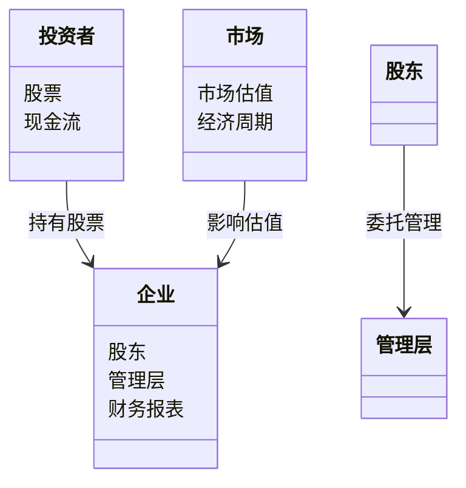
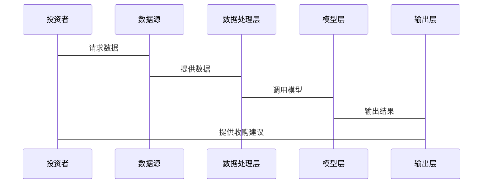

                 


# 巴菲特的公司收购策略：从股东到所有者

## 关键词：巴菲特，公司收购，投资策略，价值投资，股东，所有者

## 摘要：  
本文深入探讨了巴菲特的公司收购策略，从其投资哲学到具体的收购分析方法，再到案例分析和风险管理，为读者提供了一个全面的视角。通过分析巴菲特如何从股东的角度转变为所有者，本文揭示了其独特的价值投资理念和收购策略的核心要素。

---

# 第1章: 巴菲特的投资哲学

## 1.1 巴菲特的价值投资理念

### 1.1.1 价值投资的定义与核心原则

价值投资是一种投资策略，强调以低于内在价值的价格购买优质资产。巴菲特的价值投资理念基于以下几个核心原则：

1. **安全边际**：买入价格低于内在价值，确保即使市场波动，也能获得长期收益。
2. **长期视角**：投资不是短期交易，而是长期持有的过程，关注企业的长期盈利能力。
3. **竞争优势**：寻找具有强大护城河的企业，确保其在市场中的长期竞争优势。

### 1.1.2 巴菲特的价值投资策略

巴菲特的价值投资策略强调以下几点：

1. **寻找具有持续盈利能力的企业**：重点关注那些能够在经济周期波动中保持稳定收益的企业。
2. **关注企业的财务健康状况**：确保企业具有强大的现金流和较低的负债水平。
3. **管理层的诚信与能力**：管理层的诚信和能力是企业成功的关键因素。

### 1.1.3 从股东到所有者的转变

巴菲特的收购策略不仅仅是购买股份，而是成为企业的所有者。这种转变意味着从被动的股东角色转变为积极的所有者角色，关注企业的整体运营和长期发展。

---

## 1.2 巴菲特的投资原则

### 1.2.1 质量第一：寻找优秀的公司

巴菲特强调，投资的首要原则是寻找具有优秀管理和强大竞争优势的公司。他倾向于投资那些能够在长期中保持竞争优势的企业。

### 1.2.2 价格合理：安全边际的重要性

巴菲特认为，投资的关键在于价格的合理性。他通常以低于企业内在价值的价格买入股票，确保安全边际的存在。

### 1.2.3 长期持有：时间的力量

巴菲特的投资策略强调长期持有，他认为市场的短期波动不应该影响长期的投资决策。长期持有优质资产能够带来稳定的复利增长。

---

## 1.3 巴菲特的收购策略

### 1.3.1 收购的核心目标

巴菲特的收购目标是寻找那些具有以下特点的企业：

1. **强大的现金流**：企业能够产生稳定的现金流，支持其长期发展。
2. **低负债率**：低负债率的企业具有更强的财务安全性。
3. **高ROE（净资产收益率）**：高ROE表明企业能够高效地利用资本创造利润。

### 1.3.2 收购的标准与筛选流程

巴菲特在收购过程中遵循以下标准：

1. **财务健康状况**：企业具有稳定的现金流和低负债水平。
2. **竞争优势**：企业具有强大的护城河，能够在市场中保持竞争优势。
3. **管理层能力**：管理层具有诚信和能力，能够推动企业长期发展。

### 1.3.3 收购后的管理与整合

巴菲特在收购后通常采取以下管理策略：

1. **保持管理层稳定性**：避免频繁更换管理层，确保企业运营的稳定性。
2. **优化企业结构**：通过优化企业结构和管理流程，提高企业的运营效率。
3. **注重股东回报**：通过股息支付和股票回购，回馈股东。

---

# 第2章: 公司收购的背景与驱动因素

## 2.1 公司收购的定义与类型

### 2.1.1 公司收购的定义

公司收购是指一家企业通过购买另一家企业的股权或资产，以实现战略目标的过程。收购可以是横向的（同一行业）、纵向的（供应链）或混合的（不同行业）。

### 2.1.2 并购的类型：横向、纵向、混合并购

1. **横向并购**：在同一行业内进行的并购，旨在扩大市场份额或消除竞争对手。
2. **纵向并购**：在供应链上下游进行的并购，旨在整合资源，提高效率。
3. **混合并购**：在不同行业进行的并购，旨在多元化业务，分散风险。

### 2.1.3 收购与公司成长的关系

收购可以成为公司成长的重要手段，通过收购可以快速进入新市场、获取新技术或扩大规模。

---

## 2.2 巴菲特收购的背景分析

### 2.2.1 经济周期与收购机会

巴菲特的收购策略与经济周期密切相关。他在市场低迷时寻找廉价的收购机会，而在市场繁荣时则保持谨慎。

### 2.2.2 行业趋势与竞争优势

巴菲特倾向于投资那些具有长期竞争优势的行业，如消费必需品、公用事业等。

### 2.2.3 市场估值与价格波动

巴菲特关注市场的估值水平，通常在市场低估时进行收购，以确保安全边际。

---

## 2.3 巴菲特收购的驱动因素

### 2.3.1 财务表现与现金流

巴菲特关注企业的财务健康状况，特别是现金流和盈利能力。

### 2.3.2 管理团队与公司治理

巴菲特重视管理层的诚信和能力，认为这是企业成功的关键因素。

### 2.3.3 行业地位与市场准入

巴菲特倾向于投资那些具有强大市场地位的企业，以确保其竞争优势。

---

# 第3章: 巴菲特收购策略的核心要素

## 3.1 财务分析与估值

### 3.1.1 财务报表分析：利润、负债、现金流

巴菲特在收购前会对目标企业的财务状况进行全面分析，包括利润表、资产负债表和现金流量表。

### 3.1.2 估值方法：DCF模型与市盈率

巴菲特常用现金流折现模型（DCF）和市盈率等指标来评估企业的内在价值。

### 3.1.3 安全边际的计算与应用

安全边际是巴菲特投资策略的核心，他通常以低于企业内在价值的价格买入股票。

---

## 3.2 竞争优势分析

### 3.2.1 护城河的定义与分类

护城河是指企业在市场竞争中保持长期竞争优势的障碍。常见的护城河包括成本优势、品牌优势和技术壁垒。

### 3.2.2 品牌优势与客户忠诚度

强大的品牌优势和高客户忠诚度是企业保持竞争优势的重要因素。

### 3.2.3 技术创新与成本优势

技术创新和成本优势是企业保持竞争优势的关键因素。

---

## 3.3 管理层评估

### 3.3.1 管理层的诚信与能力

巴菲特认为，管理层的诚信和能力是企业成功的关键因素。

### 3.3.2 管理层的决策风格

巴菲特倾向于投资那些具有稳健决策风格的管理层。

### 3.3.3 管理层的长期愿景

巴菲特关注管理层的长期愿景，认为具有长期愿景的管理层更有可能推动企业持续发展。

---

# 第4章: 巴菲特收购策略的数学模型与分析

## 4.1 财务估值模型

### 4.1.1 现金流折现模型（DCF）

现金流折现模型是一种常用的财务估值方法，通过将未来现金流折现到现值来评估企业价值。

公式：
$$
\text{企业价值} = \sum_{t=1}^{n} \frac{\text{现金流}_t}{(1 + r)^t}
$$

其中，\( r \) 是折现率，\( n \) 是预测期数。

### 4.1.2 市盈率与市净率分析

市盈率（P/E）和市净率（P/B）是常用的估值指标，分别表示市价与每股收益之比，以及市价与每股净资产之比。

### 4.1.3 股息

股息是企业分配给股东的利润部分，是股东回报的重要来源。

---

## 4.2 价值评估的数学模型

### 4.2.1 企业价值公式

企业价值可以通过以下公式计算：
$$
\text{企业价值} = \text{净利润} \times \text{市盈率}
$$

### 4.2.2 股票价值公式

股票价值可以通过以下公式计算：
$$
\text{股票价值} = \text{每股收益} \times \text{市盈率}
$$

---

## 4.3 安全边际的计算

### 4.3.1 安全边际公式

安全边际可以通过以下公式计算：
$$
\text{安全边际} = \text{内在价值} - \text{市场价格}
$$

### 4.3.2 安全边际的应用

巴菲特通常以低于内在价值的价格买入股票，以确保安全边际的存在。

---

## 4.4 算法原理

### 4.4.1 现金流折现算法

以下是现金流折现算法的步骤：

1. **预测未来现金流**：预测企业在未来几年内的现金流。
2. **计算折现率**：确定合适的折现率。
3. **计算现值**：将未来现金流折现到现值。
4. **计算企业价值**：将所有现值加总，得到企业价值。

### 4.4.2 股票价值计算算法

以下是股票价值计算算法的步骤：

1. **计算每股收益**：确定企业的每股收益。
2. **确定市盈率**：选择合适的市盈率。
3. **计算股票价值**：将每股收益乘以市盈率，得到股票价值。

---

## 4.5 算法实现

### 4.5.1 现金流折现模型的Python实现

以下是现金流折现模型的Python代码：

```python
import numpy as np

def discounted_cash_flow(cash_flows, discount_rate):
    present_value = 0
    for t, cash_flow in enumerate(cash_flows, 1):
        present_value += cash_flow / (1 + discount_rate)**t
    return present_value

# 示例数据
cash_flows = [100, 150, 200, 250]  # 每年的现金流
discount_rate = 0.08  # 折现率

enterprise_value = discounted_cash_flow(cash_flows, discount_rate)
print("企业价值：", enterprise_value)
```

---

## 4.6 案例分析

### 4.6.1 案例背景

假设我们有一家企业的未来四年现金流分别为100万、150万、200万和250万，折现率为8%。

### 4.6.2 算法应用

使用上述Python代码计算企业价值：

```
企业价值：100 / 1.08 + 150 / 1.08^2 + 200 / 1.08^3 + 250 / 1.08^4 ≈ 340.91万
```

### 4.6.3 结果解读

企业价值约为340.91万元，这为企业估值提供了依据。

---

## 4.7 总结

通过数学模型和算法，我们可以更准确地评估企业的内在价值，为巴菲特的收购策略提供支持。

---

# 第5章: 巴菲特收购策略的系统分析与架构设计方案

## 5.1 系统功能设计

### 5.1.1 领域模型设计

以下是领域模型的Mermaid类图：



### 5.1.2 系统架构设计

以下是系统架构的Mermaid架构图：


### 5.1.3 系统接口设计

系统接口包括：

1. 数据输入接口：接收财务报表和市场数据。
2. 模型调用接口：调用DCF模型和市盈率分析模型。
3. 结果输出接口：输出企业价值和收购建议。

### 5.1.4 系统交互设计

以下是系统交互的Mermaid序列图：



---

## 5.2 项目实战

### 5.2.1 环境安装

需要安装以下工具：

1. Python 3.x
2. Anaconda
3. Jupyter Notebook
4. Mermaid工具

### 5.2.2 核心实现源代码

以下是DCF模型的核心实现代码：

```python
import numpy as np

def discounted_cash_flow(cash_flows, discount_rate):
    present_value = 0
    for t, cash_flow in enumerate(cash_flows, 1):
        present_value += cash_flow / (1 + discount_rate)**t
    return present_value

# 示例数据
cash_flows = [100, 150, 200, 250]
discount_rate = 0.08

enterprise_value = discounted_cash_flow(cash_flows, discount_rate)
print("企业价值：", enterprise_value)
```

### 5.2.3 代码解读

1. **导入库**：使用numpy库进行数值计算。
2. **定义DCF函数**：计算现金流的现值。
3. **示例数据**：设置未来四年的现金流和折现率。
4. **计算企业价值**：调用DCF函数，计算企业价值。
5. **输出结果**：打印企业价值。

### 5.2.4 案例分析

假设我们有一家企业的未来四年现金流分别为100万、150万、200万和250万，折现率为8%。

使用上述代码计算企业价值：

```
企业价值：340.91万
```

### 5.2.5 结果解读

企业价值约为340.91万元，这为企业估值提供了依据。

---

## 5.3 总结

通过系统分析和架构设计，我们可以更系统地实施巴菲特的收购策略，利用数学模型和算法进行精确的估值和决策。

---

# 第6章: 巴菲特收购策略的总结与展望

## 6.1 总结

巴菲特的公司收购策略强调以下几点：

1. **价值投资**：寻找具有持续盈利能力的企业。
2. **安全边际**：以低于内在价值的价格买入股票。
3. **长期持有**：关注企业的长期发展。

## 6.2 展望

未来，巴菲特的收购策略将继续在全球范围内发挥作用。随着市场的变化和技术的进步，巴菲特的策略将不断优化和创新。

---

## 6.3 最佳实践 tips

1. **关注企业的财务健康状况**：确保企业具有稳定的现金流和低负债水平。
2. **分析管理层的能力**：选择具有诚信和能力的管理层。
3. **长期持有**：避免短期波动，关注企业的长期发展。

---

## 6.4 项目小结

通过本文的分析，我们深入探讨了巴菲特的公司收购策略，从投资哲学到数学模型，再到系统设计和项目实战，为读者提供了全面的视角。

---

## 6.5 注意事项

1. **风险提示**：投资有风险，需谨慎决策。
2. **数据来源**：确保数据的准确性和可靠性。
3. **模型假设**：模型基于假设，实际结果可能有所不同。

---

## 6.6 拓展阅读

1. **《巴菲特的智慧》**：深入探讨巴菲特的投资理念。
2. **《投资学基础》**：系统介绍投资的基本原理。
3. **《并购实战》**：分析并购的实战案例和策略。

---

# 结语

通过本文的分析，我们深入探讨了巴菲特的公司收购策略，从投资哲学到数学模型，再到系统设计和项目实战，为读者提供了全面的视角。希望本文能为您提供有价值的见解和启发。

