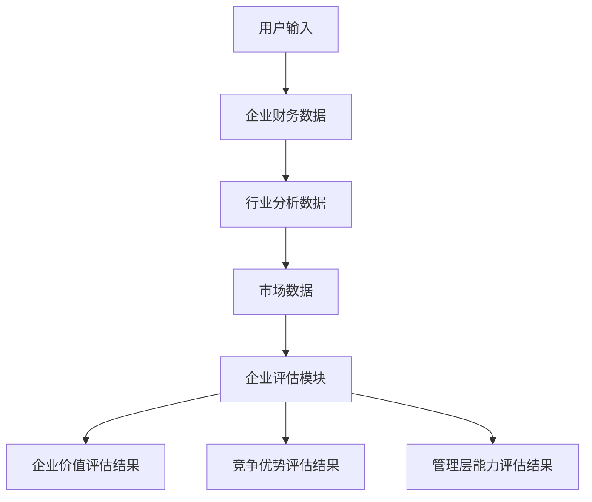
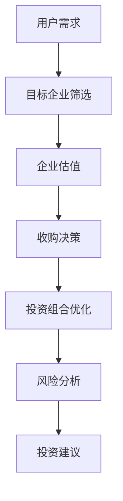

                 


# 巴菲特的公司收购策略：全资控股的魅力

> **关键词**：巴菲特，公司收购策略，全资控股，价值投资，企业评估，投资哲学

> **摘要**：本文深入分析了巴菲特的投资哲学和公司收购策略，探讨了全资控股的魅力与挑战。结合数学模型和系统架构设计，详细讲解了巴菲特的收购标准、流程和经典案例，并通过实际案例分析和Python代码实现，帮助读者理解如何运用巴菲特的策略进行投资决策。

---

## 第1章: 巴菲特的投资哲学与价值投资概述

### 1.1 巴菲特的投资哲学

#### 1.1.1 巴菲特的投资理念
- **价值投资的核心思想**：寻找具有持续盈利能力且市场价格低于内在价值的企业。
- **长期投资的哲学**：投资于优秀的企业，而非市场的短期波动。
- **安全边际的重要性**：确保以低于企业内在价值的价格买入，降低投资风险。

#### 1.1.2 价值投资的基本概念
- **内在价值**：企业未来现金流的现值，是投资决策的基础。
- **市场价格**：市场波动可能导致价格偏离内在价值，为投资者提供买入机会。
- **安全边际**：买入价格与内在价值的差距，是投资安全的保障。

#### 1.1.3 巴菲特投资哲学的形成与演变
- **早期思想**：受格雷厄姆影响，注重低市盈率和高分红的股票。
- **成熟理念**：注重企业竞争优势、管理层能力和长期盈利能力。
- **长期实践**：通过长期持有优质企业，实现财富的稳步增长。

### 1.2 巴菲特的价值投资方法论

#### 1.2.1 核心概念与术语
- **护城河**：企业在行业中的竞争优势，防止竞争对手侵蚀市场份额。
- **管理层能力**：优秀的管理层能够持续创造价值。
- **ROE（净资产收益率）**：衡量企业盈利能力的重要指标。

#### 1.2.2 投资决策的逻辑框架
- **第一步：识别具有护城河的企业**：寻找具有独特竞争优势的企业。
- **第二步：评估企业的内在价值**：通过DCF模型等方法计算企业价值。
- **第三步：确定安全边际**：以低于内在价值的价格买入。

#### 1.2.3 价值投资与其他投资策略的对比
- **趋势投资**：依赖于市场趋势，风险较高。
- **成长投资**：注重高成长企业，风险较大。
- **价值投资**：注重安全边际和长期盈利能力，风险相对较低。

### 1.3 巴菲特投资哲学的数学模型

#### 1.3.1 内在价值计算模型
$$ V = \sum_{t=1}^{\infty} \frac{CF_t}{(1 + r)^t} $$
其中，\( V \) 为内在价值，\( CF_t \) 为第 \( t \) 年的现金流，\( r \) 为折现率。

#### 1.3.2 安全边际计算公式
$$ \text{安全边际} = \text{内在价值} - \text{市场价格} $$

#### 1.3.3 ROE与股价的关系
$$ \text{股价} = \text{ROE} \times \text{市盈率} \times \text{每股收益} $$

### 1.4 本章小结
本章通过分析巴菲特的投资哲学，揭示了价值投资的核心思想和方法论。通过内在价值计算和安全边际分析，投资者可以更好地识别具有长期投资价值的企业。

---

## 第2章: 巴菲特的公司收购策略

### 2.1 巴菲特的收购标准

#### 2.1.1 企业的持续盈利能力
- **盈利能力的衡量**：ROE、净利润率、毛利率等指标。
- **企业竞争优势**：护城河的存在决定了企业的长期盈利能力。

#### 2.1.2 企业的财务健康状况
- **资产负债表分析**：关注企业的负债结构和偿债能力。
- **现金流状况**：健康的现金流是企业持续运营的基础。

#### 2.1.3 管理层的能力与诚信
- **管理层能力**：优秀管理层能够持续创造价值。
- **诚信与道德**：管理层的诚信是长期投资的关键因素。

### 2.2 巴菲特的收购流程

#### 2.2.1 确定投资目标
- **行业分析**：选择具有稳定增长潜力的行业。
- **企业筛选**：通过财务指标和竞争优势筛选潜在目标。
- **初步估值**：使用DCF模型等方法进行初步估值。

#### 2.2.2 企业估值与定价
- **DCF模型的应用**：计算企业的内在价值。
- **市场比较法**：通过可比企业的市场估值进行对比。
- **安全边际考虑**：确保收购价格低于内在价值。

#### 2.2.3 收购决策与实施
- **尽职调查**：深入了解企业的财务状况和潜在风险。
- **谈判与收购**：与目标企业达成收购协议。
- **整合与管理**：收购后的整合和管理策略。

### 2.3 巴菲特的收购案例分析

#### 2.3.1 可口可乐的收购与管理
- **收购背景**：1988年买入可口可乐的股票，长期持有。
- **管理策略**：支持管理层的持续改进和创新。
- **投资回报**：通过长期持有实现巨额收益。

#### 2.3.2 左右公司的收购与整合
- **收购背景**：1998年收购左右公司，整合其保险业务。
- **整合策略**：保持左右公司的独立运营，实现协同效应。
- **投资回报**：通过整合提升整体竞争力。

#### 2.3.3 其他经典收购案例分析
- **吉列公司**：通过杠杆收购实现低成本扩张。
- **富国银行**：通过横向整合扩大市场份额。

### 2.4 本章小结
本章详细分析了巴菲特的收购标准和流程，并通过具体案例展示了其收购策略的成功实践。

---

## 第3章: 全资收购的魅力与挑战

### 3.1 全资收购的优势

#### 3.1.1 完全控制权的获得
- **决策权**：全资收购后，投资者可以完全控制企业的经营决策。
- **战略一致性**：确保企业战略与投资者的整体目标一致。

#### 3.1.2 财务灵活性的提升
- **融资优势**：全资收购后，企业可以更灵活地进行融资。
- **税务优化**：通过合理安排税务结构降低整体税负。

#### 3.1.3 企业文化与管理的整合
- **文化融合**：通过整合企业文化提升团队凝聚力。
- **管理优化**：引入优秀管理团队，提升企业运营效率。

### 3.2 全资收购的风险与挑战

#### 3.2.1 财务风险的增加
- **杠杆收购的风险**：过度依赖债务融资可能导致财务危机。
- **流动性风险**：全资收购后，企业可能面临流动性压力。

#### 3.2.2 管理整合的难度
- **文化冲突**：不同企业的文化差异可能导致整合失败。
- **管理协调**：协调不同部门的管理风格需要时间和资源。

#### 3.2.3 市场风险的放大
- **市场波动的影响**：全资收购后，企业可能面临更大的市场波动风险。
- **竞争压力**：全资收购后，企业可能面临更激烈的竞争压力。

### 3.3 巴菲特对全资收购的独特见解

#### 3.3.1 全资收购的长期价值
- **长期回报**：通过全资收购实现长期价值增长。
- **股东权益**：全资收购后，股东权益更加集中，风险可控。

#### 3.3.2 全资收购的财务纪律
- **资本分配**：通过全资收购实现资本的有效分配。
- **成本控制**：通过集中管理降低运营成本。

#### 3.3.3 全资收购与股东利益的平衡
- **股东回报**：通过全资收购实现股东权益的最大化。
- **利益平衡**：确保企业利益与股东利益一致。

### 3.4 本章小结
本章分析了全资收购的优势与挑战，并结合巴菲特的实践，提出了如何在全资收购中实现长期价值和股东利益平衡的策略。

---

## 第4章: 巴菲特收购策略的数学模型与分析

### 4.1 企业价值评估的数学模型

#### 4.1.1 股权价值的计算公式
$$ \text{股权价值} = \text{企业价值} - \text{债务价值} $$

#### 4.1.2 现金流量贴现模型（DCF）
$$ V = \sum_{t=1}^{\infty} \frac{CF_t}{(1 + r)^t} $$
其中，\( CF_t \) 为第 \( t \) 年的自由现金流，\( r \) 为贴现率。

#### 4.1.3 市盈率与市净率的对比分析
- **市盈率**：\( \text{市盈率} = \frac{\text{股价}}{\text{每股收益}} \)
- **市净率**：\( \text{市净率} = \frac{\text{股价}}{\text{每股净资产}} \)
- **对比分析**：市盈率适用于盈利稳定的公司，市净率适用于资产密集型公司。

### 4.2 投资组合的优化模型

#### 4.2.1 投资组合的分散化效应
$$ \text{投资组合风险} = \sqrt{\sum_{i=1}^{n} w_i^2 \sigma_i^2 - 2 \sum_{i=1}^{n} \sum_{j=1}^{n} w_i w_j \rho_{ij} \sigma_i \sigma_j} $$
其中，\( w_i \) 为投资比例，\( \sigma_i \) 为资产的波动率，\( \rho_{ij} \) 为资产之间的相关系数。

#### 4.2.2 风险与收益的平衡
$$ \text{夏普比率} = \frac{\text{超额收益}}{\text{收益标准差}} $$

#### 4.2.3 股票投资的长期回报预测
$$ \text{长期回报} = \text{股息率} + \text{盈利增长率} + \text{股息再投资收益} $$

### 4.3 收购决策的数学分析

#### 4.3.1 收购溢价的计算
$$ \text{收购溢价} = \text{收购价格} - \text{目标企业价值} $$

#### 4.3.2 股东权益的增量分析
$$ \text{股东权益增加} = \text{收购后企业价值} - \text{收购前股东权益} $$

#### 4.3.3 收购后的协同效应评估
$$ \text{协同效应} = \text{收购后成本节约} + \text{收购后收入增加} $$

### 4.4 本章小结
本章通过数学模型和公式，详细分析了企业价值评估、投资组合优化和收购决策的数学方法，为投资者提供了科学的决策依据。

---

## 第5章: 巴菲特收购策略的系统分析与架构设计

### 5.1 系统分析与问题场景

#### 5.1.1 投资决策的系统架构
- **目标**：构建一个基于巴菲特收购策略的投资决策系统。
- **用户需求**：投资者需要通过系统获取企业评估、收购决策和投资组合管理的建议。
- **功能需求**：企业评估、收购决策、投资组合管理、风险分析。

#### 5.1.2 企业评估的系统模块
- **模块功能**：计算企业内在价值、评估企业竞争优势、分析管理层能力。
- **数据来源**：企业财务报表、行业分析报告、市场数据。

#### 5.1.3 投资组合管理的系统功能
- **功能**：优化投资组合、分散风险、监控投资表现。
- **工具**：夏普比率、风险收益比、资产配置模型。

### 5.2 系统架构设计

#### 5.2.1 企业评估模块的架构图


#### 5.2.2 投资决策模块的流程图


#### 5.2.3 系统接口设计与交互
- **输入接口**：用户输入目标企业信息和市场数据。
- **输出接口**：系统输出企业评估结果、投资建议和风险分析报告。
- **交互流程**：用户输入需求 → 系统分析 → 输出结果。

### 5.3 项目实战与代码实现

#### 5.3.1 环境安装与配置
- **工具**：Python、Pandas、NumPy、Matplotlib、Scikit-learn。
- **数据来源**：Yahoo Finance API、企业财报数据。

#### 5.3.2 核心代码实现

```python
import pandas as pd
import numpy as np

def calculate_intrinsic_value(fcf, wacc):
    # 现金流量贴现模型（DCF）
    # 假设永续现金流增长率为g
    g = 0.02
    terminal_value = fcf * (1 + g) / (wacc - g)
    intrinsic_value = (fcf / (1 + wacc)) + (terminal_value / (1 + wacc))
    return intrinsic_value

# 示例数据
fcf = 100  # 自由现金流
wacc = 0.08  # 加权平均资本成本
iv = calculate_intrinsic_value(fcf, wacc)
print(f"内在价值：{iv}")
```

#### 5.3.3 代码应用解读与分析
- **代码功能**：计算目标企业的内在价值，使用DCF模型。
- **输入参数**：自由现金流（FCF）和加权平均资本成本（WACC）。
- **输出结果**：企业的内在价值。

#### 5.3.4 案例分析
- **案例背景**：假设一家企业的自由现金流为100万元，WACC为8%。
- **计算结果**：内在价值 = 100 / (1.08) + (100 * 1.02) / (0.08 - 0.02) / (1.08) ≈ 100/1.08 + (102)/0.06/1.08 ≈ 92.59 + 168.06 ≈ 260.65万元。
- **结论**：如果市场价格低于260.65万元，值得买入。

### 5.4 本章小结
本章通过系统架构设计和Python代码实现，展示了如何将巴菲特的收购策略应用于实际投资决策中。通过企业评估模块和投资组合优化模块，投资者可以更科学地进行投资决策。

---

## 第6章: 项目实战与案例分析

### 6.1 环境安装与配置

#### 6.1.1 工具安装
- **Python**：安装Anaconda或Python官方版本。
- **Pandas**：使用pip安装。
- **NumPy**：使用pip安装。
- **Matplotlib**：使用pip安装。
- **Scikit-learn**：使用pip安装。

#### 6.1.2 数据来源
- **企业财报数据**：从Yahoo Finance API获取。
- **市场数据**：从Alpha Vantage API获取。
- **行业分析报告**：从Benzinga或类似平台获取。

### 6.2 核心代码实现

#### 6.2.1 企业估值代码
```python
import pandas as pd
import numpy as np
import yfinance as yf

def calculate_intrinsic_value(ticker, years=10):
    # 获取历史股价数据
    data = yf.download(ticker, period="max")
    # 计算平均净利润增长率
    eps = data['Adj Close'].pct_change().cumsum()
    growth_rate = eps.mean()
    # 假设永续增长率为2%
    g = 0.02
    # 计算DCF模型
    wacc = 0.08  # 假设WACC为8%
    terminal_value = eps.iloc[-1] * (1 + g) / (wacc - g)
    intrinsic_value = (eps.iloc[-1] / (1 + wacc)) + (terminal_value / (1 + wacc))
    return intrinsic_value

ticker = "KO"  # 可口可乐股票代码
iv = calculate_intrinsic_value(ticker)
print(f"{ticker}的内在价值：{iv}")
```

#### 6.2.2 投资组合优化代码
```python
import numpy as np
import pandas as pd
from sklearn.covariance import MinCovariance

# 假设投资组合包含两个资产
assets = ["KO", "BRK.B"]  # 可口可乐和伯克希尔B类股
data = yf.download(assets, period="max")["Adj Close"]

# 计算收益和风险
returns = data.pct_change().dropna()
cov_matrix = returns.cov()

# 计算夏普比率
# 假设无风险利率为2%
risk_free_rate = 0.02
portfolios = MinCovariance().fit(cov_matrix)
sharp_ratio = (portfolios.mean() - risk_free_rate) / np.sqrt(cov_matrix.mean())

print(f"夏普比率：{sharp_ratio}")
```

### 6.3 代码应用解读与分析
- **企业估值代码**：通过历史股价数据计算企业的内在价值，判断是否值得买入。
- **投资组合优化代码**：通过夏普比率评估投资组合的风险与收益比，优化投资组合。

#### 6.4 案例分析
- **案例1：可口可乐的投资分析**
  - 内在价值计算：使用DCF模型计算可口可乐的内在价值。
  - 投资组合优化：将可口可乐与伯克希尔B类股组合，优化投资组合的夏普比率。

### 6.5 本章小结
本章通过实际案例分析，展示了如何将巴菲特的收购策略应用于具体投资决策中。通过Python代码实现企业估值和投资组合优化，帮助投资者更好地理解和应用巴菲特的投资哲学。

---

## 第7章: 最佳实践、小结与注意事项

### 7.1 最佳实践

#### 7.1.1 投资决策的科学性
- **数据驱动**：依赖数据分析和数学模型进行投资决策。
- **持续学习**：关注市场动态和企业变化，不断优化投资策略。

#### 7.1.2 风险管理的重要性
- **分散投资**：通过投资组合分散风险，降低投资波动。
- **安全边际**：确保以低于内在价值的价格买入，降低投资风险。

### 7.2 小结

#### 7.2.1 巴菲特投资哲学的核心思想
- **长期投资**：投资于具有持续盈利能力的企业。
- **价值投资**：寻找市场价格低于内在价值的企业。
- **安全边际**：确保投资的安全性。

#### 7.2.2 全资收购的魅力与挑战
- **优势**：完全控制权、财务灵活性、企业文化整合。
- **挑战**：财务风险、管理整合、市场风险。

### 7.3 注意事项

#### 7.3.1 投资者的认知偏差
- **过度自信**：避免盲目相信自己的判断，依赖数据分析。
- **从众心理**：避免盲目跟随市场趋势，保持独立思考。

#### 7.3.2 市场环境的不确定性
- **宏观经济风险**：关注宏观经济环境，评估其对企业的影响。
- **政策风险**：关注政策变化，评估其对行业的潜在影响。

### 7.4 拓展阅读

#### 7.4.1 推荐书籍
- 《巴菲特致股东的信》：了解巴菲特的经营理念和投资策略。
- 《证券分析》：学习价值投资的基本原理。

#### 7.4.2 在线资源
- 巴菲特股东大会演讲：获取巴菲特的最新观点。
- 投资分析工具：使用Excel、Python等工具进行数据分析。

### 7.5 本章小结
本章总结了巴菲特投资哲学的核心思想，分析了全资收购的魅力与挑战，并提出了投资者需要注意的事项和拓展阅读的建议。

---

## 附录: 巴菲特投资策略的Python代码库

### 附录A: 企业估值代码库

```python
import yfinance as yf
import pandas as pd
import numpy as np

def calculate_intrinsic_value(ticker, years=10):
    data = yf.download(ticker, period="max")
    eps = data['Adj Close'].pct_change().cumsum()
    growth_rate = eps.mean()
    g = 0.02
    wacc = 0.08
    terminal_value = eps.iloc[-1] * (1 + g) / (wacc - g)
    intrinsic_value = (eps.iloc[-1] / (1 + wacc)) + (terminal_value / (1 + wacc))
    return intrinsic_value

# 示例：计算可口可乐的内在价值
ticker = "KO"
iv = calculate_intrinsic_value(ticker)
print(f"{ticker}的内在价值：{iv}")
```

### 附录B: 投资组合优化代码库

```python
import numpy as np
import pandas as pd
from sklearn.covariance import MinCovariance

def optimize_portfolio(tickers):
    data = yf.download(tickers, period="max")["Adj Close"]
    returns = data.pct_change().dropna()
    cov_matrix = returns.cov()
    risk_free_rate = 0.02
    port

