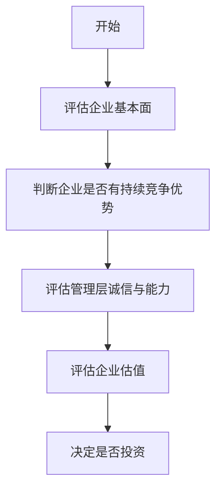
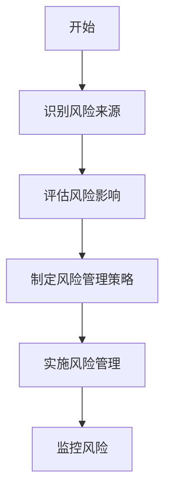
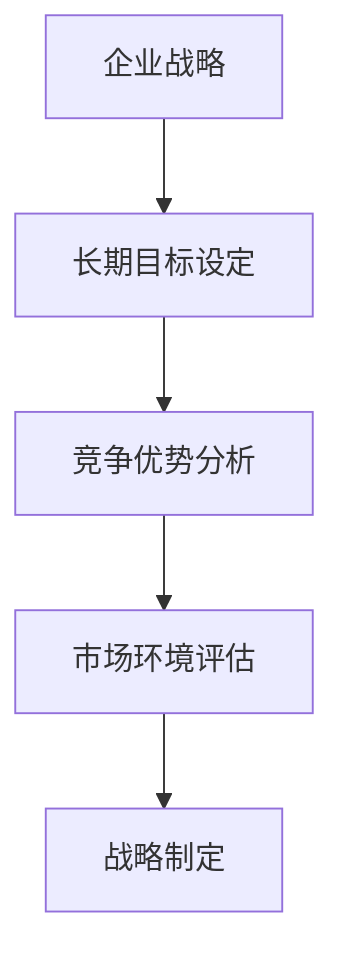
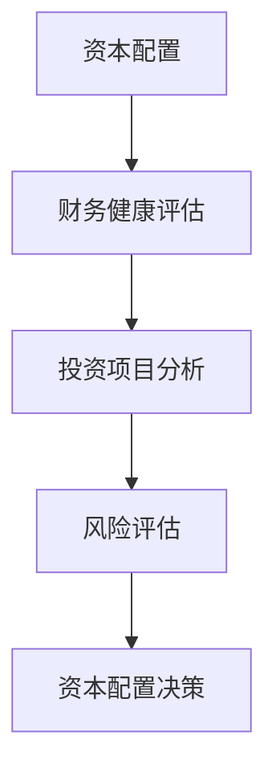
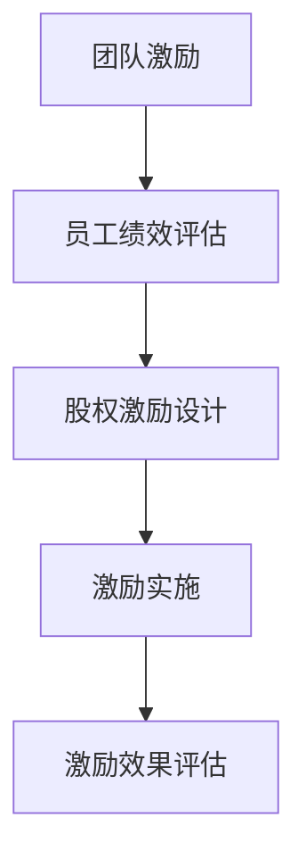

                 


# 巴菲特的公司管理哲学

> 关键词：巴菲特, 管理哲学, 价值投资, 长期主义, 股东资本主义

> 摘要：本文深入探讨了巴菲特的公司管理哲学，从其核心理念到实际应用，结合技术语言和案例分析，分析了其在现代公司管理中的价值与应用。通过系统分析和项目实战，展示了如何将巴菲特的管理哲学转化为可执行的管理策略和算法模型，帮助读者理解其深刻的思想和实际应用。

---

## 第一部分：巴菲特的管理哲学背景

### 第1章：巴菲特的管理哲学背景

#### 1.1 巴菲特的生平与投资理念

##### 1.1.1 巴菲特的早年经历与投资起步
沃伦·巴菲特（Warren Buffett）于1934年出生在美国密苏里州的奥马哈市。他从小就展现出了对数字和投资的天赋。在高中时期，他开始研究股票市场，并在19岁进入哥伦比亚大学，师从 Benjamin Graham 和 David Dodd，学习价值投资理论。他的投资理念深受这两位导师的影响，尤其是Graham的“安全边际”概念。

##### 1.1.2 巴菲特的价值投资理念
巴菲特的价值投资理念强调寻找那些具有持续竞争优势、良好治理结构和合理估值的企业。他主张以低于内在价值的价格买入优质资产，并长期持有。这种投资策略与传统的短期交易策略不同，更注重企业的基本面和长期盈利能力。

##### 1.1.3 巴菲特的长期主义与股东资本主义
巴菲特提倡长期主义，认为企业应该注重长期的可持续发展，而不是短期的利润最大化。他主张股东资本主义，即企业不仅要为股东创造价值，还要为员工、客户和社区创造价值，实现多方共赢。

#### 1.2 公司管理哲学的背景与问题背景

##### 1.2.1 当前公司管理的主要问题
现代公司管理中存在许多问题，例如短期主义、过度关注股价波动、忽视企业基本面、缺乏长期战略规划等。这些问题导致了企业频繁的管理层变动、短期行为和过度杠杆化，增加了企业的风险。

##### 1.2.2 巴菲特管理哲学的提出背景
面对上述问题，巴菲特提出了一套以长期主义和股东价值最大化为核心的管理哲学，强调企业应该关注长期的可持续发展，注重基本面分析和竞争优势，避免短期行为。

##### 1.2.3 巴菲特管理哲学的核心问题与解决思路
巴菲特管理哲学的核心问题是如何通过长期投资和价值创造实现股东价值最大化。其解决思路包括：选择具有持续竞争优势的企业、注重企业的财务健康、关注管理层的诚信与能力、实施稳健的资本配置策略等。

---

## 第二部分：巴菲特公司管理哲学的核心概念与联系

### 第2章：巴菲特公司管理哲学的核心概念与联系

#### 2.1 核心概念与原理

##### 2.1.1 巴菲特管理哲学的核心要素
- **长期主义**：关注企业的长期可持续发展，而非短期利润。
- **价值投资**：寻找具有内在价值的优质企业。
- **股东资本主义**：实现股东、员工、客户和社区的共赢。
- **风险管理**：避免过度杠杆化和财务风险。

##### 2.1.2 价值投资与公司管理的内在联系
价值投资强调对企业基本面的深入分析，这与公司管理中的财务健康、竞争优势和长期战略密切相关。通过价值投资，企业可以在管理中更好地识别和选择具有潜力的项目和投资。

##### 2.1.3 长期主义与股东价值最大化的关系
长期主义是实现股东价值最大化的重要途径。通过长期关注企业的基本面和竞争优势，企业可以在长期中实现价值增长，从而为股东创造更多的价值。

#### 2.2 核心概念对比分析

##### 2.2.1 传统公司管理与巴菲特管理哲学的对比
- **传统公司管理**：注重短期业绩、股价波动和管理层绩效。
- **巴菲特管理哲学**：注重长期发展、基本面分析和股东价值最大化。

##### 2.2.2 不同管理哲学的核心特征对比
| 管理哲学 | 核心特征                     |
|----------|------------------------------|
| 传统     | 短期业绩、股价波动、管理层绩效 |
| 巴菲特   | 长期发展、基本面分析、股东价值最大化 |

##### 2.2.3 巴菲特管理哲学的优缺点分析
- **优点**：注重长期发展，避免短期行为，促进企业稳健增长。
- **缺点**：可能忽视市场短期波动，无法快速应对市场变化。

---

## 第三部分：巴菲特管理哲学的算法原理与数学模型

### 第3章：巴菲特管理哲学的算法原理与数学模型

#### 3.1 巴菲特管理哲学的决策模型

##### 3.1.1 巴菲特决策树模型
以下是巴菲特决策树模型的Mermaid图：



##### 3.1.2 企业价值评估的数学公式
企业价值（EV）可以通过以下公式计算：

$$EV = EBIT \times (1 + g) / (r - g)$$

其中：
- EBIT：息税折旧前利润
- g：长期增长率
- r：资本成本

##### 3.1.3 风险管理的算法流程
以下是风险管理的算法流程图：



#### 3.2 企业价值评估的数学模型

##### 3.2.1 企业价值的公式推导
企业价值（EV）的计算公式如下：

$$EV = V_{FC} \times (1 + g) / (r - g)$$

其中：
- $V_{FC}$：自由现金流
- g：长期增长率
- r：资本成本

##### 3.2.2 股东价值最大化的优化模型
股东价值最大化可以通过以下优化模型实现：

$$\max \text{股东价值} = \text{收入} - \text{成本} - \text{税金} - \text{资本成本}$$

##### 3.2.3 长期投资回报的计算公式
长期投资回报（ROI）的计算公式如下：

$$ROI = \frac{\text{净利润}}{\text{初始投资}} \times 100\%$$

---

## 第四部分：巴菲特管理哲学的系统分析与架构设计

### 第4章：巴菲特管理哲学的系统分析与架构设计

#### 4.1 系统分析与问题场景介绍

##### 4.1.1 企业战略制定的场景分析
在制定企业战略时，需要考虑企业的长期目标、竞争优势和市场环境。巴菲特管理哲学强调以长期发展为目标，选择具有持续竞争优势的企业。

##### 4.1.2 资本配置的系统分析
资本配置需要考虑企业的财务健康、投资项目的回报潜力和风险。巴菲特管理哲学主张稳健的资本配置，避免过度杠杆化。

##### 4.1.3 团队激励的系统架构
团队激励需要考虑员工的长期利益和企业的长期发展。巴菲特管理哲学主张通过股权激励等方式，将员工的利益与企业的长期发展相结合。

#### 4.2 系统架构设计

##### 4.2.1 企业战略模块的架构设计
以下是企业战略模块的架构设计图：



##### 4.2.2 资本配置模块的架构设计
以下是资本配置模块的架构设计图：



##### 4.2.3 团队激励模块的架构设计
以下是团队激励模块的架构设计图：



---

## 第五部分：巴菲特管理哲学的项目实战

### 第5章：巴菲特管理哲学的项目实战

#### 5.1 项目环境与工具安装

##### 5.1.1 环境配置与数据准备
需要准备企业财务数据、市场数据和竞争对手数据。建议使用Python进行数据处理和分析。

##### 5.1.2 巴菲特决策模型的工具安装
安装Python、Pandas、NumPy等工具，用于数据分析和模型实现。

##### 5.1.3 数据分析工具的使用说明
使用Jupyter Notebook进行数据分析和可视化。

#### 5.2 核心算法实现

##### 5.2.1 企业价值评估的Python代码实现
以下是企业价值评估的Python代码：

```python
import pandas as pd
import numpy as np

# 输入数据
ebit = 10000000
g = 0.05
r = 0.10

# 计算企业价值
ev = ebit * (1 + g) / (r - g)
print("企业价值:", ev)
```

##### 5.2.2 风险管理的Python代码实现
以下是风险管理的Python代码：

```python
def risk_assessment(risk_factors):
    for factor in risk_factors:
        if factor > 0.5:
            return "高风险"
        else:
            return "低风险"

# 输入风险因素
risk_factors = [0.6, 0.3, 0.4]
print("风险评估:", risk_assessment(risk_factors))
```

##### 5.2.3 股东价值最大化的代码实现
以下是股东价值最大化的Python代码：

```python
def max_shareholder_value(revenue, cost, tax, capital_cost):
    return revenue - cost - tax - capital_cost

revenue = 100000000
cost = 60000000
tax = 10000000
capital_cost = 5000000

print("股东价值:", max_shareholder_value(revenue, cost, tax, capital_cost))
```

#### 5.3 项目实战总结

##### 5.3.1 项目总结
通过项目实战，我们可以看到巴菲特管理哲学在实际应用中的可行性和有效性。企业价值评估、风险管理等算法可以帮助企业更好地实现长期发展和股东价值最大化。

##### 5.3.2 项目小结
巴菲特管理哲学不仅仅是一种投资理念，更是一种系统的公司管理方法。通过将其转化为可执行的算法和模型，我们可以更好地理解和应用这一哲学。

---

## 第六部分：巴菲特管理哲学的最佳实践与总结

### 第6章：巴菲特管理哲学的最佳实践与总结

#### 6.1 最佳实践与小结

##### 6.1.1 最佳实践
- 定期评估企业的基本面和竞争优势。
- 选择具有诚信和能力的管理层。
- 通过股权激励等方式实现员工与企业的长期利益绑定。

##### 6.1.2 小结
巴菲特管理哲学强调长期主义和股东价值最大化，通过系统的分析和算法实现，可以帮助企业更好地应对市场挑战，实现稳健发展。

#### 6.2 注意事项

##### 6.2.1 注意事项
- 避免过度依赖短期业绩，注重长期发展。
- 理解并正确应用巴菲特管理哲学，避免断章取义。

#### 6.3 拓展阅读

##### 6.3.1 拓展阅读推荐
- 《巴菲特投资准则》
- 《价值投资实战手册》
- 《企业风险管理》

---

## 总结

通过本文的分析，我们可以看到巴菲特管理哲学的深刻思想和实际应用。从核心概念到算法实现，再到项目实战，我们逐步展示了如何将这一哲学转化为可执行的管理策略。希望本文能够为读者提供有价值的见解，并在实际工作中有所帮助。

