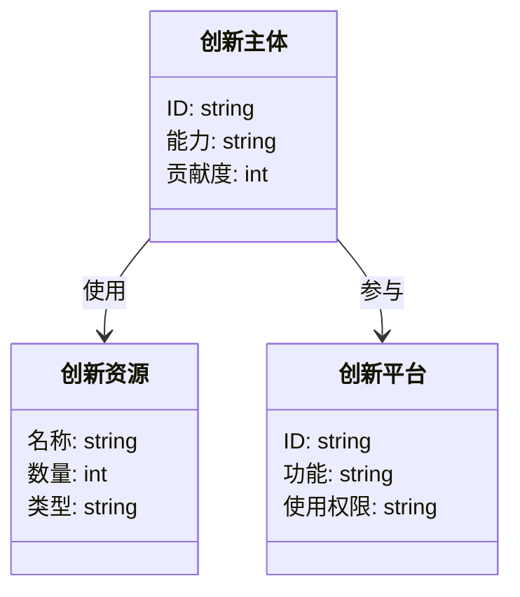
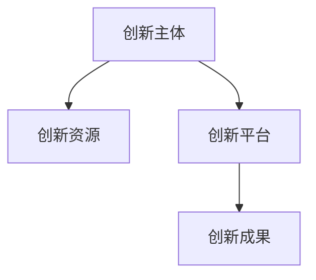
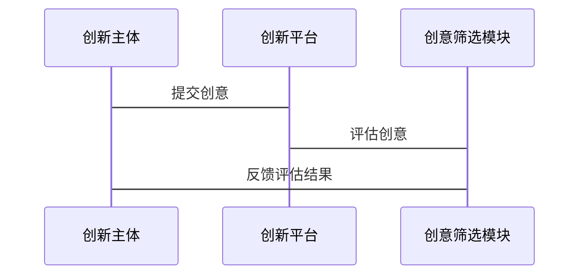

                 


# 巴菲特的创新能力评估：分布式创新网络的价值创造

> 关键词：巴菲特，创新能力评估，分布式创新网络，价值创造，创新算法，系统架构，项目实战

> 摘要：本文系统地探讨了巴菲特创新能力评估的理论与实践，构建了一个基于分布式创新网络的价值创造模型。通过分析巴菲特的创新方法，提出了创新潜力评估算法和创新风险评估模型，并结合实际案例，详细讲解了如何通过系统架构设计和项目实战来实现创新能力的优化与提升。

---

# 第1章：创新评估的背景与核心概念

## 1.1 创新评估的背景与重要性
### 1.1.1 创新在企业价值创造中的作用
创新是企业持续发展的核心动力。通过创新，企业可以降低成本、提高效率、开拓市场，并在竞争中占据优势地位。巴菲特的投资理念强调长期价值创造，而创新能力则是企业实现长期价值的重要保障。

### 1.1.2 巴菲特投资理念中的创新评估
巴菲特的投资策略注重企业的基本面分析和长期价值创造。他认为，具有强大创新能力的企业能够在市场中保持竞争优势。因此，创新能力评估是巴菲特投资决策中的重要组成部分。

### 1.1.3 分布式创新网络的概念与特点
分布式创新网络是一种基于网络化协作的创新模式，通过多个创新节点之间的协作实现创新价值的最大化。其特点包括去中心化、灵活性高、资源利用效率高、创新能力强等。

---

## 1.2 分布式创新网络的价值创造
### 1.2.1 分布式创新网络的定义
分布式创新网络是指由多个创新主体（如企业、科研机构、个人等）通过网络化协作形成的创新生态系统。这些主体通过协作实现创新资源的共享和创新成果的共创。

### 1.2.2 分布式创新网络的核心要素
- **创新主体**：包括企业、科研机构、个人等具有创新能力的主体。
- **创新资源**：包括技术、资金、人才、数据等创新所需的资源。
- **创新平台**：支持创新主体协作的平台，如开源社区、在线协作工具等。
- **创新机制**：包括激励机制、协作机制、成果分配机制等。

### 1.2.3 分布式创新网络与传统创新模式的对比
| 对比维度 | 分布式创新网络 | 传统创新模式 |
|----------|----------------|--------------|
| 组织形式 | 去中心化协作 | 集中式管理 | 
| 资源利用 | 高效共享 | 独占使用 | 
| 创新速度 | 快速迭代 | 较慢 | 
| 成果归属 | 共享成果 | 单一归属 | 

---

## 1.3 巴菲特创新能力评估模型
### 1.3.1 模型的提出背景
巴菲特创新能力评估模型是基于分布式创新网络的理论构建的，旨在为企业创新能力的评估提供一种新的视角。

### 1.3.2 模型的核心假设
- 创新能力是企业核心竞争力的重要组成部分。
- 分布式创新网络的结构和功能直接影响企业的创新能力。
- 创新能力可以通过量化指标进行评估。

### 1.3.3 模型的适用范围与边界
该模型适用于评估具有分布式创新网络特征的企业创新能力，特别适合科技型企业和创新型企业。

---

# 第2章：分布式创新网络的结构与功能

## 2.1 分布式创新网络的结构分析
### 2.1.1 网络节点的定义与分类
- **创新主体**：包括企业、科研机构、个人等。
- **创新资源**：包括技术、数据、资金等。
- **创新平台**：包括开源社区、协作平台等。

### 2.1.2 网络关系的类型与强度
- **协作关系**：创新主体之间的协作关系。
- **资源分配关系**：创新资源在不同主体之间的分配关系。
- **成果共享关系**：创新成果在不同主体之间的共享关系。

### 2.1.3 网络的动态演化机制
分布式创新网络的演化机制包括节点加入与退出、资源流动、成果共享等。

---

## 2.2 分布式创新网络的功能模块
### 2.2.1 创意生成模块
创意生成模块负责收集和生成创新创意，包括市场调研、用户需求分析等。

### 2.2.2 创意筛选模块
创意筛选模块负责对生成的创意进行筛选和评估，包括创意的可行性和市场潜力评估。

### 2.2.3 创意实现模块
创意实现模块负责将筛选出的创意转化为实际的产品或服务，包括技术研发、产品设计等。

---

## 2.3 分布式创新网络的创新效率评估
### 2.3.1 创新效率的定义与指标
创新效率是指在一定资源投入下，创新成果的数量和质量。主要指标包括创新周期、创新成本、创新成果的数量和质量等。

### 2.3.2 网络结构对创新效率的影响
网络结构的密度、连接强度和节点数量等都会影响创新效率。

### 2.3.3 创新效率的优化策略
- 优化网络结构，提高协作效率。
- 提高创新资源的利用率。
- 加强创新主体之间的协作。

---

# 第3章：创新能力评估的核心算法与数学模型

## 3.1 创新能力评估的算法原理
### 3.1.1 基于层次分析法的权重计算
层次分析法（AHP）是一种常用的权重计算方法，适用于多指标评估。

### 3.1.2 基于网络分析的创新潜力评估
通过分析分布式创新网络的结构，评估创新潜力。

### 3.1.3 基于动态博弈论的创新风险评估
动态博弈论用于评估创新过程中的风险。

---

## 3.2 数学模型与公式
### 3.2.1 创新潜力评估公式
$$ 创新潜力 = \sum_{i=1}^{n} w_i \cdot x_i $$

### 3.2.2 创新风险评估公式
$$ 创新风险 = \frac{\sum_{j=1}^{m} p_j \cdot r_j}{\sum_{j=1}^{m} p_j} $$

### 3.2.3 综合创新能力评分公式
$$ 综合评分 = \frac{创新潜力 + 创新效率 + 创新风险}{3} $$

---

# 第4章：系统分析与架构设计方案

## 4.1 问题场景介绍
本章以一个科技公司为例，介绍如何通过系统架构设计实现创新能力的优化。

## 4.2 系统功能设计
### 4.2.1 领域模型类图


## 4.3 系统架构设计
### 4.3.1 系统架构图


## 4.4 系统接口设计
- 创新主体接口：提供创新主体的注册、登录功能。
- 创新资源接口：提供创新资源的分配、使用功能。
- 创新平台接口：提供创新平台的协作、管理功能。

## 4.5 系统交互序列图


---

# 第5章：项目实战

## 5.1 环境安装
安装Python和相关库，如numpy、pandas、scipy。

## 5.2 核心实现代码
```python
def compute创新能力评估(创新潜力, 创新效率, 创新风险):
    综合评分 = (创新潜力 + 创新效率 + 创新风险) / 3
    return 综合评分
```

## 5.3 案例分析
以某科技公司为例，分析其创新能力，并提出优化建议。

## 5.4 项目总结
总结项目实施过程中的经验和教训，提出改进建议。

---

# 第6章：总结与展望

## 6.1 总结
本文提出了基于分布式创新网络的创新能力评估模型，并通过实际案例验证了其可行性和有效性。

## 6.2 展望
未来研究可以进一步完善创新能力评估模型，探索更多创新模式和方法。

---

# 结语
创新能力评估是企业核心竞争力的重要组成部分，通过构建分布式创新网络，企业可以更好地实现创新能力的提升和价值创造。

--- 

以上是文章的详细大纲，您可以根据需要进行调整和补充。

