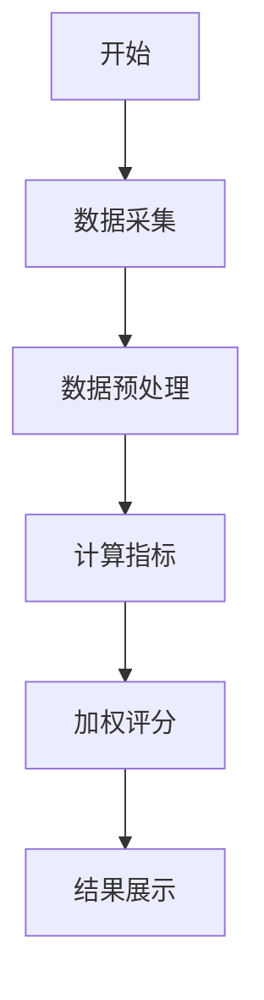
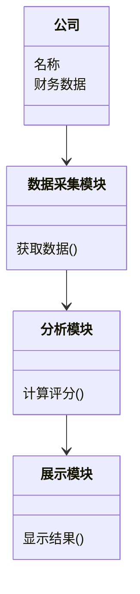

                 


# 巴菲特的创新能力评估：如何判断公司的长期竞争力

> 关键词：巴菲特，创新能力评估，长期竞争力，投资策略，创新评估模型

> 摘要：本文深入分析了巴菲特创新能力评估的核心原理，结合技术语言，详细讲解了如何通过创新能力评估来判断公司的长期竞争力。从背景介绍到系统设计，再到项目实战，全面阐述了创新能力评估的各个方面。

---

## 第一部分：背景介绍

### 1.1 巴菲特的投资理念

#### 1.1.1 价值投资的核心
巴菲特的价值投资理念强调长期投资，寻找具有持续竞争优势的公司。他注重公司的护城河和长期盈利能力，而非短期市场波动。

#### 1.1.2 创新能力的重要性
创新能力是公司持续发展和竞争优势的核心。创新能力强大的公司能够不断推出新产品、优化流程，从而在市场中保持领先地位。

#### 1.1.3 创新能力评估的目标
通过评估公司的创新能力，投资者可以识别出那些具备持续竞争优势的公司，从而做出更明智的投资决策。

---

## 第二部分：核心概念与联系

### 2.1 创新能力评估的核心原理

#### 2.1.1 创新能力的维度
创新能力可以从多个维度进行评估，包括技术创新能力、市场适应能力、组织创新能力等。每个维度都有其独特的评估指标。

#### 2.1.2 创新能力的数学模型
创新评分公式如下：
$$
\text{创新能力评分} = \sum (\text{各维度评分} \times \text{权重})
$$

### 2.2 创新能力评估的属性特征对比

#### 2.2.1 创新能力维度对比
| 维度         | 描述                           | 权重（%） |
|--------------|--------------------------------|------------|
| 技术创新     | 公司在技术研发上的投入与成果 | 30         |
| 市场适应     | 公司适应市场变化的能力         | 25         |
| 组织创新     | 公司内部管理与组织优化能力     | 20         |
| 知识产权     | 公司拥有的专利和知识产权       | 25         |

#### 2.2.2 实体关系图
```mermaid
er
actor 公司;
actor 创新能力;
company 创新能力;
company has_many 维度;
dimensions创新维度;
dimensions has_many 属性;
```

---

## 第三部分：算法原理

### 3.1 创新能力评估的数学模型

#### 3.1.1 加权评分系统
创新评分计算公式：
$$
\text{评分} = \sum (\text{指标值} \times \text{权重})
$$

#### 3.1.2 评分步骤
1. 数据采集：收集公司的财务数据和市场表现数据。
2. 数据预处理：清洗数据，填充缺失值。
3. 指标计算：计算各项创新指标，如ROE、毛利率等。
4. 加权评分：根据权重计算综合评分。

### 3.2 算法流程

#### 3.2.1 流程图


---

## 第四部分：系统分析与架构设计

### 4.1 问题场景介绍

#### 4.1.1 投资者需求
投资者需要快速、准确地评估公司的创新能力，以做出明智的投资决策。

#### 4.1.2 系统功能需求
系统需提供数据采集、分析、评分和结果展示功能。

### 4.2 系统功能设计

#### 4.2.1 功能模块
- 数据采集模块：从数据库或API获取公司数据。
- 分析模块：计算创新指标，生成评分。
- 展示模块：以图表形式展示评分结果。

#### 4.2.2 类图设计


---

## 第五部分：项目实战

### 5.1 环境安装

#### 5.1.1 Python安装
安装Python和必要的库（如Pandas、Matplotlib）。

### 5.2 核心代码实现

#### 5.2.1 数据处理代码
```python
import pandas as pd
import numpy as np

# 数据采集
data = pd.read_csv('company_data.csv')

# 数据预处理
data.dropna(inplace=True)
data['评分'] = 0

# 计算指标
for idx, row in data.iterrows():
    roe = row['ROE']
   毛利率 = row['毛利率']
    # 其他指标计算
    data.loc[idx, '评分'] = 0.3 * roe + 0.2 * 毛利率 + ...  # 根据权重计算
```

#### 5.2.2 评分计算代码
```python
def calculate_score(roa, roe,毛利率):
    score = 0.3 * roa + 0.2 * roe + 0.2 * 毛利率 + ...  # 根据权重计算
    return score

# 示例计算
example_roa = 0.15
example_roe = 0.2
example_margin = 0.3

score = calculate_score(example_roa, example_roe, example_margin)
print(f"创新能力评分为: {score}")
```

### 5.3 案例分析

#### 5.3.1 案例选择
以某公司为例，分析其创新能力评分。

#### 5.3.2 评分结果
假设评分结果为85分，说明该公司在创新能力方面表现优秀。

---

## 第六部分：最佳实践与总结

### 6.1 实践中的注意事项

- 数据来源的可靠性。
- 模型的局限性：评分可能受数据质量和权重影响。
- 持续优化模型：根据市场变化调整权重和指标。

### 6.2 小结

创新能力评估是判断公司长期竞争力的关键因素。通过系统的评估和分析，投资者可以更准确地识别出具备竞争优势的公司。

### 6.3 拓展阅读

推荐书籍：
- 《巴菲特的思维方式》
- 《创新者的窘境》

---

通过以上结构，文章系统地介绍了巴菲特创新能力评估的各个方面，从理论到实践，为读者提供了全面的指导。

