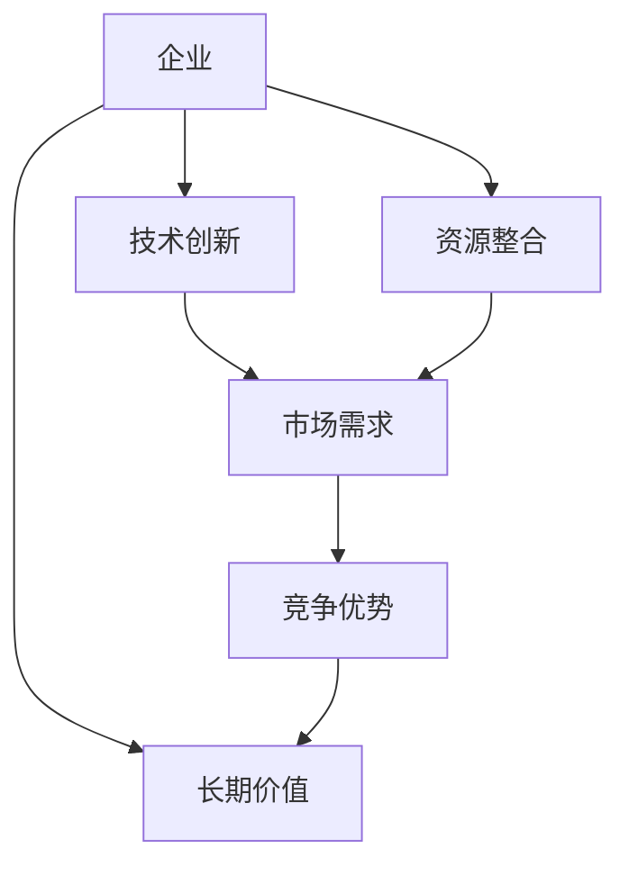
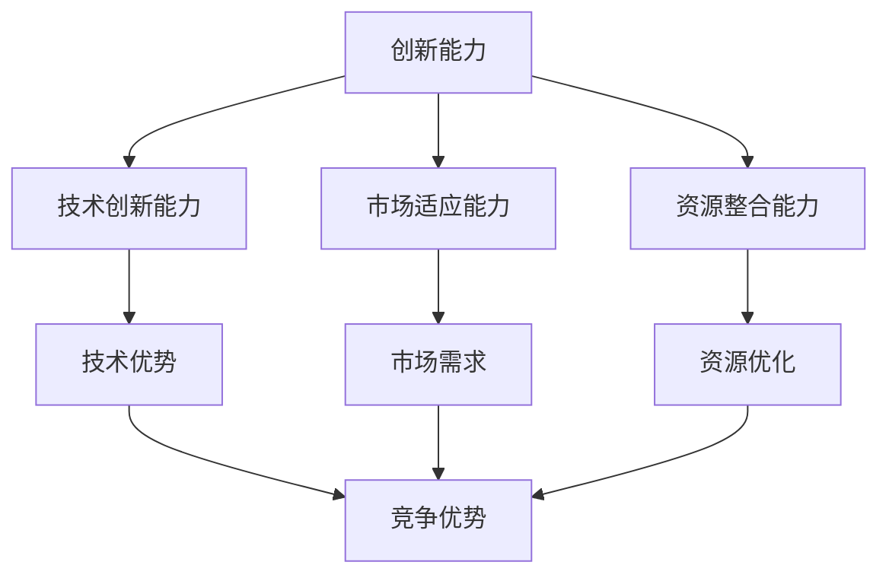
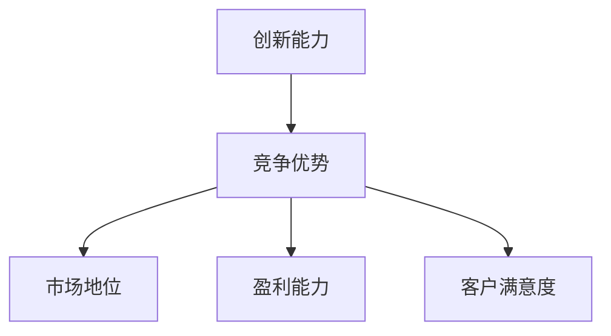

                 


# 巴菲特的创新能力评估：如何在快速变化的市场中保持领先

## 关键词：巴菲特，创新能力，投资策略，市场分析，竞争优势，价值投资

## 摘要：  
本文将探讨巴菲特的创新能力评估方法，分析其如何在快速变化的市场中保持领先地位。通过详细分析巴菲特的投资哲学、创新能力的核心要素、创新评估模型、竞争优势分析以及实际案例，本文将揭示如何在复杂多变的市场环境中，通过创新能力评估来制定有效的投资策略。同时，本文还将结合现代投资理论与技术分析，探讨创新能力评估在实际投资中的应用与优化。

---

## 第一部分: 巴菲特创新能力评估概述

### 第1章: 巴菲特创新理念与投资哲学

#### 1.1 巴菲特创新理念的背景

##### 1.1.1 投资市场的快速变化  
投资市场的核心特征之一是其动态性和不确定性。随着技术的进步、经济全球化以及政策的变化，市场参与者必须具备创新能力才能在竞争中立于不败之地。创新能力不仅是企业成功的关键，也是投资者在选择企业时需要重点关注的因素。  

##### 1.1.2 创新能力在投资中的重要性  
创新能力是企业在市场中保持竞争优势的核心因素。对于投资者来说，选择具有强大创新能力的企业，意味着投资的价值能够长期增长。巴菲特的创新能力评估方法，正是基于这一原则，通过分析企业的创新能力，筛选出具有长期竞争优势的企业。  

##### 1.1.3 巴菲特创新理念的核心要素  
- **持续性创新**：企业需要不断改进产品、服务或商业模式，以适应市场变化。  
- **竞争优势**：创新能力是企业竞争优势的核心来源。  
- **长期价值**：创新能力评估的最终目标是发现那些能够为股东创造长期价值的企业。  

#### 1.2 巴菲特的投资哲学

##### 1.2.1 价值投资的定义与特点  
价值投资是一种投资策略，强调以低于市场价值的价格购买具有内在价值的资产。巴菲特的价值投资哲学强调对企业内在价值的分析，而非短期市场波动的预测。  

##### 1.2.2 巴菲特的价值投资原则  
1. **寻找具有强大竞争优势的企业**：巴菲特倾向于投资那些在行业内具有明显竞争优势的企业。  
2. **关注企业的财务健康状况**：包括盈利能力、财务杠杆、现金流等指标。  
3. **长期投资**：巴菲特倡导长期投资，避免频繁交易，以降低交易成本并捕捉企业的长期增长潜力。  

##### 1.2.3 创新能力与价值投资的结合  
创新能力和企业竞争优势密切相关。巴菲特的价值投资策略中，创新能力是评估企业内在价值的重要组成部分。通过评估企业的创新能力，投资者可以更好地判断企业的长期增长潜力。  

#### 1.3 巴菲特创新思维的来源

##### 1.3.1 巴菲特的师承与思想演变  
巴菲特的投资哲学深受本杰明·格雷厄姆和菲利普斯·费雪的影响。格雷厄姆的价值投资理论为巴菲特提供了基础，而菲利普斯·费雪的成长股投资理念则启发了巴菲特对创新能力的关注。  

##### 1.3.2 巴菲特对市场的独特见解  
巴菲特认为，市场短期是投票机，长期是称重机。这意味着投资者应该关注企业的长期价值，而非短期市场波动。创新能力正是企业在长期市场中获胜的关键因素。  

##### 1.3.3 巴菲特创新理念的实践案例  
通过分析巴菲特的经典投资案例（如可口可乐、苹果等），我们可以看到，他对企业创新能力的高度重视。例如，巴菲特投资苹果公司，正是看中其在技术创新和市场扩展方面的持续能力。  

---

### 第2章: 巴菲特创新能力评估的核心概念

#### 2.1 创新能力的定义与特征

##### 2.1.1 创新能力的定义  
创新能力是指企业在产品、服务、技术、商业模式等方面进行创新的能力。它包括企业对市场需求的敏感性、技术创新能力以及资源整合能力等。  

##### 2.1.2 创新能力的核心特征对比表  
| 特征 | 创新能力 | 非创新能力 |
|------|----------|------------|
| 技术创新 | 频繁引入新技术 | 技术更新缓慢 |
| 市场适应性 | 快速适应市场变化 | 缓慢适应市场变化 |
| 竞争优势 | 通过创新巩固竞争优势 | 依赖传统竞争优势 |

##### 2.1.3 创新能力的实体关系图（Mermaid流程图）  


#### 2.2 巴菲特创新评估模型

##### 2.2.1 模型的构成与功能  
巴菲特创新能力评估模型由以下几个核心部分组成：  
1. **企业竞争优势分析**：评估企业的市场地位、技术优势、品牌影响力等。  
2. **财务健康状况分析**：包括盈利能力、现金流、资产负债率等指标。  
3. **管理团队能力**：评估企业管理层的创新能力与战略执行能力。  

##### 2.2.2 模型的数学表达式（LaTeX公式）  
创新能力评估模型可以用以下公式表示：  
$$ \text{创新能力} = f(\text{技术创新能力}, \text{市场适应能力}, \text{资源整合能力}) $$  
其中，技术创新能力、市场适应能力和资源整合能力是创新能力的关键影响因素。  

##### 2.2.3 模型的流程图（Mermaid图）  


#### 2.3 创新能力与企业竞争优势的关系

##### 2.3.1 创新能力是企业竞争优势的核心来源  
企业通过技术创新、产品创新和服务创新，可以建立独特的竞争优势。例如，苹果公司通过持续的技术创新，成功地将iPhone打造成全球最受欢迎的智能手机。  

##### 2.3.2 创新能力与企业竞争优势的关系图（Mermaid图）  


---

## 第二部分: 巴菲特创新能力评估工具与方法

### 第3章: 企业创新能力的系统分析

#### 3.1 企业创新能力的分析框架

##### 3.1.1 技术创新分析  
技术创新是企业创新能力的核心组成部分。通过分析企业的研发投入、技术创新速度以及技术专利数量，可以评估其技术创新能力。  

##### 3.1.2 市场适应性分析  
市场适应性分析包括对企业市场反应速度、产品生命周期管理能力的评估。  

##### 3.1.3 资源整合能力分析  
资源整合能力分析包括对企业内部资源优化配置能力以及外部资源整合能力的评估。  

#### 3.2 企业创新能力的数学模型

##### 3.2.1 创新能力指数计算公式  
$$ \text{创新能力指数} = \frac{\text{技术创新得分} + \text{市场适应得分} + \text{资源整合得分}}{3} $$  
其中，技术创新得分、市场适应得分和资源整合得分分别由相关指标评估得出。  

##### 3.2.2 创新能力指数评估表  
| 企业 | 技术创新得分 | 市场适应得分 | 资源整合得分 | 创新能力指数 |
|------|--------------|--------------|--------------|--------------|
| A    | 85           | 75           | 90           | 80           |
| B    | 70           | 80           | 85           | 78.33         |

---

### 第4章: 巴菲特创新评估的数学模型与算法

#### 4.1 创新能力评估的数学模型

##### 4.1.1 模型的构建  
$$ \text{创新能力评估} = \alpha \cdot \text{技术创新} + \beta \cdot \text{市场适应} + \gamma \cdot \text{资源整合} $$  
其中，$\alpha$、$\beta$、$\gamma$是各因素的权重系数。  

##### 4.1.2 模型的实现  
1. 收集企业的技术创新、市场适应和资源整合数据。  
2. 计算各因素的得分。  
3. 根据权重系数计算创新能力指数。  

#### 4.2 算法的实现与优化

##### 4.2.1 算法实现步骤  
```python
def calculate_innovation_capability(tech_score, market_score, resource_score, alpha, beta, gamma):
    return alpha * tech_score + beta * market_score + gamma * resource_score
```

##### 4.2.2 权重系数的优化  
通过历史数据分析和回归分析，可以优化权重系数，以提高创新能力评估的准确性。  

---

## 第三部分: 巴菲特创新能力评估的实践与应用

### 第5章: 巴菲特创新能力评估的实际案例分析

#### 5.1 巴菲特投资苹果的创新能力评估

##### 5.1.1 苹果公司的创新能力分析  
苹果公司以其持续的技术创新和产品创新能力著称。通过创新能力评估模型，我们可以发现苹果在技术创新、市场适应和资源整合方面均具有显著优势。  

##### 5.1.2 投资决策的优化  
通过创新能力评估，巴菲特可以更准确地判断企业的长期增长潜力，从而做出更明智的投资决策。  

#### 5.2 创新能力评估对投资组合优化的启示

##### 5.2.1 投资组合优化的策略  
通过创新能力评估，投资者可以筛选出具有长期竞争优势的企业，构建更具抗风险能力的投资组合。  

##### 5.2.2 投资组合优化的数学模型  
$$ \text{投资组合收益} = \sum_{i=1}^{n} w_i \cdot r_i $$  
其中，$w_i$是第$i$个资产的权重，$r_i$是第$i$个资产的预期收益率。  

---

## 第四部分: 结论与展望

### 第6章: 结论

#### 6.1 巴菲特创新能力评估的核心思想  
通过创新能力评估，投资者可以更好地识别具有长期竞争优势的企业，从而做出更明智的投资决策。  

#### 6.2 创新能力评估的未来展望  
随着科技的快速发展，创新能力评估在投资中的重要性将日益凸显。未来，投资者需要更加注重对企业创新能力的评估，以应对更加复杂多变的市场环境。  

### 第7章: 展望

#### 7.1 创新能力评估的未来研究方向  
1. 研究创新能力评估在不同行业中的适用性。  
2. 探讨创新能力评估与人工智能技术的结合。  
3. 探索创新能力评估在新兴市场中的应用。  

---

## 参考文献  
1. 巴菲特股东大会演讲（历年）。  
2. 《巴菲特传》。  
3. 《价值投资实战策略》。  

---

通过以上内容，我们可以清晰地看到，巴菲特创新能力评估不仅是价值投资的核心理念，也是应对快速变化市场环境的关键工具。未来，随着市场环境的进一步复杂化，创新能力评估的重要性将更加凸显，投资者需要不断优化其评估方法，以在竞争中保持领先地位。

