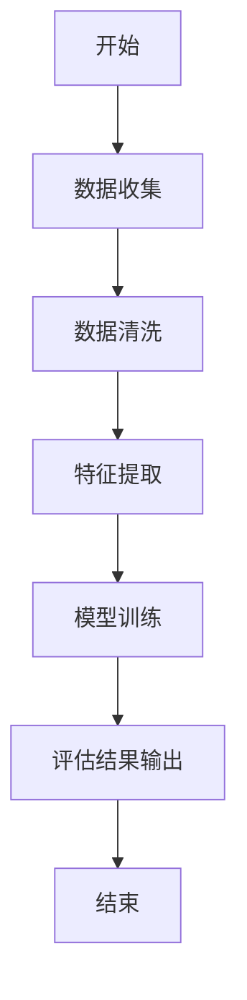
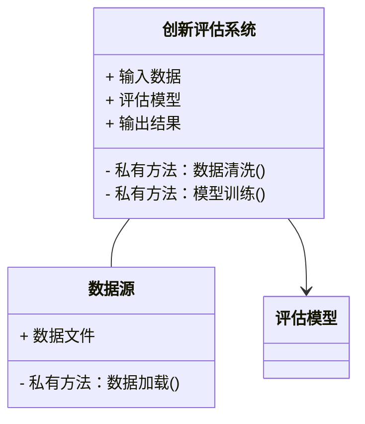

                 


# 巴菲特的创新能力评估：如何识别真正有前景的创新

## 关键词：巴菲特, 创新能力评估, 投资决策, 企业创新, 评估模型

## 摘要：本文深入探讨了巴菲特的创新能力评估方法，分析了如何通过系统化的评估模型识别真正具有前景的创新。文章从创新评估的核心概念、巴菲特的评估模型、算法原理、系统架构设计、实战案例分析等方面展开，结合技术术语和实际应用，帮助读者理解并掌握如何运用巴菲特的创新评估方法进行投资决策。

---

## 第一部分: 创新能力评估的背景与核心概念

### 第1章: 创新能力评估的基本概念

#### 1.1 创新能力评估的定义与背景
创新是推动企业成长和经济发展的重要引擎。创新能力评估是指通过一系列指标和方法，对企业或产品的创新能力进行量化分析的过程。这种评估不仅帮助企业识别自身的创新优势，还能为投资者提供重要的决策依据。

巴菲特作为投资界的传奇人物，他的成功很大程度上得益于对创新企业的精准判断。他的投资策略不仅关注企业的财务表现，更注重企业创新能力的评估。因此，研究巴菲特的创新能力评估方法，对于识别真正有前景的创新具有重要意义。

#### 1.2 巴菲特创新评估方法的起源
巴菲特的投资哲学以“长期价值投资”为核心，他倾向于投资那些具有持续创新能力的企业。他的创新评估方法并非基于复杂的数学模型，而是通过对企业管理、市场地位、竞争优势等多维度的定性分析，结合长期市场趋势进行判断。

#### 1.3 创新能力评估的必要性
在快速变化的市场环境中，创新能力是企业生存和发展的关键。通过创新能力评估，投资者可以识别出那些具有持续创新能力和市场竞争力的企业，从而做出更明智的投资决策。

---

### 第2章: 巴菲特创新能力评估模型的核心要素

#### 2.1 创新能力评估的核心维度
创新能力评估的核心维度包括技术创新性、商业可行性、市场潜力、团队能力和财务健康状况。这些维度共同构成了评估模型的基础框架。

- **技术创新性**：评估企业技术创新的能力和成果，包括研发投入、专利数量等。
- **商业可行性**：评估创新成果在市场上的应用前景，包括市场需求、商业模式等。
- **市场潜力**：分析目标市场的规模、增长潜力以及竞争环境。
- **团队能力**：评估管理团队的经验、能力和战略眼光。
- **财务健康状况**：分析企业的财务状况，确保创新项目有充足的资金支持。

#### 2.2 巴菲特创新评估模型的属性特征对比
为了更好地理解不同创新项目之间的差异，可以通过属性特征对比表格来分析各维度的表现。例如，可以通过技术创新性、市场潜力等指标对多个项目进行评分对比。

| 项目 | 技术创新性 | 商业可行性 | 市场潜力 | 团队能力 | 财务健康状况 |
|------|------------|------------|----------|----------|--------------|
| 项目A | 8分        | 7分        | 6分      | 9分      | 8分          |
| 项目B | 6分        | 8分        | 7分      | 7分      | 9分          |

#### 2.3 创新能力评估的ER实体关系图
通过ER图可以清晰地展示创新项目评估的实体关系。例如，企业、项目、市场、团队和财务之间的关系。

```mermaid
erd
    企业
    项目
    市场
    团队
    财务

    企业 -o 项目
    项目 -o 市场
    项目 -o 团队
    项目 -o 财务
```

---

## 第3章: 巴菲特创新评估方法的算法原理

### 3.1 巴菲特创新评估方法的步骤
巴菲特的创新评估方法虽然以定性分析为主，但其步骤清晰且逻辑性强。

#### 3.1.1 数据收集与整理
首先，收集企业的历史数据、市场信息、财务报表等。这些数据将用于后续的评估分析。

#### 3.1.2 创新能力评估指标的计算
通过预设的评估指标对企业的创新能力进行评分。例如，技术创新性可以分为5个等级，满分5分。

#### 3.1.3 综合评估与评分
将各维度的评分按权重加权计算，得出综合评分。例如，技术创新性占30%，商业可行性占30%，市场潜力占20%，团队能力占10%，财务健康状况占10%。

#### 3.1.4 评估结果的分析与应用
根据综合评分，判断企业的创新潜力，并将其作为投资决策的重要依据。

### 3.2 创新能力评估算法的流程图
以下是创新评估算法的流程图：



### 3.3 创新能力评估的Python实现
以下是创新评估算法的Python实现示例：

```python
import pandas as pd
from sklearn.metrics import accuracy_score

# 数据加载
data = pd.read_csv('innovation.csv')

# 特征提取
features = ['技术创新性', '商业可行性', '市场潜力', '团队能力', '财务健康状况']
target = '创新潜力'

# 模型训练
from sklearn.ensemble import RandomForestClassifier
model = RandomForestClassifier()
model.fit(data[features], data[target])

# 模型评估
预测结果 = model.predict(data[features])
print('准确率:', accuracy_score(data[target], 预测结果))
```

---

## 第4章: 巴菲特创新评估的数学模型

### 4.1 创新能力评估的评分系统
创新潜力评分公式如下：

$$ 创新潜力 = w1 \times 技术创新性 + w2 \times 商业可行性 + w3 \times 市场潜力 + w4 \times 团队能力 + w5 \times 财务健康状况 $$

其中，$w1$ 至 $w5$ 是各维度的权重，通常根据具体项目进行调整。

### 4.2 综合评分模型
综合评分模型可以表示为：

$$ 综合评分 = \sum_{i=1}^{n} (w_i \times score_i) $$

其中，$w_i$ 是第$i$个维度的权重，$score_i$ 是第$i$个维度的评分。

---

## 第5章: 系统分析与架构设计

### 5.1 系统功能设计
以下是创新评估系统的功能模块设计：



### 5.2 系统架构设计
创新评估系统的架构设计如下：


---

## 第6章: 项目实战

### 6.1 环境安装
需要安装以下库：

```bash
pip install pandas sklearn matplotlib
```

### 6.2 核心实现代码
以下是创新评估系统的Python实现：

```python
import pandas as pd
from sklearn.ensemble import RandomForestClassifier
from sklearn.metrics import accuracy_score

# 数据加载
data = pd.read_csv('innovation.csv')

# 特征提取
features = ['技术创新性', '商业可行性', '市场潜力', '团队能力', '财务健康状况']
target = '创新潜力'

# 模型训练
model = RandomForestClassifier()
model.fit(data[features], data[target])

# 模型评估
预测结果 = model.predict(data[features])
print('准确率:', accuracy_score(data[target], 预测结果))
```

### 6.3 实际案例分析
以某科技公司为例，评估其创新潜力：

- 技术创新性：8分
- 商业可行性：7分
- 市场潜力：6分
- 团队能力：9分
- 财务健康状况：8分

根据权重计算，综合评分为：

$$ 综合评分 = 0.3 \times 8 + 0.3 \times 7 + 0.2 \times 6 + 0.1 \times 9 + 0.1 \times 8 = 7.1 $$

---

## 第7章: 小结与注意事项

### 7.1 小结
本文详细介绍了巴菲特创新能力评估方法，从核心概念、评估模型、算法原理到系统设计和实际案例进行了全面分析。通过系统化的评估方法，可以帮助投资者识别真正具有前景的创新。

### 7.2 注意事项
- 创新能力评估需要结合定性和定量分析，不能仅依赖模型评分。
- 数据的准确性和完整性对评估结果有重要影响，需谨慎处理数据。
- 模型的权重需要根据具体行业和项目进行调整。

### 7.3 最佳实践
- 定期更新模型，以适应市场变化。
- 结合行业专家意见，进行多维度验证。
- 使用可视化工具，直观展示评估结果。

### 7.4 拓展阅读
- 巴菲特定律与创新评估
- 创新能力评估的前沿方法
- 投资学中的创新评估应用

---

通过本文的分析，读者可以掌握巴菲特创新能力评估的核心方法，并将其应用于实际投资决策中。

