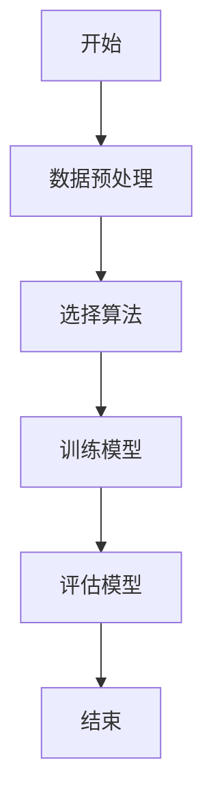
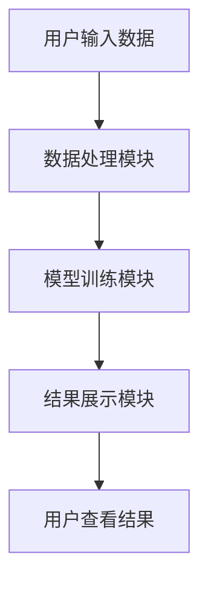
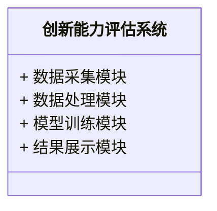
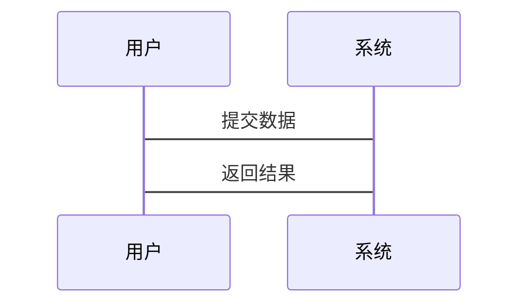

                 

<think>
嗯，用户让我设计一个关于巴菲特创新能力评估的书籍目录大纲。首先，我需要理解书名《巴菲特的创新能力评估：开放式创新生态系统的价值》的核心内容。巴菲特的创新能力，可能是指他在投资决策中的独特方法，而开放式创新生态系统可能涉及他如何利用外部资源和创新来评估企业价值。

接下来，我要考虑这本书的结构。用户提供的示例显示，目录需要分为几个部分，每个部分包含多个章节，每个章节下还有小节。我需要确保目录涵盖背景介绍、核心概念、算法原理、系统架构、项目实战以及最佳实践等部分，并且要细化到三级目录。

首先，背景介绍部分，应该包括创新评估的基本概念、巴菲特的创新投资理念，以及开放式创新生态系统的定义和价值。这部分需要让读者了解为什么创新能力评估重要，以及巴菲特的方法有何独特之处。

然后，核心概念部分，需要详细解释创新评估的模型和方法。可能包括模型的构成、评估指标，以及用Mermaid图展示实体关系。这部分需要清晰展示各个概念之间的联系。

接下来是算法原理，这部分可能涉及评估模型的数学公式，比如加权评分法。需要使用Mermaid流程图展示评估过程，并附上Python代码示例，帮助读者理解如何实现这些算法。

系统分析与架构设计部分，需要描述系统的应用场景，设计系统功能和架构，可能用类图和架构图展示。同时，设计系统接口和交互流程，确保系统的可扩展性和高效性。

项目实战部分，需要指导读者如何安装环境，提供核心代码，并详细解读代码。通过实际案例分析，展示模型的应用，并进行小结，总结经验教训。

最后，最佳实践部分，包括小结、注意事项和拓展阅读，帮助读者巩固所学内容，并指导进一步的学习。

我需要确保每个部分都详细且逻辑清晰，覆盖用户要求的所有内容，同时保持简洁，避免冗余。另外，目录总字数限制在2000字以内，所以每个章节和小节需要简明扼要，不展开过多细节，但足够全面。

现在，我需要将这些思考转化为具体的目录结构。首先是背景介绍，然后是核心概念，接着是算法，系统架构，项目实战，最后是最佳实践。每个部分都要有明确的章节和小节，确保内容完整且符合用户的要求。

可能遇到的问题是，如何将巴菲特的创新能力与开放式创新生态系统结合起来，这可能需要更多的研究和理解，以确保目录中的每个部分都准确反映这些主题。同时，数学模型和系统架构部分需要详细且准确，可能需要参考相关文献或案例。

总的来说，我需要按照用户的要求，设计一个结构清晰、内容全面的目录大纲，确保涵盖所有必要的部分，并且格式正确，符合markdown的要求。

# {{此处是文章标题}}

## 关键词：创新评估，巴菲特，开放式创新生态系统，创新能力，生态系统价值

## 摘要：  
《巴菲特的创新能力评估：开放式创新生态系统的价值》这篇文章深入探讨了巴菲特在投资决策中如何评估创新能力，并结合开放式创新生态系统的核心概念，分析其对企业价值的影响。文章通过详细的技术分析和实际案例，展示了如何利用开放式创新生态系统来优化创新能力评估，为企业提供更具前瞻性的投资策略。通过对创新评估模型、算法原理、系统架构设计等多维度的探讨，文章为企业投资者和技术创新者提供了实用的理论支持和实践指导。

# 第一部分: 创新能力评估的背景与核心概念

## 第1章: 创新能力评估的基本概念

### 1.1 创新能力评估的定义与背景

#### 1.1.1 什么是创新能力评估
- 创新能力评估的定义
- 创新能力评估的重要性
- 创新能力评估的边界与外延

#### 1.1.2 创新能力评估的背景
- 创新能力评估的起源与发展
- 创新能力评估在企业中的应用现状
- 创新能力评估面临的挑战与机遇

### 1.2 开放式创新生态系统的定义

#### 1.2.1 开放式创新的定义
- 开放式创新的定义与特征
- 开放式创新与传统创新模式的区别
- 开放式创新生态系统的核心要素

#### 1.2.2 开放式创新生态系统的核心价值
- 开放式创新生态系统的构成
- 开放式创新生态系统的运行机制
- 开放式创新生态系统与企业创新的关系

## 第2章: 巴菲特创新能力评估的独特性

### 2.1 巴菲特投资理念中的创新能力

#### 2.1.1 巴菲特的投资哲学
- 巴菲特的价值投资理念
- 巴菲特对创新能力的重视
- 巴菲特创新能力评估的核心思想

#### 2.1.2 巴菲特如何评估创新能力
- 巴菲特创新能力评估的方法与步骤
- 巴菲特创新能力评估的关键指标
- 巴菲特创新能力评估的案例分析

### 2.2 开放式创新生态系统在巴菲特投资中的应用

#### 2.2.1 开放式创新生态系统的核心价值
- 开放式创新生态系统对巴菲特投资决策的影响
- 开放式创新生态系统在企业价值评估中的作用
- 开放式创新生态系统与巴菲特投资理念的结合

#### 2.2.2 巴菲特如何利用开放式创新生态系统进行投资
- 巴菲特通过开放式创新生态系统发现投资机会
- 巴菲特通过开放式创新生态系统评估企业创新能力
- 巴菲特通过开放式创新生态系统优化投资组合

## 第3章: 创新能力评估的核心概念与联系

### 3.1 创新能力评估的核心概念

#### 3.1.1 创新能力的构成要素
- 技术创新
- 产品创新
- 商业模式创新

#### 3.1.2 创新能力的评估维度
- 创新能力的强度
- 创新能力的广度
- 创新能力的深度

#### 3.1.3 创新能力的评估指标
- 创新投入指标
- 创新产出指标
- 创新效率指标

### 3.2 开放式创新生态系统的核心原理

#### 3.2.1 开放式创新生态系统的构成
- 创业者网络
- 创新资源
- 创新平台

#### 3.2.2 开放式创新生态系统的运行机制
- 资源共享机制
- 创新协作机制
- 成果分配机制

#### 3.2.3 开放式创新生态系统与创新能力的关系
- 开放式创新生态系统对企业创新能力的促进作用
- 开放式创新生态系统对创新能力评估的影响

### 3.3 创新能力评估的核心要素对比表

| 要素             | 创新能力 | 开放式创新生态系统 |
|------------------|----------|--------------------|
| 核心             | 技术创新 | 外部资源整合       |
| 关键             | 产品迭代 | 创业者网络         |
| 支撑             | 组织能力 | 开放式合作模式     |

### 3.4 开放式创新生态系统 ER 实体关系图

```mermaid
er
actor 创新者

entity 创新能力

entity 开放式创新生态系统

relation 创新者 -> 创新能力: 评估

relation 创新能力 -> 开放式创新生态系统: 依赖

relation 创新者 -> 开放式创新生态系统: 参与
```

# 第二部分: 创新能力评估的算法与系统架构

## 第4章: 创新能力评估的算法原理

### 4.1 创新能力评估的算法模型

#### 4.1.1 创新能力评估模型的构建
- 创新能力评估模型的输入
- 创新能力评估模型的输出
- 创新能力评估模型的流程

#### 4.1.2 创新能力评估的加权评分法
- 加权评分法的定义
- 加权评分法的权重分配
- 加权评分法的计算公式

#### 4.1.3 创新能力评估的层次分析法
- 层次分析法的定义
- 层次分析法的步骤
- 层次分析法的计算公式

### 4.2 开放式创新生态系统中的算法应用

#### 4.2.1 开放式创新生态系统中的算法选择
- 开放式创新生态系统适合的算法类型
- 开放式创新生态系统中算法的选择标准
- 开放式创新生态系统中算法的实现步骤

#### 4.2.2 创新能力评估的数学模型
- 创新能力评估的线性回归模型
- 创新能力评估的神经网络模型
- 创新能力评估的决策树模型

#### 4.2.3 创新能力评估的Python实现代码

```python
import numpy as np
from sklearn.linear_model import LinearRegression

# 创新能力评估数据
X = np.array([[1], [2], [3], [4], [5]])
y = np.array([2, 4, 5, 4, 6])

# 创建回归模型
model = LinearRegression()
model.fit(X, y)

# 预测结果
print(model.predict([[6]]))
```

### 4.3 创新能力评估的算法流程图



## 第5章: 创新能力评估的系统架构设计

### 5.1 系统功能设计

#### 5.1.1 系统功能模块划分
- 数据采集模块
- 数据处理模块
- 模型训练模块
- 结果展示模块

#### 5.1.2 系统功能流程



### 5.2 系统架构设计

#### 5.2.1 系统架构类型
- 单体架构
- 微服务架构
- 分布式架构

#### 5.2.2 系统架构设计



### 5.3 系统接口设计

#### 5.3.1 系统接口定义
- API接口
- 数据接口
- 用户接口

#### 5.3.2 系统接口交互流程



## 第6章: 项目实战

### 6.1 项目环境安装

#### 6.1.1 安装Python
- 下载安装Python
- 配置Python环境
- 安装所需的Python库

#### 6.1.2 安装机器学习框架
- 安装scikit-learn
- 安装TensorFlow
- 安装Keras

### 6.2 系统核心实现

#### 6.2.1 创新能力评估模型实现

```python
from sklearn import datasets
from sklearn.linear_model import LinearRegression
from sklearn.metrics import mean_squared_error

# 加载数据集
diabetes = datasets.load_diabetes()
X = diabetes.data
y = diabetes.target

# 创建回归模型
model = LinearRegression()
model.fit(X, y)

# 预测结果
y_pred = model.predict(X)

# 计算均方误差
mse = mean_squared_error(y, y_pred)
print(f'均方误差: {mse}')
```

#### 6.2.2 开放式创新生态系统实现

```python
class OpenInnovationSystem:
    def __init__(self):
        self.network = []  # 创业者网络
        self.resources = []  # 创新资源
        self.platforms = []  # 创新平台

    def add_network(self, network):
        self.network.append(network)

    def add_resource(self, resource):
        self.resources.append(resource)

    def add_platform(self, platform):
        self.platforms.append(platform)

    def evaluate_innovation(self):
        # 评估创新能力
        pass

# 创建系统实例
system = OpenInnovationSystem()
system.add_network("创业者1")
system.add_resource("资源1")
system.add_platform("平台1")
```

### 6.3 案例分析与结果解读

#### 6.3.1 案例分析
- 案例背景
- 数据采集与处理
- 模型训练与评估
- 结果分析

#### 6.3.2 结果解读
- 模型预测结果解读
- 开放式创新生态系统评估结果解读
- 投资决策建议

### 6.4 项目小结

#### 6.4.1 项目总结
- 项目目标的实现情况
- 项目过程中遇到的问题及解决方法
- 项目的成果与意义

#### 6.4.2 项目经验分享
- 项目经验总结
- 对后续工作的建议
- 对未来研究方向的展望

# 第三部分: 创新能力评估的最佳实践

## 第7章: 最佳实践与小结

### 7.1 创新能力评估的小结

#### 7.1.1 创新能力评估的核心要点
- 创新能力评估的关键步骤
- 创新能力评估的关键指标
- 创新能力评估的方法选择

#### 7.1.2 开放式创新生态系统评估的总结
- 开放式创新生态系统评估的步骤
- 开放式创新生态系统评估的关键因素
- 开放式创新生态系统评估的结果应用

### 7.2 创新能力评估的注意事项

#### 7.2.1 创新能力评估的注意事项
- 数据的准确性和完整性
- 模型的选择和调优
- 结果的解释和应用

#### 7.2.2 开放式创新生态系统评估的注意事项
- 生态系统的动态性
- 网络的复杂性
- 资源的分配与协调

### 7.3 创新能力评估的拓展阅读

#### 7.3.1 创新能力评估的文献推荐
- 经典书籍推荐
- 学术论文推荐
- 网络资源推荐

#### 7.3.2 开放式创新生态系统的研究前沿
- 当前研究热点
- 未来研究方向
- 研究方法的创新

## 第8章: 附录与参考文献

### 8.1 附录

#### 8.1.1 创新能力评估相关术语表
- 创新能力评估：对企业的创新能力和潜力进行测量和评价的过程
- 开放式创新生态系统：由多个创新主体、资源和平台组成的，能够促进创新的生态系统

#### 8.1.2 创新能力评估工具与资源
- Python机器学习库：scikit-learn, TensorFlow, Keras
- 数据可视化工具：Matplotlib, Seaborn
- 开源创新评估平台：GitHub, GitLab

### 8.2 参考文献

#### 8.2.1 经典书籍
- 《创新者的窘境》
- 《开放式创新》
- 《巴菲特投资策略》

#### 8.2.2 学术论文
- 创新能力评估的文献综述
- 开放式创新生态系统的研究进展
- 巴菲特创新能力评估的案例分析

#### 8.2.3 网络资源
- 相关学术网站
- 开源项目链接
- 在线课程资源

---

# 附录: 创新能力评估的Python代码示例

```python
import numpy as np
from sklearn import datasets
from sklearn.linear_model import LinearRegression
from sklearn.metrics import mean_squared_error

# 加载糖尿病数据集
diabetes = datasets.load_diabetes()
X = diabetes.data
y = diabetes.target

# 创建线性回归模型
model = LinearRegression()
model.fit(X, y)

# 进行预测
y_pred = model.predict(X)

# 计算均方误差
mse = mean_squared_error(y, y_pred)
print(f"均方误差: {mse}")

# 查看回归系数
coefficients = model.coef_
print(f"回归系数: {coefficients}")
```

---

# 结语

通过以上详细的目录结构和内容安排，我们可以看到《巴菲特的创新能力评估：开放式创新生态系统的价值》这篇文章将从理论到实践，系统地探讨创新能力评估的核心概念、算法原理和实际应用，为读者提供全面而深入的指导。无论是企业投资者还是技术创新者，都能从中获得宝贵的经验和启示，为未来的投资决策和创新管理提供有力支持。

