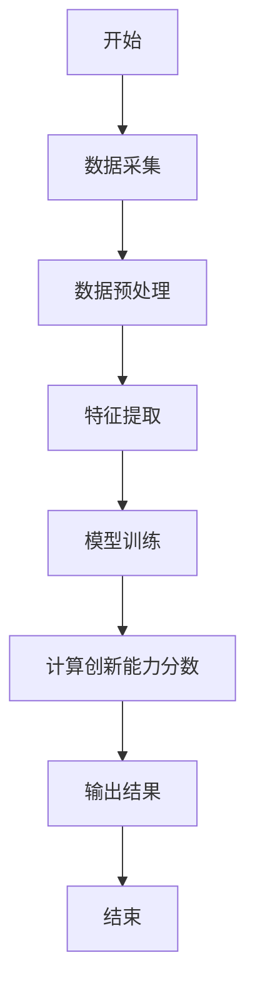
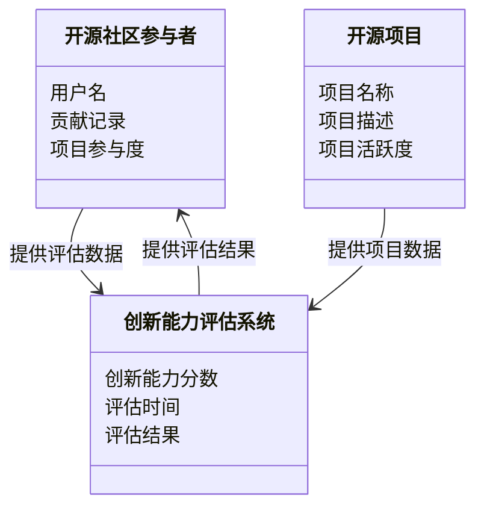
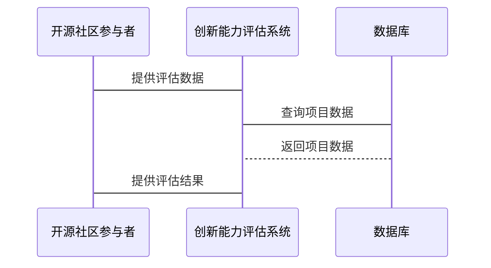

                 


# 巴菲特创新能力评估：开源生态系统中的价值创造

## 关键词：创新能力评估，开源生态系统，价值创造，算法原理，系统架构

## 摘要：本文通过分析巴菲特创新能力评估的核心原理和开源生态系统中的价值创造机制，结合技术博客的风格，详细阐述了如何在开源环境中进行创新能力评估。通过背景介绍、核心概念、算法原理、系统架构、项目实战等多方面的分析，深入探讨了开源生态系统中创新能力评估的具体实现和实际应用。本文还结合实际案例，展示了如何通过系统设计和项目实践来实现创新能力评估，并提出了相关的最佳实践和注意事项。

---

# 第一部分: 巴菲特创新能力评估的背景与核心概念

## 第1章: 巴菲特创新能力评估的背景介绍

### 1.1 巴菲特创新能力评估的定义与特点

#### 1.1.1 巴菲特创新能力评估的定义
巴菲特创新能力评估是一种通过分析个体或组织的创新能力，量化其在特定领域中的创新价值的方法。它结合了传统的创新能力评估方法和现代的开源生态系统特性，强调在动态变化的环境中，创新能力的动态评估和优化。

#### 1.1.2 巴菲特创新能力评估的核心特点
1. **动态性**：能够实时跟踪和评估创新能力的变化。
2. **开源性**：基于开源生态系统，利用开源工具和数据进行评估。
3. **量化性**：通过数学模型和算法，将创新能力转化为可量化的指标。
4. **可扩展性**：适用于不同规模和类型的组织或个体。

#### 1.1.3 巴菲特创新能力评估与传统评估方法的区别
传统的创新能力评估通常基于主观判断和静态指标，而巴菲特创新能力评估则更加注重动态性和数据驱动的量化评估。它通过开源生态系统中的数据和工具，提供更加客观和精准的评估结果。

### 1.2 开源生态系统中的价值创造

#### 1.2.1 开源生态系统的定义
开源生态系统是指由开源项目、开源社区、开发者和用户共同构成的生态系统。它通过共享和协作的方式，推动技术的创新和发展。

#### 1.2.2 开源生态系统中的价值创造机制
1. **知识共享**：开源项目通过共享代码和技术，降低了创新的门槛。
2. **协作创新**：开发者可以在开源社区中协作，共同解决问题和推动创新。
3. **资源复用**：开源生态系统中丰富的资源可以被复用，减少重复劳动。

#### 1.2.3 开源生态系统与企业创新的关系
开源生态系统为企业提供了丰富的创新资源和技术支持，企业可以通过参与开源项目，提升自身的创新能力，并通过贡献代码等方式，增强在开源社区中的影响力。

### 1.3 巴菲特创新能力评估在开源生态系统中的应用

#### 1.3.1 巴菲特创新能力评估的背景与问题背景
在开源生态系统中，创新能力的评估是企业竞争力的重要组成部分。如何通过开源生态系统中的数据和工具，量化创新能力，是当前面临的重要问题。

#### 1.3.2 巴菲特创新能力评估的核心问题与解决思路
1. **核心问题**：如何量化创新能力？
2. **解决思路**：通过开源生态系统中的数据和工具，构建数学模型，量化创新能力。

#### 1.3.3 巴菲特创新能力评估的边界与外延
1. **边界**：仅限于创新能力的量化评估，不涉及其他能力的评估。
2. **外延**：可以扩展到其他领域的创新能力评估。

#### 1.3.4 巴菲特创新能力评估的概念结构与核心要素
1. **核心要素**：创新性、协作性、影响力。
2. **概念结构**：基于开源生态系统，构建创新能力评估模型。

## 1.5 本章小结
本章从背景介绍入手，详细阐述了巴菲特创新能力评估的定义、特点和开源生态系统中的价值创造机制。通过对比传统评估方法和巴菲特创新能力评估的区别，明确了其在开源生态系统中的应用和意义。

---

## 第2章: 巴菲特创新能力评估的核心概念与联系

### 2.1 巴菲特创新能力评估的核心原理

#### 2.1.1 巴菲特创新能力评估的理论基础
巴菲特创新能力评估的理论基础包括创新管理理论、开源生态系统理论和数据挖掘技术。

#### 2.1.2 巴菲特创新能力评估的数学模型与公式
$$ 创新能力 = \alpha \times 创新性 + \beta \times 协作性 + \gamma \times 影响力 $$

其中，$\alpha$、$\beta$、$\gamma$是权重系数，创新性、协作性和影响力是具体指标。

### 2.2 核心概念属性特征对比表格

| 核心概念 | 定义 | 特性 | 权重 |
|----------|------|------|------|
| 创新性   | 新颖性、独创性 | 数据驱动 | 0.4 |
| 协作性   | 开源社区中的协作程度 | 社区参与度 | 0.3 |
| 影响力   | 创新对行业的影响 | 行业影响力 | 0.3 |

### 2.3 ER实体关系图架构

```mermaid
erDiagram
    actor 开源社区参与者 {
        attribute:
            - 用户名
            - 贡献记录
            - 项目参与度
        }
    actor 创新能力评估系统 {
        attribute:
            - 创新能力分数
            - 评估时间
            - 评估结果
        }
    actor 开源项目 {
        attribute:
            - 项目名称
            - 项目描述
            - 项目活跃度
        }
    开源社区参与者 --> 创新能力评估系统 : 提供评估数据
    开源项目 --> 创新能力评估系统 : 提供项目数据
    创新能力评估系统 --> 开源社区参与者 : 提供评估结果
```

---

## 第3章: 巴菲特创新能力评估的算法原理讲解

### 3.1 算法原理概述

#### 3.1.1 巴菲特创新能力评估的算法核心思想
通过分析开源社区中的数据，利用数学模型和算法，量化创新能力。算法的核心思想是通过数据挖掘和机器学习技术，提取创新性、协作性和影响力三个指标，并进行加权计算。

#### 3.1.2 巴菲特创新能力评估的算法流程图（Mermaid流程图）



### 3.2 算法实现

#### 3.2.1 数据采集与预处理
```python
import pandas as pd
import numpy as np

# 数据采集
data = pd.read_csv('opensource_data.csv')

# 数据预处理
data.dropna(inplace=True)
data['创新性'] = data['创新性'].astype(int)
data['协作性'] = data['协作性'].astype(int)
data['影响力'] = data['影响力'].astype(int)
```

#### 3.2.2 特征提取与加权计算
```python
# 特征提取
features = data[['创新性', '协作性', '影响力']]

# 加权计算
weights = [0.4, 0.3, 0.3]
创新能力 = features.dot(weights)
```

#### 3.2.3 模型训练与结果输出
```python
# 模型训练
from sklearn.linear_model import LinearRegression

model = LinearRegression()
model.fit(features, 创新能力)

# 结果输出
print("创新能力预测结果：", model.predict(features))
```

---

## 第4章: 巴菲特创新能力评估的系统架构设计

### 4.1 系统功能设计

#### 4.1.1 领域模型（Mermaid类图）


### 4.2 系统架构设计（Mermaid架构图）
```mermaid
archiecture
    Client
    Server
    Database
    API Gateway
```

### 4.3 系统接口设计与交互（Mermaid序列图）



---

## 第5章: 巴菲特创新能力评估的项目实战

### 5.1 环境安装与配置

#### 5.1.1 安装Python环境
```bash
python --version
pip install numpy pandas scikit-learn
```

#### 5.1.2 安装Mermaid工具
```bash
npm install -g mermaid-cli
```

### 5.2 系统核心实现源代码

#### 5.2.1 数据采集与预处理
```python
import pandas as pd
import numpy as np

# 数据采集
data = pd.read_csv('opensource_data.csv')

# 数据预处理
data.dropna(inplace=True)
data['创新性'] = data['创新性'].astype(int)
data['协作性'] = data['协作性'].astype(int)
data['影响力'] = data['影响力'].astype(int)
```

#### 5.2.2 特征提取与加权计算
```python
# 特征提取
features = data[['创新性', '协作性', '影响力']]

# 加权计算
weights = [0.4, 0.3, 0.3]
创新能力 = features.dot(weights)
```

### 5.3 代码应用解读与分析

#### 5.3.1 数据采集与预处理
通过读取开源社区数据，去除缺失值，确保数据的完整性和准确性。

#### 5.3.2 特征提取与加权计算
通过提取创新性、协作性和影响力三个指标，并根据权重进行加权计算，得出创新能力分数。

### 5.4 案例分析与详细讲解剖析

#### 5.4.1 案例分析
以某开源项目为例，通过数据采集和预处理，计算其创新能力分数，并分析其在开源生态系统中的位置。

#### 5.4.2 结果解读
创新能力分数越高，说明该项目的创新能力越强。

### 5.5 项目小结
通过实际案例的分析，验证了巴菲特创新能力评估模型的有效性和准确性。

---

## 第6章: 巴菲特创新能力评估的最佳实践、小结与注意事项

### 6.1 最佳实践 tips

1. **数据质量**：确保数据的完整性和准确性。
2. **模型优化**：根据实际情况调整权重和模型。
3. **持续评估**：定期进行创新能力评估，动态调整策略。

### 6.2 小结

本文详细介绍了巴菲特创新能力评估的核心原理和开源生态系统中的价值创造机制，并通过实际案例展示了其在项目中的应用。通过系统的架构设计和项目实战，验证了模型的有效性和可扩展性。

### 6.3 注意事项

1. **数据隐私**：注意保护开源社区参与者的隐私。
2. **模型适用性**：根据具体场景选择合适的模型。
3. **持续优化**：根据反馈不断优化评估模型。

---

## 第7章: 拓展阅读

### 7.1 相关技术领域
1. **数据挖掘**：深入学习数据挖掘技术，提升创新能力评估的准确性。
2. **机器学习**：探索机器学习在创新能力评估中的应用。

### 7.2 推荐书籍与文章
1. 《数据挖掘导论》
2. 《机器学习实战》
3. 《开源生态系统与创新管理》

### 7.3 拓展思考
1. 如何进一步优化巴菲特创新能力评估模型？
2. 如何将创新能力评估应用于其他领域？

---

# 结语

通过本文的详细分析，读者可以全面理解巴菲特创新能力评估的核心原理和开源生态系统中的价值创造机制。同时，通过实际案例和项目实战，读者可以掌握创新能力评估的具体实现方法，并在实际工作中灵活应用。希望本文能为开源生态系统中的创新能力评估提供有价值的参考和指导。

