                 


## 第四章: 开源硬件生态系统创新能力评估的系统架构设计

### 4.1 系统架构设计背景
在开源硬件生态系统中，创新能力的评估需要一个高效的系统架构来实现数据的采集、分析和评估。本章将详细探讨系统的架构设计，包括数据流、模块划分和接口设计。

### 4.2 系统功能设计
系统的功能模块包括数据采集、数据处理、创新能力评估和结果输出。每个模块都需要明确的功能定义和交互方式。

#### 4.2.1 数据采集模块
数据采集模块负责从开源硬件项目中获取相关数据，包括项目的代码量、贡献者数量、GitHubStars等指标。

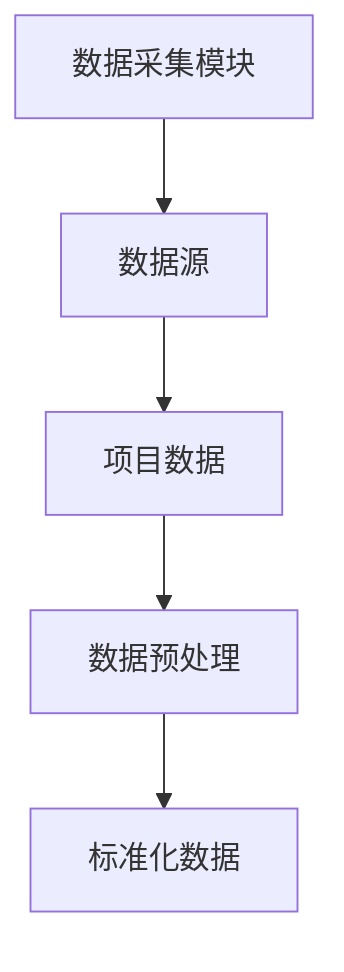

#### 4.2.2 数据处理模块
数据处理模块对采集到的数据进行清洗和预处理，确保数据的准确性和一致性。

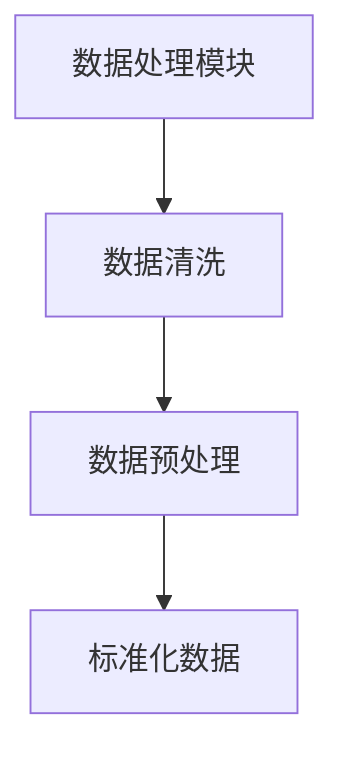

#### 4.2.3 创新能力评估模块
创新能力评估模块使用数学模型对预处理后的数据进行评估，计算出项目的创新能力得分。

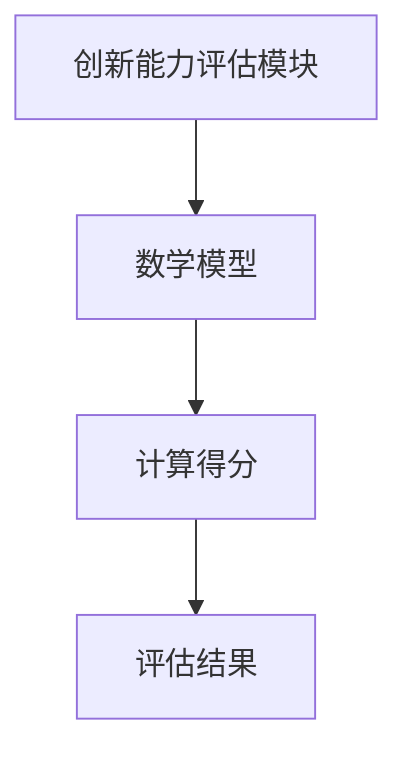

#### 4.2.4 结果输出模块
结果输出模块将评估结果以可视化的方式展示，便于用户理解和分析。

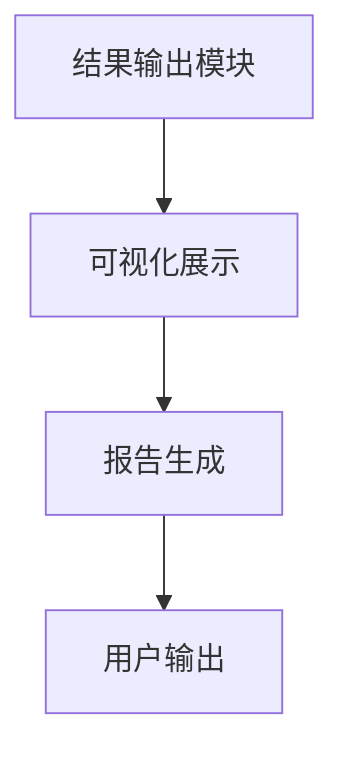

### 4.3 系统架构设计
系统的架构设计采用分层架构，包括数据层、业务逻辑层和表现层。

#### 4.3.1 数据层
数据层负责数据的存储和管理，包括数据库设计和数据接口定义。

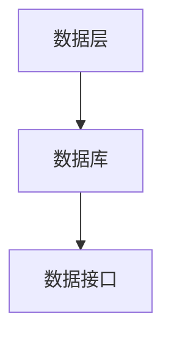

#### 4.3.2 业务逻辑层
业务逻辑层负责具体的评估逻辑实现，包括数据处理和模型计算。

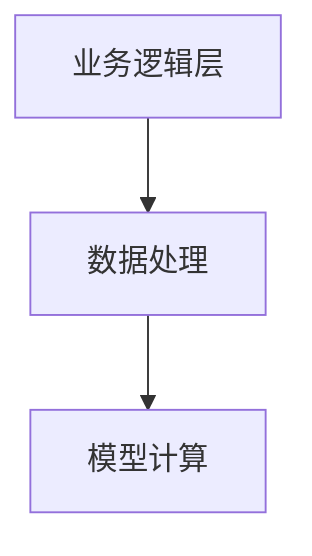

#### 4.3.3 表现层
表现层负责用户交互和结果展示，包括前端界面和结果输出。

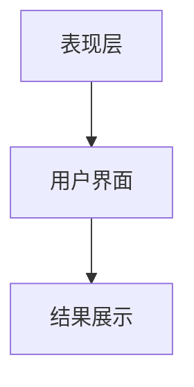

### 4.4 系统接口设计
系统接口设计需要明确各个模块之间的接口定义，确保模块之间的高效交互。

#### 4.4.1 数据接口
数据接口定义了数据采集和处理模块之间的数据交换格式和协议。

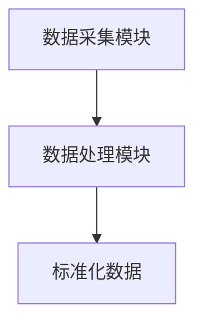

#### 4.4.2 模型接口
模型接口定义了创新能力评估模块与数据处理模块之间的交互方式。

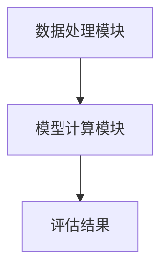

#### 4.4.3 输出接口
输出接口定义了结果输出模块与用户界面之间的数据交换方式。

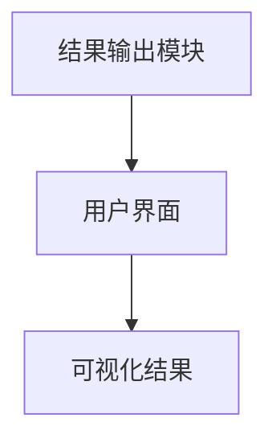

### 4.5 系统交互设计
系统交互设计描述了用户与系统之间的交互流程，包括数据输入、处理和结果输出。

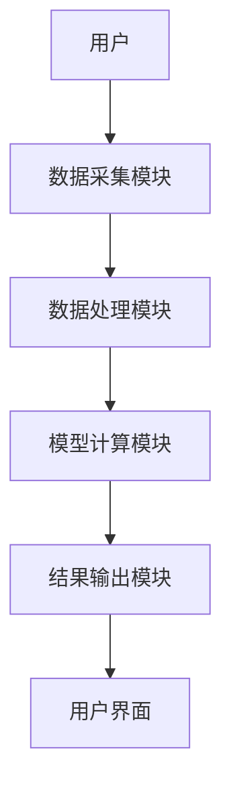

### 4.6 本章小结
本章详细探讨了开源硬件生态系统创新能力评估的系统架构设计，包括数据层、业务逻辑层和表现层的设计，以及系统接口和交互设计。通过合理的架构设计，可以确保评估系统的高效运行和准确评估。

---

## 第五章: 开源硬件生态系统创新能力评估的项目实战

### 5.1 项目选择与数据采集
选择一个具体的开源硬件项目（如Arduino）进行创新能力评估，首先需要采集相关的项目数据，包括项目的GitHub仓库数据、社区活跃度、贡献者数量等。

#### 5.1.1 项目数据采集代码
以下是一个使用Python的GitHub API库（如PyGitHub）进行数据采集的示例代码：

```python
from github import Github

# 初始化GitHub实例
g = Github("你的GitHub API令牌")

# 获取Arduino项目仓库
repo = g.get_repo("arduino/arduino")

# 获取项目数据
project_data = {
    "name": repo.name,
    "stars": repo.stargazers_count,
    "forks": repo.forks_count,
    "issues": repo.open_issues_count,
    "contributors": len(list(repo.get_contributors())),
    "updated_at": repo.updated_at
}

print(project_data)
```

### 5.2 数据预处理与分析
采集到的数据需要进行预处理和分析，提取关键指标用于创新能力评估。

#### 5.2.1 数据预处理代码
以下是一个数据预处理的Python代码示例：

```python
import pandas as pd

# 假设我们已经采集了多个项目的数据，存储在一个DataFrame中
data = {
    '项目名称': ['arduino', 'raspberry-pi', 'esp32'],
    'Stars': [40500, 32000, 28000],
    'Forks': [12000, 9000, 8000],
    'Issues': [2500, 1800, 1500],
    'Contributors': [50, 30, 25]
}

df = pd.DataFrame(data)
print(df)
```

### 5.3 创新能力评估与结果分析
使用前面的数学模型对项目进行创新能力评估，并分析评估结果。

#### 5.3.1 创新能力评估代码
以下是一个创新能力评估的Python代码示例：

```python
# 假设我们已经计算出项目的各项指标得分
def calculate创新能力评分(stars, forks, issues, contributors):
    # 定义各项指标的权重
    weights = {
        'Stars': 0.4,
        'Forks': 0.3,
        'Issues': 0.2,
        'Contributors': 0.1
    }
    
    # 计算创新能力评分
    创新能力评分 = (stars * weights['Stars'] +
                     forks * weights['Forks'] +
                     issues * weights['Issues'] +
                     contributors * weights['Contributors'])
    return 创新能力评分

# 使用示例数据进行计算
arduino_stars = 40500
arduino_forks = 12000
arduino_issues = 2500
arduino_contributors = 50

arduino创新能力评分 = calculate创新能力评分(arduino_stars, arduino_forks, arduino_issues, arduino_contributors)
print(f"Arduino创新能力评分: {arduino创新能力评分}")
```

### 5.4 项目评估结果与分析
根据评估结果，分析项目的创新能力，找出其优势和不足，并提出改进建议。

#### 5.4.1 示例分析
以Arduino为例，假设其创新能力评分为85分，说明其在开源硬件生态系统中的创新能力较高，但仍有提升空间。

### 5.5 本章小结
本章通过一个具体的开源硬件项目（Arduino）展示了创新能力评估的整个过程，包括数据采集、预处理、评估和结果分析。通过实际案例的分析，读者可以更好地理解评估方法的应用。

---

## 第六章: 开源硬件生态系统创新能力评估的总结与最佳实践

### 6.1 总结
本章总结了开源硬件生态系统创新能力评估的核心内容，包括评估方法、系统架构和项目实战。通过系统的评估方法，可以有效识别和衡量开源硬件生态系统的创新能力。

### 6.2 最佳实践
#### 6.2.1 数据收集建议
建议在数据收集过程中，确保数据的准确性和完整性，选择合适的指标和权重。

#### 6.2.2 模型优化建议
建议根据实际情况调整模型的权重和参数，以提高评估的准确性。

#### 6.2.3 系统设计建议
建议在系统设计中采用模块化设计，确保各模块的高效交互和系统的可扩展性。

### 6.3 小结
本章通过总结和最佳实践，为读者提供了在开源硬件生态系统中进行创新能力评估的实用建议和注意事项，帮助读者更好地应用这些方法。

---

## 附录: 开源硬件创新能力评估的工具与资源

### 附录A: 开源硬件项目推荐
以下是一些值得研究的开源硬件项目：
- Arduino（https://github.com/arduino/arduino）
- Raspberry Pi（https://github.com/raspberrypi/raspberrypi）
- ESP32（https://github.com/espressif/esp-idf）

### 附录B: 开源硬件创新能力评估工具
以下是一些常用的开源硬件创新能力评估工具和平台：
- GitHub API（https://github.com/github/developer GitHub API documentation）
- Git数据分析工具（如：GitPython）
- 数据可视化工具（如：Tableau、Power BI）
- 统计分析工具（如：Python的Pandas、Scikit-learn）

### 附录C: 参考文献
1. 巴菲特创新能力评估的相关文献
2. 开源硬件生态系统研究的相关文献
3. 软件架构设计的经典书籍
4. 数据分析与可视化的工具使用手册

---

## 关键词
- 开源硬件
- 创新能力评估
- 巴菲特能力圈
- 系统架构设计
- 项目实战

## 摘要
本文从开源硬件生态系统的角度，探讨了巴菲特创新能力评估的方法和应用。通过详细分析开源硬件生态系统的定义、核心概念、系统架构设计和项目实战，本文展示了如何将巴菲特的投资理念与技术创新相结合，为开源硬件生态系统的价值创造提供了新的视角和方法。

