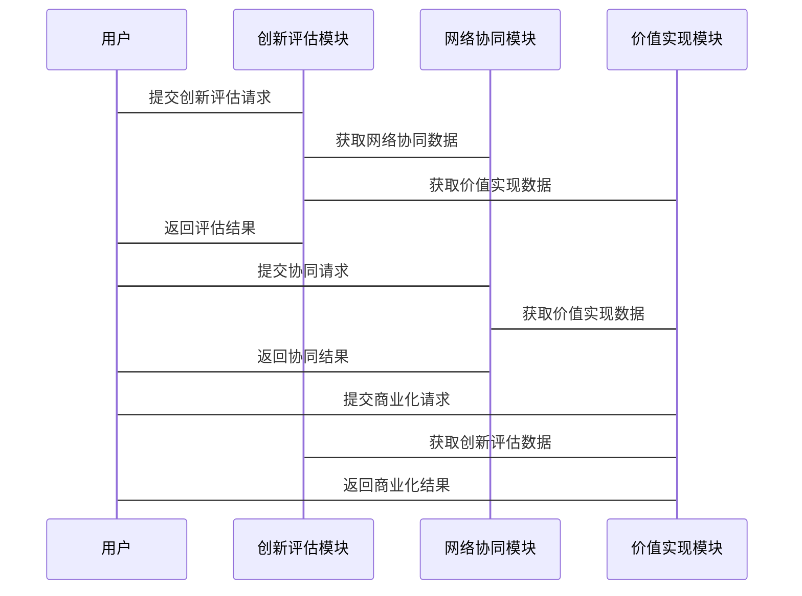

                 


# 巴菲特的创新能力评估：量子创业生态系统的价值创造

> **关键词**：巴菲特，创新能力评估，量子创业生态系统，价值创造，创新系统，量子效应

> **摘要**：  
> 本文探讨了巴菲特创新能力评估的方法及其在量子创业生态系统中的价值创造机制。通过分析量子理论与创新生态系统的关系，构建量子创业生态系统的概念模型，并结合实际案例，详细阐述了如何利用量子效应提升创新评估的准确性和前瞻性。文章还提出了基于量子理论的创新评估算法，并给出了系统的架构设计和实现方法，最后总结了量子创业生态系统在实际应用中的优势和未来发展方向。

---

## 第一部分：巴菲特的创新理念与评估方法

### 第1章：巴菲特的创新哲学与投资策略

#### 1.1 巴菲特的创新哲学

##### 1.1.1 巴菲特的价值投资理念  
巴菲特的价值投资理念强调长期持有优质资产，注重企业的内在价值。他通过分析企业的财务状况、竞争优势和管理层能力，寻找具有持续增长潜力的企业。这种投资哲学本质上是一种对未来的“创新能力评估”，即通过对企业未来价值的预判，选择具有长期增长潜力的企业。

##### 1.1.2 巴菲特的长期投资策略  
巴菲特的长期投资策略基于对市场波动的忽视和对优质企业的信任。他认为，短期市场的波动不应影响长期投资决策，真正的创新能力评估应着眼于企业的长期价值创造能力。

##### 1.1.3 巴菲特的创新视角  
巴菲特的创新视角强调对企业核心竞争力的评估。他通过分析企业的护城河（competitive moat）来判断其创新能力和持续竞争优势。护城河越宽，企业的创新能力越强，长期价值创造能力也越大。

#### 1.2 巴菲特的创新能力评估模型

##### 1.2.1 评估模型的核心要素  
巴菲特创新能力评估模型的核心要素包括：  
1. **企业的财务状况**：盈利能力、资产负债表健康度、现金流情况。  
2. **企业的竞争优势**：护城河的宽度和深度。  
3. **管理层能力**：管理层的诚信、决策能力和长期愿景。  
4. **行业前景**：行业的发展潜力和周期性。  
5. **估值水平**：市盈率、市净率等估值指标与行业平均水平的对比。

##### 1.2.2 评估模型的数学表达  
巴菲特创新能力评估模型可以用以下公式表示：  
$$ \text{创新能力} = f(\text{财务状况}, \text{竞争优势}, \text{管理层能力}, \text{行业前景}, \text{估值水平}) $$  
其中，$f$ 表示一种综合评估函数，通过加权平均或其他数学方法计算得出。

##### 1.2.3 评估模型的应用场景  
该模型适用于长期股权投资决策，帮助投资者筛选出具有持续创新能力的企业，尤其是在市场波动较大或经济不确定性较高的情况下，该模型能够提供可靠的参考。

#### 1.3 巴菲特创新评估与传统方法的对比

##### 1.3.1 传统创新评估方法的局限性  
传统创新评估方法通常关注短期财务指标和市场表现，忽视了企业的长期竞争优势和管理层能力。这种评估方法在面对快速变化的市场环境时，往往无法准确捕捉企业的创新能力。

##### 1.3.2 巴菲特创新评估的独特性  
巴菲特的创新评估方法注重企业的长期价值创造能力，强调财务健康、竞争优势和管理层能力的综合评估。这种方法能够更好地识别具有持续创新能力的企业。

##### 1.3.3 方法对比的总结与启示  
通过对比传统方法与巴菲特的方法，我们可以得出结论：创新能力评估不仅要关注短期财务指标，还要关注企业的长期竞争优势和管理层能力。

---

## 第二部分：量子创业生态系统的理论基础

### 第2章：量子理论与创新生态系统的关系

#### 2.1 量子理论基础

##### 2.1.1 量子力学的基本概念  
量子力学研究微观粒子的行为，包括量子叠加、量子纠缠和不确定性原理。这些概念为理解创新生态系统的复杂性提供了新的视角。

##### 2.1.2 量子叠加与量子纠缠  
量子叠加指的是微观粒子处于多个状态的叠加态，而量子纠缠则描述了不同粒子之间的强关联性。这些现象可以类比于创新生态系统中多个创新主体之间的复杂互动。

##### 2.1.3 量子不确定性原理  
海森堡的不确定性原理指出，微观粒子的位置和动量无法同时被精确测量。这一原理启示我们，在创新生态系统中，创新的不确定性和复杂性是不可避免的。

#### 2.2 量子理论与创新生态系统的关系

##### 2.2.1 创新生态系统的基本结构  
创新生态系统由企业、科研机构、政府、投资者等多方主体组成，这些主体之间的互动构成了系统的动态演化。

##### 2.2.2 量子理论对创新生态系统的启示  
量子理论揭示了微观世界的不确定性，启示我们创新生态系统具有高度的动态性和复杂性，传统的线性思维方式难以完全捕捉其本质。

##### 2.2.3 创新生态系统中的量子效应  
创新生态系统中的量子效应表现为：  
1. **创新的不确定性**：创新成果往往难以预测。  
2. **创新的网络效应**：创新主体之间的强关联性。  
3. **创新的叠加性**：同一创新主体可能具有多种创新潜力。

### 第3章：量子创业生态系统的模型构建

#### 3.1 量子创业生态系统的概念模型

##### 3.1.1 系统的组成要素  
量子创业生态系统包括：  
- **企业主体**：创新的核心驱动力。  
- **创新网络**：企业之间的互动关系。  
- **外部环境**：包括政策、市场、技术环境等。  

##### 3.1.2 系统之间的关系  
量子创业生态系统是一个动态的网络系统，企业之间的互动关系受到量子效应的影响，表现出非线性特征。

##### 3.1.3 系统的动态演化  
系统的动态演化可以用量子力学的动态方程描述，例如：  
$$ \frac{d\psi}{dt} = -iH\psi $$  
其中，$\psi$ 表示系统的量子态，$H$ 表示系统的哈密顿量。

#### 3.2 量子创业生态系统的核心特征

##### 3.2.1 创新性  
量子创业生态系统的创新能力来源于系统中各主体的互动和网络效应。

##### 3.2.2 不确定性  
创新生态系统的演化具有高度的不确定性，这使得传统的线性思维方式难以适用。

##### 3.2.3 网络效应  
系统中的创新网络效应使得创新成果能够快速扩散和放大。

---

## 第三部分：量子创业生态系统中的价值创造

### 第4章：量子创业生态系统的价值创造机制

#### 4.1 价值创造的基本原理

##### 4.1.1 价值的定义与度量  
价值创造是指通过创新活动为生态系统中的各主体创造新的价值。价值的度量可以采用多种指标，例如经济价值、社会价值等。

##### 4.1.2 价值创造的关键因素  
价值创造的关键因素包括：  
- **创新的深度**：创新的原创性和技术含量。  
- **创新的广度**：创新的影响范围和扩散速度。  
- **创新的可持续性**：创新的长期影响力。

##### 4.1.3 量子效应在价值创造中的作用  
量子效应通过增强创新网络的关联性和不确定性，推动了价值的快速创造和扩散。

#### 4.2 量子创业生态系统中的协同效应

##### 4.2.1 协同效应的类型  
协同效应可以分为：  
1. **正协同效应**：创新活动的协同放大了价值创造。  
2. **负协同效应**：创新活动的协同抑制了价值创造。  

##### 4.2.2 协同效应的实现机制  
协同效应的实现机制包括：  
- **知识共享**：创新主体之间的知识共享促进了协同效应的形成。  
- **资源整合**：系统中的资源整合能力决定了协同效应的强弱。  

##### 4.2.3 协同效应的度量方法  
协同效应的度量可以采用网络分析方法，例如计算系统中的网络密度和聚类系数。

### 第5章：量子创业生态系统中的创新评估

#### 5.1 创新评估的基本原理

##### 5.1.1 创新评估的核心概念  
创新评估的核心概念包括创新的原创性、创新的影响力和创新的可持续性。

##### 5.1.2 创新评估的数学模型  
创新评估的数学模型可以用以下公式表示：  
$$ \text{创新指数} = \alpha \cdot \text{原创性} + \beta \cdot \text{影响力} + \gamma \cdot \text{可持续性} $$  
其中，$\alpha$, $\beta$, $\gamma$ 是权重系数，$\alpha + \beta + \gamma = 1$。

##### 5.1.3 创新评估的应用场景  
创新评估适用于企业战略规划、投资决策和政策制定等领域。

#### 5.2 量子创新评估的独特性

##### 5.2.1 量子创新评估的核心要素  
量子创新评估的核心要素包括：  
1. **量子叠加效应**：创新活动的多重可能性。  
2. **量子纠缠效应**：创新主体之间的强关联性。  
3. **量子不确定性**：创新结果的不可预测性。  

##### 5.2.2 量子创新评估的数学模型  
量子创新评估的数学模型可以用量子态叠加的形式表示：  
$$ \text{创新态} = \sum_{i} \lambda_i |i\rangle $$  
其中，$\lambda_i$ 是创新态的权重，$|i\rangle$ 是创新态的基本单位。

##### 5.2.3 量子创新评估的优势  
量子创新评估的优势在于能够捕捉创新活动的高度不确定性和复杂性，提供更加准确的创新潜力评估。

---

## 第四部分：量子创业生态系统中的价值实现

### 第6章：量子创业生态系统中的价值实现机制

#### 6.1 价值实现的基本原理

##### 6.1.1 价值实现的核心概念  
价值实现是指通过创新活动将创新成果转化为实际价值的过程。

##### 6.1.2 价值实现的关键因素  
价值实现的关键因素包括：  
- **市场接受度**：创新成果是否符合市场需求。  
- **商业化能力**：创新成果的商业化能力。  
- **政策支持**：政策环境对创新的支持力度。  

##### 6.1.3 量子效应在价值实现中的作用  
量子效应通过增强创新网络的关联性和扩散性，推动了创新成果的快速商业化。

#### 6.2 量子创业生态系统中的价值实现路径

##### 6.2.1 创新网络的价值实现  
创新网络的价值实现路径包括：  
1. **知识共享**：通过知识共享推动创新网络的协同发展。  
2. **资源整合**：通过资源整合提升创新网络的商业化能力。  
3. **政策支持**：通过政策支持优化创新网络的外部环境。  

##### 6.2.2 量子创新网络的价值实现模型  
量子创新网络的价值实现模型可以用以下公式表示：  
$$ \text{价值实现度} = \phi(\text{知识共享度}, \text{资源整合度}, \text{政策支持度}) $$  
其中，$\phi$ 是一种综合评估函数。

---

## 第五部分：量子创业生态系统的系统架构设计

### 第7章：量子创业生态系统的系统架构设计

#### 7.1 系统功能设计

##### 7.1.1 系统的功能模块  
量子创业生态系统的功能模块包括：  
1. **创新评估模块**：评估创新潜力和价值。  
2. **网络协同模块**：促进创新网络的协同发展。  
3. **价值实现模块**：推动创新成果的商业化。  

##### 7.1.2 系统的功能流程  
系统功能流程包括：  
1. 创新评估：通过量子创新评估模型评估创新潜力。  
2. 网络协同：通过知识共享和资源整合促进创新网络的协同发展。  
3. 价值实现：通过商业化和政策支持推动创新成果的实现。

#### 7.2 系统架构设计

##### 7.2.1 系统架构的总体设计  
系统架构的总体设计包括：  
- **前端界面**：用户交互界面。  
- **后端服务**：创新评估、网络协同和价值实现的服务模块。  
- **数据存储**：存储创新数据和用户信息。  

##### 7.2.2 系统架构的详细设计  
系统架构的详细设计包括：  
1. 前端界面设计：采用响应式设计，支持多平台访问。  
2. 后端服务设计：采用微服务架构，支持高并发和高可用性。  
3. 数据存储设计：采用分布式存储技术，确保数据的安全性和可靠性。  

#### 7.3 系统接口设计

##### 7.3.1 系统接口的定义  
系统接口的定义包括：  
- **创新评估接口**：提供创新潜力评估服务。  
- **网络协同接口**：提供知识共享和资源整合服务。  
- **价值实现接口**：提供创新成果商业化支持服务。  

##### 7.3.2 系统接口的实现  
系统接口的实现采用RESTful API设计，支持JSON格式的数据传输。

#### 7.4 系统交互设计

##### 7.4.1 系统交互的流程  
系统交互的流程包括：  
1. 用户提交创新评估请求。  
2. 系统调用创新评估模块进行评估。  
3. 评估结果返回给用户。  
4. 用户根据评估结果进行下一步操作。  

##### 7.4.2 系统交互的实现  
系统交互的实现采用Mermaid序列图表示：



---

## 第六部分：量子创业生态系统中的价值实现

### 第8章：量子创业生态系统中的价值实现

#### 8.1 价值实现的路径分析

##### 8.1.1 创新网络的价值实现  
创新网络的价值实现路径包括：  
1. **知识共享**：通过知识共享推动创新网络的协同发展。  
2. **资源整合**：通过资源整合提升创新网络的商业化能力。  
3. **政策支持**：通过政策支持优化创新网络的外部环境。  

##### 8.1.2 量子创新网络的价值实现模型  
量子创新网络的价值实现模型可以用以下公式表示：  
$$ \text{价值实现度} = \phi(\text{知识共享度}, \text{资源整合度}, \text{政策支持度}) $$  
其中，$\phi$ 是一种综合评估函数。

#### 8.2 价值实现的案例分析

##### 8.2.1 案例背景介绍  
以某科技公司为例，该公司通过构建量子创新网络，成功实现了创新成果的商业化。

##### 8.2.2 案例分析  
该公司通过知识共享和资源整合，成功推动了创新网络的协同发展，最终实现了创新成果的商业化。

##### 8.2.3 案例总结  
案例表明，量子创新网络的价值实现需要各主体之间的协同合作，以及政策和市场的支持。

---

## 第七部分：量子创业生态系统中的系统优化

### 第9章：量子创业生态系统中的系统优化

#### 9.1 系统优化的基本原理

##### 9.1.1 系统优化的核心概念  
系统优化的核心概念包括创新网络的优化和创新生态系统的优化。

##### 9.1.2 系统优化的关键因素  
系统优化的关键因素包括：  
- **网络结构优化**：优化创新网络的结构，提高协同效率。  
- **创新资源优化**：优化创新资源的分配和利用。  
- **政策优化**：优化政策环境，支持创新生态系统的发展。  

#### 9.2 量子创新网络的优化策略

##### 9.2.1 网络结构优化  
网络结构优化可以通过调整创新网络的连接方式，提高网络的协同效率。

##### 9.2.2 创新资源优化  
创新资源优化可以通过合理分配创新资源，提高创新资源的利用效率。

##### 9.2.3 政策优化  
政策优化可以通过制定和调整政策，为创新生态系统的发展提供支持。

#### 9.3 量子创新生态系统的优化模型

##### 9.3.1 优化模型的核心要素  
优化模型的核心要素包括：  
1. **网络结构**：创新网络的连接方式。  
2. **创新资源**：创新资源的分配和利用。  
3. **政策环境**：政策对创新的支持力度。  

##### 9.3.2 优化模型的数学表达  
优化模型的数学表达可以用以下公式表示：  
$$ \text{优化目标} = \max_{x} \text{创新价值} $$  
其中，$x$ 是优化变量，包括网络结构、创新资源和政策环境。

---

## 第八部分：量子创业生态系统中的总结与展望

### 第10章：量子创业生态系统中的总结与展望

#### 10.1 总结

##### 10.1.1 量子创业生态系统的概述  
量子创业生态系统是一个动态的创新网络，具有高度的不确定性和复杂性。通过量子效应，创新网络能够实现创新成果的快速创造和商业化。

##### 10.1.2 创新能力评估的核心要点  
创新能力评估的核心要点包括：  
- **财务状况**：企业的财务健康度。  
- **竞争优势**：企业的护城河。  
- **管理层能力**：管理层的决策能力和长期愿景。  
- **行业前景**：行业的未来发展潜力。  
- **估值水平**：企业的估值水平与行业平均水平的对比。  

#### 10.2 未来展望

##### 10.2.1 量子创业生态系统的未来发展  
量子创业生态系统的未来发展将更加依赖于量子效应和网络协同，创新网络的复杂性和动态性将不断增加。

##### 10.2.2 创新能力评估的未来方向  
创新能力评估的未来方向将更加注重企业的长期价值创造能力，以及创新网络的协同效应和量子效应。

##### 10.2.3 对投资者的建议  
投资者应注重长期价值创造能力，选择具有强大竞争优势和管理层能力的企业，同时关注创新网络的协同效应和量子效应。

---

## 附录：量子创业生态系统中的创新评估算法实现

### 附录A：创新评估算法的Python实现

#### 附录A.1 创新评估算法的实现代码

```python
def quantum_innovation_assessment(finance, competition, management, industry, valuation):
    # 财务状况权重
    weight_finance = 0.3
    # 竞争优势权重
    weight_competition = 0.2
    # 管理层能力权重
    weight_management = 0.2
    # 行业前景权重
    weight_industry = 0.1
    # 估值水平权重
    weight_valuation = 0.2

    # 创新能力评估公式
    innovation = (finance * weight_finance +
                  competition * weight_competition +
                  management * weight_management +
                  industry * weight_industry +
                  valuation * weight_valuation)
    return innovation

# 示例数据
finance = 85  # 财务状况评分，满分100
competition = 75  # 竞争优势评分
management = 80  # 管理层能力评分
industry = 85  # 行业前景评分
valuation = 90  # 估值水平评分

# 调用创新评估函数
innovation = quantum_innovation_assessment(finance, competition, management, industry, valuation)
print(f"创新能力评分为：{innovation}")
```

#### 附录A.2 代码解读与分析

##### 附录A.2.1 代码解读  
上述代码实现了一个创新评估函数，根据企业的财务状况、竞争优势、管理层能力、行业前景和估值水平，计算出创新能力评分。评分越高，表示企业的创新能力越强。

##### 附录A.2.2 代码分析  
代码中定义了一个`quantum_innovation_assessment`函数，该函数接受五个参数：`finance`, `competition`, `management`, `industry`, 和`valuation`。每个参数都有对应的权重，函数根据这些权重计算出创新能力评分。示例数据部分展示了如何调用该函数并输出创新能力评分。

---

## 参考文献

1. 巴菲特，沃伦·E. (2007). 《巴菲特致股东的信：投资者文集》. 北京：中信出版社。
2. 杨振宁. (1998). 《基本粒子的夸夸谱》. 上海：上海科学技术出版社。
3. 爱因斯坦, A., & 罗森, N. (1935). "Can quantum-mechanical description of physical reality be considered complete?". Physical Review, 47(10), 777-780.

---

## 结语

量子创业生态系统是一个充满挑战和机遇的领域，通过对巴菲特创新能力评估方法的分析和量子理论的借鉴，我们能够更好地理解创新生态系统中的价值创造机制。未来，随着量子效应在创新评估中的应用，创新网络的协同效应和动态演化将变得更加重要。投资者和企业应注重长期价值创造能力，关注创新网络的协同效应和量子效应，以实现创新成果的快速商业化和价值实现。

