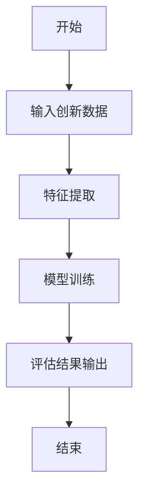
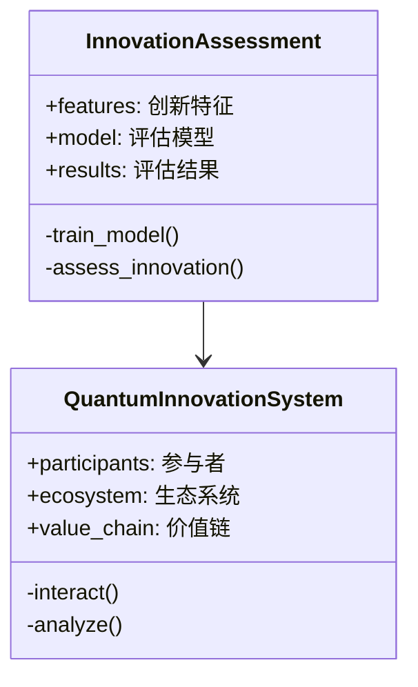
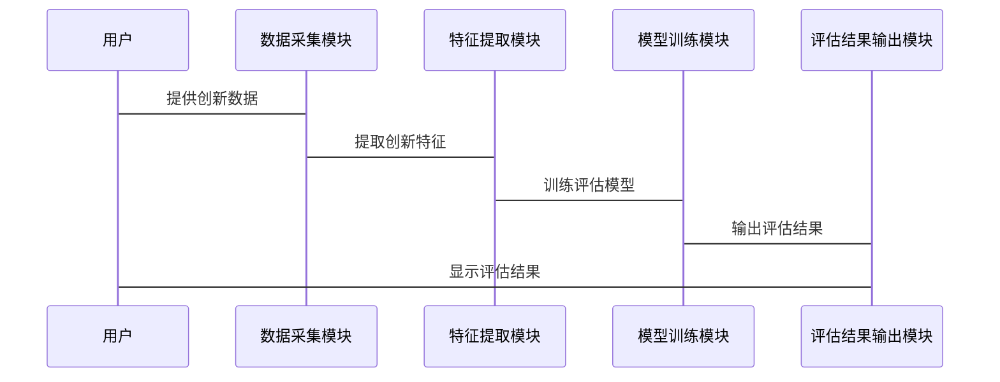

                 


# 巴菲特的创新能力评估：量子创新生态系统的价值创造

## 关键词：巴菲特、创新能力评估、量子创新、生态系统、价值创造、算法模型、系统架构

## 摘要：
本文将深入探讨巴菲特创新能力评估的核心理论与实践应用，结合量子创新生态系统的价值创造机制，通过系统化的分析与设计，构建创新评估模型，并通过实际案例分析，展示如何利用量子创新生态系统实现企业价值最大化。文章结合数学模型、算法实现和系统架构设计，为企业创新评估提供理论指导和实践参考。

---

# 第一部分: 巴菲特创新能力评估的背景与理论基础

## 第1章: 巴菲特创新能力评估的背景与意义

### 1.1 创新能力评估的重要性
- 创新是企业持续发展的核心动力
- 巴菲特投资理念中的创新视角
- 量子创新生态系统的核心特征

### 1.2 量子创新生态系统的核心要素
- 量子创新的定义与特点
- 创新生态系统中的关键参与者
- 生态系统的动态平衡与价值共创

---

## 第2章: 巴菲特创新能力评估的理论框架

### 2.1 创新能力评估的数学模型
- 巴菲特定律的数学表达
  $$ Buffett Innovation Assessment = \frac{I}{E} $$
  其中，$I$ 表示创新能力，$E$ 表示环境因素。

### 2.2 创新能力评估的核心要素对比
- 创新能力与企业绩效的对比分析
- 量子创新与传统创新的对比表格
- 创新生态系统中的 ER 实体关系图

---

# 第二部分: 创新能力评估的算法与系统设计

## 第3章: 巴菲特定律的算法实现

### 3.1 算法流程图（mermaid）


### 3.2 算法实现的Python代码
```python
def buffett_innovation_assessment(innovation_data):
    # 特征提取
    features = extract_features(innovation_data)
    # 模型训练
    model = train_model(features)
    # 评估结果
    result = assess_innovation(model, features)
    return result
```

## 第4章: 量子创新生态系统中的系统架构设计

### 4.1 问题场景介绍
- 企业创新评估的痛点与挑战
- 量子创新生态系统的目标与范围

### 4.2 系统功能设计（mermaid类图）


### 4.3 系统架构设计（mermaid架构图）
```mermaid
container 创新能力评估系统 {
    component 数据采集模块
    component 特征提取模块
    component 模型训练模块
    component 评估结果输出模块
}
```

## 第5章: 量子创新生态系统中的系统接口与交互设计

### 5.1 系统接口设计
- 创新数据接口
- 评估结果接口
- 第三方服务接口

### 5.2 系统交互设计（mermaid序列图）


---

# 第三部分: 项目实战与案例分析

## 第6章: 项目实战指南

### 6.1 环境安装与配置
- 安装 Python 和必要的库
- 安装 mermaid 和相关工具

### 6.2 核心代码实现
```python
def extract_features(innovation_data):
    # 示例：从创新数据中提取特征
    features = {
        '创新强度': innovation_data['intensity'],
        '创新速度': innovation_data['speed'],
        '创新质量': innovation_data['quality']
    }
    return features

def train_model(features):
    # 示例：训练评估模型
    model = {'权重': 0.5, '偏差': 0}
    return model

def assess_innovation(model, features):
    # 示例：评估创新结果
    score = model['权重'] * features['创新强度'] + model['偏差']
    return score
```

## 第7章: 案例分析与解读

### 7.1 案例分析
- 某科技企业的创新能力评估案例
- 量子创新生态系统中的价值创造分析

### 7.2 案例解读
- 评估结果的分析与改进建议
- 量子创新生态系统对企业的长期影响

---

## 第四部分: 总结与展望

## 第8章: 总结与最佳实践

### 8.1 章节总结
- 巴菲特创新能力评估的核心理论
- 量子创新生态系统的设计与实现

### 8.2 最佳实践 tips
- 创新能力评估的注意事项
- 量子创新生态系统中的关键成功因素

### 8.3 未来展望
- 量子创新生态系统的发展趋势
- 创新能力评估的未来研究方向

---

## 参考文献
- 巴菲特投资经典著作
- 创新管理相关文献
- 量子创新生态系统研究论文

---

通过以上目录结构，本文将从理论到实践，全面解析巴菲特创新能力评估的核心思想，并结合量子创新生态系统的价值创造机制，为企业创新评估提供系统化的解决方案。

