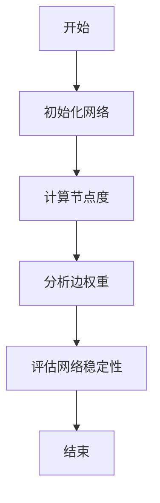
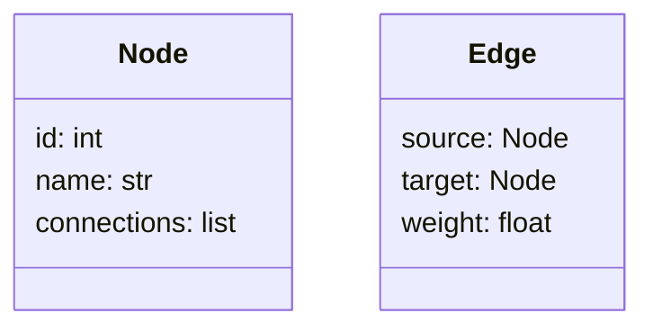
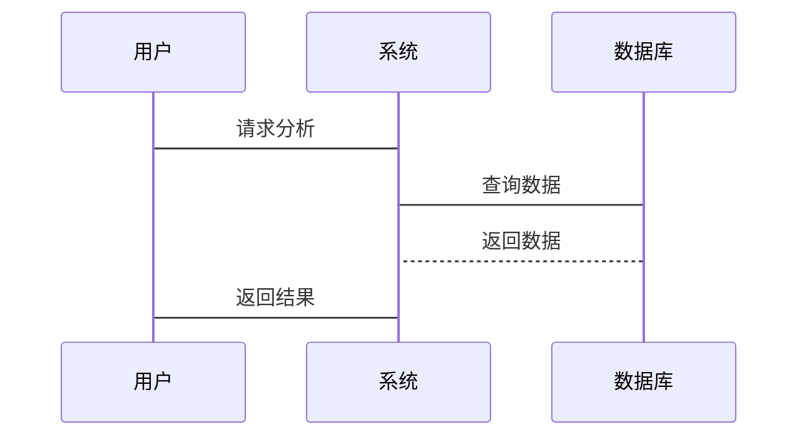

                 


# 巴菲特的创新能力评估：量子创新生态系统的价值网络分析

**关键词**：巴菲特、创新能力、量子创新、价值网络、生态系统、投资分析

**摘要**：  
本文从量子创新生态系统的视角，分析巴菲特创新能力的评估方法。通过构建价值网络模型，探讨巴菲特如何在投资决策中体现创新能力，并结合实际案例，提出量子创新生态系统的构建方法，为企业投资决策提供参考。

---

## 第一部分: 巴菲特创新能力评估的背景与基础

### 第1章: 巴菲特创新能力评估的背景介绍

#### 1.1 巴菲特创新理念的核心要素
##### 1.1.1 巴菲特投资哲学的演变
巴菲特的投资哲学从价值投资逐步扩展到创新能力评估。通过分析其投资决策，发现创新能力在其选择优质企业中的重要性。

##### 1.1.2 创新能力在投资决策中的作用
创新能力决定了企业的长期竞争优势，巴菲特通过评估企业的创新能力来判断其投资价值。

##### 1.1.3 价值网络的概念与意义
价值网络是连接企业内外资源的桥梁，通过分析价值网络，可以评估企业的创新能力。

#### 1.2 量子创新的基本概念
量子创新是一种超越传统线性创新的模式，通过量子效应实现创新的指数级增长。

#### 1.3 价值网络分析的理论基础
价值网络分析是一种基于图论的分析方法，用于评估企业内部和外部资源的连接性。

---

### 第2章: 量子创新生态系统概述

#### 2.1 量子创新的基本概念
量子创新是基于量子力学原理的一种创新模式，具有非线性和不确定性。

#### 2.2 量子创新与传统创新的对比
量子创新相比传统创新，具有更高的不确定性和指数级增长潜力。

#### 2.3 量子创新的核心特征
量子创新的核心特征包括：非线性增长、不确定性、资源的量子态连接等。

---

## 第二部分: 量子创新生态系统的核心概念与联系

### 第3章: 核心概念与联系的分析

#### 3.1 核心概念的原理
##### 3.1.1 巴菲特创新理念的数学模型
通过数学模型，量化创新能力的影响。

##### 3.1.2 量子创新的系统结构
量子创新系统结构可以用图论中的图模型表示。

##### 3.1.3 价值网络的动态关系
价值网络的动态关系可以用图论中的动态网络模型表示。

#### 3.2 核心概念的对比分析
##### 3.2.1 不同创新模式的特征对比
通过对比分析，发现量子创新的独特性。

##### 3.2.2 不同价值网络的属性分析
分析不同价值网络的属性，发现量子创新的特征。

##### 3.2.3 创新能力评估指标的对比
对比不同创新能力评估指标的优劣。

#### 3.3 ER实体关系图架构
```mermaid
erDiagram
    +---+             +---+       +---+
    |A  |<---+       |B  |       |C  |
    +---+             +---+       +---+
```

---

### 第4章: 巴菲特创新能力评估框架

#### 4.1 评估框架的构建
##### 4.1.1 评估目标的确定
明确评估的目标，例如识别具备量子创新能力的企业。

##### 4.1.2 评估指标的选择
选择适合的评估指标，例如创新能力、资源连接性等。

##### 4.1.3 评估方法的设计
设计适合的评估方法，例如基于图论的网络分析。

---

## 第三部分: 量子创新生态系统的算法原理

### 第5章: 量子创新网络分析算法

#### 5.1 算法原理
##### 5.1.1 数学模型
$$ G = (V, E) $$
其中，$ V $ 表示节点，$ E $ 表示边。

##### 5.1.2 算法流程


#### 5.2 代码实现
```python
import networkx as nx

def quantum_innovation_network_analysis(nodes, edges):
    G = nx.Graph()
    G.add_nodes_from(nodes)
    G.add_edges_from(edges)
    return G
```

#### 5.3 应用案例
通过实际案例，说明算法的应用和效果。

---

## 第四部分: 系统分析与架构设计

### 第6章: 量子创新生态系统架构设计

#### 6.1 问题场景介绍
量子创新生态系统是一个复杂系统，需要从多个维度进行分析。

#### 6.2 系统功能设计
##### 6.2.1 领域模型


#### 6.3 系统架构设计
##### 6.3.1 系统架构图


#### 6.4 系统接口设计
##### 6.4.1 接口设计
定义系统接口，例如REST API。

#### 6.5 系统交互
##### 6.5.1 交互流程图


---

## 第五部分: 项目实战

### 第7章: 项目实战

#### 7.1 环境配置
##### 7.1.1 安装依赖
安装必要的Python库，例如networkx。

#### 7.2 代码实现
##### 7.2.1 核心代码
实现量子创新网络分析的核心代码。

#### 7.3 案例分析
通过实际案例，展示系统的应用和效果。

#### 7.4 项目小结
总结项目实施的经验和教训。

---

## 第六部分: 总结与展望

### 第8章: 总结与展望

#### 8.1 总结
回顾全文，总结量子创新生态系统的重要性和应用价值。

#### 8.2 展望
展望未来，提出进一步的研究方向和实践建议。

---

通过以上内容，我们可以系统地分析和评估巴菲特的创新能力，并构建量子创新生态系统，为企业投资决策提供参考。

