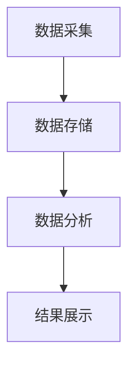

                 


# 巴菲特的创新能力评估：量子初创企业的价值创造潜力分析

## 关键词：巴菲特，创新能力评估，量子初创企业，价值潜力分析，技术驱动，投资策略

## 摘要：  
本文深入分析了巴菲特创新能力评估方法在量子初创企业中的应用，探讨了这些企业在技术驱动下的价值创造潜力。通过构建创新评估模型和数学价值评估模型，结合系统架构设计与项目实战，揭示了量子初创企业的创新特征和投资价值。本文为投资者和企业提供了实用的评估工具和策略建议。

---

## 第一部分：巴菲特创新能力评估的背景与基础

### 第1章：巴菲特创新能力评估概述

#### 1.1 巴菲特创新能力评估的定义与核心要素
- **1.1.1 创新能力评估的定义**  
  创新能力评估是指对企业在技术研发、产品设计、市场适应等方面的创新能力进行量化分析的过程。  
- **1.1.2 巴菲特创新能力评估的核心要素**  
  - **技术创新性**：企业的技术是否具有突破性和独特性。  
  - **市场适应性**：产品或服务是否能够满足市场需求并获得认可。  
  - **可持续性**：企业的技术是否具有长期发展潜力。  

#### 1.2 量子初创企业的定义与特征
- **1.2.1 量子初创企业的定义**  
  量子初创企业是指在量子计算、量子通信等新兴领域成立的初创公司。  
- **1.2.2 量子初创企业的创新特征**  
  - 技术驱动性强。  
  - 市场潜力巨大。  
  - 技术研发周期长。  

#### 1.3 价值创造潜力分析的重要性
- **1.3.1 价值创造潜力的定义**  
  价值创造潜力是指企业在未来一定时间内通过技术创新和市场拓展所能创造的经济价值。  
- **1.3.2 创新能力与价值创造的关系**  
  创新能力是价值创造的核心驱动力。  

---

### 第2章：巴菲特创新能力评估模型

#### 2.1 模型的核心原理
- **2.1.1 模型的构成**  
  巴菲特创新能力评估模型由技术创新性、市场适应性和可持续性三个核心维度组成。  

#### 2.2 模型的评估维度
- **2.2.1 创新能力维度**  
  - 技术研发投入占比：$R \leq 5\%$。  
  - 技术专利数量：$P \geq 10$ 项。  
- **2.2.2 市场潜力维度**  
  - 市场规模：$M \geq 10亿美元。  
  - 市场增长率：$G \geq 15\%$。  

#### 2.3 模型的评估框架
- **2.3.1 框架的组成部分**  
  - 数据收集：企业财务数据、专利数据、市场数据。  
  - 数据分析：使用量化指标进行综合评分。  

---

## 第二部分：量子初创企业的创新能力评估

### 第3章：量子初创企业的创新特征分析

#### 3.1 量子计算领域的创新特征
- **技术特征**：量子计算技术的突破性进展。  
- **市场特征**：市场需求快速增长。  

#### 3.2 其他新兴领域的创新特征
- **人工智能**：算法优化和数据处理能力提升。  
- **区块链**：去中心化技术的应用扩展。  

---

## 第三部分：创新能力评估的数学模型与算法原理

### 第4章：创新能力评估的数学模型

#### 4.1 价值评估模型
- **贴现现金流模型**：  
  $$ V = \sum_{t=1}^{n} \frac{CF_t}{(1 + r)^t} $$  
  其中，$CF_t$ 是第 $t$ 年的现金流，$r$ 是贴现率。  

#### 4.2 算法实现
- **步骤1**：数据预处理。  
- **步骤2**：模型训练。  
- **步骤3**：结果预测。  

---

## 第四部分：系统架构设计与项目实战

### 第5章：系统架构设计

#### 5.1 系统功能设计
- **功能模块**：数据采集、数据分析、结果展示。  

#### 5.2 系统架构设计


### 第6章：项目实战

#### 6.1 环境安装
- **Python环境**：安装 `numpy` 和 `pandas`。  

#### 6.2 核心代码实现
```python
import numpy as np
import pandas as pd

def calculate_value(R, P, M, G):
    V = 0
    for t in range(1, 10):
        CF_t = R * P * M * G
        V += CF_t / (1 + 0.1)**t
    return V
```

#### 6.3 案例分析
- **案例1**：量子计算初创企业的价值评估。  

---

## 第五部分：最佳实践与未来展望

### 第7章：最佳实践

#### 7.1 投资建议
- **关注技术创新性**：优先选择技术突破性强的企业。  
- **评估市场潜力**：选择市场规模大、增长率高的领域。  

### 第8章：未来展望

#### 8.1 量子技术的发展趋势
- **技术融合**：量子计算与人工智能的结合。  

#### 8.2 巴菲特投资策略的演变
- **技术驱动型投资**：未来投资将更加依赖技术创新能力。  

---

## 总结
本文通过分析巴菲特创新能力评估方法，结合量子初创企业的特征，构建了创新评估模型和价值评估模型。通过系统架构设计和项目实战，展示了如何将理论应用于实际。未来，随着量子技术的不断发展，创新能力评估将更加重要。

