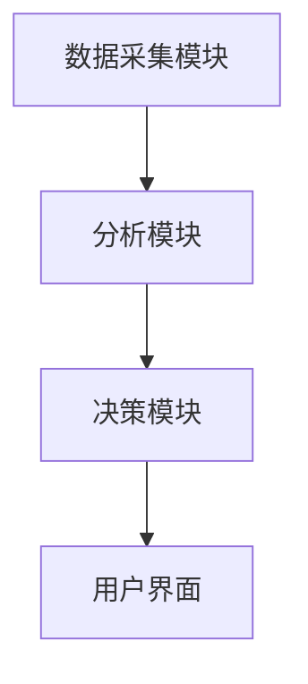
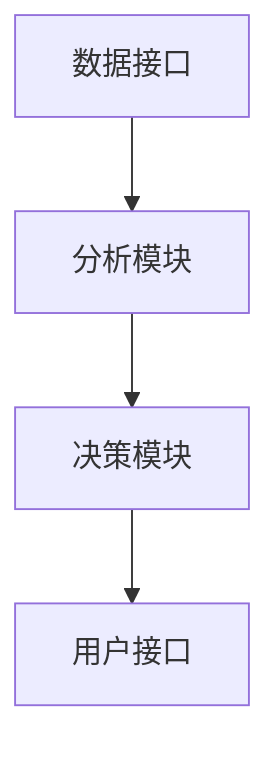

                 


# 巴菲特的周期性行业投资技巧：把握时机的艺术

> 关键词：巴菲特，周期性行业，投资技巧，市场时机，风险管理，价值投资

> 摘要：本文深入探讨巴菲特在周期性行业中的投资策略，分析其成功的秘诀，包括市场时机的选择、风险管理以及如何通过价值投资把握周期性行业的波动性。文章结合实际案例，为投资者提供实用的指导。

---

## 第1章：周期性行业的基本概念

### 1.1 周期性行业的定义与特点

周期性行业是指其需求和利润会随着经济周期波动而变化的行业。以下是周期性行业的核心特征：

- **经济敏感性**：周期性行业的产品需求通常与整体经济状况密切相关。在经济繁荣时期，需求增加；在衰退时期，需求下降。
- **波动性**：这些行业的收入和利润呈现周期性波动，波动幅度较大。
- **行业类型**：典型的周期性行业包括钢铁、汽车制造、能源和建筑材料等。

### 1.2 巴菲特与周期性行业的投资哲学

巴菲特的投资哲学以价值投资为核心，强调以合理价格投资优质企业。在周期性行业投资中，他关注企业的长期盈利能力、财务健康状况以及行业周期的位置。

#### 1.2.1 价值投资的核心理念

巴菲特的价值投资理念强调寻找那些被市场低估的优秀企业，长期持有，等待其内在价值的实现。在周期性行业中，这意味着在行业低谷期投资，等待其复苏。

#### 1.2.2 周期性行业的投资价值

周期性行业在经济繁荣期能够带来高回报，而在衰退期则可能面临巨大风险。巴菲特的成功在于他能够准确判断周期性行业的波动，并在低谷期进行布局。

---

## 第2章：巴菲特的投资策略与周期性行业分析

### 2.1 巴菲特的投资策略概述

巴菲特的投资策略强调对企业的深入研究和对市场时机的把握。在周期性行业中，他关注企业的财务状况、行业地位以及市场周期的位置。

#### 2.1.1 财务分析方法

巴菲特通过财务报表分析企业的盈利能力、偿债能力和现金流状况。以下是关键指标：

- **盈利能力**：ROE（净资产收益率）和净利润率。
- **偿债能力**：资产负债率和速动比率。
- **现金流**：自由现金流和现金流总量。

### 2.2 周期性行业的系统分析与架构设计

周期性行业的系统分析包括对行业生命周期、竞争结构和政策环境的分析。以下是系统架构设计的关键步骤：

1. **行业生命周期分析**：判断行业所处的阶段（导入期、成长期、成熟期、衰退期）。
2. **竞争结构分析**：分析行业内竞争者的数量、市场集中度、进入壁垒等。
3. **政策与经济环境分析**：考虑政府政策、经济周期对行业的影响。

---

## 第3章：巴菲特的周期性行业投资实践

### 3.1 经典投资案例分析

#### 3.1.1 钢铁行业的投资案例

巴菲特在2008年金融危机期间投资了钢铁公司，利用行业的低谷期进行布局，等待经济复苏带来的价值回升。

#### 3.1.2 石油行业的投资案例

石油行业受油价波动影响较大，巴菲特通过长期投资优质石油公司，在油价回升时实现收益。

### 3.2 市场时机选择策略

#### 3.2.1 市场周期的判断方法

巴菲特通过分析宏观经济指标（GDP增长率、失业率、通货膨胀率）和市场情绪指标（投资者情绪、市场估值）来判断市场周期的位置。

#### 3.2.2 市场拐点的识别技巧

巴菲特关注市场的极端情绪，如市场的恐慌和贪婪，利用市场的非理性波动进行投资。

### 3.3 风险管理与投资组合优化

#### 3.3.1 风险管理原则

- **分散投资**：将资金分配到不同行业和资产类别，降低风险。
- **止损策略**：设定止损点，避免重大损失。

#### 3.3.2 投资组合优化

- **资产配置**：根据市场周期调整资产配置比例，如在经济衰退期增加防御性资产的配置。
- **动态再平衡**：定期审视投资组合，根据市场变化进行调整。

---

## 第4章：周期性行业的系统分析与架构设计

### 4.1 周期性行业的系统分析

周期性行业的系统分析需要考虑多个因素，包括市场需求、供应能力、价格波动和行业竞争等。以下是系统分析的步骤：

1. **需求分析**：确定行业的市场需求弹性，分析消费者行为。
2. **供应分析**：研究行业的生产能力、成本结构和供应商集中度。
3. **价格分析**：分析价格波动对行业利润的影响。

### 4.2 周期性行业的架构设计

架构设计的目标是构建一个能够适应市场波动的系统，以下是关键步骤：

1. **数据采集模块**：收集宏观经济指标、行业数据和市场信息。
2. **分析模块**：利用数据分析工具进行周期性分析和预测。
3. **决策模块**：根据分析结果制定投资策略。

### 4.3 系统接口与交互设计

系统接口设计需要考虑数据流的高效传输和模块间的有效交互。以下是关键点：

- **数据接口**：定义数据格式和接口协议，确保模块之间的数据互通。
- **交互流程**：设计用户友好的交互界面，方便用户进行数据输入和查询。

---

## 第5章：项目实战——基于巴菲特周期性行业投资技巧的策略开发

### 5.1 环境安装与数据准备

#### 5.1.1 环境安装

安装必要的软件和工具，如Python、Pandas、Matplotlib等，用于数据处理和可视化。

#### 5.1.2 数据准备

收集相关的宏观经济数据、行业数据和市场信息，清洗数据并进行预处理。

### 5.2 系统核心实现源代码

以下是一个简单的周期性行业投资策略的Python代码示例：

```python
import pandas as pd
import matplotlib.pyplot as plt

# 数据加载
data = pd.read_csv('industry_data.csv')

# 绘制行业周期图
plt.figure(figsize=(10, 6))
plt.plot(data['Year'], data['Revenue'], label='Revenue')
plt.plot(data['Year'], data['Cost'], label='Cost')
plt.xlabel('Year')
plt.ylabel('Value')
plt.title('Industry Cycle Analysis')
plt.legend()
plt.show()
```

### 5.3 实际案例分析

通过分析具体的市场周期，如2008年金融危机，展示如何利用巴菲特的投资策略进行投资。

---

## 第6章：数学模型与算法原理

### 6.1 周期性行业的数学模型

周期性行业的分析可以通过时间序列分析和波动率模型进行。以下是常用的数学模型：

1. **ARIMA模型**：用于预测未来的市场趋势。
2. **GARCH模型**：用于估计市场波动率。

### 6.2 算法实现

以下是一个简单的ARIMA模型的Python代码示例：

```python
from statsmodels.tsa.arima_model import ARIMA

# 数据加载
data = pd.read_csv('industry_data.csv')

# 模型训练
model = ARIMA(data['Revenue'], order=(1, 1, 1))
model_fit = model.fit()

# 预测未来值
forecast = model_fit.forecast(steps=5)
print(forecast)
```

---

## 第7章：系统架构与接口设计

### 7.1 系统架构设计

系统架构包括数据采集模块、分析模块和决策模块，以下是系统架构图：



### 7.2 系统接口设计

系统接口设计包括数据接口和用户接口，以下是接口设计图：



---

## 第8章：总结与未来展望

### 8.1 总结

本文深入探讨了巴菲特在周期性行业的投资策略，分析了其成功的秘诀，并提供了实用的指导。通过系统分析和实际案例，展示了如何在周期性行业中把握时机，实现长期收益。

### 8.2 未来展望

随着市场的变化和技术的发展，周期性行业的投资策略也在不断演变。未来，投资者需要更加关注技术进步、政策变化和全球经济趋势，以应对新的挑战和机遇。

---

通过以上结构和内容的详细分析，读者可以全面理解巴菲特的周期性行业投资技巧，并能够在实际投资中灵活运用这些策略。

