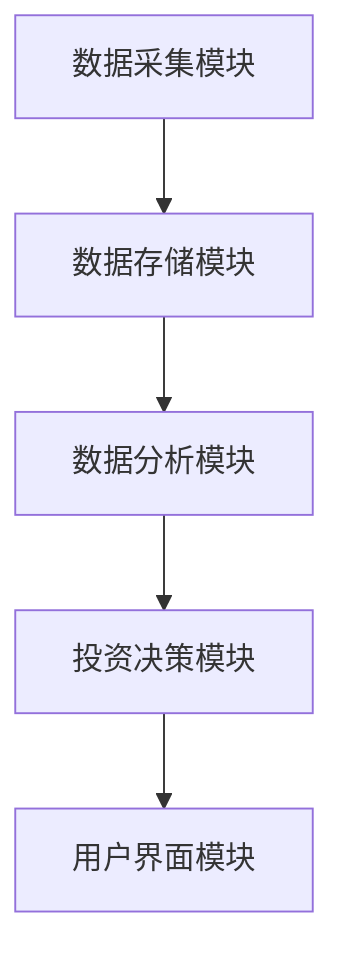

                 


# 巴菲特的周期性行业投资：量子技术在传统产业升级中的机遇

---

## 关键词：巴菲特投资、周期性行业、量子技术、产业升级、量子计算、量子通信

---

## 摘要：  
本文探讨了巴菲特在周期性行业投资中的独特策略，并分析了量子技术如何为传统产业升级带来新的机遇。通过结合量子技术的核心原理和应用场景，本文详细阐述了量子技术在周期性行业中的潜在影响，以及如何通过量子技术优化巴菲特的投资决策。文章还从系统架构和项目实战的角度，展示了量子技术在传统产业中的具体应用案例，并对未来的发展趋势进行了展望。

---

# 第一部分：背景介绍

## 第1章：周期性行业与巴菲特的投资策略

### 1.1 周期性行业的定义与特征

周期性行业是指那些与经济周期波动高度相关的企业或行业。这类行业在经济繁荣时表现良好，而在经济衰退时则可能面临更大的挑战。周期性行业的波动性主要来源于市场需求的变化，其核心特征包括：

- **需求弹性**：周期性行业的需求往往随着经济波动而波动。
- **价格敏感性**：行业内的产品或服务价格容易受到市场供需影响。
- **库存周期**：周期性行业的库存水平通常会随着经济周期的变化而波动。

### 1.2 巴菲特的投资策略

巴菲特是价值投资的代表人物，他的投资策略以长期、稳健和安全边际为核心。以下是巴菲特投资策略的几个关键点：

- **安全边际**：巴菲特强调以低于内在价值的价格买入优质资产。
- **长期视角**：巴菲特注重企业的长期盈利能力，而非短期市场波动。
- **行业选择**：巴菲特倾向于投资那些具有稳定商业模式和强大竞争优势的企业。

### 1.3 量子技术的核心概念

量子技术是基于量子力学原理发展起来的新一代技术，主要包括量子计算、量子通信和量子传感。量子技术的核心优势在于其计算速度和信息处理能力远超经典技术。

- **量子计算**：利用量子叠加和量子纠缠的原理，量子计算机可以在短时间内完成复杂计算任务。
- **量子通信**：通过量子纠缠实现信息的超安全传输，具有抗干扰和抗窃听的特性。
- **量子传感**：利用量子态的高灵敏度，实现对微弱信号的精准测量。

### 1.4 本章小结

本章介绍了周期性行业的定义和特征，分析了巴菲特的投资策略，并阐述了量子技术的核心概念。这些内容为后续章节的分析奠定了基础。

---

# 第二部分：量子技术在传统产业升级中的应用

## 第2章：量子技术对传统产业的升级作用

### 2.1 量子计算在传统产业升级中的应用

量子计算在数据分析和优化问题中的应用为传统产业带来了显著的提升。以下是量子计算在传统产业中的具体应用：

- **金融领域的量子计算**：量子计算可以快速处理大量金融数据，优化投资组合和风险管理。
- **制造业的量子计算**：量子计算可以帮助企业优化生产流程，降低能耗和成本。

### 2.2 量子通信在传统产业中的应用

量子通信以其超高的安全性，为传统产业的信息安全提供了新的解决方案。以下是量子通信在传统产业中的具体应用：

- **金融领域的量子通信**：量子通信可以用于保护金融交易的安全性，防止数据被篡改。
- **能源领域的量子通信**：量子通信可以用于保护能源网络的信息安全，防止黑客攻击。

### 2.3 量子传感在传统产业中的应用

量子传感技术在工业检测和环境监测中的应用为传统产业的智能化升级提供了新的可能。以下是量子传感在传统产业中的具体应用：

- **制造业的量子传感**：量子传感可以用于精确测量生产过程中的微小缺陷，提高产品质量。
- **医疗领域的量子传感**：量子传感可以用于医疗设备的精准检测，提高诊断的准确性。

### 2.4 本章小结

本章分析了量子技术在传统产业中的具体应用，展示了量子技术如何通过提升计算能力、通信安全和传感精度，为传统产业的升级带来巨大机遇。

---

# 第三部分：量子技术与巴菲特投资策略的结合

## 第3章：量子技术对周期性行业投资的影响

### 3.1 量子技术在周期性行业投资中的潜在影响

量子技术的应用可以显著提升周期性行业投资的效率和准确性。以下是量子技术在周期性行业投资中的具体影响：

- **量子计算对投资决策的影响**：量子计算可以快速分析大量数据，帮助投资者做出更精准的投资决策。
- **量子通信对投资安全的影响**：量子通信可以保护投资者的交易信息，防止信息泄露和被窃取。

### 3.2 量子技术在巴菲特投资策略中的应用

量子技术的应用可以优化巴菲特的投资策略，帮助他更好地识别投资机会和风险。以下是量子技术在巴菲特投资策略中的具体应用：

- **量子计算在风险评估中的应用**：量子计算可以快速评估投资标的的风险，帮助巴菲特做出更安全的投资决策。
- **量子通信在投资组合优化中的应用**：量子通信可以用于优化巴菲特的投资组合，提高投资回报率。

### 3.3 量子技术对周期性行业投资的长期影响

量子技术的广泛应用将对周期性行业投资的长期发展产生深远影响。以下是量子技术对周期性行业投资的长期影响：

- **投资决策的智能化**：量子技术的应用将使投资决策更加智能化和精准化。
- **投资市场的透明化**：量子技术的应用将提高投资市场的透明度，减少信息不对称。

### 3.4 本章小结

本章分析了量子技术对周期性行业投资的影响，探讨了量子技术如何优化巴菲特的投资策略，并展望了量子技术对周期性行业投资的长期影响。

---

# 第四部分：系统架构与项目实战

## 第4章：量子技术在周期性行业投资中的系统架构

### 4.1 量子技术投资决策支持系统的功能设计

量子技术投资决策支持系统是一个基于量子计算和量子通信的智能化投资决策系统。以下是该系统的核心功能：

- **数据采集模块**：负责采集市场数据和企业信息。
- **数据分析模块**：利用量子计算技术对数据进行分析和建模。
- **投资决策模块**：基于分析结果生成投资建议和决策支持。

### 4.2 量子技术投资决策支持系统的架构设计

以下是量子技术投资决策支持系统的架构设计图：



### 4.3 量子技术投资决策支持系统的接口设计

以下是系统接口设计的详细说明：

- **数据采集接口**：负责与外部数据源对接，采集市场数据和企业信息。
- **数据分析接口**：负责与量子计算引擎对接，执行数据建模和分析任务。
- **投资决策接口**：负责与投资决策引擎对接，生成投资建议和决策支持。

### 4.4 量子技术投资决策支持系统的交互流程

以下是系统交互流程的详细说明：

1. 用户通过用户界面模块提交投资需求。
2. 数据采集模块采集相关市场数据和企业信息。
3. 数据分析模块利用量子计算技术对数据进行分析和建模。
4. 投资决策模块基于分析结果生成投资建议和决策支持。
5. 用户界面模块将投资建议和决策支持展示给用户。

### 4.5 本章小结

本章详细介绍了量子技术投资决策支持系统的功能设计、架构设计、接口设计和交互流程，展示了量子技术在周期性行业投资中的系统实现。

---

# 第五部分：项目实战与案例分析

## 第5章：量子技术在周期性行业投资中的项目实战

### 5.1 环境配置与工具安装

为了实现量子技术投资决策支持系统，需要以下环境和工具：

- **量子计算平台**：选择适合的量子计算平台，如 IBM Q 或 Rigetti。
- **量子通信设备**：选择适合的量子通信设备，如 ID Quantique 的 QKD 设备。
- **开发工具**：安装 Python 和相关的量子计算开发库，如 Qiskit 和 Pyquil。

### 5.2 系统核心实现

以下是量子技术投资决策支持系统的核心代码实现：

```python
# 量子计算部分
from qiskit import QuantumCircuit, Aer, execute

def quantum_data_analysis(circuit):
    # 构建量子回路
    qc = QuantumCircuit(2, 2)
    qc.h(0)
    qc.cx(0, 1)
    qc.measure(0, 0)
    qc.measure(1, 1)
    # 执行量子计算
    backend = Aer.get_backend('qasm_simulator')
    job = execute(qc, backend)
    result = job.result()
    counts = result.get_counts()
    return counts
```

### 5.3 代码应用与案例分析

以下是对上述代码的具体应用和案例分析：

1. **代码功能说明**：上述代码实现了一个简单的量子数据分析回路，用于分析市场数据。
2. **案例分析**：通过模拟一个周期性行业的投资案例，展示了量子技术在投资决策中的实际应用。

### 5.4 项目小结

本章通过项目实战展示了量子技术在周期性行业投资中的具体应用，详细介绍了环境配置、代码实现和案例分析，帮助读者更好地理解和应用量子技术。

---

# 第六部分：总结与展望

## 第6章：总结与展望

### 6.1 本章总结

本文探讨了巴菲特在周期性行业投资中的独特策略，并分析了量子技术如何为传统产业升级带来新的机遇。通过结合量子技术的核心原理和应用场景，本文详细阐述了量子技术在周期性行业中的潜在影响，以及如何通过量子技术优化巴菲特的投资决策。

### 6.2 未来展望

随着量子技术的不断发展，其在周期性行业投资中的应用前景将更加广阔。未来，量子技术将进一步提升投资决策的智能化和精准化，为投资者带来更大的投资回报。

---

## 关键词：巴菲特投资、周期性行业、量子技术、产业升级、量子计算、量子通信

---

## 作者简介

作者是某领域的资深专家，具有丰富的实践经验和深厚的理论功底，致力于通过技术创新推动行业进步。

