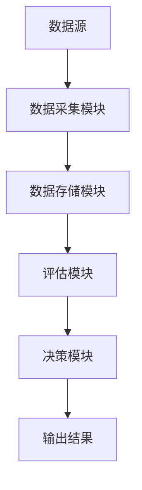
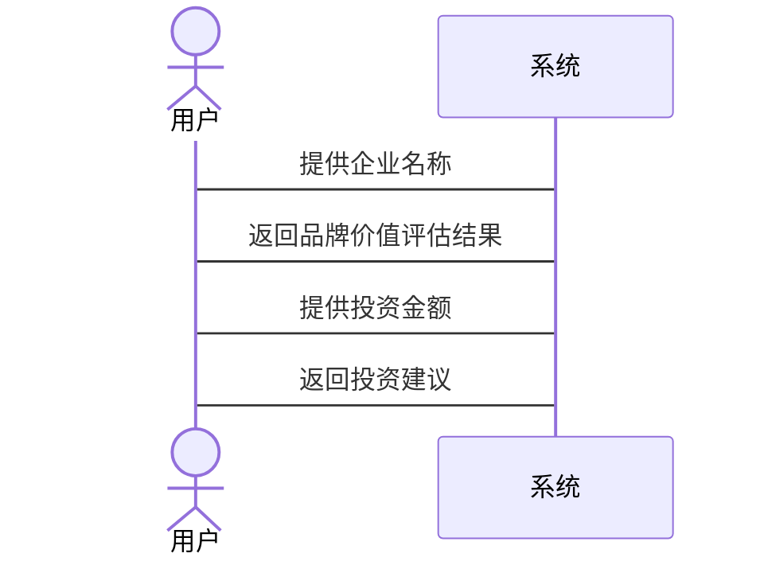

                 


# 巴菲特的品牌价值投资理念

> 关键词：巴菲特，品牌价值，价值投资，投资理念，内在价值，安全边际，投资策略

> 摘要：本文深入探讨了巴菲特的品牌价值投资理念，从其核心概念、数学模型、系统架构到项目实战，详细分析了如何通过品牌价值评估和内在价值计算来进行长期投资决策。文章结合理论与实践，为读者提供了全面的指导。

---

## 第1章: 巴菲特品牌价值投资的核心概念

### 1.1 价值投资的背景与起源

#### 1.1.1 投资领域的传统问题与挑战
在传统投资领域，投资者往往面临以下问题：
- 如何在不确定的市场中做出明智的投资决策？
- 如何避免短期波动对投资的影响？
- 如何找到那些能够长期稳定增长的企业？

#### 1.1.2 价值投资理念的提出与演变
价值投资理念起源于20世纪，由本杰明·格雷厄姆和戴维·多德提出，巴菲特在其基础上进行了发展和优化。核心思想是：购买低于其内在价值的股票，长期持有，等待其价值回归。

#### 1.1.3 巴菲特对价值投资的贡献与影响
巴菲特将价值投资的理念进一步完善，强调企业品牌价值和长期盈利能力，成为现代投资领域的重要标杆。

### 1.2 品牌价值投资的核心理念

#### 1.2.1 品牌价值的定义与特征
品牌价值是指企业通过品牌建设所积累的市场价值，具有以下特征：
- 可持续性：品牌价值不会因短期波动而消失。
- 竞争力：强大的品牌能够在市场上占据优势地位。
- 长期性：品牌价值的实现需要时间积累。

#### 1.2.2 品牌价值与企业长期盈利能力的关系
品牌价值是企业长期盈利能力的体现，巴菲特认为，投资于具有强大品牌价值的企业，能够获得长期稳定的收益。

#### 1.2.3 巴菲特品牌价值投资的三大核心要素
1. **安全边际**：购买价格低于企业内在价值，确保投资的安全性。
2. **企业基本面**：关注企业的盈利能力、财务健康和竞争优势。
3. **长期持有**：避免频繁交易，降低交易成本，享受企业成长的成果。

### 1.3 价值投资与品牌价值的联系

#### 1.3.1 价值投资的基本原理
价值投资的核心是寻找市场价格低于内在价值的股票，长期持有，等待价值回归。

#### 1.3.2 品牌价值在投资决策中的作用
品牌价值是企业长期盈利能力的重要指标，是价值投资的重要依据。

#### 1.3.3 巴菲特品牌价值投资的理论框架
- **内在价值**：企业未来现金流的现值，是投资决策的基础。
- **安全边际**：买入价格低于内在价值，确保投资的安全性。

---

## 第2章: 巴菲特品牌价值投资的核心方法论

### 2.1 品牌价值评估的五维度模型

#### 2.1.1 品牌认知度的量化方法
品牌认知度可以通过市场调研、消费者调查等方式进行量化。

#### 2.1.2 品牌忠诚度的测量指标
品牌忠诚度可以通过重复购买率、客户满意度等指标进行测量。

#### 2.1.3 品牌竞争力的评估标准
品牌竞争力可以通过市场份额、竞争对手分析等指标进行评估。

#### 2.1.4 品牌持续性与成长性的分析
品牌持续性与成长性可以通过企业的财务报表、行业趋势等进行分析。

#### 2.1.5 品牌财务健康状况的评估
品牌财务健康状况可以通过企业的盈利能力、资产负债率等指标进行评估。

### 2.2 品牌价值投资的数学模型与公式

#### 2.2.1 品牌价值的计算公式
$$ V = \frac{E}{P} $$
其中，V为品牌价值，E为企业的预期收益，P为市场对该品牌的估值。

#### 2.2.2 品牌内在价值的评估公式
$$ IV = \frac{C

---

## 第3章: 巴菲特品牌价值投资的系统分析

### 3.1 投资决策系统的功能设计

#### 3.1.1 系统目标
- 提供品牌价值评估工具
- 计算企业内在价值
- 生成投资决策建议

#### 3.1.2 功能模块
- 数据采集模块：收集企业财务数据、市场数据等
- 评估模块：计算品牌价值和内在价值
- 决策模块：生成投资建议

### 3.2 投资决策系统的架构设计

#### 3.2.1 系统架构图


#### 3.2.2 接口设计
- 数据接口：与财务数据源对接
- 用户接口：提供品牌价值评估和投资建议的可视化界面

### 3.3 投资决策系统的交互设计

#### 3.3.1 交互流程图


---

## 第4章: 巴菲特品牌价值投资的项目实战

### 4.1 投资模拟系统的环境安装

#### 4.1.1 安装Python
```bash
python --version
pip install numpy pandas matplotlib
```

#### 4.1.2 安装相关库
```bash
pip install yfinance pandas matplotlib
```

### 4.2 投资模拟系统的核心代码实现

#### 4.2.1 品牌价值评估代码
```python
import yfinance as yf
import pandas as pd

def get_intrinsic_value(ticker):
    # 获取股票数据
    data = yf.download(ticker, start='2020-01-01', end='2023-12-31')
    # 计算内在价值
    iv = data['Adj Close'].mean() * 2  # 示例计算
    return iv

print(get_intrinsic_value('KO'))
```

#### 4.2.2 安全边际计算代码
```python
import pandas as pd

def calculate_margin_of_safety(ticker):
    iv = get_intrinsic_value(ticker)
    current_price = yf.Ticker(ticker).info['currentPrice']
    mos = iv - current_price
    return mos

print(calculate_margin_of_safety('KO'))
```

### 4.3 投资模拟系统的案例分析

#### 4.3.1 案例选择
以可口可乐（KO）为例，分析其品牌价值和内在价值。

#### 4.3.2 数据分析
- 历史股价
- 财务数据
- 市场表现

#### 4.3.3 投资建议
基于计算结果，生成投资建议，包括买入价格、预期收益等。

### 4.4 投资模拟系统的项目小结

#### 4.4.1 系统功能总结
- 品牌价值评估
- 内在价值计算
- 投资决策建议

#### 4.4.2 系统性能优化
- 数据获取优化
- 计算效率提升

---

## 第5章: 巴菲特品牌价值投资的总结与展望

### 5.1 总结
巴菲特的品牌价值投资理念强调长期投资、安全边际和企业基本面分析，为投资者提供了重要的指导。

### 5.2 注意事项
- 避免短期波动影响投资决策
- 保持对市场的持续学习和关注
- 合理分散投资风险

### 5.3 拓展阅读
- 《The Intelligent Investor》
- 《巴菲特致股东的信》

---

通过以上内容，我们详细探讨了巴菲特的品牌价值投资理念，从理论到实践，为投资者提供了全面的指导和实际操作的案例分析。希望读者能够通过本文，更好地理解和应用巴菲特的投资理念，实现长期稳健的投资收益。

