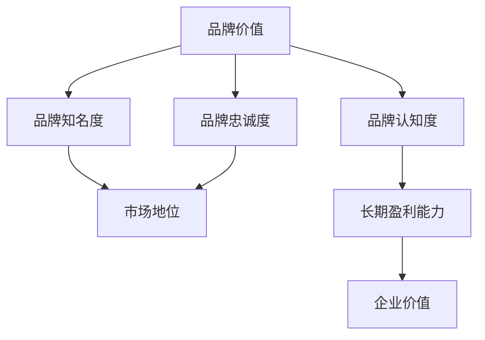
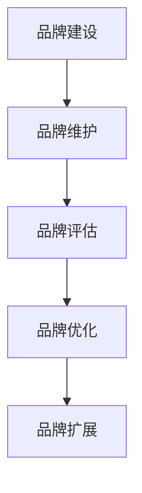
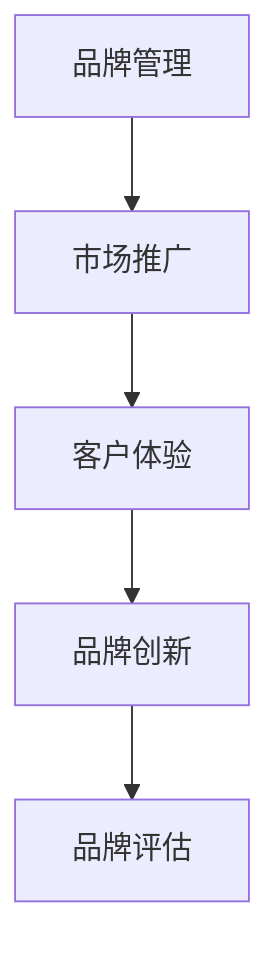

                 

# 巴菲特的品牌价值理念：无形资产的重要性

---

## 关键词：
- 巴菲特投资理念
- 品牌价值
- 无形资产
- 长期价值
- 市场地位
- 股东价值

---

## 摘要：
本文深入探讨了巴菲特的品牌价值理念及其对无形资产的高度重视。通过分析品牌价值的核心概念、评估方法以及在投资决策中的应用，结合巴菲特的经典案例，揭示了无形资产如何为企业创造长期价值。文章还从技术角度出发，结合数学模型和算法，详细阐述了品牌价值的量化方法，并提出了实际的管理策略和最佳实践。

---

## 第1章: 背景介绍：品牌价值与无形资产的核心概念

### 1.1 问题背景与描述
品牌价值是企业长期竞争优势的核心来源之一，而无形资产（如品牌、声誉、客户忠诚度等）在企业价值创造中占据着至关重要的地位。巴菲特曾多次强调，品牌价值是企业长期盈利能力的关键因素。

### 1.2 核心概念与术语
- **品牌价值**：品牌在市场中所代表的附加价值，通常反映在消费者对品牌的认知和偏好上。
- **无形资产**：企业中不能被直接观察或触摸的资产，包括品牌、专利、商誉等。
- **长期价值**：企业在未来一段时间内的预期收益，通常与品牌价值密切相关。

### 1.3 问题解决与边界
本文将从以下几个方面展开：
1. 品牌价值的量化方法。
2. 巴菲特对品牌价值的重视及其投资策略。
3. 无形资产对企业长期价值的影响。

### 1.4 概念结构与核心要素
通过以下 **Mermaid 图**，我们可以清晰地看到品牌价值与无形资产的关系：

---

## 第2章: 品牌价值的核心评估方法

### 2.1 定性评估
- **品牌故事与文化**：品牌的起源、使命和价值观直接影响其市场定位。
- **品牌形象与声誉**：品牌在消费者心中的形象和声誉决定了其市场影响力。

### 2.2 定量评估
- **财务模型**：通过DCF模型（ discounted cash flow，折现现金流模型）计算品牌价值。

#### DCF模型公式：
$$
\text{品牌价值} = \sum_{t=1}^{n} \frac{\text{自由现金流}}{(1 + r)^t} + \frac{\text{终值}}{(1 + r)^n}
$$
其中，$r$ 是折现率，$n$ 是预测期数。

### 2.3 巴菲特的视角
巴菲特认为，品牌价值的评估应关注企业的长期盈利能力，而不是短期市场波动。

#### 案例分析：
以可口可乐为例，其品牌价值主要体现在其全球市场地位和消费者的长期忠诚度。

---

## 第3章: 无形资产的分类与管理

### 3.1 无形资产的分类
- **品牌相关资产**：包括品牌名称、标志、商誉等。
- **知识资本**：包括专利、商标、专有技术等。
- **客户资产**：包括客户关系和客户忠诚度。

### 3.2 品牌资产的生命周期管理
- **品牌建设**：通过营销和创新提升品牌知名度。
- **品牌维护**：通过质量管理确保品牌声誉。

#### 生命周期管理流程图：

---

## 第4章: 无形资产对企业长期价值的影响

### 4.1 企业市场地位
品牌价值越高，企业在市场中的话语权越大。

### 4.2 股东价值
品牌溢价能力直接影响企业的股价和股东收益。

#### 品牌溢价能力的数学模型：
$$
\text{品牌溢价} = \frac{\text{品牌价值}}{\text{行业平均价值}}
$$

---

## 第5章: 巴菲特投资策略中的无形资产应用

### 5.1 长期投资策略
巴菲特倾向于投资具有强大品牌价值和长期盈利能力的企业。

### 5.2 投资决策中的无形资产权重
- 品牌忠诚度
- 市场地位
- 竞争优势

### 5.3 案例分析
- **可口可乐**：品牌价值超过百亿美元，其市场地位几乎不可动摇。
- **亨氏联合**：品牌组合的优势使其在调味品市场占据领先地位。

---

## 第6章: 无形资产的管理与提升策略

### 6.1 品牌创新与差异化
通过创新保持品牌活力，形成差异化竞争优势。

### 6.2 品牌传播与市场推广
通过有效的营销策略提升品牌知名度和美誉度。

### 6.3 品牌体验与客户忠诚度
通过提升客户体验增强品牌忠诚度。

---

## 第7章: 无形资产的系统架构与最佳实践

### 7.1 系统架构设计

### 7.2 最佳实践
- 定期评估品牌价值。
- 注重品牌创新和客户体验。
- 建立长期的品牌管理策略。

---

## 第8章: 总结与展望

### 8.1 本章总结
本文从品牌价值的评估方法、无形资产的管理策略以及巴菲特的投资理念出发，全面分析了品牌价值对企业长期发展的核心作用。

### 8.2 未来展望
未来，随着市场竞争的加剧，品牌价值的量化和管理将变得更加重要。企业需要通过技术创新和管理优化，进一步提升品牌价值。

---

## 参考文献
1. 巴菲特股东大会演讲
2. 《巴菲特的智慧：投资经典》
3. 品牌价值评估相关学术论文

---

## 致谢
感谢读者的耐心阅读，希望通过本文能帮助大家更好地理解巴菲特的品牌价值理念以及无形资产的重要性。

--- 

希望这篇文章能为您提供有价值的见解！

