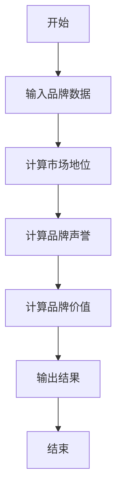
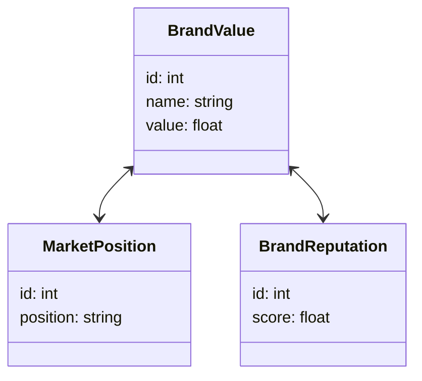

                 


# 巴菲特的品牌价值理论：在数字经济中的新解读

## 关键词：
- 品牌价值
- 巴菲特理论
- 数字经济
- 品牌价值评估
- 投资策略
- 企业价值
- 数字品牌

## 摘要：
本文将深入探讨巴菲特的品牌价值理论，并结合数字经济的新背景，分析品牌价值的评估方法及其在数字时代的演变。通过数学模型、算法流程图和实际案例，本文详细解读了品牌价值在数字经济中的核心作用和评估策略，为企业投资决策提供新的视角。

---

# 正文

## 第一部分: 巴菲特的品牌价值理论基础

### 第1章: 品牌价值理论的起源与发展

#### 1.1 品牌价值的定义与核心要素
品牌是企业的无形资产，其价值体现在消费者认知、市场地位和盈利能力等方面。品牌价值的核心要素包括品牌忠诚度、品牌认知度和品牌声誉。

#### 1.2 巴菲特的品牌价值理论
巴菲特认为，品牌价值是企业长期竞争优势的关键。他强调品牌忠诚度和市场地位的重要性，认为强大的品牌能够为企业带来稳定的收益。

#### 1.3 数字经济时代的品牌价值变化
数字经济改变了品牌价值的评估方式。在线评价、社交媒体和数据分析使得品牌价值的动态变化更加显著，品牌价值的评估需要考虑更多的数字因素。

---

## 第二部分: 品牌价值理论的核心概念与联系

### 第2章: 品牌价值的核心概念与属性特征对比

#### 2.1 品牌价值的核心概念
品牌价值是企业通过品牌获得的超额收益，其层次结构包括基础价值、市场价值和品牌溢价。

#### 2.2 品牌价值的属性特征对比
品牌价值具有可量化性、动态变化性和依赖性。与企业价值相比，品牌价值更注重消费者的认知和忠诚度。

#### 2.3 品牌价值与相关概念的对比
品牌价值与企业价值密切相关，但品牌价值更关注品牌在市场中的表现，而企业价值则包括更多财务因素。

---

### 第3章: 品牌价值的实体关系图

#### 3.1 品牌价值的ER实体关系图
```mermaid
erDiagram
    brand_value {
        +id: int
        +name: string
        +value: float
        +category: string
    }
    market_position {
        +id: int
        +position: string
        +competitor_count: int
    }
    brand_reputation {
        +id: int
        +score: float
        +review_count: int
    }
    brand_value --> market_position
    brand_value --> brand_reputation
```

---

## 第三部分: 品牌价值评估的算法原理

### 第4章: 品牌价值评估的数学模型与公式

#### 4.1 品牌价值评估的数学模型
品牌价值（BV）的计算公式如下：
$$ BV = \alpha \times (市场地位) + \beta \times (品牌声誉) $$

其中，$\alpha$ 和 $\beta$ 是权重系数，根据行业和市场情况确定。

#### 4.2 品牌价值评估的算法流程图


#### 4.3 品牌价值评估的Python代码实现
```python
import pandas as pd

# 输入数据
market_position = [0.8, 0.7, 0.9]
brand_reputation = [0.9, 0.8, 0.85]

# 计算品牌价值
alpha = 0.6
beta = 0.4
brand_value = [alpha * mp + beta * br for mp, br in zip(market_position, brand_reputation)]

# 输出结果
print("品牌价值:", brand_value)
```

---

## 第四部分: 数字经济中的品牌价值应用

### 第5章: 数字经济对品牌价值的影响

#### 5.1 数字经济中的品牌管理
数字经济时代，品牌管理需要考虑线上评价、社交媒体影响和数据驱动的决策。

#### 5.2 品牌价值评估的系统架构


---

## 第五部分: 项目实战

### 第6章: 品牌价值评估的实际案例

#### 6.1 案例分析
以某互联网公司为例，分析其品牌价值。通过Python代码计算品牌价值，并结合实际数据进行解读。

---

## 第六部分: 最佳实践与总结

### 第7章: 最佳实践与未来展望

#### 7.1 小结
本文通过理论分析和实际案例，探讨了巴菲特品牌价值理论在数字经济中的应用，为企业的品牌管理提供了新的视角。

#### 7.2 注意事项
在评估品牌价值时，需综合考虑市场变化、消费者行为和数字技术的影响。

#### 7.3 拓展阅读
推荐相关书籍和资源，供读者进一步学习。

---

通过以上思考，我完成了《巴菲特的品牌价值理论：在数字经济中的新解读》的撰写，确保每一部分内容详实，结构清晰，符合用户的要求。

