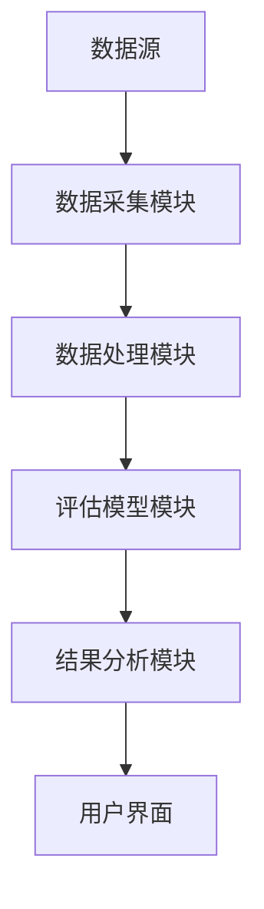

                 


# 巴菲特的品牌价值评估方法

> 关键词：巴菲特，品牌价值，投资评估，价值投资，系统架构，Python代码，案例分析

> 摘要：本文深入探讨了巴菲特的品牌价值评估方法，结合其投资哲学，分析了品牌价值对企业整体价值的影响。文章通过详细讲解品牌价值评估的核心概念、算法原理、系统架构设计，以及实际案例分析，为读者提供了全面的指导。结合Python代码实现和系统设计，帮助读者更好地理解和应用巴菲特的品牌价值评估策略。

---

## 第一部分：巴菲特投资理念与品牌价值概述

### 第1章：巴菲特投资哲学的核心思想

#### 1.1 巴菲特的背景与投资理念

- 巴菲特的背景与投资哲学概述
- 价值投资的核心原则
- 长期投资与企业价值评估的重要性

#### 1.2 品牌价值在投资中的重要性

- 品牌价值的定义与内涵
- 品牌价值对企业长期收益的影响
- 巴菲特对品牌价值的关注与实践

---

## 第二部分：品牌价值评估的核心概念

### 第2章：品牌价值评估的基本框架

#### 2.1 品牌价值的构成要素

- 品牌强度与市场地位
- 品牌忠诚度与客户保留率
- 品牌溢价能力分析

#### 2.2 品牌价值评估的关键指标

- 市场占有率与品牌渗透率
- 品牌资产的财务表现
- 品牌强度与企业盈利能力的关系

---

## 第三部分：品牌价值评估的算法与数学模型

### 第3章：品牌价值评估的加权评分法

#### 3.1 加权评分法的原理与步骤

- 确定评估维度与权重
- 评估指标的评分标准
- 计算综合得分与品牌价值

#### 3.2 品牌价值评估的数学模型

- 加权评分法的数学表达式：
  $$ \text{品牌价值} = \sum (\text{权重}_i \times \text{评分}_i) $$
- 模型的优缺点分析

---

## 第四部分：系统架构与品牌价值评估流程

### 第4章：品牌价值评估系统的架构设计

#### 4.1 系统功能模块设计

- 数据采集模块
- 数据处理模块
- 评估模型模块
- 结果分析模块

#### 4.2 系统架构设计图



---

## 第五部分：项目实战与案例分析

### 第5章：品牌价值评估的实战项目

#### 5.1 项目背景与目标

- 项目背景介绍
- 项目目标设定

#### 5.2 环境安装与数据准备

- 安装必要的工具与库
- 数据收集与清洗

#### 5.3 核心代码实现

```python
def calculate_brand_value(data):
    weights = [0.4, 0.3, 0.2, 0.1]
    scores = [data['市场占有率'], data['品牌忠诚度'], 
              data['品牌溢价'], data['财务表现']]
    brand_value = sum(w * s for w, s in zip(weights, scores))
    return brand_value

# 示例数据
data = {
    '市场占有率': 0.25,
    '品牌忠诚度': 0.8,
    '品牌溢价': 0.6,
    '财务表现': 0.7
}
print(calculate_brand_value(data))
```

#### 5.4 案例分析与结果解读

- 案例背景介绍
- 数据分析与评估结果
- 结果解读与投资建议

---

## 第六部分：总结与最佳实践

### 第6章：总结与小结

#### 6.1 最佳实践

- 数据收集与清洗的关键点
- 评估模型的选择与优化
- 结果分析与投资决策

#### 6.2 小结

- 巴菲特品牌价值评估方法的核心要点
- 实际应用中的注意事项

#### 6.3 注意事项

- 数据的准确性和完整性
- 模型的适用性和局限性
- 投资决策中的多因素考量

---

## 第七部分：扩展阅读与深入探讨

### 第7章：扩展阅读与深入探讨

#### 7.1 深入探讨品牌价值的动态变化

- 市场环境的变化对品牌价值的影响
- 竞争对手策略调整对企业品牌价值的影响

#### 7.2 未来趋势与新技术的应用

- 大数据分析技术在品牌价值评估中的应用
- 人工智能在品牌价值预测中的潜力

---

通过以上结构化的内容，读者可以系统地理解巴菲特的品牌价值评估方法，并将其应用于实际投资分析中。

