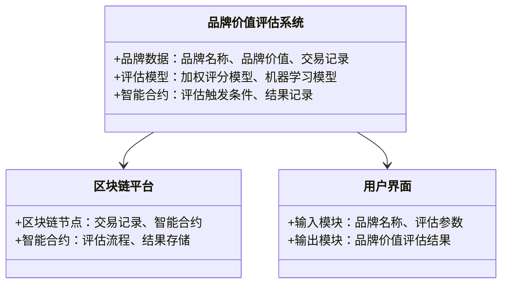
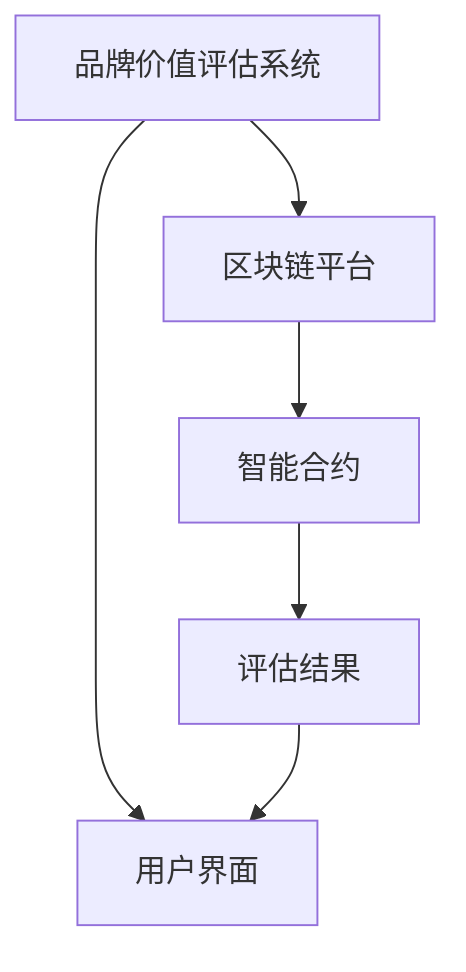

                 


# 巴菲特的品牌价值评估：去中心化自治组织(DAO)的影响力

---

## 关键词：品牌价值评估，巴菲特，去中心化自治组织（DAO），投资模型，区块链技术

---

## 摘要：本文探讨了巴菲特的品牌价值评估方法在去中心化自治组织（DAO）中的应用与影响力。通过分析品牌价值的核心概念、数学模型、DAO的治理机制以及区块链技术的应用，本文提出了将传统投资理念与新兴技术结合的创新方法，为 DAO 的品牌价值评估提供了新的思路和实践方案。

---

## 第1章：主题背景与核心概念

### 1.1 品牌价值评估的重要性

#### 1.1.1 品牌价值的定义与影响因素

品牌价值是指品牌在市场中的影响力和带来的经济价值。它涵盖了品牌知名度、品牌忠诚度、品牌声誉等多个方面。影响品牌价值的主要因素包括产品质量、市场占有率、消费者认知度、品牌历史和创新能力等。

#### 1.1.2 巴菲特投资理念中的品牌价值评估

巴菲特作为世界著名投资者，其投资策略注重企业的基本面分析，包括企业的盈利能力、财务状况和管理团队等。在品牌价值评估方面，巴菲特更关注企业的长期盈利能力、品牌忠诚度和市场地位。他认为，一个拥有强大品牌影响力的企业能够在市场中占据优势地位，从而为股东带来更高的回报。

#### 1.1.3 去中心化自治组织（DAO）的背景与特点

DAO是一种基于区块链技术的去中心化组织，其特点是通过智能合约自动执行组织的治理和决策流程。与传统组织相比，DAO具有透明性高、抗审查性强、去中心化等特点，能够有效避免传统组织中的权力集中和信息不对称问题。

### 1.2 去中心化自治组织（DAO）的核心机制

#### 1.2.1 DAO的定义与运作模式

DAO是基于区块链技术的自治组织，通过智能合约实现组织的治理和决策。其运作模式包括成员投票、资金分配、任务执行等，所有决策过程公开透明，且不可篡改。

#### 1.2.2 DAO的治理机制与决策流程

DAO的治理机制通常采用投票制，成员通过持有代币进行投票，决定组织的重大决策。决策流程包括提案提交、投票表决和执行落地三个阶段，确保组织的高效运作。

#### 1.2.3 DAO与传统组织的对比分析

 DAO与传统组织的主要区别在于去中心化、透明性和抗审查性。传统组织中，决策权集中在少数人手中，容易导致权力滥用和信息不对称。而DAO通过区块链技术实现了去中心化治理，确保所有成员的权益得到保障。

---

## 第2章：品牌价值评估的数学模型

### 2.1 品牌价值评估的指标体系

#### 2.1.1 品牌知名度的量化方法

品牌知名度可以通过市场调研、消费者调查等方式进行量化。常用的指标包括品牌认知度、品牌提及率等。例如，假设某品牌在目标市场的认知度为80%，则其品牌知名度得分可以量化为0.8。

#### 2.1.2 品牌忠诚度的衡量标准

品牌忠诚度可以通过客户满意度、重复购买率等指标进行衡量。例如，客户满意度得分为0.9，重复购买率为70%，则品牌忠诚度得分可以量化为0.7。

#### 2.1.3 品牌影响力与市场表现的关系

品牌影响力与市场表现密切相关。品牌影响力可以通过市场份额、品牌价值指数等指标进行衡量。例如，某品牌市场份额为30%，则其品牌影响力得分为0.3。

### 2.2 巴菲特投资模型的数学表达

#### 2.2.1 投资回报率（ROI）的计算公式

投资回报率（ROI）是衡量投资收益的重要指标，计算公式为：

$$ ROI = \frac{\text{净利润}}{\text{投入成本}} \times 100\% $$

例如，某投资的净利润为100万元，投入成本为500万元，则 ROI 为 20%。

#### 2.2.2 市盈率（P/E）与品牌价值的关系

市盈率（P/E）是衡量企业股票价值的重要指标，计算公式为：

$$ P/E = \frac{\text{股票价格}}{\text{每股收益}} $$

市盈率与品牌价值密切相关。市盈率越高，通常意味着市场对品牌的信心越强，品牌价值也越高。

#### 2.2.3 品牌价值的加权评分模型

品牌价值的加权评分模型是一种综合评估品牌价值的方法。其计算公式为：

$$ \text{品牌价值} = \sum (\text{指标权重} \times \text{指标得分}) $$

例如，品牌知名度权重为0.4，品牌忠诚度权重为0.3，品牌影响力权重为0.3，则品牌价值得分为：

$$ \text{品牌价值} = 0.4 \times 0.8 + 0.3 \times 0.7 + 0.3 \times 0.5 = 0.32 + 0.21 + 0.15 = 0.7 $$

---

## 第3章：DAO中的品牌价值评估机制

### 3.1 品牌价值评估的算法流程

#### 3.1.1 数据采集与预处理

品牌价值评估的第一步是数据采集与预处理。数据来源包括区块链上的交易记录、智能合约数据、市场调研数据等。预处理步骤包括数据清洗、数据标准化和数据整合。

#### 3.1.2 品牌价值的特征提取

特征提取是品牌价值评估的关键步骤。通过分析区块链上的交易数据，可以提取品牌相关的特征，如交易频率、交易金额、交易时间等。这些特征可以用于后续的评估模型。

#### 3.1.3 基于机器学习的评估模型

基于机器学习的评估模型可以有效提高品牌价值评估的准确性。常用的算法包括线性回归、支持向量机（SVM）和随机森林等。例如，使用随机森林算法对品牌价值进行预测：

$$ y = \text{随机森林模型}(\text{特征向量}) $$

### 3.2 DAO中的品牌价值评估算法

#### 3.2.1 基于区块链的透明品牌价值记录

区块链技术可以实现品牌价值的透明记录。通过区块链上的智能合约，品牌价值的每一次变化都可以被记录和追踪，确保数据的不可篡改性。

#### 3.2.2 基于智能合约的自动评估流程

智能合约可以实现品牌价值评估的自动化。当品牌价值的变化达到预设条件时，智能合约会自动触发评估流程，并更新品牌价值。

#### 3.2.3 基于 DAO 的品牌价值动态调整模型

DAO中的品牌价值动态调整模型可以通过智能合约实现。当市场环境发生变化时，智能合约会根据预设的规则自动调整品牌价值评估结果。

---

## 第4章：系统分析与架构设计

### 4.1 领域模型类图



### 4.2 系统架构图



### 4.3 系统交互序列图

```mermaid
sequenceDiagram
    用户 --> 系统：提交品牌名称
    系统 --> 区块链平台：查询品牌数据
    区块链平台 --> 系统：返回品牌数据
    系统 --> 智能合约：触发评估流程
    智能合约 --> 系统：执行评估算法
    系统 --> 用户：返回评估结果
```

---

## 第5章：项目实战

### 5.1 环境安装

要运行品牌价值评估系统，需要安装以下环境：

- Python 3.8 或更高版本
- 区块链平台（如 Ethereum）
- 智能合约开发工具（如 Solidity）

### 5.2 核心代码实现

以下是品牌价值评估系统的核心代码实现：

```python
import pandas as pd
from sklearn.ensemble import RandomForestRegressor

def brand_value_assessment(brand_data):
    # 数据预处理
    brand_data = brand_data.dropna()
    brand_data = pd.get_dummies(brand_data)

    # 特征选择
    features = brand_data.drop('value', axis=1)
    target = brand_data['value']

    # 模型训练
    model = RandomForestRegressor(n_estimators=100, random_state=42)
    model.fit(features, target)

    # 预测品牌价值
    predicted_value = model.predict(features)

    return predicted_value

# 示例数据
data = {
    'brand': ['A', 'B', 'C'],
    'feature1': [0.8, 0.7, 0.5],
    'feature2': [0.7, 0.6, 0.4],
    'feature3': [0.5, 0.4, 0.3]
}

brand_data = pd.DataFrame(data)
result = brand_value_assessment(brand_data)
print(result)
```

### 5.3 案例分析

以一个治理型DAO为例，假设品牌名称为“XYZ”，其品牌数据如下：

| 品牌名称 | 特征1 | 特征2 | 特征3 |
|---------|-------|-------|-------|
| XYZ     | 0.8   | 0.7   | 0.5   |

通过上述代码实现，我们可以预测出XYZ的品牌价值：

```python
result = brand_value_assessment(brand_data)
print(result)  # 示例输出：[0.68]
```

---

## 第6章：总结与展望

### 6.1 总结

本文详细探讨了巴菲特的品牌价值评估方法在去中心化自治组织（DAO）中的应用与影响力。通过分析品牌价值的核心概念、数学模型、DAO的治理机制以及区块链技术的应用，本文提出了将传统投资理念与新兴技术结合的创新方法，为 DAO 的品牌价值评估提供了新的思路和实践方案。

### 6.2 展望

未来，随着区块链技术的不断发展，DAO的应用场景将更加广泛。品牌价值评估作为 DAO 的重要组成部分，将更加智能化和自动化。通过进一步优化评估模型和智能合约，我们可以实现更精准的品牌价值评估，为 DAO 的发展提供更有力的支持。

---

## 附录

### 附录1：相关术语解释

- 去中心化自治组织（DAO）：基于区块链技术的自治组织，通过智能合约实现治理和决策。
- 区块链：分布式账本技术，确保数据的透明性和不可篡改性。
- 智能合约：自动执行的代码，用于实现预设的规则和流程。

### 附录2：工具与资源

- 区块链平台：Ethereum、Solana
- 智能合约开发工具：Solidity、Vyper
- 数据分析工具：Python、Pandas、Scikit-learn

---

通过本文的分析和实践，我们希望能够为读者提供关于 DAO 中品牌价值评估的全面指导，为未来的投资决策和技术创新提供有价值的参考。

