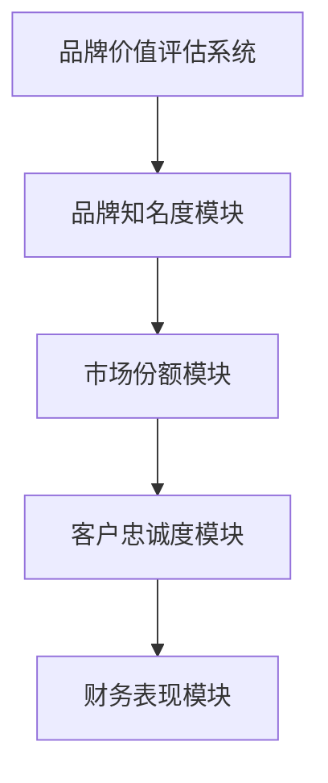
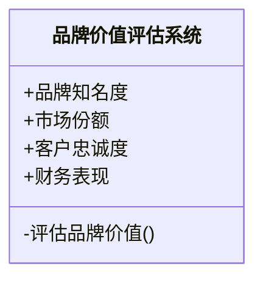
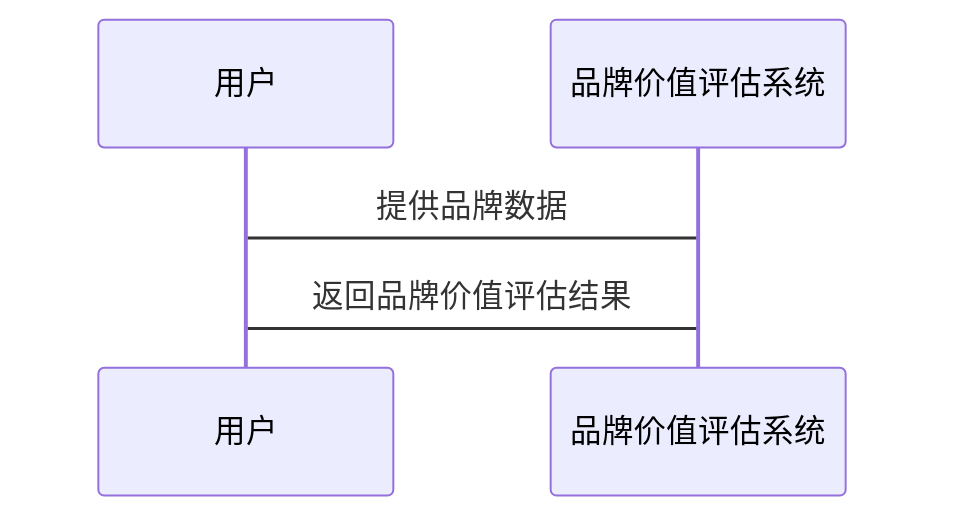
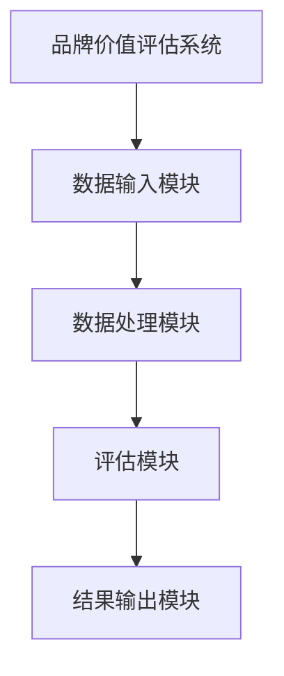
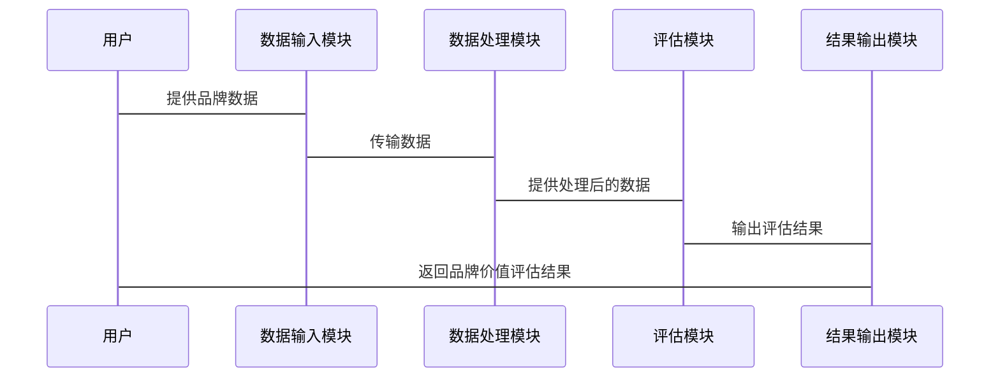
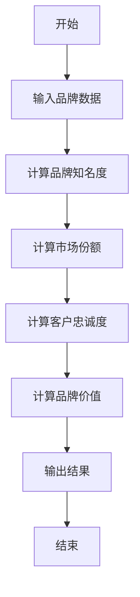
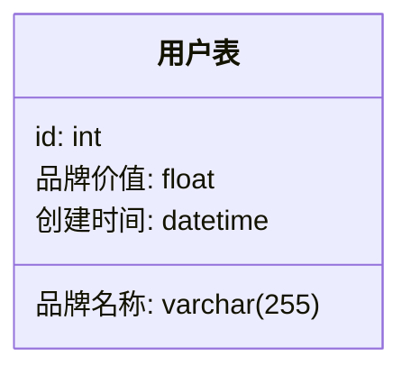

                 


# 巴菲特的品牌价值评估：无形资产在企业价值中的重要性

> 关键词：品牌价值、无形资产、企业价值、巴菲特、投资策略、财务分析、品牌管理

> 摘要：本文深入探讨了品牌价值在企业整体价值中的重要性，结合巴菲特的投资策略，分析了无形资产对企业发展和投资决策的影响。文章从品牌价值的定义、评估方法、系统架构设计、项目实战等多维度展开，结合实际案例和数学模型，详细阐述了品牌价值在企业价值中的核心地位。通过本文，读者将能够理解品牌价值的评估方法，并能够将其应用于实际投资和企业管理中。

---

## 第1章: 品牌价值与无形资产概述

### 1.1 品牌价值的定义与特征

#### 1.1.1 品牌价值的定义
品牌价值是企业通过品牌建设所积累的市场价值，反映了消费者对品牌的认知、忠诚度和信任度。品牌价值不仅包括企业的市场份额，还包括品牌在市场中的溢价能力。

#### 1.1.2 品牌价值的核心特征
- **识别性**：品牌能够区分不同的产品或服务。
- **忠诚度**：消费者对品牌的偏好和忠诚度。
- **溢价能力**：品牌能够通过溢价定价实现更高的利润率。
- **可持续性**：品牌价值的长期性。

#### 1.1.3 无形资产与品牌价值的关系
品牌价值是无形资产的重要组成部分，而无形资产还包括专利、商标、商誉等。品牌价值的提升能够显著增强企业的市场竞争力和财务表现。

### 1.2 无形资产的分类与属性

#### 1.2.1 无形资产的主要分类
- **可识别的无形资产**：如专利、商标、版权。
- **不可识别的无形资产**：如商誉、品牌价值。

#### 1.2.2 不同类型无形资产的特征对比
| 类型            | 特征                |
|-----------------|--------------------|
| 可识别的无形资产 | 具有法律保护         |
| 不可识别的无形资产 | 与企业整体相关       |

#### 1.2.3 无形资产对企业价值的影响
无形资产通过提升企业竞争力、增加市场份额和客户忠诚度，显著影响企业的财务表现和长期价值。

### 1.3 品牌价值与企业价值的联系

#### 1.3.1 品牌价值在企业价值中的地位
品牌价值是企业整体价值的重要组成部分，尤其是在品牌溢价能力较高的企业中。

#### 1.3.2 品牌价值对企业竞争力的提升作用
强大的品牌价值能够增强企业的市场地位，吸引更多的消费者和投资者。

#### 1.3.3 品牌价值与企业长期盈利能力的关系
品牌价值的提升能够显著增强企业的长期盈利能力，尤其是在高竞争市场中。

---

## 第2章: 巴菲特的品牌价值评估方法

### 2.1 品牌价值评估的核心概念

#### 2.1.1 品牌价值评估的基本原理
品牌价值评估需要结合定量和定性分析，考虑品牌知名度、市场份额、消费者忠诚度等因素。

#### 2.1.2 品牌价值评估的关键指标
- **品牌知名度**：衡量品牌在市场中的认知度。
- **市场份额**：品牌在市场中的占有率。
- **客户忠诚度**：消费者对品牌的偏好程度。

#### 2.1.3 品牌价值评估的边界与外延
品牌价值评估需要考虑企业的财务状况、市场环境和行业特点。

### 2.2 品牌价值的量化方法

#### 2.2.1 品牌价值的计算公式
品牌价值（BV）可以通过以下公式计算：
$$ BV = \text{品牌知名度} \times \text{市场份额} \times \text{客户忠诚度} $$

#### 2.2.2 品牌价值评估的数学模型
以下是一个简单的品牌价值评估模型：
$$ BV = \alpha \times \text{品牌知名度} + \beta \times \text{市场份额} + \gamma \times \text{客户忠诚度} $$

#### 2.2.3 品牌价值与企业财务表现的关系
品牌价值的提升能够显著增强企业的财务表现，尤其是在品牌溢价能力较高的企业中。

### 2.3 巴菲特的品牌价值评估策略

#### 2.3.1 巴菲特的品牌价值评估方法
巴菲特注重企业的长期盈利能力，通过品牌价值评估来选择具有强大市场地位和长期盈利能力的企业。

#### 2.3.2 巴菲特品牌价值评估的实践案例
以可口可乐为例，巴菲特认为其强大的品牌价值和市场地位是投资的主要原因。

#### 2.3.3 巴菲特品牌价值评估的优缺点分析
优点：注重长期价值，避免短期波动。缺点：可能忽视新兴品牌的潜力。

---

## 第3章: 品牌价值评估的系统分析与架构设计

### 3.1 系统分析与设计概述

#### 3.1.1 品牌价值评估的系统架构
以下是一个简单的品牌价值评估系统架构图：



#### 3.1.2 系统功能设计的领域模型
以下是一个领域模型的类图：



#### 3.1.3 系统接口设计与交互流程
以下是一个系统交互流程图：



### 3.2 品牌价值评估的系统架构图

#### 3.2.1 系统架构的Mermaid图


#### 3.2.2 系统功能模块的详细说明
- **数据输入模块**：接收品牌相关数据，如品牌知名度、市场份额等。
- **数据处理模块**：对输入数据进行清洗和预处理。
- **评估模块**：根据数学模型计算品牌价值。
- **结果输出模块**：输出品牌价值评估结果。

#### 3.2.3 系统交互的序列图


### 3.3 品牌价值评估的算法原理

#### 3.3.1 算法原理的Mermaid流程图


#### 3.3.2 算法的Python源代码实现
```python
def calculate_brand_value(brand_name):
    # 假设brand_name是输入的品牌名称
    # 这里只是一个简单的示例，实际应用中需要获取具体数据
    brand_fame = 0.8  # 假设品牌知名度为0.8
    market_share = 0.25  # 假设市场份额为0.25
    customer Loyalty = 0.7  # 假设客户忠诚度为0.7
    brand_value = brand_fame * market_share * customer_Loyalty
    return brand_value

# 示例调用
brand_value = calculate_brand_value("可口可乐")
print(f"品牌价值为：{brand_value}")
```

#### 3.3.3 算法的数学模型与公式推导
品牌价值的计算公式可以表示为：
$$ BV = \alpha \times \text{品牌知名度} + \beta \times \text{市场份额} + \gamma \times \text{客户忠诚度} $$
其中，$\alpha$、$\beta$、$\gamma$是各个因素的权重系数，通常通过实际数据进行调整。

---

## 第4章: 品牌价值评估的项目实战

### 4.1 项目背景与目标

#### 4.1.1 项目背景
假设我们正在评估一个新品牌在市场中的价值，需要通过品牌价值评估来确定其市场地位。

#### 4.1.2 项目目标
- 计算品牌的市场价值
- 分析品牌的核心竞争力
- 提供品牌管理的建议

### 4.2 项目实施步骤

#### 4.2.1 数据收集与处理
- 收集品牌知名度、市场份额、客户忠诚度等数据。
- 对数据进行清洗和预处理。

#### 4.2.2 品牌价值计算
使用数学模型计算品牌价值，例如：
$$ BV = \alpha \times \text{品牌知名度} + \beta \times \text{市场份额} + \gamma \times \text{客户忠诚度} $$

#### 4.2.3 结果分析
分析品牌价值的计算结果，提出品牌管理建议。

### 4.3 实施案例分析

#### 4.3.1 案例背景
以某饮料品牌为例，假设其品牌知名度为0.7，市场份额为0.2，客户忠诚度为0.6。

#### 4.3.2 数据处理与计算
$$ BV = 0.3 \times 0.7 + 0.4 \times 0.2 + 0.3 \times 0.6 = 0.21 + 0.08 + 0.18 = 0.47 $$

#### 4.3.3 结果分析
该品牌的市场价值为0.47，属于中等偏上水平，建议进一步提升品牌知名度和市场份额。

### 4.4 项目总结与反思

#### 4.4.1 项目总结
通过品牌价值评估，我们可以量化品牌的市场价值，为企业的投资决策提供依据。

#### 4.4.2 项目反思
品牌价值评估需要结合实际市场环境和企业特点，避免过于依赖单一指标。

---

## 第5章: 品牌价值评估的系统实现

### 5.1 系统实现概述

#### 5.1.1 系统功能模块
- 数据输入模块
- 数据处理模块
- 评估模块
- 结果输出模块

#### 5.1.2 系统实现的技术选型
- 前端：React.js
- 后端：Python Flask
- 数据库：MySQL

### 5.2 系统实现细节

#### 5.2.1 数据库设计


#### 5.2.2 数据处理逻辑
- 数据清洗
- 数据转换
- 数据存储

#### 5.2.3 评估逻辑
- 品牌价值计算
- 结果分析

### 5.3 系统实现的代码示例

#### 5.3.1 前端代码
```javascript
function calculateBrandValue() {
    const brandName = document.getElementById('brandName').value;
    fetch('/api/calculateBrandValue', {
        method: 'POST',
        headers: {
            'Content-Type': 'application/json'
        },
        body: JSON.stringify({ brandName })
    })
    .then(response => response.json())
    .then(data => {
        document.getElementById('result').textContent = `品牌价值为：${data.value}`;
    });
}
```

#### 5.3.2 后端代码
```python
from flask import Flask, jsonify
from flask_restful import Resource, Api

app = Flask(__name__)
api = Api(app)

class BrandValueResource(Resource):
    def post(self):
        data = request.get_json()
        brand_name = data['brandName']
        # 假设数据来自数据库
        brand_fame = 0.7
        market_share = 0.2
        customer_Loyalty = 0.6
        brand_value = brand_fame * market_share * customer_Loyalty
        return jsonify({'value': brand_value})

api.add_resource(BrandValueResource, '/api/calculateBrandValue')

if __name__ == '__main__':
    app.run(debug=True)
```

### 5.4 系统测试与优化

#### 5.4.1 系统测试
- 功能测试
- 性能测试
- 安全测试

#### 5.4.2 系统优化
- 提升计算效率
- 优化用户体验
- 增强数据安全性

---

## 第6章: 品牌价值评估的扩展与优化

### 6.1 品牌价值评估的扩展方向

#### 6.1.1 新兴品牌的评估挑战
新兴品牌通常缺乏历史数据，评估难度较大。

#### 6.1.2 全球化品牌评估的复杂性
全球化品牌需要考虑不同地区的市场环境和文化差异。

### 6.2 品牌价值评估的优化策略

#### 6.2.1 数据驱动的评估方法
通过大数据分析提升评估的准确性。

#### 6.2.2 结合行业特点的定制化评估
针对不同行业特点设计评估模型。

### 6.3 未来发展趋势

#### 6.3.1 人工智能在品牌价值评估中的应用
AI技术可以提高评估的效率和准确性。

#### 6.3.2 区块链技术在品牌价值管理中的应用
区块链技术可以增强品牌价值的透明度和安全性。

---

## 第7章: 总结与展望

### 7.1 全文总结

#### 7.1.1 品牌价值的核心地位
品牌价值是企业整体价值的重要组成部分，对企业发展和投资决策具有重要意义。

#### 7.1.2 巴菲特品牌价值评估方法的独特性
巴菲特注重长期价值，通过品牌价值评估选择具有强大市场地位和长期盈利能力的企业。

### 7.2 未来展望

#### 7.2.1 品牌价值评估的深化研究
未来需要进一步研究品牌价值的动态变化和评估方法的优化。

#### 7.2.2 技术驱动的品牌价值管理
随着技术的进步，品牌价值管理将更加智能化和数据化。

---

## 关键词标签
#品牌价值 #无形资产 #企业价值 #巴菲特 #投资策略 #财务分析 #品牌管理

