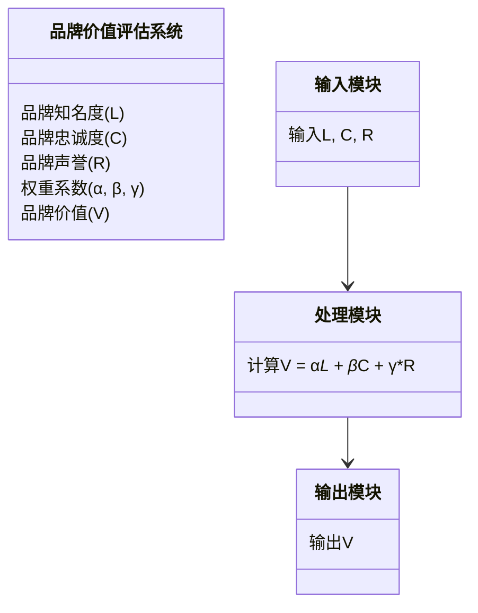
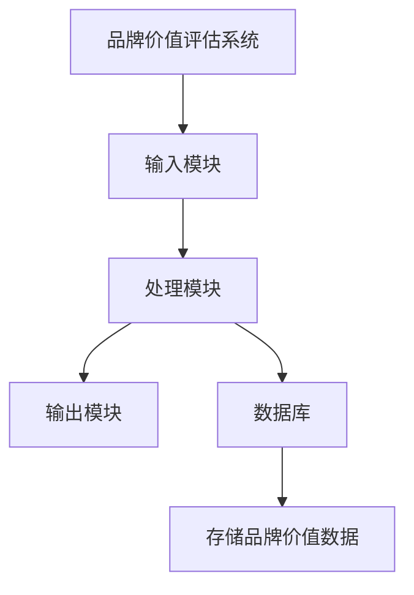
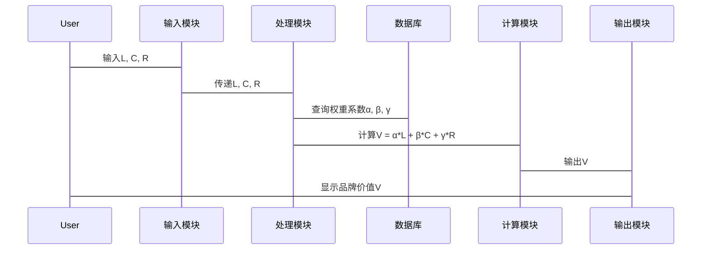

                 


# 巴菲特的品牌价值评估：无形资产如何创造超额回报

> **关键词**：巴菲特，品牌价值，无形资产，投资回报，企业价值评估，品牌评估方法

> **摘要**：  
> 本文深入探讨巴菲特的品牌价值评估方法，分析其如何通过无形资产创造超额回报。文章从品牌价值的核心概念出发，结合定量和定性分析方法，阐述品牌价值对企业长期发展的意义，并通过实际案例展示如何将品牌价值评估应用于投资决策中。通过系统化的分析框架和算法模型，本文揭示了品牌价值评估在投资中的关键作用，并提供可操作的实战指南。

---

## 第1章: 品牌价值评估的背景与重要性

### 1.1 什么是品牌价值
品牌价值是企业在市场中通过品牌建设所积累的无形资产，包括品牌知名度、品牌忠诚度、品牌声誉等核心要素。它不仅影响企业的市场地位，还直接影响企业的财务表现和长期盈利能力。

#### 1.1.1 品牌的定义与核心要素
- **品牌定义**：品牌是消费者对企业及其产品的认知和信任的总和。
- **核心要素**：
  1. 品牌知名度：品牌在市场中的可见性和认知度。
  2. 品牌忠诚度：消费者对品牌的偏好和购买意愿。
  3. 品牌声誉：品牌在市场中的信誉和形象。
  4. 品牌强度：品牌在竞争中的优势和抗风险能力。

#### 1.1.2 品牌价值的内涵与外延
- **内涵**：品牌价值是品牌在市场中创造的超额收益能力。
- **外延**：包括品牌对消费者、员工、合作伙伴的价值，以及品牌对企业的长期发展影响。

#### 1.1.3 品牌价值在企业中的作用
- 品牌价值是企业核心竞争力的重要组成部分。
- 品牌价值直接影响企业的市场地位和定价能力。

### 1.2 巴菲特的品牌价值评估方法
#### 1.2.1 巴菲特投资理念概述
巴菲特的投资理念以“价值投资”为核心，注重企业的内在价值和长期盈利能力。他特别关注企业的品牌价值，认为品牌是企业的重要无形资产。

#### 1.2.2 品牌价值在巴菲特投资中的地位
- 品牌价值是巴菲特评估企业的重要指标之一。
- 品牌价值高的企业通常具有更强的市场竞争力和长期盈利能力。

#### 1.2.3 巴菲特品牌价值评估的独特性
- 巴菲特的品牌价值评估注重定性分析和定量分析的结合。
- 他特别关注企业的品牌忠诚度和品牌声誉。

### 1.3 品牌价值评估的必要性
#### 1.3.1 传统财务指标的局限性
- 传统财务指标（如ROE、ROA）无法全面反映企业的品牌价值。
- 品牌价值是企业长期盈利能力的重要驱动因素。

#### 1.3.2 品牌价值对企业长期发展的意义
- 品牌价值是企业市场地位和竞争力的核心体现。
- 品牌价值高的企业通常具有更强的抗风险能力和长期增长潜力。

#### 1.3.3 品牌价值对投资者决策的影响
- 品牌价值是投资者评估企业投资价值的重要依据。
- 品牌价值高的企业通常能够为投资者创造超额回报。

---

## 第2章: 品牌价值的核心概念与联系

### 2.1 品牌价值的核心要素
#### 2.1.1 品牌知名度
- 品牌知名度是品牌在市场中的可见性和认知度。
- 品牌知名度高的企业通常具有更强的市场影响力。

#### 2.1.2 品牌忠诚度
- 品牌忠诚度是消费者对品牌的偏好和购买意愿。
- 品牌忠诚度高的企业通常具有稳定的客户基础和较高的客户 retention率。

#### 2.1.3 品牌认知度
- 品牌认知度是消费者对品牌及其产品的了解程度。
- 品牌认知度高的企业通常具有更强的市场竞争力。

#### 2.1.4 品牌声誉
- 品牌声誉是品牌在市场中的信誉和形象。
- 品牌声誉高的企业通常具有更强的客户信任和市场认可度。

### 2.2 品牌价值与其他无形资产的关系
#### 2.2.1 品牌与企业文化的互动
- 企业文化是品牌价值的重要组成部分。
- 企业文化的强健性直接影响品牌的市场表现和长期价值。

#### 2.2.2 品牌与客户关系的纽带作用
- 品牌是企业与客户之间的重要纽带。
- 品牌价值高的企业通常具有更强的客户 loyalty和客户 retention能力。

#### 2.2.3 品牌与企业创新的相互促进
- 品牌创新是企业保持市场竞争力的重要手段。
- 企业的创新能力直接影响品牌的市场地位和长期价值。

### 2.3 品牌价值的量化维度
#### 2.3.1 市场地位
- 市场地位是品牌在市场中的排名和份额。
- 市场地位高的品牌通常具有更强的市场影响力和竞争能力。

#### 2.3.2 财务表现
- 财务表现是品牌价值的量化指标之一。
- 品牌价值高的企业通常具有较强的盈利能力和发展潜力。

#### 2.3.3 品牌强度
- 品牌强度是品牌在市场中的竞争优势。
- 品牌强度高的企业通常具有更强的市场竞争力和抗风险能力。

#### 2.3.4 竞争优势
- 竞争优势是品牌在市场中的独特优势。
- 竞争优势高的品牌通常具有更强的市场竞争力和长期发展潜力。

---

## 第3章: 品牌价值评估的算法原理

### 3.1 品牌价值评估的数学模型
#### 3.1.1 品牌价值的公式表示
$$ V = \alpha \cdot L + \beta \cdot C + \gamma \cdot R $$
其中，$V$ 表示品牌价值，$L$ 表示品牌知名度，$C$ 表示品牌忠诚度，$R$ 表示品牌声誉，$\alpha$、$\beta$、$\gamma$ 为权重系数。

#### 3.1.2 权重系数的确定方法
- **定性分析**：根据品牌的核心要素（知名度、忠诚度、声誉）的重要性，赋予不同的权重系数。
- **定量分析**：根据企业的历史数据和市场表现，调整权重系数。

### 3.2 品牌价值评估的算法流程
```mermaid
graph TD
    A[品牌价值评估] --> B[收集数据]
    B --> C[计算品牌知名度(L)]
    B --> D[计算品牌忠诚度(C)]
    B --> E[计算品牌声誉(R)]
    C --> F[确定权重系数α]
    D --> G[确定权重系数β]
    E --> H[确定权重系数γ]
    F --> I[计算V=α*L]
    G --> J[计算V=β*C]
    H --> K[计算V=γ*R]
    I --> L[综合品牌价值V]
    J --> L
    K --> L
```

### 3.3 品牌价值评估的Python实现
```python
def calculate_brand_value(L, C, R, alpha=0.5, beta=0.3, gamma=0.2):
    brand_value = alpha * L + beta * C + gamma * R
    return brand_value

# 示例数据
L = 80  # 品牌知名度
C = 70  # 品牌忠诚度
R = 90  # 品牌声誉

value = calculate_brand_value(L, C, R)
print(f"品牌价值为：{value}")
```

---

## 第4章: 品牌价值评估的系统分析与架构设计

### 4.1 问题场景介绍
- **问题场景**：如何系统化地评估企业的品牌价值，并将其应用于投资决策中？
- **目标**：构建一个品牌价值评估系统，帮助企业投资者快速、准确地评估企业的品牌价值。

### 4.2 系统功能设计
#### 4.2.1 领域模型


#### 4.2.2 系统架构


### 4.3 系统接口设计
- **输入接口**：接受品牌知名度、品牌忠诚度、品牌声誉的输入数据。
- **输出接口**：输出品牌价值评估结果。

### 4.4 系统交互流程


---

## 第5章: 项目实战

### 5.1 环境安装
- 安装Python和必要的库（如pandas、numpy）。
- 安装mermaid和相关工具。

### 5.2 核心实现代码
```python
import pandas as pd
import numpy as np

def calculate_brand_value(L, C, R, alpha=0.5, beta=0.3, gamma=0.2):
    brand_value = alpha * L + beta * C + gamma * R
    return brand_value

# 示例数据
data = {
    '品牌A': [80, 70, 90],
    '品牌B': [75, 65, 85],
    '品牌C': [60, 80, 70]
}

df = pd.DataFrame(data)

# 计算品牌价值
results = []
for brand in df.columns:
    L = df[brand][0]
    C = df[brand][1]
    R = df[brand][2]
    value = calculate_brand_value(L, C, R)
    results.append(value)

print(results)
```

### 5.3 案例分析
- **案例背景**：评估三个品牌的品牌价值。
- **数据输入**：品牌A、品牌B、品牌C的品牌知名度、忠诚度和声誉。
- **计算结果**：输出三个品牌的品牌价值。

### 5.4 小结
- 品牌价值评估是企业投资决策的重要工具。
- 通过系统化的评估方法和工具，可以提高评估的准确性和效率。

---

## 第6章: 总结与展望

### 6.1 总结
- 品牌价值是企业的重要无形资产。
- 巴菲特的品牌价值评估方法为投资者提供了重要的参考。
- 通过系统化的评估方法和工具，可以更好地评估品牌价值，并将其应用于投资决策中。

### 6.2 未来展望
- 进一步完善品牌价值评估的数学模型和算法。
- 开发更多的工具和平台，帮助投资者更好地评估品牌价值。
- 探索品牌价值评估在其他领域的应用。

---

## 附录

### 附录A: 巴菲特品牌价值评估工具安装指南
- **工具名称**：品牌价值评估系统。
- **安装步骤**：
  1. 下载并安装Python。
  2. 安装pandas和numpy库。
  3. 下载并安装mermaid工具。

### 附录B: 品牌价值评估代码示例
```python
import pandas as pd
import numpy as np

def calculate_brand_value(L, C, R, alpha=0.5, beta=0.3, gamma=0.2):
    brand_value = alpha * L + beta * C + gamma * R
    return brand_value

# 示例数据
data = {
    '品牌A': [80, 70, 90],
    '品牌B': [75, 65, 85],
    '品牌C': [60, 80, 70]
}

df = pd.DataFrame(data)

# 计算品牌价值
results = []
for brand in df.columns:
    L = df[brand][0]
    C = df[brand][1]
    R = df[brand][2]
    value = calculate_brand_value(L, C, R)
    results.append(value)

print(results)
```

### 附录C: 扩展阅读
- 巴菲特投资哲学：《巴菲特致股东的信》。
- 品牌价值评估：《品牌经济学》。

---

通过本文的详细讲解，我们不仅了解了巴菲特的品牌价值评估方法，还掌握了如何通过系统化的分析和工具来评估品牌价值，并将其应用于投资决策中。希望本文能够为投资者和企业提供有价值的参考和指导。

