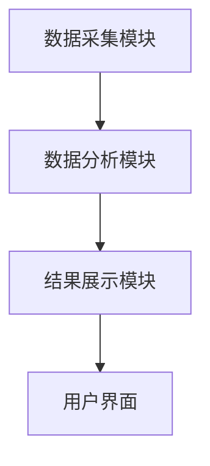
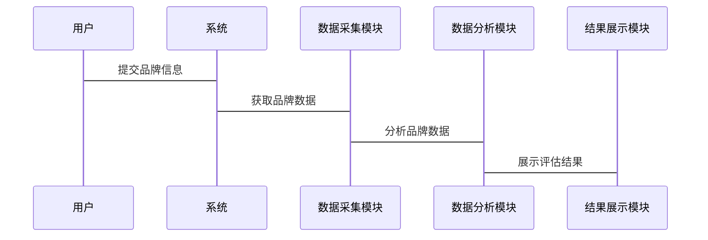

                 


# 巴菲特的品牌价值评估：无形资产的重要性

> 关键词：品牌价值、无形资产、巴菲特、企业价值、投资评估

> 摘要：品牌价值评估是现代企业价值评估的重要组成部分，而无形资产在企业价值中的作用越来越受到重视。本文以巴菲特的投资理念为视角，探讨品牌价值评估的核心概念、数学模型、系统设计和实际案例。通过分析品牌价值评估的数学模型、算法原理、系统架构和项目实战，深入解析巴菲特如何通过品牌价值评估实现投资决策。本文旨在为投资者和企业管理者提供理论依据和实践指导。

---

# 第1章: 背景介绍与核心概念

## 1.1 无形资产在企业中的重要性

### 1.1.1 无形资产的定义与分类

**无形资产**是指企业拥有或控制的没有实物形态的长期资产，主要包括专利权、商标权、品牌价值、商誉、客户关系、技术诀窍等。这些资产无法被触觉感知，但对企业价值的贡献却不可忽视。

| 资产类别 | 描述 | 示例 |
|----------|------|------|
| 品牌价值 | 企业品牌在市场中的认知和价值 | 可口可乐、苹果 |
| 商誉 | 企业并购中形成的超出净资产公允价值的部分 | 谷歌收购YouTube |
| 专利权 | 企业拥有的专利和技术 | 苹果的iPhone专利 |

### 1.1.2 无形资产在企业价值中的占比

随着知识经济的发展，无形资产在企业总价值中的占比逐年增加。根据全球领先咨询公司德勤的报告，无形资产在企业总价值中的占比已从20世纪80年代的20%左右，提升至目前的50%以上。无形资产的评估已成为企业战略决策的重要依据。

### 1.1.3 无形资产对企业竞争力的影响

无形资产是企业核心竞争力的重要来源。例如，苹果的商标和品牌价值使其在全球市场上具有强大的竞争优势。品牌价值不仅体现在市场占有率上，还体现在客户忠诚度和溢价能力上。

## 1.2 品牌价值评估的背景与现状

### 1.2.1 品牌价值评估的起源与发展

品牌价值评估起源于20世纪60年代的美国，随着企业并购的兴起，品牌价值成为企业估值的重要组成部分。20世纪90年代，品牌价值评估方法逐渐成熟，出现了多种评估模型，如加权平均法、层次分析法等。

### 1.2.2 当前品牌价值评估的现状与趋势

当前，品牌价值评估已成为企业战略管理的重要工具。越来越多的企业开始将品牌价值作为衡量企业绩效的重要指标。同时，品牌价值评估的国际化趋势也在加强，国际品牌评估机构如Interbrand、BrandZ等发布的品牌价值排行榜备受关注。

### 1.2.3 无形资产在现代企业中的战略地位

在现代企业中，无形资产不仅是企业价值的重要组成部分，也是企业核心竞争力的体现。例如，谷歌的专利储备使其在全球科技行业具有强大的竞争优势。品牌价值和商誉的评估已成为企业并购、融资和上市的重要环节。

## 1.3 巴菲特投资理念与品牌价值评估

### 1.3.1 巴菲特投资理念的核心思想

巴菲特的投资理念以“价值投资”为核心，强调长期持有优质资产，注重企业的基本面分析。他认为，企业的品牌价值和无形资产是决定企业长期价值的关键因素。

### 1.3.2 巴菲特对品牌价值的关注点

巴菲特在投资过程中特别关注企业的品牌价值和客户忠诚度。他认为，强大的品牌价值能够为企业带来持续的利润和市场优势。例如，他对可口可乐的投资就是基于对其品牌价值和市场地位的认可。

### 1.3.3 巴菲特品牌价值评估的独特视角

巴菲特的品牌价值评估注重企业的长期盈利能力、市场地位和竞争优势。他认为，品牌价值不仅体现在企业的财务表现上，还体现在企业的市场影响力和客户忠诚度上。

## 1.4 本章小结

本章从无形资产的定义和分类出发，分析了品牌价值评估的背景和发展趋势，探讨了巴菲特投资理念与品牌价值评估的独特视角。通过这些分析，我们可以看到，品牌价值评估在现代企业中的重要性日益凸显，而巴菲特的投资理念为我们提供了独特的视角和方法。

---

# 第2章: 品牌价值评估的核心概念与联系

## 2.1 品牌价值评估的定义与属性

### 2.1.1 品牌价值评估的定义

品牌价值评估是通过对品牌资产、品牌忠诚度、品牌认知度等多方面因素的综合分析，估算品牌在市场中的价值。品牌价值是企业整体价值的重要组成部分。

### 2.1.2 品牌价值的核心属性对比表格

以下是品牌价值与企业价值的核心属性对比：

| 属性 | 品牌价值 | 企业价值 |
|------|---------|---------|
| 定义 | 品牌在市场中的价值 | 企业整体的市场价值 |
| 构成 | 品牌知名度、品牌忠诚度等 | 有形资产、无形资产等 |
| 影响因素 | 市场认知度、客户忠诚度 | 财务表现、市场地位等 |

### 2.1.3 品牌价值与企业价值的ER实体关系图

```mermaid
erDiagram
    customer[客户]
    brand[品牌]
    enterprise[企业]
    product[产品]
    sale[销售]
    brand o- customer: "客户对品牌的认知度"
    brand o- product: "产品使用品牌"
    enterprise o- brand: "企业拥有品牌"
    enterprise o- product: "企业生产产品"
    product o- sale: "产品被销售"
```

## 2.2 品牌价值评估的关键要素

### 2.2.1 品牌知名度的评估方法

品牌知名度的评估方法主要包括市场份额分析、品牌认知度调查和品牌提及率分析。例如，可以通过市场调研公司进行抽样调查，了解消费者对品牌的认知程度。

### 2.2.2 品牌忠诚度的衡量指标

品牌忠诚度可以通过客户重复购买率、客户推荐率和客户满意度等指标来衡量。例如，可以通过问卷调查了解客户对品牌的满意度和忠诚度。

### 2.2.3 品牌认知度的分析框架

品牌认知度的分析框架主要包括品牌知名度、品牌联想和品牌认同度三个维度。例如，可以通过消费者调查了解消费者对品牌的联想和认同程度。

## 2.3 品牌价值与企业价值的关系

### 2.3.1 品牌价值对企业整体价值的影响

品牌价值是企业整体价值的重要组成部分。强大的品牌价值可以提升企业的市场地位和竞争优势，从而提高企业整体价值。

### 2.3.2 品牌价值与企业财务表现的关联

品牌价值与企业财务表现密切相关。例如，强大的品牌价值可以提高企业的销售能力和定价能力，从而提升企业的盈利能力。

### 2.3.3 品牌价值在企业并购中的作用

品牌价值在企业并购中具有重要作用。例如，品牌价值是企业并购定价的重要依据，同时也是企业并购后整合的重要内容。

## 2.4 本章小结

本章从品牌价值评估的定义和核心属性出发，分析了品牌价值评估的关键要素及其与企业价值的关系。通过这些分析，我们可以更好地理解品牌价值在企业整体价值中的重要性。

---

# 第3章: 品牌价值评估的数学模型与算法原理

## 3.1 品牌价值评估的数学模型

### 3.1.1 品牌价值评估的加权平均模型

加权平均模型是一种常用的品牌价值评估方法。其基本公式如下：

$$ V = \sum_{i=1}^{n} w_i x_i $$

其中，\( V \) 表示品牌价值，\( w_i \) 表示各因素的权重，\( x_i \) 表示各因素的得分。

### 3.1.2 品牌价值评估的层次分析法（AHP）

层次分析法是一种基于专家判断的品牌价值评估方法。其基本步骤如下：

1. 构建层次分析模型；
2. 确定各层次的因素权重；
3. 进行一致性检验；
4. 计算综合得分。

### 3.1.3 品牌价值评估的回归分析法

回归分析法是一种基于统计学的品牌价值评估方法。其基本步骤如下：

1. 确定自变量和因变量；
2. 建立回归模型；
3. 进行模型拟合和检验；
4. 预测品牌价值。

## 3.2 品牌价值评估的算法原理

### 3.2.1 品牌价值评估的加权平均法公式

$$ V = \sum_{i=1}^{n} w_i x_i $$

其中，\( w_i \) 表示各因素的权重，\( x_i \) 表示各因素的得分。

### 3.2.2 品牌价值评估的层次分析法步骤

1. 构建层次分析模型；
2. 确定各层次的因素权重；
3. 进行一致性检验；
4. 计算综合得分。

### 3.2.3 品牌价值评估的回归分析法流程

1. 确定自变量和因变量；
2. 建立回归模型；
3. 进行模型拟合和检验；
4. 预测品牌价值。

## 3.3 品牌价值评估的案例分析

### 3.3.1 可口可乐品牌价值评估案例

可口可乐的品牌价值评估可以采用加权平均模型。假设品牌知名度、品牌忠诚度和品牌认知度的权重分别为0.5、0.3和0.2，对应的得分为90、85和80，则其品牌价值为：

$$ V = 0.5 \times 90 + 0.3 \times 85 + 0.2 \times 80 = 86.5 $$

### 3.3.2 吉列品牌价值评估案例

吉列的品牌价值评估可以采用层次分析法。假设品牌知名度、品牌忠诚度和品牌认知度的权重分别为0.4、0.3和0.3，对应的得分为85、80和75，则其综合得分为：

$$ V = 0.4 \times 85 + 0.3 \times 80 + 0.3 \times 75 = 80.5 $$

### 3.3.3 巴菲特品牌价值评估方法的实际应用

巴菲特在投资过程中，特别注重企业的品牌价值和客户忠诚度。例如，他对可口可乐的投资就是基于对其品牌价值和市场地位的认可。

## 3.4 本章小结

本章从品牌价值评估的数学模型和算法原理出发，分析了加权平均法、层次分析法和回归分析法的原理和应用。通过案例分析，我们可以更好地理解这些方法的实际应用和效果。

---

# 第4章: 品牌价值评估系统的设计与实现

## 4.1 系统分析与架构设计

### 4.1.1 品牌价值评估系统的功能需求

品牌价值评估系统需要具备数据采集、数据分析和结果展示三大功能模块。

### 4.1.2 品牌价值评估系统的架构设计



### 4.1.3 系统接口设计与交互流程



## 4.2 系统功能模块实现

### 4.2.1 数据采集模块的设计与实现

数据采集模块负责收集品牌相关的数据，包括品牌知名度、品牌忠诚度和品牌认知度等。

### 4.2.2 数据分析模块的核心算法

数据分析模块采用加权平均模型进行品牌价值评估：

$$ V = \sum_{i=1}^{n} w_i x_i $$

### 4.2.3 结果展示模块的可视化设计

结果展示模块通过图表的形式展示品牌价值评估结果，例如柱状图、饼图等。

## 4.3 系统实现的代码与分析

### 4.3.1 环境安装与配置

需要安装Python、Pandas、Matplotlib等库。

### 4.3.2 核心算法实现的Python源代码

```python
import pandas as pd
import matplotlib.pyplot as plt

# 数据输入
brand_name = input("请输入品牌名称：")
weight1 = float(input("请输入品牌知名度权重："))
weight2 = float(input("请输入品牌忠诚度权重："))
weight3 = float(input("请输入品牌认知度权重："))
score1 = float(input("请输入品牌知名度得分："))
score2 = float(input("请输入品牌忠诚度得分："))
score3 = float(input("请输入品牌认知度得分："))

# 计算品牌价值
value = weight1 * score1 + weight2 * score2 + weight3 * score3
print(f"{brand_name}的品牌价值为：{value:.2f}")

# 可视化展示
plt.bar(['品牌知名度', '品牌忠诚度', '品牌认知度'], [score1, score2, score3])
plt.title(f"{brand_name}品牌价值评估")
plt.show()
```

### 4.3.3 代码运行结果与分析

运行上述代码，输入品牌名称及相关权重和得分，即可计算出品牌价值并生成可视化图表。

## 4.4 本章小结

本章从品牌价值评估系统的功能需求和架构设计出发，详细介绍了系统的实现过程，包括数据采集、数据分析和结果展示模块的设计与实现。通过代码和图表的展示，我们可以更好地理解品牌价值评估系统的实际应用。

---

# 第5章: 项目实战——巴菲特品牌价值评估方法的实际应用

## 5.1 项目背景与目标

本项目旨在通过巴菲特的品牌价值评估方法，评估某公司的品牌价值，并为企业提供战略决策依据。

## 5.2 项目实施过程

### 5.2.1 数据收集与整理

收集目标公司的品牌知名度、品牌忠诚度和品牌认知度等数据。

### 5.2.2 数据分析与评估

采用加权平均模型进行品牌价值评估：

$$ V = \sum_{i=1}^{n} w_i x_i $$

### 5.2.3 结果展示与分析

通过图表形式展示品牌价值评估结果，并进行分析。

## 5.3 项目成果与总结

### 5.3.1 项目成果

通过本项目，我们成功评估了目标公司的品牌价值，并为企业提供了战略决策依据。

### 5.3.2 项目总结

本项目充分展示了巴菲特品牌价值评估方法的实际应用价值。通过科学的品牌价值评估，企业可以更好地制定品牌战略，提升品牌价值。

## 5.4 本章小结

本章通过实际项目案例，展示了巴菲特品牌价值评估方法的实际应用过程和成果。通过本项目的实施，我们可以更好地理解品牌价值评估的重要性及其实际应用价值。

---

# 第6章: 总结与展望

## 6.1 本章总结

本文从品牌价值评估的背景与核心概念出发，详细分析了品牌价值评估的数学模型与算法原理，并通过系统设计与项目实战，展示了巴菲特品牌价值评估方法的实际应用。通过这些分析，我们可以更好地理解品牌价值评估的重要性及其在现代企业中的应用价值。

## 6.2 未来展望

未来，随着人工智能和大数据技术的发展，品牌价值评估将更加精准和科学。企业可以通过技术创新，进一步提升品牌价值评估的准确性和效率。

---

# 关键词：品牌价值、无形资产、巴菲特、企业价值、投资评估

---

# 总结

通过本文的分析与探讨，我们可以看到，品牌价值评估是现代企业价值评估的重要组成部分，而无形资产在企业价值中的作用越来越受到重视。巴菲特的品牌价值评估方法为我们提供了独特的视角和方法，通过科学的品牌价值评估，企业可以更好地制定品牌战略，提升品牌价值。未来，随着技术的进步，品牌价值评估将更加精准和科学，为企业创造更大的价值。

