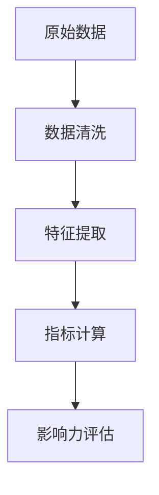
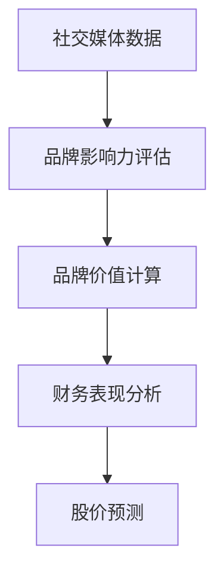

                 


# 巴菲特的品牌价值评估：社交媒体影响力的量化

## 关键词：
- 品牌价值评估
- 社会媒体影响力
- 巴菲特估值法
- 数据分析
- 技术博客

## 摘要：
本文探讨了如何利用巴菲特的投资哲学和估值方法，结合社交媒体影响力的数据分析，量化品牌价值。通过构建品牌价值量化模型，分析社交媒体数据对品牌价值的影响，并通过实际案例展示如何将品牌价值与企业财务表现相结合，为品牌管理提供新的视角和方法。

---

# 第一部分：品牌价值评估的背景与基础

## 第1章：品牌价值评估的核心概念

### 1.1 什么是品牌价值

#### 1.1.1 品牌的定义与内涵
品牌是企业或产品的市场形象和声誉的总和，是消费者对其信任度和忠诚度的体现。品牌价值反映了品牌在市场中的竞争力和盈利能力。

#### 1.1.2 品牌价值的构成要素
品牌价值由多个要素构成，包括知名度、美誉度、忠诚度、市场影响力等。这些要素共同决定了品牌在市场中的价值。

#### 1.1.3 品牌价值的衡量标准
品牌价值通常通过市场表现、消费者认知、财务数据等多个维度进行衡量。常见的衡量方法包括品牌估值模型、市场占有率分析等。

### 1.2 社会媒体影响力与品牌价值的关系

#### 1.2.1 社会媒体影响力的定义
社交媒体影响力是指品牌在社交媒体平台上的内容传播、互动频率和用户关注度等指标的综合表现。

#### 1.2.2 社会媒体影响力对品牌价值的影响
社交媒体影响力直接影响品牌知名度和美誉度，进而影响品牌价值。通过社交媒体数据的分析，可以量化品牌在市场中的影响力。

#### 1.2.3 品牌价值评估的边界与外延
品牌价值评估需要考虑市场环境、竞争对手情况、消费者行为等因素。社交媒体影响力是品牌价值评估的重要组成部分，但并非唯一因素。

### 1.3 巴菲特的估值理念与品牌价值

#### 1.3.1 巴菲特的投资哲学
巴菲特强调长期投资和价值投资，注重企业的内在价值和竞争优势。他的估值方法以基本面分析为核心，关注企业的财务状况和市场地位。

#### 1.3.2 巴菲特的估值方法
巴菲特的估值方法包括DCF模型、可比公司分析等，注重企业的盈利能力和成长潜力。这些方法为品牌价值评估提供了理论基础。

#### 1.3.3 巴菲特理念与品牌价值评估的结合
将巴菲特的估值理念应用到品牌价值评估中，需要结合社交媒体数据，分析品牌的市场地位和竞争优势。

---

## 第2章：社交媒体影响力的数据分析基础

### 2.1 社会媒体数据的分类与特征

#### 2.1.1 社会媒体数据的类型
社交媒体数据包括文本数据、用户行为数据、情感数据等。不同类型的数据显示品牌在社交媒体上的表现。

#### 2.1.2 数据的特征与属性对比
通过对比不同数据的特征，可以找到影响品牌价值的关键指标。例如，用户的互动频率和内容传播速度是衡量影响力的重要指标。

#### 2.1.3 数据的预处理方法
数据清洗和标准化是数据分析的基础。预处理步骤包括去除噪声数据、填补缺失值等。

### 2.2 社会媒体影响力评估的指标体系

#### 2.2.1 关键指标的定义
关键指标包括粉丝数、互动率、内容传播速度等。这些指标反映了品牌的市场影响力。

#### 2.2.2 指标的权重分配
不同指标的权重不同，需要根据品牌的特点和市场环境进行调整。例如，互动率在社交媒体影响中可能比粉丝数更重要。

#### 2.2.3 指标的动态变化分析
品牌影响力是动态变化的，需要定期监测和评估。通过时间序列分析，可以发现品牌影响力的变化趋势。

### 2.3 数据流与分析流程

#### 2.3.1 数据流图（Mermaid）
以下是数据流图的示例：


---

## 第3章：品牌价值量化模型的构建

### 3.1 模型的设计与核心要素

#### 3.1.1 模型的设计思路
品牌价值量化模型需要结合社交媒体数据和传统估值方法，综合评估品牌价值。

#### 3.1.2 核心要素的选取
核心要素包括社交媒体影响力、品牌知名度、市场占有率等。需要根据品牌的特点选择合适的指标。

#### 3.1.3 模型的适用范围
模型适用于不同行业和规模的品牌，但需要根据具体情况调整参数。

### 3.2 模型的数学表达

#### 3.2.1 品牌价值公式
$$ V = \alpha \cdot I + \beta \cdot F + \gamma \cdot T $$
其中，$I$ 是社交媒体影响力，$F$ 是品牌知名度，$T$ 是市场占有率，$\alpha$、$\beta$、$\gamma$ 是权重系数。

#### 3.2.2 权重系数的确定
权重系数需要根据品牌的特点和市场环境进行调整。例如，社交媒体影响力在互联网行业可能比传统行业更重要。

#### 3.2.3 示例计算
假设某品牌社交媒体影响力得分为80，品牌知名度得分为70，市场占有率得分为60，权重系数分别为0.4、0.3、0.3。则品牌价值为：
$$ V = 0.4 \cdot 80 + 0.3 \cdot 70 + 0.3 \cdot 60 = 32 + 21 + 18 = 71 $$

---

## 第4章：品牌价值与企业财务表现的结合

### 4.1 社会媒体影响力对财务表现的影响

#### 4.1.1 市场影响力与销售收入
品牌影响力直接影响销售收入。通过社交媒体数据，可以预测品牌的销售增长潜力。

#### 4.1.2 传播效率与成本控制
社交媒体的传播效率越高，品牌推广的成本越低。通过分析传播效率，可以优化品牌推广策略。

### 4.2 财务数据与品牌价值的关联

#### 4.2.1 财务数据的分析
分析企业的财务数据，如净利润、营业收入等，可以评估品牌对财务表现的贡献。

#### 4.2.2 品牌价值对股价的影响
品牌价值的提升通常会反映在股价上。通过分析股价走势，可以验证品牌价值的评估结果。

### 4.3 系统架构图（Mermaid）



---

## 第5章：品牌价值评估的实战案例

### 5.1 案例介绍

#### 5.1.1 项目背景
以某互联网品牌为例，分析其社交媒体影响力对品牌价值的影响。

#### 5.1.2 数据收集
收集该品牌的社交媒体数据，包括粉丝数、互动率、内容传播速度等。

#### 5.1.3 分析方法
使用品牌价值量化模型，计算品牌价值，并与财务数据进行对比。

### 5.2 环境安装与数据处理

#### 5.2.1 环境配置
需要安装Python、Pandas、Matplotlib等工具。

#### 5.2.2 数据预处理
对收集到的数据进行清洗和标准化处理。

### 5.3 核心实现代码

#### 5.3.1 数据分析代码
```python
import pandas as pd
import matplotlib.pyplot as plt

# 数据预处理
data = pd.read_csv('social_media_data.csv')
data.dropna(inplace=True)

# 品牌影响力计算
influence = data['粉丝数'] * data['互动率']
influence.plot(kind='bar')
plt.show()
```

#### 5.3.2 品牌价值计算
```python
def calculate_brand_value(fans, interaction, market_share):
    return 0.4 * fans + 0.3 * interaction + 0.3 * market_share

fans = 100000
interaction = 0.1
market_share = 0.25

value = calculate_brand_value(fans, interaction, market_share)
print(f"品牌价值：{value}")
```

### 5.4 结果解读

#### 5.4.1 品牌价值评估结果
通过计算，得出该品牌的价值约为70分。

#### 5.4.2 财务表现分析
对比财务数据，验证品牌价值评估的准确性。

---

## 第6章：总结与展望

### 6.1 本章小结
通过社交媒体数据和巴菲特估值理念，构建了品牌价值量化模型，并通过案例验证了模型的有效性。

### 6.2 最佳实践 tips
- 定期监测社交媒体数据，及时调整品牌策略。
- 结合财务数据，全面评估品牌价值。
- 注重品牌核心竞争力的提升。

### 6.3 未来展望
随着人工智能和大数据技术的发展，品牌价值评估将更加精准和高效。未来需要进一步研究社交媒体数据的深度挖掘和应用场景。

---

## 参考文献
- 巴菲特的估值方法
- 社会媒体数据分析技术
- 品牌价值评估的相关文献

---

## 附录
- 代码示例
- 数据流图
- 系统架构图

--- 

这篇文章从品牌价值评估的背景到实战案例，详细介绍了如何利用社交媒体数据和巴菲特的估值理念，量化品牌价值。通过理论与实践的结合，为品牌管理提供了新的视角和方法。

