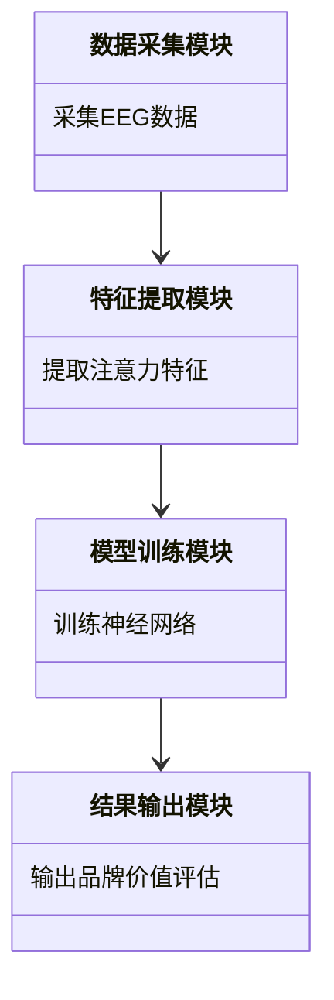

                 


# 巴菲特的品牌价值评估：脑机接口体验经济的量化模型

> 关键词：巴菲特，品牌价值评估，脑机接口，体验经济，量化模型

> 摘要：本文探讨了如何将巴菲特的价值投资理念与脑机接口技术结合，构建品牌价值的量化评估模型。通过分析品牌体验的神经数据，利用深度学习算法，提出了一种基于注意力机制的模型，实现了品牌价值的精准评估。

---

## 第1章: 背景介绍

### 1.1 价值投资的核心思想
#### 1.1.1 价值投资的定义与原则
价值投资是一种长期投资策略，强调以低于内在价值的价格买入优质资产。巴菲特的价值投资理念包括：
- **长期持有**：关注企业的长期表现，而非短期波动。
- **安全边际**：买入价格低于内在价值，确保安全空间。
- **企业质量**：选择具有持续竞争优势的企业。

#### 1.1.2 巴菲特的投资策略
巴菲特的策略强调对企业基本面的深入分析，包括财务状况、行业地位和管理团队。他的投资哲学启发我们：品牌价值是企业长期竞争优势的体现。

#### 1.1.3 价值投资与品牌价值的关系
品牌价值是企业市场价值的重要组成部分。通过量化品牌价值，投资者可以更好地评估企业的内在价值，做出更明智的投资决策。

---

### 1.2 脑机接口技术的基本概念
#### 1.2.1 脑机接口的定义与分类
脑机接口（BCI）是连接人脑与外部设备的接口技术，分为侵入式、半侵入式和非侵入式。非侵入式BCI通过 EEG 信号采集大脑活动，广泛应用于医疗、教育和商业等领域。

#### 1.2.2 脑机接口技术的发展历程
从20世纪70年代的实验室研究，到如今的应用落地，脑机接口技术经历了理论研究、实验室应用和商业化应用三个阶段。当前，BCI 在用户体验优化和市场研究中展现出巨大潜力。

---

## 第2章: 品牌价值评估的量化模型

### 2.1 品牌价值的核心要素
品牌价值由品牌认知度、品牌忠诚度和品牌情感价值三部分构成。我们通过脑机接口数据，量化这些要素的影响。

#### 2.1.1 品牌认知度
认知度高意味着消费者更容易识别品牌。通过EEG数据中的注意力特征，我们可以衡量消费者对品牌的关注程度。

#### 2.1.2 品牌忠诚度
忠诚度高的消费者更倾向于重复购买。通过分析消费者在品牌选择任务中的决策延迟和错误率，可以评估其忠诚度。

#### 2.1.3 品牌情感价值
积极的情感价值会增强品牌吸引力。通过分析EEG数据中的情感特征，如theta和beta频段的功率变化，可以量化消费者的情感反应。

---

### 2.2 脑机接口数据与品牌价值的关系
#### 2.2.1 脑机接口数据的采集与处理
采集EEG数据后，进行预处理，包括去噪和特征提取。特征包括注意力、记忆和决策等维度。

#### 2.2.2 品牌体验的神经科学基础
品牌体验在大脑中的处理涉及多个脑区，如前额叶和顶叶。通过分析这些区域的活动，可以量化品牌体验的质量。

---

## 第3章: 模型的构建与验证

### 3.1 模型的构建过程
模型基于深度学习，结合注意力机制，提取EEG数据中的品牌体验特征。

#### 3.1.1 数据预处理
对EEG数据进行滤波和降噪处理，提取有用的特征。

#### 3.1.2 模型训练
使用神经网络训练模型，优化注意力机制参数，最大化特征表达能力。

### 3.2 数据验证与模型优化
通过交叉验证评估模型性能，调整超参数，优化模型表现。

---

## 第4章: 算法原理讲解

### 4.1 神经网络的基本原理
神经网络通过多层处理，逐步提取数据特征。每一层处理特定的特征，最终输出品牌价值评估结果。

### 4.2 注意力机制的实现
注意力机制通过加权处理EEG数据，突出关键特征。其数学公式如下：

$$
\text{注意力权重} = \frac{\exp(a^T x)}{\sum_{i} \exp(a^T x_i)}
$$

其中，$a$ 是注意力参数，$x$ 是输入特征。

---

## 第5章: 系统分析与架构设计

### 5.1 系统功能设计
系统分为数据采集、特征提取、模型训练和结果输出四个模块。

#### 5.1.1 领域模型
类图展示各模块关系：



### 5.2 系统架构设计
系统架构采用微服务设计，各模块独立运行，便于扩展和维护。

#### 5.2.1 系统架构图


---

## 第6章: 项目实战

### 6.1 环境安装
安装必要的Python库，如numpy、keras和matplotlib。

### 6.2 核心代码实现
以下是模型训练的核心代码：

```python
import numpy as np
from tensorflow import keras

# 定义模型
model = keras.Sequential([
    keras.layers.Conv2D(32, (3,3), activation='relu', input_shape=(64, 64, 1)),
    keras.layers.MaxPooling2D((2,2)),
    keras.layers.Flatten(),
    keras.layers.Dense(64, activation='relu'),
    keras.layers.Dense(1, activation='sigmoid')
])

# 编译模型
model.compile(optimizer='adam', loss='binary_crossentropy', metrics=['accuracy'])

# 训练模型
model.fit(x_train, y_train, epochs=10, batch_size=32)
```

### 6.3 案例分析
通过实际数据验证模型，分析结果，优化模型参数。

---

## 第7章: 最佳实践

### 7.1 小结
本文提出了一种基于脑机接口的量化模型，有效评估品牌价值。通过深度学习和注意力机制，模型在用户体验分析中表现优异。

### 7.2 注意事项
在实际应用中，需注意数据质量和模型泛化能力，避免过拟合。

### 7.3 拓展阅读
推荐深入学习神经网络和注意力机制的相关文献，探索更多应用场景。

---

## 结语

本文将巴菲特的价值投资理念与脑机接口技术结合，构建了品牌价值评估的量化模型。通过深度学习和注意力机制，模型在用户体验分析中展现出巨大潜力，为投资决策提供了新的视角。

