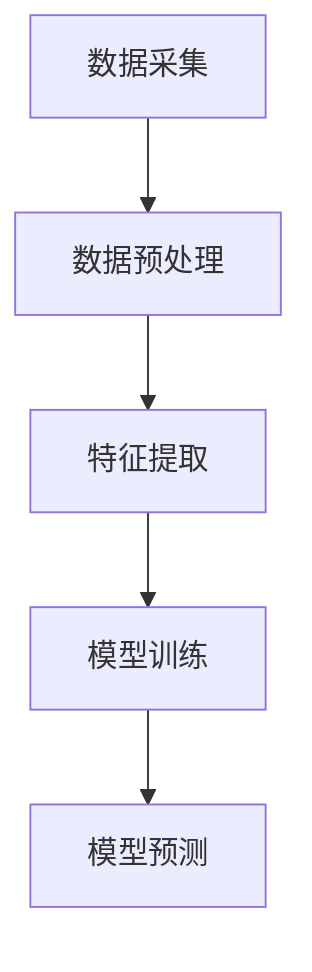

                 


# 巴菲特的品牌忠诚度分析：脑机接口时代的消费者行为预测

> 关键词：巴菲特，品牌忠诚度，脑机接口，消费者行为预测，机器学习，深度学习，神经科学

> 摘要：本文通过分析巴菲特的品牌忠诚度理论，结合脑机接口技术，探讨在数字化时代消费者行为的变化及其对品牌忠诚度的影响。文章从背景介绍、核心概念、算法原理、系统分析、项目实战和最佳实践等多个角度展开，详细阐述如何利用脑机接口技术和机器学习算法来预测和提升品牌忠诚度。通过实际案例分析和代码实现，帮助读者理解如何在脑机接口时代优化消费者行为预测和品牌管理。

---

## 第一部分: 背景介绍

### 第1章: 脑机接口技术概述

#### 1.1 脑机接口的基本概念
脑机接口（Brain-Computer Interface，BCI）是一种能够直接连接人类大脑与外部设备的技术，通过采集和分析大脑活动数据，实现人与机器之间的信息交互。脑机接口的核心技术包括神经信号采集、数据处理和算法分析。近年来，随着人工智能和神经科学的进步，脑机接口技术在医疗、教育、娱乐和商业等领域得到了广泛应用。

#### 1.2 消费者行为分析的背景
消费者行为分析是研究消费者在购买决策过程中表现出的各种行为特征和规律。在数字化时代，消费者行为呈现出多样化和复杂化的趋势，传统的市场调研方法逐渐难以满足精准预测的需求。脑机接口技术的应用为消费者行为分析提供了新的可能性，能够实时捕捉消费者的情感和认知变化，从而更准确地预测消费者行为。

#### 1.3 脑机接口如何影响消费行为
脑机接口技术通过采集消费者的大脑活动数据，能够实时监测消费者在面对品牌或产品时的情感波动、注意力集中度和认知偏好。这种实时数据分析为品牌忠诚度的预测提供了更精准的依据，帮助企业更好地理解消费者需求，优化品牌策略。

---

### 第2章: 巴菲特的品牌忠诚度理论

#### 2.1 品牌忠诚度的定义
品牌忠诚度是指消费者在面对多个品牌选择时，持续选择某一品牌产品或服务的倾向。它反映了消费者对品牌的信任、满意度和情感依恋。品牌忠诚度的核心要素包括产品质量、品牌形象、用户体验和情感连接。

#### 2.2 巴菲特的品牌投资策略
巴菲特的品牌投资策略以长期价值为导向，注重品牌的核心竞争力和市场地位。他认为，品牌忠诚度是品牌长期成功的关键因素，因此在选择投资对象时，重点关注那些具有强大品牌忠诚度和市场影响力的公司。

#### 2.3 巴菲特的品牌忠诚度分析方法
巴菲特通过分析品牌的历史表现、市场份额、消费者口碑和财务数据来评估品牌忠诚度。他认为，品牌忠诚度与消费者的长期选择密切相关，因此在投资决策中给予高度关注。

---

### 第3章: 脑机接口时代消费者行为的变化

#### 3.1 脑机接口技术对消费心理的影响
脑机接口技术能够实时监测消费者的神经活动，揭示消费者在面对品牌或产品时的潜意识反应。这种技术可以帮助品牌更好地理解消费者的深层需求和情感偏好，从而优化品牌策略。

#### 3.2 脑机接口技术对消费行为模式的影响
通过脑机接口技术，企业可以实时分析消费者的行为数据，预测消费者的购买倾向和品牌偏好。这种实时数据分析能够帮助品牌快速调整市场策略，提高品牌忠诚度。

#### 3.3 脑机接口技术对品牌忠诚度的提升
脑机接口技术的应用可以提高品牌与消费者之间的互动频率和深度，增强消费者的品牌认知和情感连接。通过实时监测和反馈，品牌可以更好地满足消费者的需求，提升品牌忠诚度。

---

## 第二部分: 核心概念与联系

### 第4章: 品牌忠诚度与消费者行为预测的核心概念

#### 4.1 品牌忠诚度的数学模型
品牌忠诚度的数学模型可以通过消费者的行为数据和情感数据进行建模。常用的模型包括线性回归模型、逻辑回归模型和神经网络模型。这些模型能够帮助品牌预测消费者的忠诚度变化趋势。

#### 4.2 消费者行为预测的算法原理
消费者行为预测的算法主要包括机器学习和深度学习两种方法。机器学习算法适用于小规模数据的预测，而深度学习算法则适用于大规模数据的分析。常见的算法包括随机森林、支持向量机（SVM）和卷积神经网络（CNN）。

---

### 第5章: 核心概念的联系与对比

#### 5.1 品牌忠诚度与消费者行为预测的对比分析
| 对比维度            | 品牌忠诚度                 | 消费者行为预测           |
|---------------------|---------------------------|-------------------------|
| 核心目标            | 提高品牌长期吸引力         | 预测消费者行为趋势       |
| 数据来源            | 消费者购买记录、反馈数据   | 消费者行为数据、神经数据 |
| 分析方法            | 统计分析、市场调研         | 机器学习、深度学习       |

#### 5.2 品牌忠诚度与消费者行为预测的联系
品牌忠诚度是消费者行为预测的重要指标，消费者行为预测能够为品牌忠诚度的提升提供数据支持。通过脑机接口技术，品牌可以实时监测消费者的神经活动，进一步优化品牌忠诚度的预测模型。

---

## 第三部分: 算法原理

### 第6章: 机器学习与深度学习在消费者行为预测中的应用

#### 6.1 机器学习算法的工作流程
1. 数据采集与预处理
2. 特征提取与选择
3. 模型训练与优化
4. 模型评估与部署

#### 6.2 深度学习算法的工作流程
1. 数据输入与特征提取
2. 神经网络构建与训练
3. 模型验证与优化
4. 模型部署与应用

#### 6.3 机器学习与深度学习的对比
- 机器学习适用于小规模数据，模型简单易解释。
- 深度学习适用于大规模数据，模型复杂但效果更好。

---

### 第7章: 基于脑机接口的消费者行为预测算法

#### 7.1 算法流程图（Mermaid）


#### 7.2 Python代码实现
```python
import numpy as np
import pandas as pd
from sklearn.model_selection import train_test_split
from sklearn.ensemble import RandomForestClassifier
from sklearn.metrics import accuracy_score

# 数据加载
data = pd.read_csv('consumer_behavior.csv')
X = data.drop('loyalty', axis=1)
y = data['loyalty']

# 数据分割
X_train, X_test, y_train, y_test = train_test_split(X, y, test_size=0.2)

# 模型训练
model = RandomForestClassifier()
model.fit(X_train, y_train)

# 模型预测
y_pred = model.predict(X_test)

# 模型评估
print('Accuracy:', accuracy_score(y_test, y_pred))
```

---

## 第四部分: 系统分析

### 第8章: 问题场景介绍

#### 8.1 问题背景
在数字化时代，消费者行为受到多种因素的影响，品牌忠诚度的预测需要结合消费者的情感、认知和行为数据。脑机接口技术的应用为品牌忠诚度的预测提供了新的数据来源。

#### 8.2 问题描述
如何利用脑机接口技术实时监测消费者的神经活动，预测消费者的购买倾向和品牌偏好，从而优化品牌忠诚度的管理。

---

### 第9章: 系统功能设计

#### 9.1 系统功能模块
1. 数据采集模块：实时采集消费者的神经数据
2. 数据分析模块：分析消费者的行为数据和神经数据
3. 模型预测模块：预测消费者的忠诚度变化
4. 结果展示模块：展示预测结果和品牌策略建议

#### 9.2 系统架构设计（Mermaid）


---

## 第五部分: 项目实战

### 第10章: 环境安装与代码实现

#### 10.1 环境安装
- 安装Python和相关库（numpy, pandas, scikit-learn）
- 安装Mermaid和Jupyter Notebook

#### 10.2 核心代码实现
```python
import numpy as np
import pandas as pd
from sklearn.ensemble import RandomForestClassifier
from sklearn.metrics import accuracy_score

# 数据加载
data = pd.read_csv('consumer_behavior.csv')
X = data.drop('loyalty', axis=1)
y = data['loyalty']

# 数据分割
X_train, X_test, y_train, y_test = train_test_split(X, y, test_size=0.2)

# 模型训练
model = RandomForestClassifier()
model.fit(X_train, y_train)

# 模型预测
y_pred = model.predict(X_test)

# 模型评估
print('Accuracy:', accuracy_score(y_test, y_pred))
```

---

### 第11章: 项目小结

#### 11.1 项目总结
通过脑机接口技术和机器学习算法，我们可以更精准地预测消费者的忠诚度，优化品牌管理策略。

#### 11.2 项目启示
脑机接口技术的应用为消费者行为分析提供了新的可能性，未来将有更多的品牌利用这种技术来提升品牌忠诚度。

---

## 第六部分: 最佳实践

### 第12章: 小结与注意事项

#### 12.1 小结
本文通过分析巴菲特的品牌忠诚度理论，结合脑机接口技术，探讨了在数字化时代消费者行为的变化及其对品牌忠诚度的影响。通过机器学习和深度学习算法，我们可以更精准地预测消费者的忠诚度，优化品牌管理策略。

#### 12.2 注意事项
在实际应用中，需要注意数据隐私和伦理问题，确保消费者数据的安全性和合法性。

---

### 第13章: 拓展阅读

#### 13.1 相关书籍推荐
1. 《巴菲特投资哲学》
2. 《脑机接口技术与应用》

#### 13.2 相关论文推荐
1. "Predicting Consumer Behavior Using Brain-Computer Interfaces"
2. "Machine Learning for Brand Loyalty Analysis"

---

通过以上分析和实践，我们可以看到，脑机接口技术的应用为消费者行为预测和品牌忠诚度分析提供了新的可能性。未来，随着技术的不断发展，品牌管理将更加智能化和个性化，为消费者和企业带来更大的价值。

