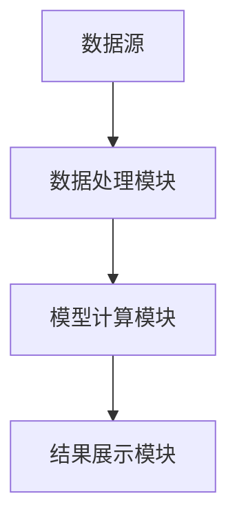

                 

# 巴菲特的品牌溢价理论：数字原生品牌的价值评估

> 关键词：巴菲特，品牌溢价，数字原生品牌，价值评估，层次分析法，系统架构，实战案例

> 摘要：本文通过结合巴菲特的品牌溢价理论，深入探讨数字原生品牌的独特价值和评估方法。文章从品牌溢价的定义出发，分析数字原生品牌的特性及其与传统品牌的差异，并提出基于层次分析法的评估模型，结合实际案例进行详细解析，最后总结数字原生品牌在数字时代的竞争优势和发展趋势。

---

# 正文

## 第一章: 巴菲特品牌溢价理论概述

### 1.1 品牌溢价的定义与核心概念

品牌溢价是巴菲特投资理论中的一个重要概念，指的是品牌在市场中超出其基础价值的额外价值。品牌溢价的核心在于品牌所带来的信任、忠诚度和市场地位。

#### 1.1.1 品牌溢价的定义

品牌溢价是指消费者愿意为某一品牌的产品或服务支付的额外价格。这个额外价格反映了品牌在市场中的独特价值和消费者的偏好。

#### 1.1.2 品牌溢价的核心要素

- **品牌认知度**：消费者对品牌的熟悉程度直接影响品牌溢价能力。
- **品牌忠诚度**：消费者对品牌的忠诚度越高，品牌溢价能力越强。
- **品牌质量**：品牌产品的质量是品牌溢价的基础。
- **品牌创新**：品牌的创新能力是吸引消费者的重要因素。

#### 1.1.3 巴菲特投资理论中的品牌溢价

巴菲特认为，品牌溢价是企业长期竞争优势的重要体现。他倾向于投资那些具有强大品牌溢价能力的企业，因为这些企业能够在市场中持续获得超额利润。

### 1.2 数字原生品牌的特性

#### 1.2.1 数字原生品牌的定义

数字原生品牌是指那些在数字时代从零开始构建的品牌，其核心竞争力来源于数字化技术和互联网平台。

#### 1.2.2 数字原生品牌的核心特征

- **数字化基因**：数字原生品牌从诞生之初就与数字技术密不可分。
- **快速迭代**：数字原生品牌能够快速响应市场变化，进行产品和服务的迭代。
- **数据驱动**：数字原生品牌依赖于数据分析和挖掘技术来优化运营。

#### 1.2.3 数字原生品牌与传统品牌的对比

| 特性                | 数字原生品牌         | 传统品牌           |
|---------------------|--------------------|---------------------|
| 诞生方式           | 数字化构建         | 线下构建           |
| 反应速度           | 快速               | 较慢               |
| 数据依赖性         | 高                 | 较低               |

### 1.3 巴菲特品牌溢价理论的适用性

#### 1.3.1 巴菲特品牌溢价理论的背景

巴菲特的品牌溢价理论主要应用于传统企业，但在数字时代，其理论需要适应数字原生品牌的特点。

#### 1.3.2 理论在数字原生品牌中的应用

数字原生品牌可以通过数据分析和用户行为研究，验证品牌溢价的存在，并通过数字化手段提升品牌溢价能力。

#### 1.3.3 理论的局限性与改进方向

- **局限性**：传统品牌溢价理论更多关注企业长期价值，而数字原生品牌更注重数据驱动的即时价值。
- **改进方向**：结合数字技术，动态调整品牌溢价评估模型。

---

## 第二章: 品牌溢价的评估模型

### 2.1 品牌溢价的层次分析法

#### 2.1.1 层次分析法的基本原理

层次分析法（AHP）是一种用于多因素决策的分析方法，适用于品牌溢价的多维度评估。

#### 2.1.2 品牌溢价评估的层次结构

| 层级                | 具体内容           |
|---------------------|---------------------|
| 目标层             | 品牌溢价评估       |
| 准则层             | 品牌认知度、忠诚度等 |
| 方案层             | 各品牌评估结果       |

#### 2.1.3 层次分析法的计算公式

层次分析法通过计算各因素的权重，确定品牌溢价的能力。计算步骤如下：

1. 构建比较矩阵。
2. 计算特征向量。
3. 计算一致性检验。

公式示例：
$$ A = \begin{bmatrix} 1 & 3 & 2 \\ 1/3 & 1 & 1/2 \\ 1/2 & 2 & 1 \end{bmatrix} $$

---

## 第三章: 数字原生品牌的独特性与价值评估

### 3.1 数字原生品牌的用户行为分析

#### 3.1.1 用户行为的数字化特征

数字原生品牌的用户行为高度依赖于数字化平台，用户数据易于采集和分析。

#### 3.1.2 数字原生品牌用户的决策模型

数字原生品牌的用户决策模型可以表示为：

$$ P = f(D, S, T) $$

其中，$P$ 表示购买概率，$D$ 表示数据驱动因素，$S$ 表示社会影响因素，$T$ 表示时间因素。

### 3.2 数字原生品牌的传播方式

#### 3.2.1 数字化传播渠道的多样性

数字原生品牌可以通过社交媒体、搜索引擎、电子商务平台等多种渠道进行传播。

#### 3.2.2 社交媒体对品牌溢价的影响

社交媒体上的用户互动可以显著提升品牌溢价能力。例如，通过KOL（意见领袖）推广，可以快速提升品牌认知度。

### 3.3 数字原生品牌的市场定位

#### 3.3.1 数字市场定位的策略

数字原生品牌需要结合数据和用户反馈，动态调整市场定位策略。

---

## 第四章: 品牌溢价的系统架构设计

### 4.1 系统功能设计

#### 4.1.1 数据采集模块

数据采集模块负责从各种渠道采集品牌相关数据，包括社交媒体数据、销售数据等。

#### 4.1.2 模型计算模块

模型计算模块基于层次分析法，计算品牌溢价能力。

#### 4.1.3 结果展示模块

结果展示模块以可视化的方式呈现品牌溢价评估结果。

### 4.2 系统架构图

### 4.3 接口设计与交互流程

#### 4.3.1 系统接口设计

系统接口设计需要考虑数据输入、模型计算和结果输出的接口。

#### 4.3.2 用户交互流程

用户通过输入品牌数据，系统输出品牌溢价评估结果。

---

## 第五章: 项目实战——数字原生品牌价值评估案例

### 5.1 项目背景与目标

#### 5.1.1 项目背景

本案例以某新兴数字原生品牌为例，评估其品牌溢价能力。

#### 5.1.2 项目目标

通过层次分析法，评估该品牌的溢价能力，并提出优化建议。

### 5.2 数据收集与处理

#### 5.2.1 数据来源

数据来源包括社交媒体评论、销售数据、用户调研等。

#### 5.2.2 数据清洗与特征提取

数据清洗过程包括去除噪声数据，提取有效特征。

### 5.3 模型计算与结果分析

#### 5.3.1 品牌溢价评估

通过层次分析法，计算各因素的权重，得出品牌溢价能力。

---

## 总结

数字原生品牌在数字时代具有独特的竞争优势，通过结合巴菲特的品牌溢价理论和数字化技术，可以更精准地评估品牌价值。本文通过理论分析和实战案例，展示了数字原生品牌的价值评估方法，为品牌管理者提供了实践指导。

--- 

**注意事项**：本文内容为示例性思考过程，实际撰写时需结合具体数据和案例进行详细分析。

