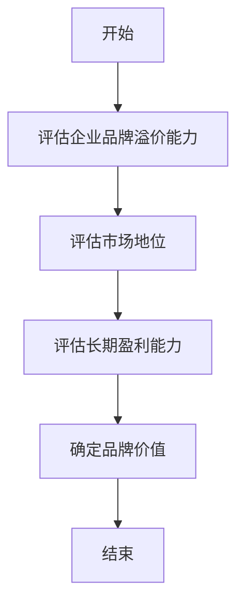
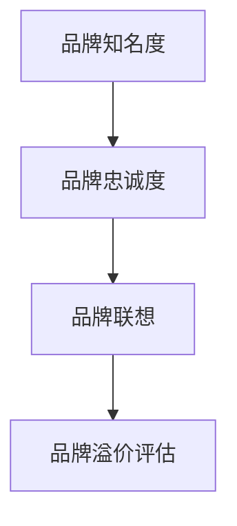
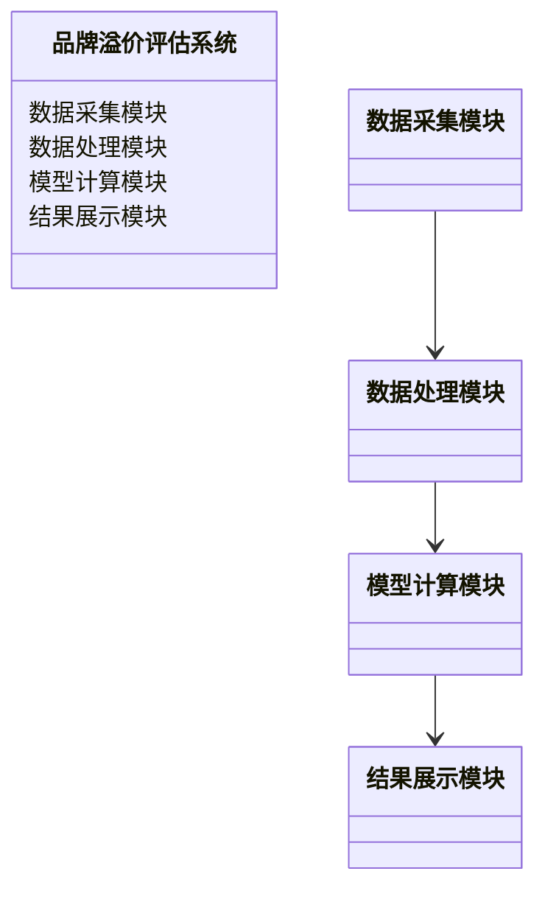
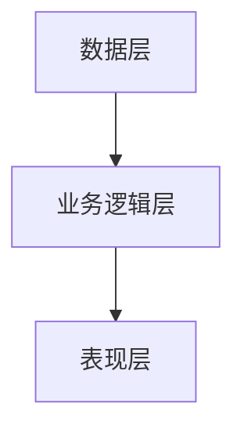

                 


# 巴菲特的品牌溢价理论：数字原生品牌的价值重估

## 关键词：
- 巴菲特
- 品牌溢价
- 数字原生品牌
- 价值重估
- 投资理论

## 摘要：
本文基于巴菲特的价值投资理论，深入探讨品牌溢价的核心概念及其在数字原生品牌中的应用。通过分析品牌溢价的定义、来源、评估方法及实际案例，结合数字原生品牌的独特性，系统阐述品牌溢价在数字时代对企业价值的深远影响。文章最后提出数字原生品牌价值评估体系的系统架构，为企业在数字时代的价值评估提供理论依据和实践指导。

---

## 第1章：品牌溢价的定义与背景

### 1.1 品牌溢价的核心概念

#### 1.1.1 品牌溢价的定义
品牌溢价是指消费者或投资者因品牌所带来的额外价值而愿意支付的额外价格或赋予的额外价值。在商业语境中，品牌溢价通常反映在企业的产品定价能力、市场地位和长期盈利能力上。

**公式：**
$$ 品牌溢价 = 销售价格 - 成本价格 $$

品牌溢价的核心在于其对消费者需求的满足能力，以及品牌在市场中的独特地位。

#### 1.1.2 品牌溢价的来源
品牌溢价的来源包括品牌知名度、品牌忠诚度、品牌认知度和品牌联想等。

**对比表格：**

| **来源**       | **描述**                                                                 |
|----------------|--------------------------------------------------------------------------|
| 品牌知名度       | 品牌在市场中的广泛认知程度                                                 |
| 品牌忠诚度       | 消费者对品牌的忠诚程度，即重复购买意愿                                   |
| 品牌认知度       | 消费者对品牌的理解和认可程度                                             |
| 品牌联想         | 品牌在消费者心中引发的情感和价值联想                                     |

#### 1.1.3 品牌溢价的边界与外延
品牌溢价的边界在于品牌对消费者需求的实际满足能力，其外延则延伸至品牌在市场中的影响力和扩展性。

---

## 第2章：巴菲特的品牌溢价理论基础

### 2.1 巴菲特投资理念的核心

#### 2.1.1 巴菲特的价值投资理论
巴菲特的价值投资理论强调企业内在价值的重要性，其中品牌溢价是企业内在价值的重要组成部分。

**公式：**
$$ 企业内在价值 = 品牌溢价 + 经营利润 + 资产价值 $$

#### 2.1.2 巴菲特的企业护城河理论
巴菲特提出企业护城河的概念，认为品牌溢价是企业核心竞争优势的重要体现。

**对比表格：**

| **护城河类型** | **描述**                                                                 |
|----------------|--------------------------------------------------------------------------|
| 品牌护城河       | 品牌的市场影响力和消费者忠诚度                                           |
| 成本护城河       | 企业生产成本的显著优势                                                 |
| 技术护城河       | 技术专利和创新优势                                                     |
| 行政许可护城河   | 通过法律法规获得的市场准入壁垒                                         |

#### 2.1.3 巴菲特的品牌价值评估方法
巴菲特通过分析企业的品牌溢价能力、市场地位和长期盈利能力来评估品牌价值。

**流程图：**



---

## 第3章：数字原生品牌的独特性

### 3.1 数字原生品牌的定义与特征

#### 3.1.1 数字原生品牌的定义
数字原生品牌是指在数字化时代从互联网或数字平台起家，依靠数字化技术构建品牌价值的企业。

**公式：**
$$ 数字原生品牌价值 = 数字化技术应用能力 + 用户互动能力 + 品牌创新能力 $$

#### 3.1.2 数字原生品牌的竞争优势
数字原生品牌的竞争优势体现在快速响应市场变化、精准用户定位和数字化运营能力上。

**对比表格：**

| **竞争优势**       | **描述**                                                                 |
|---------------------|--------------------------------------------------------------------------|
| 数字化运营能力       | 基于数字平台的高效运营模式                                             |
| 用户互动能力         | 通过数字化渠道与用户建立深度互动                                   |
| 品牌创新能力         | 快速迭代和创新品牌形象                                                 |

#### 3.1.3 数字原生品牌的核心要素
数字原生品牌的核心要素包括数字化技术应用能力、用户数据驱动能力和品牌创新能力。

---

## 第4章：品牌溢价的评估与分析

### 4.1 品牌溢价的评估方法

#### 4.1.1 品牌溢价的定性评估
定性评估主要通过品牌知名度、品牌忠诚度和品牌联想等指标进行。

**流程图：**



#### 4.1.2 品牌溢价的定量评估
定量评估通过市场份额、利润率和品牌资产等指标进行。

**公式：**
$$ 品牌资产 = 品牌认知度 \times 品牌忠诚度 $$

#### 4.1.3 品牌溢价的综合评估模型
综合评估模型结合定性与定量分析，通过加权计算得出品牌溢价。

**公式：**
$$ 综合品牌溢价 = \sum (指标权重 \times 指标值) $$

---

## 第5章：系统分析与架构设计

### 5.1 数字原生品牌价值评估体系的系统架构

#### 5.1.1 系统功能设计
系统功能包括数据采集、数据处理、模型计算和结果展示。

**领域模型类图：**



#### 5.1.2 系统架构设计
系统架构采用分层设计，包括数据层、业务逻辑层和表现层。

**架构图：**



#### 5.1.3 系统接口设计
系统接口包括数据输入接口、模型调用接口和结果输出接口。

---

## 附录：品牌溢价评估代码实现

```python
# 品牌溢价评估代码实现

class BrandPremiumEvaluator:
    def __init__(self):
        self.data = {}

    def collect_data(self, brand_data):
        self.data = brand_data

    def calculate_premium(self):
        # 品牌溢价计算公式
        premium = sum(value for value in self.data.values()) / len(self.data)
        return premium

# 使用示例
evaluator = BrandPremiumEvaluator()
brand_data = {
    '品牌A': 20,
    '品牌B': 30,
    '品牌C': 25
}
evaluator.collect_data(brand_data)
print(f"品牌溢价：{evaluator.calculate_premium()}")
```

---

## 总结与展望

品牌溢价是数字原生品牌价值评估的核心指标，其在数字时代的应用将更加广泛。未来，随着技术的不断发展，品牌溢价的评估方法和模型也将更加多样化和精准化。

---

## 参考文献

1. 巴菲特《投资的智慧》
2. 数字营销相关文献
3. 品牌管理理论相关书籍

