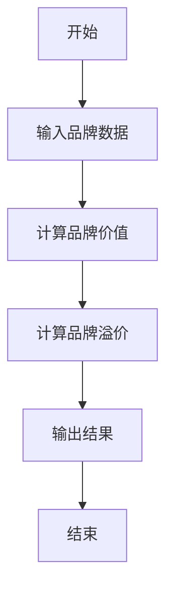
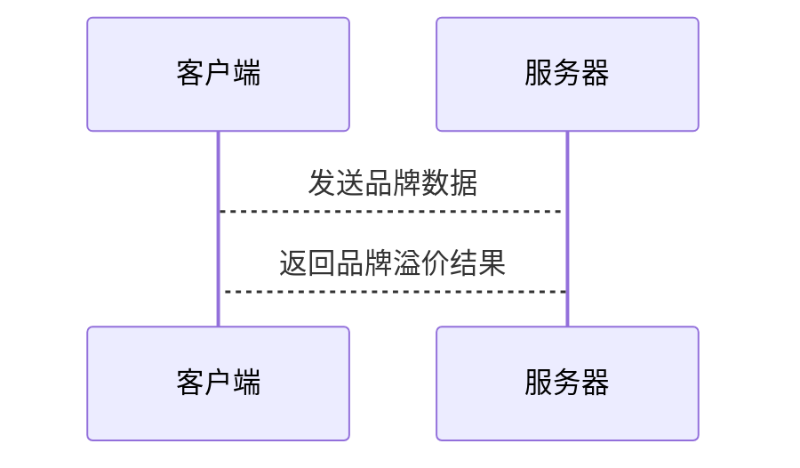

                 


# 巴菲特的品牌溢价理论：无形资产创造超额回报

> **关键词**：品牌溢价、巴菲特投资理论、无形资产、企业价值、品牌价值评估  
> **摘要**：本文深入探讨了巴菲特的品牌溢价理论，分析了无形资产如何为企业创造超额回报。通过背景介绍、核心概念、算法原理、系统架构设计、项目实战及最佳实践，系统性地阐述了品牌溢价的形成机制、评估方法及其在企业投资中的应用。文章结合理论与实践，提供了丰富的案例和详细的数学模型，帮助读者全面理解品牌溢价的价值及其在投资决策中的重要性。

---

## 第一部分：背景介绍

### 第1章：品牌溢价理论的背景介绍

#### 1.1 品牌溢价的定义与核心概念
##### 1.1.1 品牌溢价的定义
品牌溢价是指消费者或市场对企业品牌价值的超额支付部分。简单来说，品牌溢价是消费者愿意为某一品牌的产品或服务支付的额外价格，反映了品牌在市场中的附加价值。

##### 1.1.2 品牌溢价的核心要素
品牌溢价的核心要素包括：
1. **品牌知名度**：品牌在市场中的认知度越高，消费者愿意支付的溢价越高。
2. **品牌忠诚度**：消费者对品牌的偏好程度直接影响品牌溢价的大小。
3. **品牌创新能力**：品牌能够持续推出创新产品或服务，增强市场竞争力，从而提升溢价能力。
4. **品牌市场地位**：品牌在市场中的地位越高，其溢价能力越强。

##### 1.1.3 品牌溢价与企业价值的关系
品牌溢价与企业价值密切相关。高品牌溢价能力的企业通常具有更强的市场定价权和竞争优势，从而能够实现超额回报。

#### 1.2 巴菲特投资理念与品牌溢价
##### 1.2.1 巴菲特的投资哲学
巴菲特的投资哲学以“价值投资”为核心，强调长期持有优质资产，关注企业的基本面和长期盈利能力。他认为，企业品牌的价值是其长期竞争优势的重要体现。

##### 1.2.2 品牌溢价在巴菲特投资中的重要性
巴菲特认为，具有强大品牌溢价能力的企业能够在市场中获得更高的利润率和市场份额，从而为企业创造超额回报。品牌溢价是企业长期竞争优势的重要组成部分。

##### 1.2.3 巴菲特如何识别具有品牌溢价的企业
巴菲特通过分析企业的品牌知名度、市场地位、盈利能力及竞争优势，识别出具有强大品牌溢价能力的企业。例如，可口可乐和苹果就是巴菲特长期看好的具有强大品牌溢价能力的企业。

#### 1.3 品牌溢价的形成机制
##### 1.3.1 品牌溢价的来源
品牌溢价来源于消费者对品牌的信任、忠诚和偏好。这些因素使得消费者愿意为某一品牌支付更高的价格。

##### 1.3.2 品牌溢价的影响因素
品牌溢价的影响因素包括：
1. 品牌知名度
2. 品牌忠诚度
3. 品牌创新能力
4. 市场竞争格局

##### 1.3.3 品牌溢价的量化方法
品牌溢价的量化方法包括：
1. 品牌价值评估
2. 市场定价能力分析
3. 市场份额变化分析

---

## 第二部分：核心概念与联系

### 第2章：品牌溢价的核心概念与联系

#### 2.1 品牌溢价的核心原理
##### 2.1.1 品牌价值的评估方法
品牌价值的评估方法包括：
1. 市场法：基于市场交易数据评估品牌价值。
2. 收益法：基于未来现金流折现评估品牌价值。
3. 成本法：基于品牌建设成本评估品牌价值。

##### 2.1.2 品牌溢价与企业定价策略
品牌溢价与企业定价策略密切相关。企业可以通过品牌溢价提升产品或服务的价格，从而增加利润。

##### 2.1.3 品牌溢价与市场竞争力
品牌溢价是企业市场竞争力的重要体现。强大的品牌溢价能力能够帮助企业在竞争中占据优势地位。

#### 2.2 品牌溢价的属性特征对比
##### 2.2.1 品牌知名度与市场占有率的对比
品牌知名度高通常意味着市场占有率较高，但品牌知名度并不直接等于市场占有率。

##### 2.2.2 品牌忠诚度与客户生命周期价值的对比
品牌忠诚度高的客户通常具有更高的客户生命周期价值，能够为企业带来更多的收入和利润。

##### 2.2.3 品牌创新能力与市场竞争力的对比
品牌创新能力越强，市场竞争力越强，品牌溢价能力也越高。

#### 2.3 品牌溢价的ER实体关系图
以下是品牌溢价的ER实体关系图：

```mermaid
erDiagram
    brand_table
    {
        brand_id : integer
        brand_name : string
        brand_value : float
        brand_premium : float
    }
    customer_table
    {
        customer_id : integer
        customer_name : string
        brand_preference : integer
        purchase_frequency : integer
    }
    transaction_table
    {
        transaction_id : integer
        transaction_date : date
        product_id : integer
        price : float
        customer_id : integer
    }
    brand_table --|{一对多}-> customer_table : 喜欢该品牌的客户
    brand_table --|{一对多}-> transaction_table : 该品牌参与的交易
    customer_table --|{一对一}-> transaction_table : 客户参与的交易
```

---

## 第三部分：算法原理讲解

### 第3章：品牌溢价评估的算法原理

#### 3.1 品牌溢价评估的算法流程
以下是品牌溢价评估的算法流程图：



##### 3.1.1 品牌价值的加权计算
品牌价值的加权计算公式如下：
$$ V = \sum_{i=1}^{n} w_i \times v_i $$
其中，\( w_i \) 是第 \( i \) 个因素的权重，\( v_i \) 是第 \( i \) 个因素的评估值。

##### 3.1.2 品牌溢价的净现值计算
品牌溢价的净现值计算公式如下：
$$ NPV = \sum_{t=1}^{n} \frac{CF_t}{(1 + r)^t} $$
其中，\( CF_t \) 是第 \( t \) 年的现金流，\( r \) 是贴现率。

##### 3.1.3 品牌溢价的动态调整模型
品牌溢价的动态调整模型如下：
$$ P_{t+1} = P_t + \alpha \times (V_t - P_t) $$
其中，\( P_t \) 是第 \( t \) 期的品牌溢价，\( V_t \) 是第 \( t \) 期的品牌价值，\( \alpha \) 是调整系数。

#### 3.2 品牌溢价评估的数学模型
##### 3.2.1 品牌价值计算公式
$$ V = \sum_{t=1}^{n} \frac{C_t}{(1 + r)^t} $$
其中，\( C_t \) 是第 \( t \) 期的现金流，\( r \) 是贴现率。

##### 3.2.2 品牌溢价计算公式
$$ P = V - B $$
其中，\( V \) 是品牌价值，\( B \) 是基础价值。

---

## 第四部分：系统架构设计

### 第4章：品牌溢价评估系统架构设计

#### 4.1 系统功能设计
以下是品牌溢价评估系统的领域模型：

```mermaid
classDiagram
    class 品牌溢价评估系统
    {
        品牌数据输入
        品牌价值计算
        品牌溢价计算
        结果输出
    }
    品牌溢价评估系统 --> 品牌数据输入 : 输入品牌数据
    品牌溢价评估系统 --> 品牌价值计算 : 计算品牌价值
    品牌溢价评估系统 --> 品牌溢价计算 : 计算品牌溢价
    品牌溢价评估系统 --> 结果输出 : 输出结果
```

#### 4.2 系统架构设计
以下是品牌溢价评估系统的架构图：


#### 4.3 系统接口设计
以下是品牌溢价评估系统的接口设计：



---

## 第五部分：项目实战

### 第5章：品牌溢价评估项目实战

#### 5.1 环境安装
以下是品牌溢价评估项目的环境安装步骤：
1. 安装Python
2. 安装Pandas和NumPy库
3. 安装Mermaid工具

#### 5.2 核心代码实现
以下是品牌溢价评估的核心代码实现：

```python
import pandas as pd
import numpy as np

def calculate_brand_value(sales, cost, margin):
    return (sales - cost) * margin

def calculate_brand_premium(value, base_value):
    return value - base_value

# 示例数据
sales = 1000
cost = 800
margin = 0.2
base_value = 200

brand_value = calculate_brand_value(sales, cost, margin)
brand_premium = calculate_brand_premium(brand_value, base_value)

print(f"品牌价值: {brand_value}")
print(f"品牌溢价: {brand_premium}")
```

#### 5.3 案例分析
以下是品牌溢价评估的案例分析：
假设某企业品牌价值为1000万元，基础价值为800万元，则品牌溢价为200万元。

#### 5.4 项目小结
通过本项目，我们能够掌握品牌溢价的计算方法，并能够将其应用于实际投资决策中。

---

## 第六部分：最佳实践

### 第6章：最佳实践与总结

#### 6.1 最佳实践
以下是品牌溢价评估的最佳实践：
1. 选择具有强大品牌溢价能力的企业进行投资。
2. 定期评估品牌溢价能力，及时调整投资策略。

#### 6.2 小结
品牌溢价是企业长期竞争优势的重要体现。通过本文的分析，我们能够深入理解品牌溢价的形成机制及其在投资决策中的重要性。

#### 6.3 注意事项
1. 品牌溢价评估需要结合企业的实际情况进行。
2. 品牌溢价能力并非一成不变，需要持续关注市场变化。

#### 6.4 拓展阅读
建议读者阅读巴菲特的《投资之道》和相关品牌管理书籍，以进一步深入理解品牌溢价理论。

---

通过以上内容，我们能够全面理解巴菲特的品牌溢价理论，并能够将其应用于实际投资决策中。品牌溢价是企业长期竞争优势的重要体现，通过本文的分析，我们能够深入理解其形成机制及其在投资决策中的重要性。

