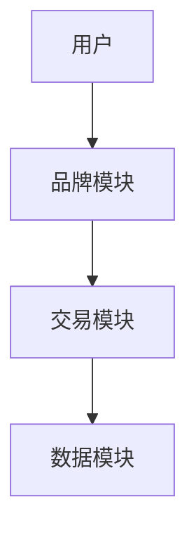
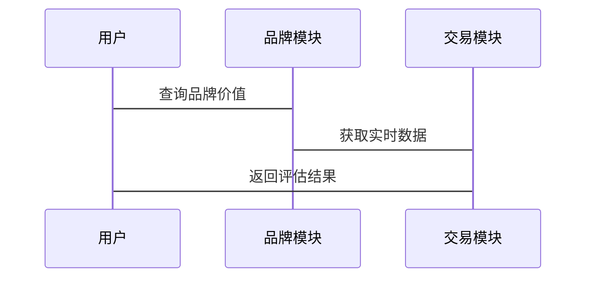

                 


# 巴菲特的品牌溢价理论：量子品牌在元宇宙中的价值重估

## 关键词：品牌溢价，量子品牌，元宇宙，价值重估，数字资产，区块链

## 摘要：本文探讨了巴菲特品牌溢价理论在量子品牌于元宇宙中的应用，分析了元宇宙经济体系中品牌价值的变化，并提出了新的评估模型和实现方案。

---

# 第一部分：引言

## 第1章：主题介绍

### 1.1 品牌溢价理论概述
#### 1.1.1 品牌溢价的定义
品牌溢价是消费者因品牌信任度而愿意支付的额外价格，体现品牌价值。

#### 1.1.2 品牌溢价的核心要素
- 品牌知名度
- 用户忠诚度
- 品牌声誉

#### 1.1.3 传统品牌溢价与量子品牌的区别
量子品牌存在于元宇宙，依赖数字资产，具有去中心化特性。

### 1.2 元宇宙的基本概念
#### 1.2.1 元宇宙的定义
元宇宙是虚拟与现实结合的数字空间，用户通过虚拟现实技术参与其中。

#### 1.2.2 元宇宙的主要特征
- 去中心化
- 数字资产
- 智能合约

#### 1.2.3 元宇宙与现实世界的关联
通过数字资产和区块链技术，元宇宙与现实世界形成经济互动。

### 1.3 量子品牌的定义与特征
#### 1.3.1 量子品牌的定义
量子品牌是存在于元宇宙的数字品牌，依赖区块链技术和NFTs。

#### 1.3.2 量子品牌的独特性
- 去中心化
- 虚拟资产驱动
- 用户参与度高

---

## 第2章：问题背景与研究意义

### 2.1 品牌溢价理论的现状
#### 2.1.1 传统品牌溢价理论的局限性
传统理论难以应对数字时代的品牌价值变化。

#### 2.1.2 元宇宙时代品牌溢价的新挑战
- 数字资产波动
- 用户数据隐私

### 2.2 量子品牌在元宇宙中的价值重估
#### 2.2.1 量子品牌价值评估的必要性
元宇宙中数字资产价值不稳定，需新评估方法。

#### 2.2.2 元宇宙中品牌价值的变化
- 数字资产影响
- 用户行为变化

#### 2.2.3 量子品牌溢价理论的创新点
结合区块链技术，提出动态评估模型。

### 2.3 本章小结

---

# 第二部分：核心理论与模型

## 第3章：巴菲特品牌溢价理论的核心概念

### 3.1 品牌溢价理论的原理
#### 3.1.1 品牌价值的构成要素
- 品牌知名度
- 用户忠诚度
- 品牌声誉

#### 3.1.2 品牌溢价的计算方法
品牌溢价 = 基础价格 × 品牌影响力

#### 3.1.3 品牌溢价与企业价值的关系
品牌溢价提升企业市场价值。

### 3.2 品牌溢价理论的数学模型
$$ \text{品牌价值} = \text{基础价值} + \text{品牌溢价} $$

$$ \text{品牌溢价} = \text{品牌影响力} \times \text{品牌忠诚度} $$

### 3.3 品牌溢价理论的属性特征对比

| 特性       | 传统品牌溢价 | 量子品牌溢价 |
|------------|--------------|--------------|
| 依赖因素   | 实体资产     | 数字资产     |
| 变化速度   | 较慢         | 较快         |

## 第4章：量子品牌的核心原理

### 4.1 量子品牌的定义与特点
#### 4.1.1 量子品牌的定义
量子品牌是基于区块链的去中心化品牌，存在于元宇宙中。

#### 4.1.2 量子品牌的独特性
- 去中心化
- 数字资产驱动
- 用户深度参与

---

# 第三部分：系统架构与技术实现

## 第5章：系统架构设计

### 5.1 系统整体架构


### 5.2 核心功能模块设计

#### 5.2.1 用户模块
- 用户注册与登录
- 数字资产管理

#### 5.2.2 品牌模块
- 品牌信息存储
- 智能合约部署

#### 5.2.3 交易模块
- NFT交易
- 价值评估

#### 5.2.4 数据模块
- 数据采集
- 数据分析

### 5.3 系统交互设计


---

## 第6章：项目实战

### 6.1 环境搭建
- 安装以太坊节点
- 安装Solidity编译器

### 6.2 核心实现代码
```solidity
// 品牌NFT合约
contract BrandNFT {
    function createNFT(uint256 tokenId) {
        // 创建NFT
    }
}

// 价值评估合约
contract BrandValue {
    function calculateValue(address brandAddress) {
        // 计算品牌价值
    }
}
```

### 6.3 代码解读
- 使用Solidity编写智能合约，实现品牌NFT创建和价值评估。

### 6.4 实际案例分析
分析奢侈品牌在元宇宙中的NFT应用，展示价值变化。

### 6.5 本章小结

---

## 第7章：最佳实践与注意事项

### 7.1 小结
总结量子品牌在元宇宙中的价值评估方法和实现方案。

### 7.2 注意事项
- 数据安全
- 用户隐私保护
- 技术创新

### 7.3 拓展阅读
建议阅读相关区块链技术和元宇宙经济的书籍。

---

## 第8章：结论

### 8.1 研究结论
量子品牌溢价理论在元宇宙中的应用前景广阔。

### 8.2 未来展望
进一步研究动态评估模型和跨链技术。

---

通过以上分析，本文详细探讨了量子品牌在元宇宙中的价值重估，为品牌管理和数字资产评估提供了新思路。

